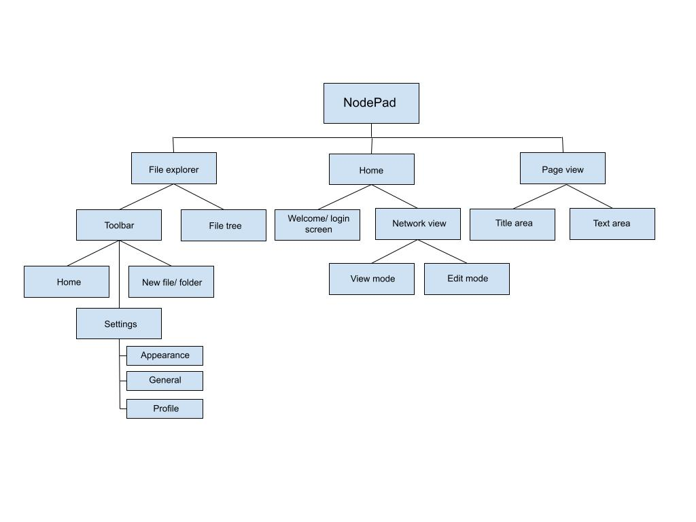

# Computational Methods
> *What stops the problem from being solved with just a pen and paper?*

For my proposed solution to meet the needs of all [stakeholders](1.2-stakeholders.md) mentioned, I need to consider how the problem can be solved computationally. It should enhance note taking by taking advantage of what computers can offer - for example formatting. The computerisation of this task provides a standard and consistent format, without the messiness of writing by hand. Furthermore text read online can be copied and pasted rather than re-written, improving comfort and efficiency.

The main areas I need to cover are: Abstraction, Thinking Ahead, Thinking Logically and Thinking Procedurally, and I'll need to revisit these regularly throughout development to ensure I'm working computationally and efficiently.

## Abstraction
> Removing all unnecessary information/ details about the task, reducing it to its most primitive and comprehensive format.

Abstraction allows me to focus only on core concepts, without worrying about elements of the program not important to its structure/ function. This also involves abstracting the process of note-taking for the user - the more I can simplify the UI, the more intuitive and user-friendly the software can be; the aim is to make the software as simple and effective as possible.

One form of abstraction will be in the representation of notes in the 'network'. These can be displayed as stars and constellations in the night sky providing a simple, yet aesthetically pleasing view. This must stay *simple*, and so I should abstract away any unnecessary information such as previews of the contents of files, the only information supplied to the user being what notes there are, and how they connect to each other. This should ideally prevent the user from feeling overloaded with information, and so other information will be handled purely on the backend/ out of the user's view.

For this reason, the 'night sky' won't be realistic, but rather simplified down to just a few types of objects seen in the night sky (such as stars and planets), and they will be modelled with stylised, simplified designs rather than being photorealistic.

There should also be a way to manipulate the 'nodes', such as changing what other nodes they are connected to - this can all be accessed behind one intuitively labelled 'edit mode' to make the UI as simple and easy to follow as possible. This network will be 2D, abstracting away the 3rd dimension, as this would make it much harder to use, understand and program.

Furthermore the user's selected directory/ subdirectories will need to be accessed from within the app. This should only display everything necessary to navigate through and manipulate folders/ files *i.e 'add', 'delete' options, and a tree diagram of folders/ files*.

Icons should be simple and consistent throughout, using common convention so as for the user the recognise what they mean *i.e a cog icon is universally recognised as settings*.

## Thinking...
### Ahead
> Consider inputs and outputs of processes within the program and preconditions and reuseable components.

- I'll likely use a framework such as [React.js](https://react.dev/) to aid in streamlining the process of building up a UI
- Either [Electron](https://www.electronjs.org/docs/latest/tutorial/ipc) or [Tauri](https://tauri.app/), where Electron has a much larger community and thus much more documentation/ help, but Tauri has the benefit of being a much lighter and faster app, utilising a custom web renderer built in rust. This does however mean having to learn Rust for the backend, and so I'll likely go for Electron due to how much support it has.

#### A simplified modular breakdown:

### Logically

### Procedurally

See next: [Research](1.4-research.md)
