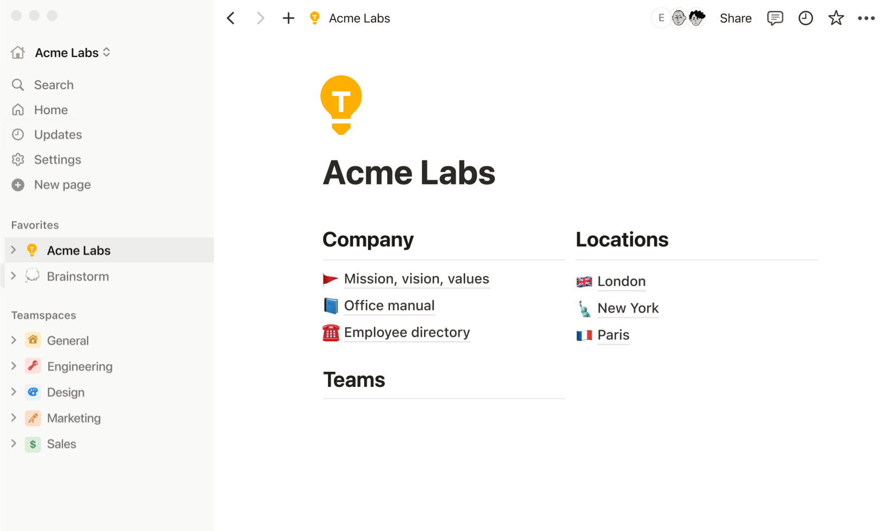
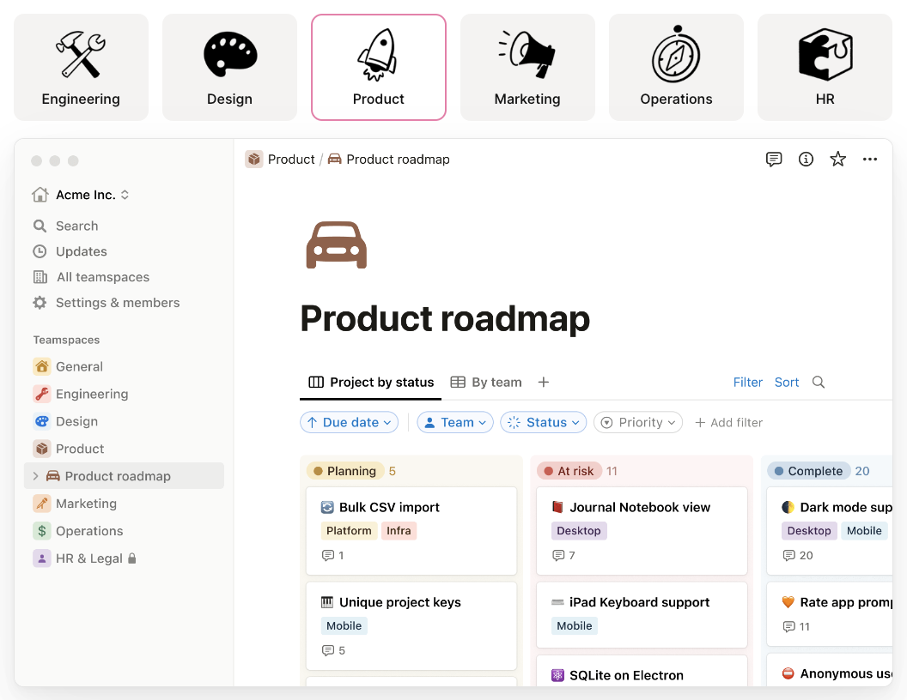
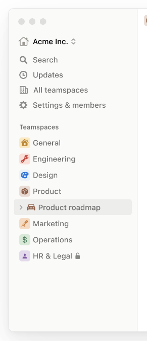

# Research
> *What similar products already exists on the market - how will this project draw inspiration or differ?*

## [Notion](https://www.notion.so/product/)

Notion is a prominent notes app already in the market, with 'millions' running it daily. It supplies a vast set of services, making it more of a superset of a notetaking app, rather notetaking being one of its many features on offer. This can be seen as a positive; one of the quotes it cites on its homepage is: "We got rid of nearly a dozen different tools because of what Notion does for us." ~Justin Watts. It can improve workflow and reduce the need for multiple large pieces of software, with support for Engineering, Design, Product launches, Marketing, Operations, HR and more:

However, the community seems to have varying opinions on how good this trait actually is for the app. [As one user on reddit puts it](https://www.reddit.com/r/productivity/comments/zvojcq/comment/j1t4hir/?utm_source=share&utm_medium=web3x&utm_name=web3xcss&utm_term=1&utm_content=share_button), it is a 'jack of all trades but master of none', *aka.* it supplies too much, and may not put enough effort into making its existing features the best they can be. Focusing on just a few core features for my app will make it simple abnd there will be a clear direction for what it does/ what it's meant to do - I can invest all time spent in development on features that will matter to the end user.

*The sidebar above greeting the user could be found to be quite overwhelming, with lots of information and possibilites for the user. This could actually distract, and detract from being completely focused and 'in the zone' when trying to take notes.*

Furthermore, the user states that there is 'no offline support', which is a 'pretty big' issue - notes aren't stored locally, only on the cloud. They mention the necessity of being able to access your notes regardless of internet connection, which my solution will offer. In addition, there may be security worries over what happens to all users' potentially personal/ sensitive notes, given that they are stored somewhere remote - this could be seen as unsafe, or a breach of privacy.

## [Obsidian](https://obsidian.md/)

## [Zettlr](https://www.zettlr.com/)

Zettlr is Free and Open Source Software (FOSS). This means nothing is hidden from the users, and so they know exactly what they are getting.
On their homepage, one of the standout features they mention that "Your Notes are Your Notes". This posts legitimate concerns as to what other apps are doing with your notes, suggesting with phrases such as "No forced cloud synchronization, no hidden costs, and no strings attached", that many apps currently on the market raise issues with regards to privacy.

There are two main advantages to this:
- **Trust** - The customers have complete trust that the product is doing nothing malicious with their personal information
- **Access** - As a developer working on a similar project, I can use the fact Zettlr is *open source* to understand how an app like this is built, and even magpie/ improve on existing features in the [Zettlr codebase](https://github.com/Zettlr/Zettlr)

See next: [Proposed Solution Features](1.5-proposed_solution_features.md)
