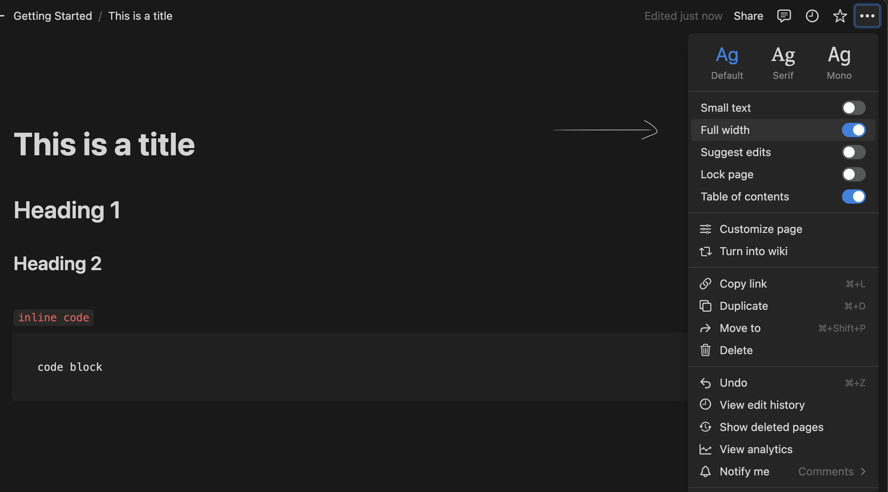

# Research
> *What similar products already exists on the market - how will this project draw inspiration or differ?*

## [Notion](https://www.notion.so/product/)

### Features/ Services

Notion is a prominent notes app already in the market, with 'millions' running it daily. It supplies a vast set of services, making it more of a superset of a notetaking app, rather notetaking being one of its many features on offer. This can be seen as a positive; one of the quotes it cites on its homepage is: "We got rid of nearly a dozen different tools because of what Notion does for us." ~Justin Watts. It can improve workflow and reduce the need for multiple large pieces of software, with support for Engineering, Design, Product launches, Marketing, Operations, HR and more:

However, the community seems to have varying opinions on how good this trait actually is for the app. [As one user on reddit puts it](https://www.reddit.com/r/productivity/comments/zvojcq/comment/j1t4hir/?utm_source=share&utm_medium=web3x&utm_name=web3xcss&utm_term=1&utm_content=share_button), it is a 'jack of all trades but master of none', *aka.* it supplies too much, and may not put enough effort into making its existing features the best they can be. Focusing on just a few core features for my app will make it simple abnd there will be a clear direction for what it does/ what it's meant to do - I can invest all time spent in development on features that will matter to the end user.

*The sidebar above greeting the user could be found to be quite overwhelming, with lots of information and possibilites for the user. This could actually distract, and detract from being completely focused and 'in the zone' when trying to take notes.*

Furthermore, the user states that there is 'no offline support', which is a 'pretty big' issue - notes aren't stored locally, only on the cloud. They mention the necessity of being able to access your notes regardless of internet connection, which my solution will offer. In addition, there may be security worries over what happens to all users' potentially personal/ sensitive notes, given that they are stored somewhere remote - this could be seen as unsafe, or a breach of privacy.

Notion provides standardised markdown formatting by default, presenting the preview as the text is written live, as seen in the sample above. The title written at the top of the file automatically becomes the name of the file, shown on the left in the sidebar; this is a feature I would like to replicate, as it elegantly simplifies the process of naming each file.

Upon opening the app for the first time, the user is prompted to login and is opened to this home screen. Immediately to me, there is quite a lot of information just in the home screen. As a new user, it isn't automatically obvious what I should do - this is a problem that can only be simplified so much considering how much Notion can do. This is a reason for me to keep the functionality of my project as simple and reduced as possible; only the absolutely necessary features should be presented to the user on start-up. The greeting at the top of the page could make the user feel more relaxed/ comfortable, however it could also be considered to be unnecessary detail, and in fact some people actually don't like this idea of a computer greeting them, as if to simulate huuman interaction. I don't find it to be necessary, and there wouldn't be a very natural place for it in the home screen I plan on making.

Within the markdown editor, there is seemless live preview of the markdown text, suporting all features you would expect.

An issue I initially had with the editor was how narrow the page is when editing, but by using the triple dots `...` icon top right, you can access the toggle-able 'wide view' which makes the page much wider and more natural feeling. This is a feature I would like to mimic, as the wider view makes it feel much more immersive and places the focus solely on what you are writing.

## [NotePlan](https://noteplan.co/)

NotePlan is another text editor/ planner that is available for macOS, iOS and the web. It has a variety of feeatures including its support of markdown.

### Platforms

NotePlan is built natively for Apple products, meaning it fits seemlessly into the Apple ecosystem, and runs much faster compared to **CEFs** *(Chromium Embedded Frameworks)*. However, this entirely removes a large portion of the market using Windows, Linux or Android, with the only support being through the web. This is a large drawback for such an app, and with developments in web apps such as [Tauri](https://tauri.app/), the speed of the app is not much of an issue anymore. For this reason, I see it much more beneficial to build a cross platform web app, rather than writing with a language like Swift, as native apps are now only marginally faster than web apps. For a web app to run this fast however, using Tauri would mean writing the backend in Rust, which is a notoriously difficult language to learn.

As seen above, the app is available both on iOS and ipadOS, identical in design to the desktop version - a perk of being written in Apple's native language, Swift. My focus is on the desktop experience, and making this the best it can be, moving on to mobile versions only if/ when the desktop version is good enough.

## [Obsidian](https://obsidian.md/)

## [Zettlr](https://www.zettlr.com/)

Zettlr is Free and Open Source Software (FOSS). This means nothing is hidden from the users, and so they know exactly what they are getting.
On their homepage, one of the standout features they mention that "Your Notes are Your Notes". This posts legitimate concerns as to what other apps are doing with your notes, suggesting with phrases such as "No forced cloud synchronization, no hidden costs, and no strings attached", that many apps currently on the market raise issues with regards to privacy.

There are two main advantages to this:
- **Trust** - The customers have complete trust that the product is doing nothing malicious with their personal information
- **Access** - As a developer working on a similar project, I can use the fact Zettlr is *open source* to understand how an app like this is built, and even magpie/ improve on existing features in the [Zettlr codebase](https://github.com/Zettlr/Zettlr)

See next: [Proposed Solution Features](1.5-proposed_solution_features.md)
