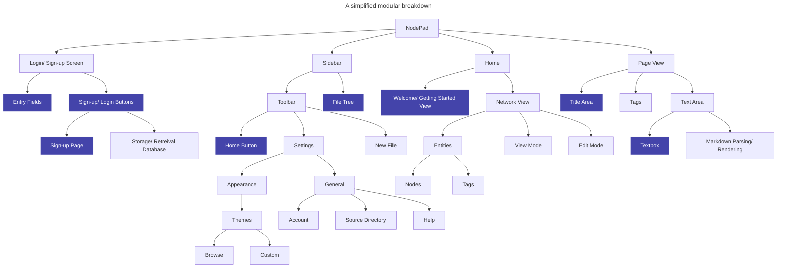

# 2.1.2 - Functionality of Prototype
> *What features do I aim to have implemented in this iteration?*

The hierarchy chart of features to be included in the final product *(note this has been updated/ added to since the [Analysis](https://github.com/samcalthrop/NodePad/tree/main/Write-up/1%20-%20Analysis))* - the highlighted elements are features I aim to have working within this iteration:

