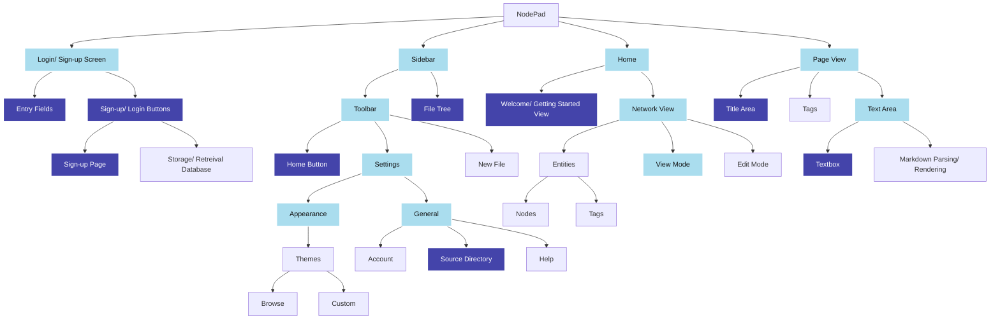

# 2.1.2 - Functionality of Prototype
> *What features do I aim to have implemented in this iteration?*

The hierarchy chart of features to be included in the final product *(note this has been updated/ added to since the [Analysis](https://github.com/samcalthrop/NodePad/tree/main/Write-up/1%20-%20Analysis))*:

### Key:

- Dark blue: the feature should ideally be (close to) completely finished *(it's likely there'll still need to be improvements/ optimisations, but it should be in working order)*
- Light blue: the feature should be at least partially completed - *e.g, the Page view's bare skeleton should be implemented, however I'm not aiming to have markdown parsing/ rendering done, thus it would be partially completed*
- Unhighlighted: the feature is not one I plan on focusing much time into during this iteration
