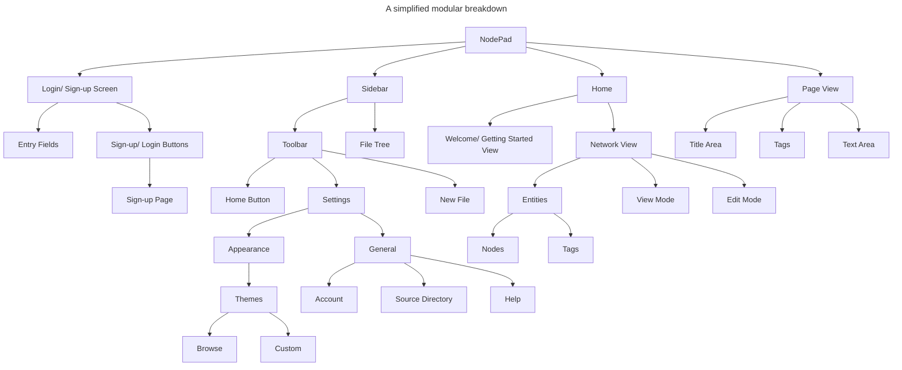

# Computational Methods

> _What stops the problem from being solved with just a pen and paper?_

For my proposed solution to meet the needs of all [stakeholders](1.2-stakeholders.md) mentioned, I need to consider how the problem can be solved computationally. It should enhance note taking by taking advantage of what computers can offer - for example formatting. The computer-isation of this task provides a standard and consistent format, without the messiness of writing by hand. Furthermore text read online can be copied and pasted rather than re-written, improving comfort and efficiency.

The main areas I need to cover are: Abstraction, Thinking Ahead, Thinking Logically and Thinking Procedurally, and I'll need to revisit these regularly throughout development to ensure I'm working computationally and efficiently.

## Abstraction

> _Removing all unnecessary information/ details about the task, reducing it to its most primitive and comprehensive format._

Abstraction allows me to focus only on core concepts, without worrying about elements of the program not important to its structure/ function. This also involves abstracting the process of note-taking for the user - the more I can simplify the UI, the more intuitive and user-friendly the software can be; the aim is to make the software as simple and effective as possible.

One form of abstraction will be in the representation of notes in the 'network'. These can be displayed as stars and constellations in the night sky providing a simple, yet aesthetically pleasing view. This must stay _simple_, and so I should abstract away any unnecessary information such as previews of the contents of files, the only information supplied to the user being what notes there are, and how they connect to each other. This should ideally prevent the user from feeling overloaded with information, and so other information will be handled purely on the backend/ out of the user's view.

For this reason, the 'night sky' won't be realistic, but rather simplified down to just a few types of objects seen in the night sky (such as stars and planets), and they will be modelled with stylised, simplified designs rather than being photorealistic.

There should also be a way to manipulate the 'nodes', such as changing what other nodes they are connected to - this can all be accessed behind one intuitively labelled 'edit mode' to make the UI as simple and easy to follow as possible. This network will be 2D, abstracting away the 3rd dimension, as this would make it much harder to use, understand and program.

Furthermore the user's selected directory/ subdirectories will need to be accessed from within the app. This should only display everything necessary to navigate through and manipulate folders/ files _i.e 'add', 'delete' options, and a tree diagram of folders/ files_.

Icons should be simple and consistent throughout, using common convention so as for the user the recognise what they mean _i.e a cog icon is universally recognised as settings_.

## Thinking...

### ...Ahead

> _Consider inputs and outputs of processes within the program and preconditions and reuseable components._

- I'll likely use a framework such as [React.js](https://react.dev/) to aid in streamlining the process of building up a UI
- Either [Electron](https://www.electronjs.org/) or [Tauri](https://tauri.app/), where Electron has a much larger community and thus much more documentation/ help, but Tauri has the benefit of being a much lighter and faster app, utilising a custom web renderer built in rust. This does however mean having to learn Rust for the backend, and so I'll likely go for Electron due to how much support it has.

Due to the nature of the program I plan on producing, there won't be many different input cases to consider in comparison to something like a game; mostly the user will be clicking icons/ buttons unless they are taking notes, in which case they'll be typing with the keyboard. I should also consider implementing commands such as `cmd`/ `ctrl` + `n` to create a new note, or `cmd`/ `ctrl` + `,` to open settings. The user should also be able to click, hold and drag when in 'edit' mode so they can connect different nodes to each other.

Additionally, I will be using a database to store the credentials of any user who signs up. This database won't be massive, though I should still consider minimising redundancy. As of right now, the only functionality of having an account is to verify that the person logging should have access to the notes, as these may be personal/ sensitive, so it shouldn't be accessible to anybody. This means that it may be acceptable to store the data in a flat file as there aren't many relationships currently planned.

#### The main inputs/ outputs:

_Note the toolbar will be accessible at all times on the side of the screen, so while the scope is within the toolbar, the user can use commands such as `cmd`/`ctrl` + `n` to create a new file even while writing/ in the network view without having to change focus._

| Scope                 | Input                                                                        | Output                                                                                                                                                                                                                                                                                              |
| --------------------- | ---------------------------------------------------------------------------- | --------------------------------------------------------------------------------------------------------------------------------------------------------------------------------------------------------------------------------------------------------------------------------------------------- |
| Toolbar               | Clicking the home icon                                                       | Takes user to the network view                                                                                                                                                                                                                                                                      |
| Toolbar               | Clicking the settings icon _or_ `cmd`/ `ctrl` + `,`                          | Takes user to settings view                                                                                                                                                                                                                                                                         |
| Toolbar               | Clicking the add ('+') icon _or_ `cmd`/ `ctrl` + `n`                         | Creates new note, and opening it automatically                                                                                                                                                                                                                                                      |
| Welcome/ login screen | Entering details into the login page and pressing `enter`/ clicking 'log in' | Grants user access and opens to the network view                                                                                                                                                                                                                                                    |
| Page view             | Any ASCII character inputted by the keyboard                                 | character will be added to the file. Exceptions: any characters used to format `.md` files may not appear as the text will be automatically formatted live in the page view, such as using `#`s as headers                                                                                          |
| Page view             | Clicking in the title/ text areas                                            | Switches context between title and text areas, determining whether the user is writing the title or making notes beneath                                                                                                                                                                            |
| Home                  | Toggle edit and view modes by clicking icon on screen                        | Will switch between the normal view, where the 'constellations' of notes can be seen, and the edit mode, where the UI will change to make the editing process intuitive. This will include hovering over nodes leading to them becoming brighter/ animating. The icon will also toggle when pressed |
| Home                  | Left clicking on a node                                                      | Opens the selected note in page view to be edited                                                                                                                                                                                                                                                   |

### ...Procedurally

> _Breaking the program into smaller, isolated sub-programs/ modules that can be written separately._

This way of thinking allows me to make the development process much more efficient and in line with the Agile Development approach. The problems I have to solve become much simpler, and each module can be tested in isolation, making any bugs much easier to track down and fix. The creation of reusable components also means way less code has to be written and tested.

The main areas within which I will be focusing are the different windows/ views available; the sidebar, home, page view, sign-up/ login and settings:

_This will become more in-depth/ thorough once in the development process._

_In reference to the 'nodes' and 'tags' (NodePad -> Home -> Network View -> Entities in the hierarchy chart), nodes will represent the notes a user makes. The tags are used to show what they are connected to - each note can have any amount of tags, and in the network view, nodes will connect to each tag it has. For example, a note with the title "music-videos.md", containing notes related music videos they are making could have the tags `music` and `videos`. Therefore, in the network view, the `music-videos` node would have connections both to `music` and `videos`, which would have a different appearance to nodes so the user can distinguish between them. This sets the precedent that 'nodes' and 'tags' are different entities in the network view, and it is possible to connect a node to a tag/ tag to a node, but no nodes to each other. Some tags may be subsets of other tags e.g. `music` is a subset `media` tag, so these tags should be able to be connected to each other._

See next: [Research](1.4-research.md)
