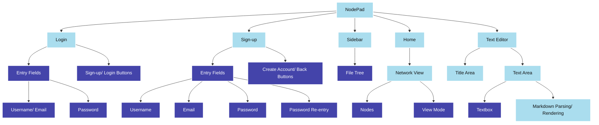

# 2.1.2 - Functionality of Prototype

> _What features do I aim to have implemented in this iteration?_

The hierarchy chart of features to be included in the final product _(note this has been updated/ added to since the [Analysis](../../1%20-%20Analysis/))_:

### Key:

- **Dark blue**: the feature should ideally be (close to) completely finished _(it's likely there'll still need to be improvements/ optimisations, but it should be in working order)_
- **Light blue**: the feature should be at least partially completed - _e.g, the Page view's bare skeleton should be implemented, however I'm not aiming to have markdown parsing/ rendering done, thus it would be partially completed_
- **Unhighlighted**: the feature is not one I plan on focusing much time into during this iteration

```mermaid

flowchart TD

	A --> U[Login]:::highlight-half
	U --> V[Entry Fields]:::highlight
	V --> ZH[Username/ Email]:::highlight
	V --> ZI[Password]:::highlight
	U --> W[Sign-up/ Login Buttons]:::highlight
	U --> ZA[Storage/ Retrieval Database]

	A --> Z[Sign-up]:::highlight-half
	Z --> ZD[Entry Fields]:::highlight
	ZD --> ZO[Username]:::highlight
	ZD --> ZP[Email]:::highlight
	ZD --> ZQ[Password]:::highlight
	ZD --> ZJ[Password Re-entry]:::highlight
	Z --> ZK[Create Account/ Back Buttons]:::highlight
	Z --> ZU[Storage/ Retrieval Database]

  A[NodePad]:::highlight-half --> B[Sidebar]:::highlight-half
  B --> C[Toolbar]
  B --> D[File Tree]:::highlight
  C --> E[Home Button]
  C --> F[Settings Button]
  C --> ZM[New Folder]
  C --> J[New File]

  A --> ZE[Settings]
  ZE --> G[Appearance]
  G --> H[Themes]
  H --> Browse
  H --> Custom
  ZE --> ZG[Account]
  ZG --> ZR[Username]
  ZG --> ZS[Email]
  ZG --> ZT[Password]
  ZE --> Y[Files]
  Y --> ZF[Networks]
  ZF --> ZN[Source Directory]
  ZE --> Help

  A --> K[Home]:::highlight-half
  K --> L[Welcome/ Getting Started View]
  K --> M[Network View]:::highlight-half
  M --> Nodes:::highlight
  M --> Tags
  M --> O[View Mode]:::highlight
  M --> P[Edit Mode]
  M --> Linking
  M --> Unlinking
  M --> ZZ[Fuzzy search]

  A --> Q[Text Editor]:::highlight-half
  Q --> R[Title Area]:::highlight-half
  Q --> S[Tags]
  Q --> T[Text Area]:::highlight-half
  T --> ZB[Textbox]:::highlight
  T --> ZC[Markdown Parsing/ Rendering]:::highlight-half

  classDef highlight fill:#44a,stroke:#fff,stroke-width:2px,color:#fff
  classDef highlight-half fill:#ade,stroke:#fff,stroke-width:2px,color:#111
```

Breaking this down into only the components I plan on making progress on:

From this diagram, I can say that the main features I want to get in place to start off the development of this project are:

- The login page
- The sign up page
- The sidebar
- The node network
- The text editor

**NOTE: I aim to get started on all of these areas, though given how much there is to do, it's not likely I'm going to complete all/ many of them in this iteration.**

See next: [Annotation of Code](2.1.3-annotation_of_code.md)
