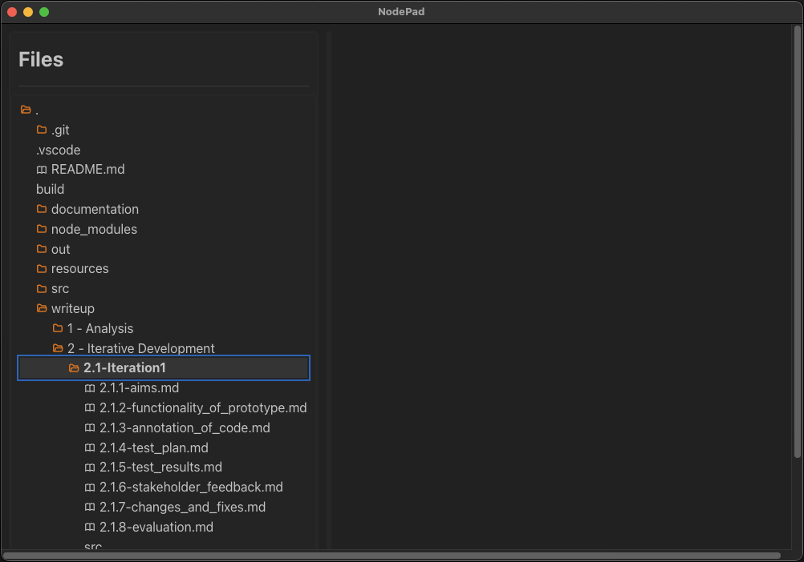

# 2.1.3 - Annotation of Code

> _an overview & explanation of the code written to build this project - **this includes testing**_

_^Note that any time elipses `...` are used, it represents more code that isn't relevant to what I'm analysing, but is still in the file_

## Preface/ Configuration

Though this area isn't related to logic/ flow of the program, it's important to set it up right - I'll use `npm`/ `node` to install/ manage files and packages. These packages currently include:

- [electron](https://www.electronjs.org/) - provides the wrapper to embed chromium as a desktop app
- [react](https://react.dev/) - provides a framework for UI/ flow of the app
- [mantine](https://mantine.dev/) - a UI library for buttons, menus etc.
- Some core javascript libraries such as the `path` module

Furthermore, I'll be writing with Typescript in place of Javascript, so additional configuration is needed for transpilation. These are responsible for the majority of dotfiles, `.json` and `.yml` files in the [root](https://github.com/samcalthrop/NodePad) NodePad directory:


Additionally, I will be using [VSCode](https://code.visualstudio.com/) to program the coded solution, as well as iTerm2 as my terminal of choice for version control etc.

Coming back to this later on in development:

> **In [Iteration 2](../2.2-Iteration2/2.2.1-aims.md), I switched to using [Zed](https://zed.dev/) as my IDE, which was a new, faster alternative to VSCode written in Rust. This was experimental, and not guaranteed to stay my main code editor, and my aim was to test its performance - VSCode was good, but became slow and bulky after building up the codebase significantly. As a result, I decided to stick with Zed, as it proved to be much faster, and even aesthetically nicer for me to use.**

### Conventions

Before I start programming, it's important I set out conventions to use throughout my codebase to make sure the code is _understandable, modifiable, robust, and, consistent_.

With regards to the layout of the project files, they fall into the following categories:

| Item             | Type     | Usage                                                                                                                                                    |
| ---------------- | -------- | -------------------------------------------------------------------------------------------------------------------------------------------------------- |
| `build/`         | `folder` | where the metadata is stored for when the app is built, e.g. the app icon                                                                                |
| `db/`            | `folder` | the store for the database I'm going to use in my app                                                                                                    |
| `documentation/` | `folder` | where I store the user and developer documentation with regards to using/ developing the app                                                             |
| `node_modules/`  | `folder` | a folder containing all the packages/ frameworks used to aid in building the app, e.g. Mantine                                                           |
| `out/`           | `folder` | the location given for all the output files - these are the compiled files used to run the app, produced when the commands `npm run`/`npm build` are run |
| `resources/`     | `folder` | where media used within the app, such as demo videos                                                                                                     |
| `src/`           | `folder` | where the entirety of the code written by me is stored                                                                                                   |
| `writeup/`       | `folder` | where the writeup is stored - _we are here_                                                                                                              |
| `README.md`      | `file`   | an introductory document briefing whoever enters the repository on what the repository is about and where to find everything                             |

#### `src/` Structure

Within the `src/` directory, the following folders/ files are delegated to different roles for maximum modularity and understandability for other programmers:

| Item                          | Type   | Usage                                                                                                                                                                                                                                                                                                                    |
| ----------------------------- | ------ | ------------------------------------------------------------------------------------------------------------------------------------------------------------------------------------------------------------------------------------------------------------------------------------------------------------------------ |
| `src/main/`                   | folder | a folder used to contain all files related to the app's backend                                                                                                                                                                                                                                                          |
| `src/main/index.ts`           | file   | the main entry point for the backend of the app - this includes starting the app up, and initialising variables such as window size                                                                                                                                                                                      |
| `src/preload/`                | folder | a folder symbolising the link between the backend and frontend - this is used by Electron to enforce security measures so that I don't have to manually. This does however mean I have to write more code to pass data from the frontend to the backend, using an intermediary step - this code is written here          |
| `src/preload/index.ts`        | file   | the entry point for the preload part of the app to be run                                                                                                                                                                                                                                                                |
| `src/renderer/`               | folder | a folder housing all the code for the frontend of the app. Since this is a significant amount of code, it's split up into the logical subcategories below                                                                                                                                                                |
| `src/renderer/index.html`     | file   | where the base HTML is written for the app, including metadata and a base for all components to sit on                                                                                                                                                                                                                   |
| `src/renderer/src/index.ts`   | file   | the main entry point for the frontend of the app, where all the code from `renderer/` is brought together                                                                                                                                                                                                                |
| `src/renderer/src/assets`     | folder | a folder containing all assets used in components, such as file icons in the file tree                                                                                                                                                                                                                                   |
| `src/renderer/src/components` | folder | a folder containing all the modular components used in the app. This not only makes my code easier to read, but means these components can be re-used in any part of the app, such as being able to use a theme selector component both in Settings and in the Welcome Screen without needing to rewrite any of the code |
| `src/renderer/src/providers`  | folder | a folder containing all providers used in the app - these are used to communicate data between all parts of the app at all times                                                                                                                                                                                         |
| `src/renderer/src/screens`    | folder | a folder containing code for all the 'screens' in the app - these are just the different views the user can navigate to within the app, e.g. the Home Screen                                                                                                                                                             |
| `src/renderer/src/types`      | folder | a folder containing the different custom types I've defined that are used in the app                                                                                                                                                                                                                                     |

##### Module Layout

Furthermore, to create each module, I aim to follow the same general pattern:

- Component Folder e.g. `HomeScreen/`
  - Component logic & structuring e.g. `HomeScreen.tsx`
  - Export file, always `index.ts`, used to export the component function from the `.tsx` file
  - Styling module, where component styles are determined, e.g. `HomeScreen.module.css`

A visual example is below:


I aim to keep this convention consistent throughout, which should make the codebase a lot cleaner and clearer for anyone viewing it, as it mimics conventions used in industry.

#### Code

Additionally, code should be consistent in its writing style, as well as being clear and concise. As I'm using TypeScript, I'm able to make use of [ESLint](https://eslint.org/) to use linting rules in order to keep my code to a certain standard throughout. Since the linting config files are included in the repository, this also means anyone else who downloads the repo will have to follow the same linting rules.

Some additional conventions that aren't caught by ESLint are:

- Curly brace `{}` indentation/ positioning - the opening bracket is written on the same line as the definition, and the trailing bracket has its own line below the content:

```ts
const x = (): void => {
  // content
};
```

- Functions and variables are by convention named with `camelCase` (starting with a lowercase letter):

```ts
const doSomething = (thisVariable: string): void => {
  // content
};
```

- Classes, Types, and JSX Elements are by convention named with `CamelCase` (starting with an uppercase letter):

```ts
class ThisClass {
  // content
}

type ThisType = {
  // content
};

function ThisElement = (): JSX.Element {
  // content
}
```

- Acronyms only have their first letter capitalised, and the rest are in lowercase:

```ts
const Tqbf: string = 'The Quick Brown Fox';
```

- Indents are equal to two line spaces in length:

```ts
if (a === b) {
  if (c === d) {
    if (e === f) {
      // content
    }
  }
}
```

# The App

The far majority of the code written is found within the [src](https://github.com/samcalthrop/NodePad/tree/main/src) directory. This is split into:

- [main](https://github.com/samcalthrop/NodePad/tree/main/src/main) - the backend
- [preload](https://github.com/samcalthrop/NodePad/tree/main/src/preload) - sets up Inter-Process Communication - essentially a bridge between the front and backend
- [renderer](https://github.com/samcalthrop/NodePad/tree/main/src/renderer) - the frontend

An expansion of how the three layers work together is below:


## App Setup

`src/main`, _at the time of writing this_, contains 2 files - [index.ts](https://github.com/samcalthrop/NodePad/blob/main/src/main/index.ts) and [getTreeNodeData.ts](https://github.com/samcalthrop/NodePad/blob/main/src/main/getTreeNodeData.ts).

[index.ts](https://github.com/samcalthrop/NodePad/blob/main/src/main/index.ts) is the access point for the backend code. A lot of this file is attributed to set up of the app:

The `createWindow()` function...

...defines how the window should appear, relative to the OS of the user:

```ts
const mainWindow = new BrowserWindow({
  width: 900,
  height: 670,
  show: false,
  autoHideMenuBar: true,
  ...(process.platform === 'linux' ? { icon } : {}),
  webPreferences: {
    preload: join(__dirname, '../preload/index.js'),
    sandbox: false,
  },
});
```

...makes the call to display the window to the user:

```ts
mainWindow.on('ready-to-show', () => {
  mainWindow.show();
});
```

...and handles customisation for different versions e.g opening `dev tools` if the user runs the app in `dev` mode using `npm run dev` in the command line:

```ts
mainWindow.webContents.openDevTools({ mode: 'right' });
```

Within `app.whenReady().then`, we can set the `createWindow()` function defined above to be called once the app is ready to be shown

For further setup, in `src/renderer/src` I have to define all the routes through the app (_e.g. which pages you can navigate to_). This is done in [index.tsx](https://github.com/samcalthrop/NodePad/blob/main/src/preload/index.ts):

`src/renderer/src/index.html`:

```tsx
ReactDOM.createRoot(document.getElementById('root') as HTMLElement).render(
  <React.StrictMode>
    <MantineProvider defaultColorScheme="dark" theme={theme}>
      <HashRouter>
        <Routes>
          <Route path="/" element={<Screen> </Screen>} />
          <Route path="/login" element={<LoginScreen />} />
          <Route path="/signup" element={<SignUpScreen />} />
          <Route path="/home" element={<HomeScreen />} />
          <Route path="/edit-node-meta" element={<EditNodeMetaScreen />} />
        </Routes>
      </HashRouter>
    </MantineProvider>
  </React.StrictMode>
);
```

where each `<Route/>` defines a path to a different Screen.

This is then paired with the `index.html` file found directly within the `renderer` directory, which is used to configure the base html/ meta information for the app, and telling the renderer where it can find the main code for the app:

`src/renderer/index.html`:

```html
<!doctype html>
<html>
  <head>
    <meta charset="UTF-8" />
    <title>NodePad</title>
    <meta
      http-equiv="Content-Security-Policy"
      content="default-src 'self'; script-src 'self' 'unsafe-inline' 'unsafe-eval' https://github.com/mdx-editor/editor; style-src 'self' 'unsafe-inline'; img-src 'self' data:"
    />
  </head>

  <body>
    <div id="root"></div>
    <!-- defining where the renderer can find the main code for the app -->
    <script type="module" src="/src/index.tsx"></script>
  </body>
</html>
```

### Testing

1. The defined routes all work as they should - this includes the app opening to the login page by default, **once the screens have all been made**. This means I can only test this after the other screens have been made and tested:

<div align="center">
  
</div>

As seen above, the flow of the app works as expected.

## Screens

In order to best modularise my code, I created a `screens` directory within `src/renderer/src` - that way I was able to build a base `screen`, from which I could build on top of for other screens. This sped up the development process, and also made the styling/ layout of the app more consistent and logical.

### Defining a base

The [base screen](https://github.com/samcalthrop/NodePad/blob/main/src/renderer/src/screens/Screen/Screen.tsx) was my solution to creating a simple base, mainly defining rules allowing it to be used by child screens (screens I build using this as a base).

To make this, I simply created a function to return a `<div/>` element containing all children passed into the element:

`Screen.tsx`:

```tsx
export const Screen = ({ children }: ScreenProps): JSX.Element => {
  return <div className={classes.root}>{children}</div>;
};
```

Which uses the `ScreenProps` type to allow the developer to pass in properties to the `<Screen/>` element:

`types/index.ts`:

```ts
export type ScreenProps = {
  children: ReactNode;
};
```

I gave it minimal styling given that this screen only needs to house child content, so the `Screen.module.css` file is very bare-bones:

```css
.root {
  margin: 10px;
  width: 100%;
  height: 100%;
}
```

#### Testing

There is no testing to be done for this screen, as it's only purpose is to provide a base for children screens.

#### The result

The result is a basic window from which I can build all screens on top of:


### Login

> _The [Login Screen](https://github.com/samcalthrop/NodePad/tree/main/src/renderer/src/screens/LoginScreen) is where the user is taken to enter valid credentials in order to be let into the main app._

For this screen I focused on making the skeleton for the login screen, rather than the backend processing of the data entered at this point - the form for the user to fill out, containing all username and password fields, as well as a submission button and a 'remember me' checkbox. I used [Mantine's documentation on their `<form/>` component](https://mantine.dev/form/use-form/) to build up the three fields with placeholders, labels, asterisks and a way for the form to submit all 3 fields simultaneously, by using the `key` attribute alongside a submission `<Button/>`. This is all contained within the `<Screen/>` component defined earlier:

```tsx
<Screen>
  ...
  <form onSubmit={form.onSubmit(() => navigate('/home'))}>
    {/* username field */}
    <TextInput
      withAsterisk
      label="Email"
      placeholder="your@email.com"
      key={form.key('email')}
      {...form.getInputProps('email')}
    />

    {/* password field */}
    <PasswordInput
      withAsterisk
      label="Password"
      description="ensure password length is at least 8 characters long"
      placeholder="password-123"
      key={form.key('password')}
      {...form.getInputProps('password')}
    />

    {/* 'remember me' checkbox */}
    <Checkbox
      mt="sm"
      label="remember me"
      key={form.key('remember')}
      {...form.getInputProps('remember', { type: 'checkbox' })}
    />

    {/* form submission */}
    <Group justify="flex-begin" mt="md">
      <Button type="submit">Submit</Button>
    </Group>
  </form>
  ...
</Screen>
```

_Note that since it's wrapped within the `<Screen>` element, it inherits whatever properties are applied to `<Screen>` automatically._

To make this form functional I used Mantine's `useForm()` hook to determine what properties the form should take...

```tsx
const form = useForm({
  initialValues: {
    email: '',
    password: '',
    remember: false,
  },
  ...
});
```

...and then wrote scripts to define how they should validate input:

```tsx
validate: {
  email: (value) => (/^\S+@\S+$/.test(value) ? null : 'Invalid email'),
  password: (value) => (value.length >= 8 ? null : 'Invalid email'),
},
```

A breakdown of the RegEx expressions for validation is below:

- The `email` validation uses the regular expression `/^\S+@\S+$/` as follows:
  - `^`: The pattern must start at the start if the user's input
  - `\S+`: `\S` matches any non-whitespace character, and `+` indicates any number of non-whitespace characters
  - `@`: Ensures there must be an '@' to separate the input
  - `\S+` (again): checks that there are characters on the other side of the '@'
  - `$`: Ensures no characters proceed the entered string of characters
- The `password` validation is currently much more primitive, only requiring the input be at least 8 characters long

Then a react hook is used to navigate to the homepage upon successful login, where `useNavigate()` is a hook provided by `react-router-dom`, and again to reroute the user to the Signup Screen if they're new:

```tsx
const navigate = useNavigate();
...
<form onSubmit={form.onSubmit(() => navigate('/home'))}>
  ...
</form>

<Button
  variant="transparent"
  className={classes.button}
  onClick={() => navigate('/signup')}
>
  Sign Up
</Button>
```

#### Testing

1. Pressing the Sign-up button navigates to the Sign-up screen:

<div align="center">
  
</div>

2. Validation/ sanitation of input:

<div align="center">
  
</div>

#### The result

The result of this code is a login page that looks like this:


### Signup

> _Additionally, if the user doesn't have an account, they can follow the `Sign Up` button to be taken to the [Signup Screen](https://github.com/samcalthrop/NodePad/tree/main/src/renderer/src/screens/SignUpScreen)_

In order to navigate to the Signup Screen, I used React's `useNavigate()` hook again in the Login Screen, this time to navigate to the Signup Page route:

```tsx
<Button variant="transparent" className={classes.button} onClick={() => navigate('/signup')}>
  Sign Up
</Button>
```

The Signup screen is a close copy of the login screen with a few differences; therefore the code (_for the frontend at least_) looks very similar for the most part.

The key differences are that there is a password re-entry field and the user's username is not asked for as a form of validation, but the overall structure of the code is very close to that of the Login Screen:

```tsx
import classes from '../LoginScreen/LoginScreen.module.css';
import { Screen } from '../Screen';
import { useNavigate } from 'react-router-dom';
import { Button, Title, TextInput, Group, PasswordInput } from '@mantine/core';
import { useForm } from '@mantine/form';

export const SignUpScreen = (): JSX.Element => {
  const navigate = useNavigate();

  // defining the rules for the login form
  const form = useForm({
    mode: 'uncontrolled',
    initialValues: {
      email: '',
      password: '',
      reEnterPassword: '',
    },

    // in-browser validation of email entry
    validate: {
      email: (value) => (/^\S+@\S+$/.test(value) ? null : 'Invalid email'),
      password: (value) => (value.length >= 8 ? null : 'Invalid password'),
      reEnterPassword: (value) => (value ? null : 'Passwords must match'),
    },
  });

  return (
    <Screen>
      <div className={classes.root}>
        <br />
        <Title order={1}>Sign Up</Title>
        <br />
        <form onSubmit={form.onSubmit(() => navigate('/login'))}>
          {/* username field */}
          <TextInput
            withAsterisk
            label="Email"
            placeholder="your@email.com"
            key={form.key('email')}
            {...form.getInputProps('email')}
          />

          {/* password field */}
          <PasswordInput
            withAsterisk
            label="Password"
            description="ensure password length is at least 8 characters long"
            placeholder="password-123"
            key={form.key('password')}
            {...form.getInputProps('password')}
          />

          {/* re-enter password field */}
          <PasswordInput
            withAsterisk
            label="Re-enter Password"
            placeholder="password-123"
            key={form.key('re-renter-password')}
            {...form.getInputProps('re-renter-password')}
          />

          {/* form submission */}
          <Group justify="flex-begin" mt="md">
            <Button type="submit" onClick={() => navigate('/login')}>
              Submit
            </Button>
          </Group>
        </form>
      </div>
    </Screen>
  );
};
```

One of the stand-out differences between the two screens is the extra field for re-entering the chosen password, using:

```tsx
validate: {
  ...
  reEnterPassword: (value) => (value ? null : 'Passwords must match'),
},
```

to check that the passwords are exactly equal to one another.

#### Testing

1. Validation/ sanitation of input:

2. Pressing the Create Account button navigates user to the Login screen, only if valid data is entered:

3. Pressing the Back button navigates user to the Login screen:

4. Test how UI is affected by change in window dimensions:

#### The result

The result looks like this:


### SideBar

> _The SideBar is where the filetree for the user-selected root directory is displayed, within which the user can navigate to and select the file they want to edit._

The structure in which I built the file tree was in a way such that the program:

- iterates through each file in `treeNodeData`,
- checks their file extension to determine the file icon displayed by the filename, and,
- renders each file/ folder, along with their corresponding icons.

Firstly, I wrote the code to determine the file icon to be displayed next to each file by checking their file extension:

`Sidebar.tsx`:

```tsx
function FileIcon({ name, isFolder, expanded }: FileIconProps): JSX.Element {
  if (name.endsWith('package.json')) {
    return <NpmIcon size={14} />;
  }

  if (name.endsWith('.md')) {
    return <IconBook size={14} />;
  }

  // returns an opened/ closed folder based on the boolean value `expanded`
  if (isFolder) {
    return expanded ? (
      <IconFolderOpen size={14} stroke={2.5} />
    ) : (
      <IconFolderClosed size={14} stroke={2.5} />
    );
  }

  return <></>;
}
```

Then, I wrote the function `Leaf` to package the filename and file icon into a single `<div/>` element (as well as handling the event that the file is selected and navigating to the text editor using the `useNavigate()` hook), which allows each item to be iterated through and subsequently rendered:

`Sidebar.tsx`:

```tsx
function Leaf({
  node,
  expanded,
  hasChildren,
  elementProps,
  tree,
}: RenderTreeNodePayload): ReactElement<FileIconProps> {
  const navigate = useNavigate();

  return (
    <Group
      gap={5}
      {...elementProps}
      onClick={() => {
        tree.toggleSelected(node.value);
        tree.toggleExpanded(node.value);
        if (!node.children) {
          console.log('Sidebar: node selected: ', node);
          // navigate to the text editor
          navigate('/home/edit-node-meta');
        }
      }}
    >
      <div className={classes.leaf}>
        {/* <div></div> */}
        <FileIcon name={node.value} isFolder={hasChildren} expanded={expanded} />
        <Text className={classes.leafText}>{node.label}</Text>
      </div>
    </Group>
  );
}
```

And finally, assembling the tree requires the use of the `<Tree/>` element in the `<Sidebar/>` component:

`Sidebar.tsx`:

```tsx
export const Sidebar = (): JSX.Element => {
  return (
    <div className={classes.root}>
      <div className={classes.titleDiv}>
        <Title className={classes.title} order={1}>
          Sidebar
        </Title>
      </div>
      <Divider className={classes.divider} size="sm" />
      <div className={classes.filetreeDiv}>
        <Tree
          levelOffset="lg"
          className={classes.tree}
          selectOnClick
          data={treeNodeData}
          renderNode={(payload) => <Leaf {...payload} />}
        />
      </div>
    </div>
  );
};
```

The aim of the Sidebar is to render the user-selected files in a file tree - this requires the frontend to query the backend for these files, and return them in a suitable format to be rendered. Given that this would require code be written in at least 4 different files (`Sidebar.tsx`, `/types/index.ts`, `/preload/index.ts` and `/main/index.ts`), it would be very hard to write it all first, then track down any bugs that arise. To solve this issue, I decided it would be easier to find a way to make the separate components work in isolation - I used abstraction to break this down into front-end functionality, preload functionality, and backend functionality.

In order to verify that my code works in small steps, I decided to attempt to make the tree work first with hard-coded data on the frontend:

#### Step 1 - Frontend rendering using hard-coded data

Firstly, I used hard-coded `treeNodeData` below to verify that the tree would render correctly (this was the data Mantine used to demo the Tree element, which allowed me to directly compare between my version and theirs, meaning I could make sure the two were identical):

`Sidebar.tsx`:

```tsx
const treeNodeData: Array<TreeNodeData> = [
  {
    label: 'src',
    value: 'src',
    children: [
      {
        label: 'components',
        value: 'src/components',
        children: [
          { label: 'Accordion.tsx', value: 'src/components/Accordion.tsx' },
          { label: 'Tree.tsx', value: 'src/components/Tree.tsx' },
          { label: 'Button.tsx', value: 'src/components/Button.tsx' },
        ],
      },
    ],
  },
  ...{
    label: 'tsconfig.lib.json',
    value: 'tsconfig.lib.json',
  },
];
```

##### Verifying it works

To check that this code works, I booted up the app and checked the contents of the Sidebar:

<div align="center">
  
</div>

This correctly displayed the hard-coded data, verifying the code written thus-far works as intended.

#### Step 2 - Preload/ Main using hard-coded data

This next step required me to communicate data between the backend and the frontend - following [Electron's guide on backend-frontend communication](https://www.electronjs.org/docs/latest/tutorial/ipc) as described towards the start of the writeup, the communication of data requires a 'middleman' (_preload_) to handle/ secure the transport of data between `main` and `renderer`. This meant I had to define a function `getTreeNodeData()` as being a method on the inter-process communication API in `renderer`...

`types/index.ts`:

```ts
export type IpcAPI = {
  getTreeNodeData: GetTreeNodeData;
};
```

... define what the function does in `preload/index.ts` (_which passes a message on to the backend, and awaits the return of data which it then sends to the frontend_)...

`preload/index.ts`:

```ts
if (process.contextIsolated) {
  try {
    // communication between front and backend for data transfer (tree node data)
    // expose these functions to the backend (main):
    contextBridge.exposeInMainWorld('ipcAPI', {
      // retrieves file structure from given path, in TreeNodeData[] format
      getTreeNodeData: (path: string) => {
        ipcRenderer.send('get-tree-node-data', path);

        return new Promise((resolve) => {
          ipcRenderer.once('get-tree-node-data-success', (_event, data: Array<TreeNodeData>) =>
            resolve(data)
          );
        });
      },
    }
  }
}
```

... and tell the backend what should happen upon a message being received from `preload` telling it to retrieve the file tree from a given path with the message of 'get-tree-node-data' followed by the specific path - at this point, I used the same hard-coded data, only this time on the backend side so as to test that the data is correctly being sent from the backend to the frontend and rendered in the Sidebar:

`main/index.ts`:

```ts
...
app.whenReady().then(() => {
  ...
  // when the frontend requests the file tree...
  ipcMain.on('get-tree-node-data', (event: IpcMainEvent, path: string) => {
    // all files/ directories found and returned to frontend
    const data: Array<TreeNodeData> = [
      {
        label: 'src',
        value: 'src',
        children: [
          {
            ...
          },
        ],
        ...
      },
    ];
    event.sender.send('get-tree-node-data-success', data);
    console.log('tree node data successfully retrieved');
  });
}
```

Then I made use of React's `useState` and `useEffect` components to _retrieve_ and then _set_ `treeNodeData` dynamically as the returned object of type `TreeNodeData` by calling the `getTreeNodeData()` method on the Inter-Process Communication API (_note the distinction between `treeNodeData`, the variable containing the file tree structure, and `TreeNodeData`, the type provided by Mantine which is used to render the tree_):

`Sidebar.tsx`:

```tsx
export const Sidebar = (): JSX.Element => {
  const [treeNodeData, setTreeNodeData] = useState<Array<TreeNodeData>>([]);

  useEffect(() => {
    window.ipcAPI.getTreeNodeData().then((treeNodeData) => {
      setTreeNodeData(treeNodeData);
    });
  }, []);
  ...
};
```

##### Verifying it works

To check that this code works, I again ran up the app and checked the contents of the Sidebar:

<div align="center">
  
</div>

This correctly displayed the hard-coded data passed from the backend, verifying the code written thus-far works as intended.

#### Step 3 - Main using data retrieved from user filesystem

DO STUFF HERE

#### Testing

- tree is correctly rendered with icons + children
- tree leaves can be clicke don, open, closed etc.

3. Test how UI is affected by change in window dimensions

#### The result

The Sidebar screen on its own, without any content displayed beside it now looks like this:



### Home

> _The Home Screen is where all markdown files in the user-selected root directory will be displayed visually in a network_

Home only constists of a few basic components currently:

```tsx
<Title order={1}>Home</Title>
<Canvas drawFunc={drawPulsingDot} width={200} height={200} />
<Text>Edit node meta</Text>
<Button
  variant="subtle"
  className={classes.button}
  onClick={() => navigate('/edit-node-meta')}
>
  Ok
</Button>
```

The two most important parts are he `<Button/>` and `<Canvas/>` elements - the button is the source of navigation, again using the `navigate()` function to transport the user to the editing screen (currently named `edit-node-meta` - this may change to something more user friendly) which will become valuable when combined with the other key element - `<Canvas/>`:

```tsx
<Canvas drawFunc={drawPulsingDot} width={200} height={200} />
```

This makes use of a predefined draw function, `drawFunc`, which takes in `drawPulsingDot` - this is imported at the top of the file from the path `@renderer/drawing/drawPulsingDot`. If we open `drawPulsingDot.ts`, we can see where the code for the 'node network' will go:

```tsx
export const drawPulsingDot: DrawFunc = (frameCount: number, context: CanvasRenderingContext2D) => {
  context.clearRect(0, 0, context.canvas.width, context.canvas.height);
  context.fillStyle = 'var(--mantine-primary-color-filled)'; // doesn't work
  context.beginPath();
  context.arc(50, 100, 20 * Math.sin(frameCount * 0.05) ** 2, 0, 2 * Math.PI);
  context.fill();
};
```

In its current state, all the function does is clear the canvas with the `clearRect()` method and draws a circle that grows/ shrinks based on the framecount _a.k.a time_ using the `arc()` method. This is just a prototype to test how canvas works as it's entirely new to me, and so I'm taking time to learn canvas separately.

Then I wrapped the code for the homescreen in the `<ScreenWithSidebar/>` element in order to have both the homescreen and sidebar displayed next to one another:

```tsx
<ScreenWithSidebar>
  ...
  <Title order={1}>Home</Title>
  <Canvas drawFunc={drawPulsingDot} width={200} height={200} />
  <Text>Edit node meta</Text>
  <Button variant="subtle" className={classes.button} onClick={() => navigate('/edit-node-meta')}>
    Ok
  </Button>
  ...
</ScreenWithSidebar>
```

Where `<ScreenWithSidebar/>` is an just a `<Sidebar/>` element wrapped within a `<Screen/>` element with desired styling applied:

```tsx
export const ScreenWithSidebar = ({ children }: ScreenWithSidebarProps): JSX.Element => {
  return (
    <Screen>
      <div className={classes.root}>
        <div className={classes.sidebar}>
          <Sidebar />
        </div>
        <div>{children}</div>
      </div>
    </Screen>
  );
};
```

The mention of `children` within this function:

```tsx
export const ScreenWithSidebar = ({ children }: ScreenWithSidebarProps): JSX.Element => {
  ...
  <div>{children}</div>
};
```

allow any elements to be placed within this element within a `<div>`.

#### Testing

1. Test how UI is affected by change in window dimensions:

#### The result

The result of this code is:


### Text

> _The Text Screen is where the user is taken to edit the text of the selected markdown_

The code for the text editor screen is as follows:

```tsx
import classes from './EditNodeMetaScreen.module.css';
import { ScreenWithSidebar } from '../ScreenWithSidebar';
import { useNavigate } from 'react-router-dom';
import { Button, Title } from '@mantine/core';
import { MDXEditor, MDXEditorMethods, codeBlockPlugin, headingsPlugin } from '@mdxeditor/editor';
import '@mdxeditor/editor/style.css';
import { useEffect, useRef, useState } from 'react';

export const EditNodeMetaScreen = (): JSX.Element => {
  const navigate = useNavigate();
  // uses a react state to get/ change the current contents of the file being edited
  const mdxEditorRef = useRef<MDXEditorMethods>(null);
  // hard-coded path to the README in order to retrieve test data from the backend
  const path = './README.md';

  // test
  const [fileContents, setFileContents] = useState<string>();
  // retrieving the file contents from the backend
  useEffect(() => {
    window.ipcAPI.getFileContents(path).then((fileContents) => {
      setFileContents(fileContents);
    });
  }, []);

  return (
    <ScreenWithSidebar>
      <div className={classes.root}>
        <div className={classes.thing}>
          <Title order={2}>Edit node meta</Title>

          {/* a class specially for the markdown editor instance, as specified in the documentation for MDXEditor: https://mdxeditor.dev/editor/docs/theming */}
          <div className={classes.mdxeditor}>
            <MDXEditor
              ref={mdxEditorRef}
              className="dark-theme dark-editor"
              markdown={fileContents ?? '# Failed to retrieve contents'}
              plugins={[codeBlockPlugin(), headingsPlugin()]}
            />
          </div>

          <Button variant="subtle" className={classes.button} onClick={() => navigate('/home')}>
            Exit
          </Button>
        </div>
      </div>
    </ScreenWithSidebar>
  );
};
```

In order to retrieve the contents of a specified file, the React hooks `useState` and `useEffect` have to be used in order to get past the asynchronous nature of the communication and transferral of data between the back and frontend:

```tsx
const [fileContents, setFileContents] = useState<string>();
useEffect(() => {
  window.ipcAPI.getFileContents(path).then((fileContents) => {
    setFileContents(fileContents);
  });
}, []);
```

Most of the other code is self-explanatory, or already explained by previous analysis, leaving the `<MDXEditor>` element as the only unfamiliar section:

```tsx
<MDXEditor markdown={fileContents ? fileContents : ''} plugins={[headingsPlugin()]} />
```

Using the ternary operator `fileContents ? fileContents : ''` allows for the potentiality that the value returned by `getFileContents()` could be `null`, meaning that the empty quote marks, `''` would be rendered in the case that the retrieval of `fileContents` fails. Additionally, the `plugins` attribute specifies any plugins the editor should use. In this case, only the `headingsPlugin` is used, meaning only markdown headings will be rendered.

This code doesn't work in its current state; use of `MDXEditor` is causing errors due to security rules put in place by electron - I'm working on a fix for this issue, but in case I can't find one, I'll have to find a new library or attempt a home-made parser and renderer:


The contents of the dev tools console output when run is:


Tracing this bug we can see the Content Security Policy for this project does not allow the `eval` function to be called. This error leads back to:

```
at eval (<anonymous>)
at getGlobal (@mdxeditor_editor.js?v=e8b0c740:64659:10)
at @mdxeditor_editor.js?v=e8b0c740:64660:2
```

within the `@mdxeditor_editor.js?v=e8b0c740:64660:2` file - _a.k.a. the error is within the MDXEditor module_. The exact source of the error is found to be within this function:

```js
var GLOBAL = (function getGlobal() {
  var savedEval = eval;
  return savedEval('this');
})();
```

##### How to fix it

One potential solution to this issue is to try and change the Content Security Policy (CSP) and make it less strict, or find a way to allow the script to run. The Content Security Policy definition is in `./src/renderer/src/index.html`, within a `<meta/>` tag:

```html
<meta
  http-equiv="Content-Security-Policy"
  content="default-src 'self'; script-src 'self'; style-src 'self' 'unsafe-inline'; img-src 'self' data:"
/>
```

After inspecting Electron's online documentation, I found the following information to be potentially useful:

"The following CSP will allow Electron to execute scripts from the current website and from apis.example.com.

```
// Bad
Content-Security-Policy: '*'

// Good
Content-Security-Policy: script-src 'self' https://apis.example.com
```

Applying this to how I've written my code, I changed the `<meta>` tag on my app's Content Safety Policy from:

```html
<meta
  http-equiv="Content-Security-Policy"
  content="default-src 'self'; script-src 'self'; style-src 'self' 'unsafe-inline'; img-src 'self' data:"
/>
```

to:

```html
<meta
  http-equiv="Content-Security-Policy"
  content="default-src 'self'; script-src 'self' 'unsafe-inline' 'unsafe-eval' https://github.com/mdx-editor/editor; style-src 'self' 'unsafe-inline'; img-src 'self' data:"
/>
```

allowing unsafe scripts to be run from specified sources (_in this case, unsafe scripts can be run from the <MDXEditor> source code - https://github.com/mdx-editor/editor_)

#### Testing

1. Test that the correct file contents are returned from the backend:


2. Test that text is rendered as markdown:


#### The result

After successfully debugging the issue, the editor looks like this (I highlighted the background in red to make the area more visible):


**NOTE:** _though this solves the issue of the CSP, the editor is still not rendering the text it should - the contents of the `README.md` file in the root directory. This is an issue I cannot yet solve, and aim to have solved in Iteration 2._

## Inter-Process Communication (IPC)

> _The bridge between the frontend and backend, allowing exchange of data and the safe exposure of APIs_

### Basic Communication

In order to have a successful & compatible front & backend I need to establish a secure and reliable connection between them. Electron provides processes `IPCMain` and `IPCRenderer` that allow for this communication, making use of a `preload` script to make the app more secure by exposing the least amount of sensitive APIs to the frontend as possible.

#### Retrieving User Files

> _Requesting information about what files are in the selected directory, and what is in each of these files_

##### The Backend

- getTreeNodeData.ts

```ts
import { TreeNodeData } from '@mantine/core';
import directoryTree, { DirectoryTree } from 'directory-tree';

export const convertDirectoryTree = ({ name, path, children }: DirectoryTree): TreeNodeData => ({
  label: name,
  value: path,
  children: children ? children.map(convertDirectoryTree) : undefined,
});

export const getTreeNodeData = (path: string): TreeNodeData[] => {
  const tree = directoryTree(path, { extensions: /\.md$/ });
  // debug log
  console.log(tree);

  return [convertDirectoryTree(tree)];
};
```

- Sidebar.tsx
- main/index.ts
- preload/index.ts
- preload/index.d.ts
- TESTING

```tsx
return [
  {
    label: 'src',
    value: 'src',
    children: [
      {
        label: 'components',
        value: 'src/components',
        children: [
          { label: 'Accordion.tsx', value: 'src/components/Accordion.tsx' },
          { label: 'Tree.tsx', value: 'src/components/Tree.tsx' },
          { label: 'Button.tsx', value: 'src/components/Button.tsx' },
        ],
      },
    ],
  },
  ...{
    label: 'tsconfig.lib.json',
    value: 'tsconfig.lib.json',
  },
];
```

|
v

```tsx
return [convertDirectoryTree(tree)];
```

- File Contents Retrieval

  - getFileContents.ts

  ```ts
  import fs from 'node:fs';

  export const getFileContents = (path: string): string | void => {
    let fileContents: string = '';
    fs.readFile(path, 'utf8', (err, data) => {
    if (err) {
      console.error(err);
      return;
    }
    fileContents = data;
    console.log(fileContents);
  });
  ```

  |
  v

  ```ts
  export const getFileContents = (path: string): string => {
    const fileContents = fs.readFileSync(path, 'utf8');
    // logs the call for getFileContents + what it returns
    console.log('getFileContents', { fileContents });
    return fileContents;
  };
  ```

  - EditNodeMetaScreen.tsx

  ```tsx

  ```

  - main/index.ts
  - preload/index.ts
  - preload/index.d.ts
  - TESTING

  ```ts
  return '# Hello World';
  ```

  |
  v

  ```ts
  return fileContents;
  ```

  AND

  ```tsx
  markdown={fileContents ?? '# Failed to retrieve contents'}
  ```

  (within

  ```tsx
  <MDXEditor
    ref={mdxEditorRef}
    className="dark-theme dark-editor"
    markdown={fileContents ?? '# Failed to retrieve contents'}
    plugins={[codeBlockPlugin(), headingsPlugin()]}
  />
  ```

  )
  AND

  ```tsx
  const path = './README.md';
  ```

  ^In next iteration, I will make the path be custom selected by user

See next: [Stakeholder Feedback](2.1.4-stakeholder_feedback.md)
