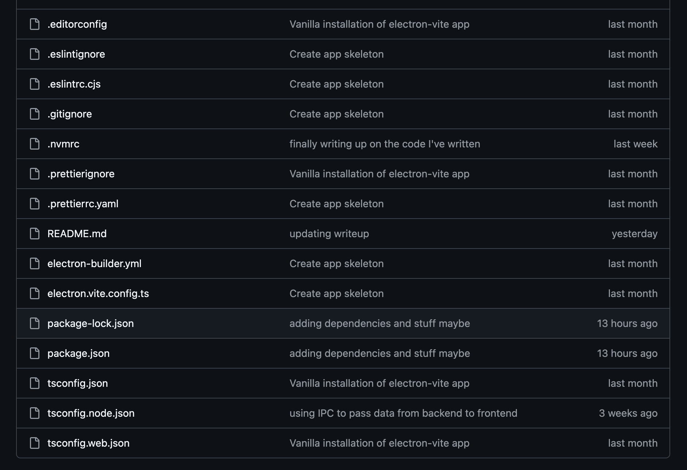

# 2.1.3 - Annotation of Code
> *an overwiew & explanation of the code written to make this project work*

*^Note that any time elipses `...` are used, it represents more code that isn't relevant to what I'm analysing, but is still in the file*

## Configuration

Though this area isn't related to logic/ flow of the program, it's important to set it up right - I'll use `npm`/ `node` to install/ manage files and packages. These packages currently include:

- [electron](https://www.electronjs.org/) - provides the wrapper to embed chromium as a desktop app
- [react](https://react.dev/) - provides a framework for UI/ flow of the app
- [mantine](https://mantine.dev/) - a UI library for buttons, menus etc.
- Some core javascript libraries such as the `path` module

Furthermore, I'll be writing with Typescript in place of Javascript, so additional configuration is needed for transpilation. These are responsible for the majority of dotfiles, `.json` and `.yml` files in the [root](https://github.com/samcalthrop/NodePad) NodePad directory:



# The App

The far majority of the code written is found within the [src](https://github.com/samcalthrop/NodePad/tree/main/src) directory. This is split into:

- [main](https://github.com/samcalthrop/NodePad/tree/main/src/main) - the backend
- [preload](https://github.com/samcalthrop/NodePad/tree/main/src/preload) - sets up Inter-Process Communication - essentially a bridge between the front and backend
- [renderer](https://github.com/samcalthrop/NodePad/tree/main/src/renderer) - the frontend

## App Setup

`src/main`, *at the time of writing this*, contains 2 files - [index.ts](https://github.com/samcalthrop/NodePad/blob/main/src/main/index.ts) and [getTreeNodeData.ts](https://github.com/samcalthrop/NodePad/blob/main/src/main/getTreeNodeData.ts).

[index.ts](https://github.com/samcalthrop/NodePad/blob/main/src/main/index.ts) is the access point for the backend code. A lot of this file is attributed to set up of the app:

The `createWindow()` function...

...defines how the window should appear, relative to the OS of the user:
```ts
const mainWindow = new BrowserWindow({
  width: 900,
  height: 670,
  show: false,
  autoHideMenuBar: true,
  ...(process.platform === 'linux' ? { icon } : {}),
  webPreferences: {
    preload: join(__dirname, '../preload/index.js'),
    sandbox: false,
  },
});
```

...makes the call to display the window to the user:
```ts
mainWindow.on('ready-to-show', () => {
  mainWindow.show();
});
```

...and handles customisation for different versions e.g opening `dev tools` if the user runs the app in `dev` mode using `npm run dev` in the command line:
```ts
mainWindow.webContents.openDevTools({ mode: 'right' });
```

Within `app.whenReady().then`, we can set the `createWindow()` function defined above to be called once the app is ready to be shown

For further setup, in `src/renderer/src` I have to define all the routes through the app (*e.g. which pages you can navigate to*). This is done in [index.tsx](https://github.com/samcalthrop/NodePad/blob/main/src/preload/index.ts):
```tsx
ReactDOM.createRoot(document.getElementById('root') as HTMLElement).render(
  <React.StrictMode>
    <MantineProvider defaultColorScheme="dark" theme={theme}>
      <HashRouter>
        <Routes>
          <Route path="/" element={<Screen> </Screen>} />
          <Route path="/login" element={<LoginScreen />} />
          <Route path="/signup" element={<SignUpScreen />} />
          <Route path="/home" element={<HomeScreen />} />
          <Route path="/edit-node-meta" element={<EditNodeMetaScreen />} />
        </Routes>
      </HashRouter>
    </MantineProvider>
  </React.StrictMode>
);
```
where each `<Route/>` defines a path to a different Screen.

### Testing

### The Result

## Screens
In order to best modularise my code, I created a `screens` directory within `src/renderer/src` - that way I was able to build a base `screen`, from which I could build on top of for other screens. This sped up the development process, and also made the styling/ layout of the app more consistent and logical.

### Defining a base
The [base screen](https://github.com/samcalthrop/NodePad/blob/main/src/renderer/src/screens/Screen/Screen.tsx) is currently very simple, mainly just defining rules allowing it to be used by child screens (screens I build using this as a base):

Defining a type `ScreenProps` to give the child screens a type that can be taken by `Screen`, and then defining what the base screen looks like
```tsx
export type ScreenProps = {
  children: ReactNode;
};

export const Screen = ({ children }: ScreenProps): JSX.Element => {
  return <div className={classes.root}>{children}</div>;
};
```

Currently it has minimal styling given my aim for functionality over aesthetics at this point, so the `Screen.module.css` file is very barebones:
```css
.root {
  margin: 10px;
  width: 100%;
  height: 100%;
}
```

#### Testing

#### The result
The result is a basic window from which I can build all screens on top of:


### Login
> *The [Login Screen](https://github.com/samcalthrop/NodePad/tree/main/src/renderer/src/screens/LoginScreen) is where the user is taken to enter valid credentials in order to be let into the main app.*

For this screen I focused on making the skeleton for the login screen, rather than the backend processing of the data entered at this point - the form for the user to fill out, containing all username and password fields, aswell as a submission button and a 'remember me' chackbox:
```tsx
<Screen>
  ...
  <form onSubmit={form.onSubmit(() => navigate('/home'))}>
    {/* username field */}
    <TextInput
      withAsterisk
      label="Email"
      placeholder="your@email.com"
      key={form.key('email')}
      {...form.getInputProps('email')}
    />

    {/* password field */}
    <PasswordInput
      withAsterisk
      label="Password"
      description="ensure password length is at least 8 characters long"
      placeholder="password-123"
      key={form.key('password')}
      {...form.getInputProps('password')}
    />

    {/* 'remember me' checkbox */}
    <Checkbox
      mt="sm"
      label="remember me"
      key={form.key('remember')}
      {...form.getInputProps('remember', { type: 'checkbox' })}
    />

    {/* form submission */}
    <Group justify="flex-begin" mt="md">
      <Button type="submit">Submit</Button>
    </Group>
  </form>
  ...
</Screen>
```

*Note that since it's wrapped within the `<Screen>` element, it inherits whatever properties are applied to `<Screen>` automatically.*

Furthermore, I used a form (provided by mantine) to declare what properties the login should have...
```tsx
const form = useForm({
  initialValues: {
    email: '',
    password: '',
    remember: false,
  },
  ...
});
```

...and then write scripts to define how they should validate input:
```tsx
validate: {
  email: (value) => (/^\S+@\S+$/.test(value) ? null : 'Invalid email'),
  password: (value) => (value.length >= 8 ? null : 'Invalid email'),
},
```

- The `email` validation uses the regular expression `/^\S+@\S+$/` as follows:
  - `^`: The pattern must start at the start if the user's input
  - `\S+`: `\S` matches any non-whitespace character, and `+` indicates any number of non-whitespace characters
  - `@`: Ensures there must be an '@' to separate the input
  - `\S+` (again): checks that there are characters on the other side of the '@'
  - `$`: Ensures no characters proceed the entered string of characters
- The `password` validation is currently much more primitive, only requiring the input be at least 8 characters long

Then a react hook is used to navigate to the homepage upon successful login, where `useNavigate()` is a hook provided by `react-router-dom`, and again to reroute the user to the Signup Screen if they're new:
```tsx
const navigate = useNavigate();
...
<form onSubmit={form.onSubmit(() => navigate('/home'))}>
  ...
</form>

<Button
  ...
  onClick={() => navigate('/signup')}
>
  Sign Up
</Button>
```

#### Testing

#### The result
The result of this code is a login page that looks like this:


### Signup
> *Additionally, if the user doesn't have an account, they can follow the `Sign Up` button to be taken to the [Signup Screen](https://github.com/samcalthrop/NodePad/tree/main/src/renderer/src/screens/LoginScreen)*

The login page makes use of the `navigate()` hook, this time to :


The Signup screen is very similar to the login screen, only adding an extra field for re-entering the chosen password, using:
```tsx
validate: {
  ...
  reEnterPassword: (value) => (value ? null : 'Passwords must match'),
},
```
as a temporary validation solution just to allow the user to enter a password - this logic will be redefined at a later date. The rest of the code is too similar to the Login screen for me to have any reason to show it too - the source can be seen [here](https://github.com/samcalthrop/NodePad/blob/main/src/renderer/src/screens/SignUpScreen/SignUpScreen.tsx)


#### Testing

#### The result
The result looks like this:


### SideBar
> *The SideBar is where the filetree for the user-selected root directory is displayed - for this section I'm only going to focus on the frontend part, and analyse the code for communication/ retrieval of file data further on, in the [IPC Section](https://github.com/samcalthrop/NodePad/blob/main/writeup/2%20-%20Iterative%20Development/2.1-Iteration1/2.1.3-annotation_of_code.md#inter-process-communication-ipc)*

The Sidebar is going to render the user-selected files in a file tree - this requires the frontend to query the backend for these files, and return them in a suitable format to be rendered. Because of this, I have to make use of React's `useState` and `useEffect` components to *retrieve* and then *set* `treeNodeData` as the returned object of type `TreeNodeData` (note the distinction between `treeNodeData` and `TreeNodeData`); a format which mantine uses to render the tree:
```tsx
export const Sidebar = (): JSX.Element => {
  const [treeNodeData, setTreeNodeData] = useState<Array<TreeNodeData>>([]);

  useEffect(() => {
    window.ipcAPI.getTreeNodeData().then((treeNodeData) => {
      setTreeNodeData(treeNodeData);
    });
  }, []);
  ...
};
```

#### Testing

#### The result
The Sidebar screen on its own, without any content displayed beside it now looks like this:


### Home
> *The Home Screen is where all markdown files in the user-selected root directory will be displayed visually in a network*

Home only constists of a few basic components currently:
```tsx
<Title order={1}>Home</Title>
<Canvas drawFunc={drawPulsingDot} width={200} height={200} />
<Text>Edit node meta</Text>
<Button
  variant="subtle"
  className={classes.button}
  onClick={() => navigate('/edit-node-meta')}
>
  Ok
</Button>
```

The two most important parts are he `<Button/>` and `<Canvas/>` elements - the button is the source of navigation, again using the `navigate()` function to transport the user to the editing screen (currently named `edit-node-meta` - this may change to something more user friendly) which will become valuable when combined with the other key element - `<Canvas/>`:
```tsx
<Canvas drawFunc={drawPulsingDot} width={200} height={200} />
```

This makes use of a predefined draw function, `drawFunc`, which takes in `drawPulsingDot` - this is imported at the top of the file from the path `@renderer/drawing/drawPulsingDot`. If we open `drawPulsingDot.ts`, we can see where the code for the 'node network' will go:
```tsx
export const drawPulsingDot: DrawFunc = (frameCount: number, context: CanvasRenderingContext2D) => {
  context.clearRect(0, 0, context.canvas.width, context.canvas.height);
  context.fillStyle = 'var(--mantine-primary-color-filled)'; // doesn't work
  context.beginPath();
  context.arc(50, 100, 20 * Math.sin(frameCount * 0.05) ** 2, 0, 2 * Math.PI);
  context.fill();
};
```

In its current state, all the function does is clear the canvas with the `clearRect()` method and draws a circle that grows/ shrinks based on the framecount *a.k.a time* using the `arc()` method. This is just a prototype to test how canvas works as it's entirely new to me, and so I'm taking time to learn canvas separately.

Then I wrapped the code for the homescreen in the `<ScreenWithSidebar/>` element in order to have both the homescreen and sidebar displayed next to one another:
```tsx
<ScreenWithSidebar>
  ...
    <Title order={1}>Home</Title>
    <Canvas drawFunc={drawPulsingDot} width={200} height={200} />
    <Text>Edit node meta</Text>
    <Button
      variant="subtle"
      className={classes.button}
      onClick={() => navigate('/edit-node-meta')}
    >
      Ok
    </Button>
  ...
</ScreenWithSidebar>
```

Where `<ScreenWithSidebar/>` is an just a `<Sidebar/>` element wrapped within a `<Screen/>` element with desired styling applied:
```tsx
export const ScreenWithSidebar = ({ children }: ScreenWithSidebarProps): JSX.Element => {
  return (
    <Screen>
      <div className={classes.root}>
        <div className={classes.sidebar}>
          <Sidebar />
        </div>
        <div>{children}</div>
      </div>
    </Screen>
  );
};
```

The mention of `children` within this function:
```tsx
export const ScreenWithSidebar = ({ children }: ScreenWithSidebarProps): JSX.Element => {
  ...
  <div>{children}</div>
};
```

allow any elements to be placed within this element within a `<div>`.

#### Testing

#### The result
The result of this code is:


### Text
> *The Text Screen is where the user is taken to edit the text of the selected markdown*

***IMPORTANT: I have yet to get this section to work - the API I'm using to parse/ render markdown is causing issues with security, so in the future I may have to build my own markdown parser/ renderer, or use another existing module.***

The main code for the text editor screen is as follows:
```tsx
export const EditNodeMetaScreen = (): JSX.Element => {
  // function to navigate to different pre-defined screens
  const navigate = useNavigate();
  // the hardcoded path for the backend to find where to retrieve the file contents
  const path = './README.md';

  const [fileContents, setFileContents] = useState<string>();
  // retrieving the file contents from the backend
  useEffect(() => {
    // upon data retrieval, assign it to the fileContents variable
    window.ipcAPI.getFileContents(path).then((fileContents) => {
      setFileContents(fileContents);
    });
  }, []);

  return (
    <ScreenWithSidebar>
      <div className={classes.root}>
        <div className={classes.thing}>
          <Title order={2}>Edit node meta</Title>

          {/* text area where the user can write and have their input live-translated to markdown preview */}
          <MDXEditor markdown={fileContents ? fileContents : ''} plugins={[headingsPlugin()]} />

          {/* button to exit to the homepage */}
          <Button variant="subtle" className={classes.button} onClick={() => navigate('/home')}>
            Exit
          </Button>
        </div>
      </div>
    </ScreenWithSidebar>
  );
};
```

In order to retrieve the contents of a specified file, the React hooks `useState` and `useEffect` have to be used in order to get past the asynchronous nature of the communication and transferral of data between the back and frontend:
```tsx
const [fileContents, setFileContents] = useState<string>();
useEffect(() => {
  window.ipcAPI.getFileContents(path).then((fileContents) => {
    setFileContents(fileContents);
  });
}, []);
```

Most of the other code is self-explanatory, or already explained by previous analysis, leaving the `<MDXEditor>` element as the only unfamiliar section:
```tsx
<MDXEditor markdown={fileContents ? fileContents : ''} plugins={[headingsPlugin()]} />
```

Using the ternary operator `fileContents ? fileContents : ''` allows for the potentiality that the value returned by `getFileContents()` could be `null`, meaning that the empty quote marks, `''` would be rendered in the case that the retrieval of `fileContents` fails. Additionally, the `plugins` attribute specifies any plugins the editor should use. In this case, only the `headingsPlugin` is used, meaning only markdown headings will be rendered.

As mentioned previously, the use of `MDXEditor` is causing errors due to security rules put in place by electron - I'm workign on a fix for this issue, but in case I can't find one, I'll have to find a new library or attempt a home-made parser and renderer.

#### Testing

#### The result


The contents of the dev tools console output when run is:


Tracing this bug we can see the Content Security Policy for this project does not allow the `eval` function to be called. This error leads back to:
```
at eval (<anonymous>)
at getGlobal (@mdxeditor_editor.js?v=e8b0c740:64659:10)
at @mdxeditor_editor.js?v=e8b0c740:64660:2
```
within the `@mdxeditor_editor.js?v=e8b0c740:64660:2` file - *a.k.a. the error is within the MDXEditor module*. The exact source of the error is found to be within this function:

```js
var GLOBAL = function getGlobal() {
  var savedEval = eval;
  return savedEval("this");
}();
```

##### How to fix it
One potential solution to this issue is to try and change the Content Security Policy (CSP) and make it less strict, or find a way to allow the script to run. The Content Security Policy definition is in `./src/renderer/src/index.html`, within a `<meta/>` tag:

```html
<meta
  http-equiv="Content-Security-Policy"
  content="default-src 'self'; script-src 'self'; style-src 'self' 'unsafe-inline'; img-src 'self' data:"
/>
```

## Inter-Process Communication (IPC)
> *The bridge between the frontend and backend, allowing exchange of data and the safe exposal of APIs*

### Basic Communication
In order to have a successful & compatible front & backend I need to establish a secure and reliable connection between them. Electron provides processes `IPCMain` and `IPCRenderer` that allow for this communication, making use of a `preload` script to make the app more secure by exposing the least amount of sensitive APIs to the frontend as possible.

Files:
- Basic Communication:
  - main/index.ts
  - HomeScreen.tsx
  - preload/index.d.ts

- Tree Stuff:
  - getTreeNodeData.ts
  - Sidebar.tsx
  - main/index.ts
  - preload/index.ts
  - preload/index.d.ts
