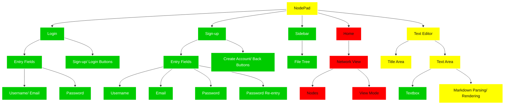

# 2.1.5 - Evaluation

> _To what extent was this iteration a success?_

An objective approach to evaluating the success of this iteration is to compare what I aimed to achieve with what was actually achieved in reality:

### The goal:

```mermaid

flowchart TD

	A --> U[Login]:::highlight-half
	U --> V[Entry Fields]:::highlight
	V --> ZH[Username/ Email]:::highlight
	V --> ZI[Password]:::highlight
	U --> W[Sign-up/ Login Buttons]:::highlight
	U --> ZA[Storage/ Retrieval Database]

	A --> Z[Sign-up]:::highlight-half
	Z --> ZD[Entry Fields]:::highlight
	ZD --> ZO[Username]:::highlight
	ZD --> ZP[Email]:::highlight
	ZD --> ZQ[Password]:::highlight
	ZD --> ZJ[Password Re-entry]:::highlight
	Z --> ZK[Create Account/ Back Buttons]:::highlight
	Z --> ZU[Storage/ Retrieval Database]

  A[NodePad]:::highlight-half --> B[Sidebar]:::highlight-half
  B --> C[Toolbar]
  B --> D[File Tree]:::highlight
  C --> E[Home Button]
  C --> F[Settings Button]
  C --> ZM[New Folder]
  C --> J[New File]

  A --> ZE[Settings]
  ZE --> G[Appearance]
  G --> H[Themes]
  H --> Browse
  H --> Custom
  ZE --> ZG[Account]
  ZG --> ZR[Username]
  ZG --> ZS[Email]
  ZG --> ZT[Password]
  ZE --> Y[Files]
  Y --> ZF[Networks]
  ZF --> ZN[Source Directory]
  ZE --> Help

  A --> K[Home]:::highlight-half
  K --> L[Welcome/ Getting Started View]
  K --> M[Network View]:::highlight-half
  M --> Nodes:::highlight
  M --> Tags
  M --> O[View Mode]:::highlight
  M --> P[Edit Mode]
  M --> Linking
  M --> Unlinking
  M --> ZZ[Fuzzy search]

  A --> Q[Text Editor]:::highlight-half
  Q --> R[Title Area]:::highlight-half
  Q --> S[Tags]
  Q --> T[Text Area]:::highlight-half
  T --> ZB[Textbox]:::highlight
  T --> ZC[Markdown Parsing/ Rendering]:::highlight-half

  classDef highlight fill:#44a,stroke:#fff,stroke-width:2px,color:#fff
  classDef highlight-half fill:#ade,stroke:#fff,stroke-width:2px,color:#111
```

From this I can isolate all the items I had plans on making progress on:

### The result:

And now, I can demonstrate whether these have been a success, using the key:

- **green** - I achieved everything I set out to do
- **yellow** - I partially achieved what I wanted to
- **red** - I did not achieve what I set out to

Additionally, any additional features I plan to add based on [my stakeholder feedback](./2.1.4-stakeholder_feedback.md) will be added to the hierarchy chart [at the start of the next iteration](../2.2-Iteration2/2.2.2-functionality_of_prototype.md).

## Self Evaluation

This, to me, is a minor success; certainly not all the boxes have been checked at this point, mainly due to persistent errors, some of which I haven't yet been able to debug - **_these will carry over to Iteration 2_**, where I will hopefully be able to resole them. Significant progress has been made, though notably not as much as I wanted to. This suggests to me I need to put more time into Iteration 2 (_in the parts that matter, instead of focusing on minor bugs/ details_)

See next: [Iteration 2: Aims](../2.2-Iteration2/2.2.1-aims.md)
