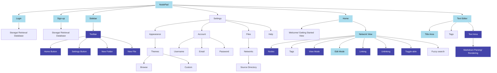
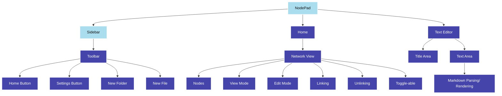

# 2.2.2 - Functionality of Prototype

> _What features do I aim to have implemented in this iteration?_

### Key:

- **Dark blue**: the feature should ideally be (close to) completely finished _(it's likely there'll still need to be improvements/ optimisations, but it should be in working order)_
- **Light blue**: the feature should be at least partially completed - _e.g, the Page view's bare skeleton should be implemented, however I'm not aiming to have markdown parsing/ rendering done, thus it would be partially completed_
- **Grey**: features finished in the last iteration
- **Unhighlighted**: the feature is not one I plan on focusing much time into during this iteration

```mermaid

flowchart TD

	A --> U[Login]:::highlight-half
	U --> V[Entry Fields]:::finished
	V --> ZH[Username/ Email]:::finished
	V --> ZI[Password]:::finished
	U --> W[Sign-up/ Login Buttons]:::finished
	U --> ZA[Storage/ Retrieval Database]

	A --> Z[Sign-up]:::highlight-half
	Z --> ZD[Entry Fields]:::finished
	ZD --> ZO[Username]:::finished
	ZD --> ZP[Email]:::finished
	ZD --> ZQ[Password]:::finished
	ZD --> ZJ[Password Re-entry]:::finished
	Z --> ZK[Create Account/ Back Buttons]:::finished
	Z --> ZU[Storage/ Retrieval Database]

  A[NodePad]:::highlight-half --> B[Sidebar]:::highlight-half
  B --> C[Toolbar]:::highlight
  B --> D[File Tree]:::finished
  C --> E[Home Button]:::highlight
  C --> F[Settings Button]:::highlight
  C --> ZM[New Folder]:::highlight
  C --> J[New File]:::highlight

  A --> ZE[Settings]
  ZE --> G[Appearance]
  G --> H[Themes]
  H --> Browse
  H --> Custom
  ZE --> ZG[Account]
  ZG --> ZR[Username]
  ZG --> ZS[Email]
  ZG --> ZT[Password]
  ZE --> Y[Files]
  Y --> ZF[Networks]
  ZF --> ZN[Source Directory]
  ZE --> Help

  A --> K[Home]:::highlight-half
  K --> L[Welcome/ Getting Started View]
  K --> M[Network View]:::highlight-half
  M --> Nodes:::highlight
  M --> Tags
  M --> O[View Mode]:::highlight
  M --> P[Edit Mode]:::highlight
  M --> Linking:::highlight
  M --> Unlinking:::highlight
  M --> Toggle-able:::highlight
  M --> ZZ[Fuzzy search]

  A --> Q[Text Editor]:::highlight-half
  Q --> R[Title Area]:::highlight-half
  Q --> S[Tags]
  Q --> T[Text Area]:::highlight
  T --> ZB[Textbox]:::finished
  T --> ZC[Markdown Parsing/ Rendering]:::highlight

  classDef highlight fill:#44a,stroke:#fff,stroke-width:2px,color:#fff
  classDef highlight-half fill:#ade,stroke:#fff,stroke-width:2px,color:#111
  classDef finished fill:#888888,stroke:#fff,stroke-width:2px,color:#111
```

This diagram is quite large and daunting, and so some simplifying would be beneficial - after removing all the components that are finished, what's left is:

This better shows the proportion of the app I aim to have done by the end of this iteration - however this isn't completely accurate, as some components are much larger/ more difficult to implement, so the proportion shown may be misleading. Finally, a diagram of just the features I want to make significant changes to is:

This diagram appears small, however I expect the network will prove difficult and time-consuming to implement, given that I have no experience with the HTML Canvas element, or any form of animation/ asynchronous programming. Therefore, the two main areas I focus on getting completed are:

- The sidebar
- The text editor
- The node network

See next: [Annotation of Code](2.2.3-annotation_of_code.md)
