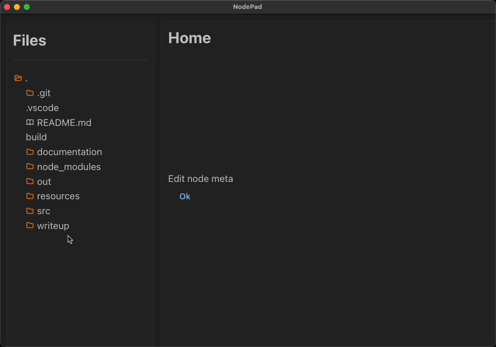
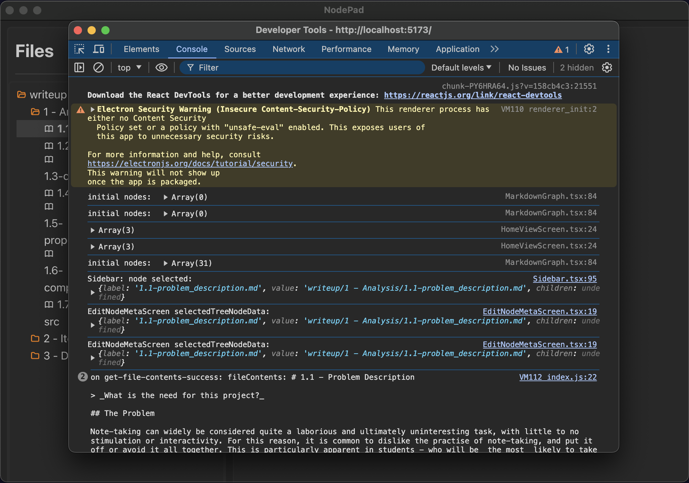
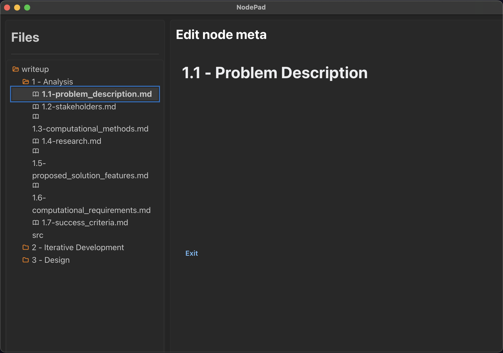
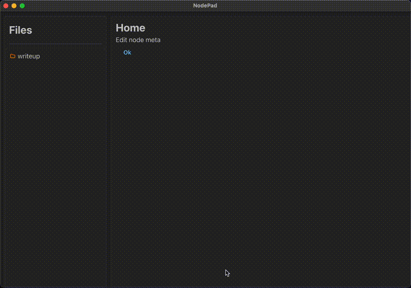
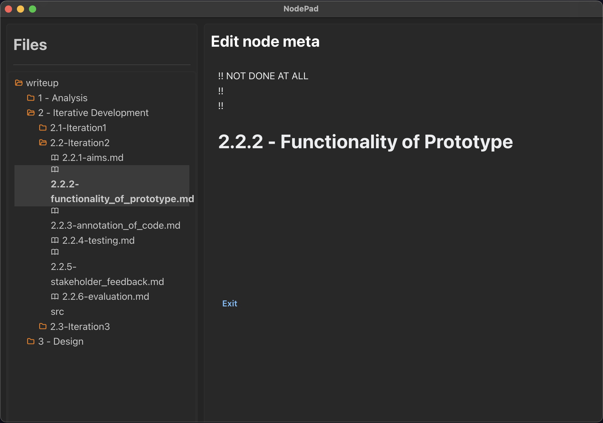
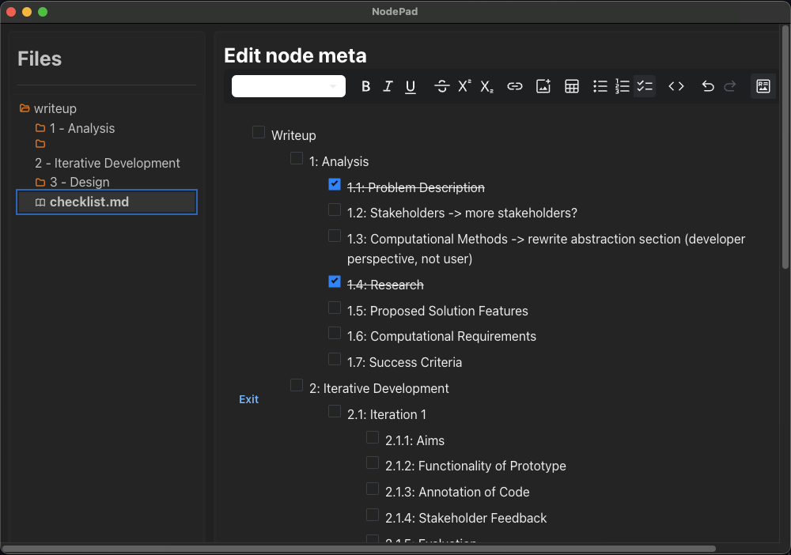
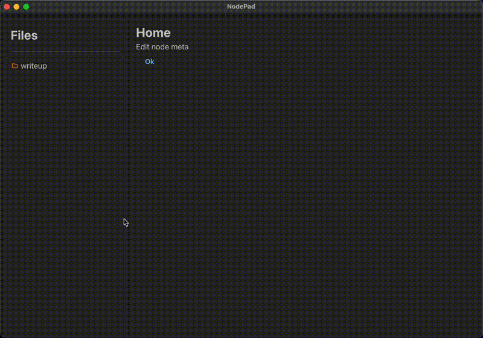
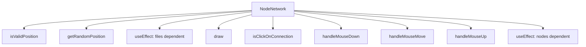
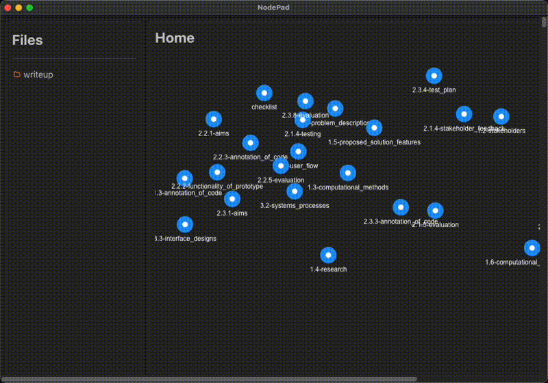
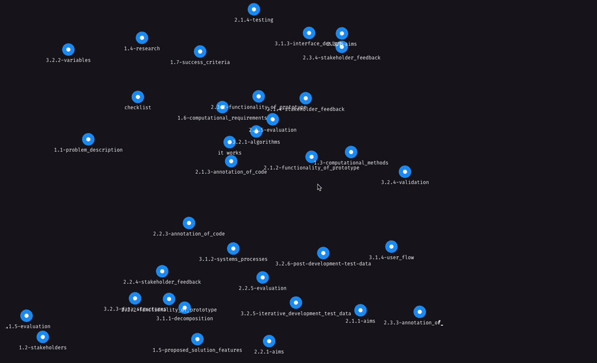

# 2.2.3 - Annotation of Code

> _an overview & explanation of the code written to build this project - **this includes testing**_

## Errors Carried Over from Iteration 1

First thing to do this iteration is focus on fixing the errors carried over from iteration 1. At this point, the main errors are:

- MDXEditor failing to render the data passed to it
- The Sidebar component reloading with each update to the app, meaning its state is lost each time the user navigates through the app - _this means, for example, opening a file to edit it will result in the sidebar to the left losing its current state, making the app feel clunky and less usable._

### Using a Provider

One way to potentially resolve the issue currently being faced restructuring app to implement my own provider - `SharedDataProvider`. **_This may be useful for both of the above errors_**, as it allows the app to re-access the state of the sidebar at any point, and also allows the MDXEditor to access the data passed to it repeatedly - my working theory is that the data is being rendered once, before it has a chance to be retrieved by the backend, but is not re-rendered once the contents are retrieved, resulting in an erroneous render message:

A provider allows data to be passed from the lower components to the top level component, in this case the `App` component. This can then be passed down the component stack to any other components that need to access the data. Therefore I can pass data from the sidebar component, to the top level app component, and then down to the MDXEditor component.

To make the provider, I:

- created a new directory `providers` to store all providers I make for the app, and,
- created the `SharedDataProvider` directory within `providers` to store any code related to this specific provider, containing the following code within `SharedDataProvider.tsx`:

`SharedDataProvider.tsx`:

```tsx
import { createContext, useContext, useMemo, useState } from 'react';
import { TreeNodeData } from '@mantine/core';

export type SharedDataProviderProps = {
  children: React.ReactNode;
};

export type SharedData = {
  selectedTreeNodeData: TreeNodeData | undefined;
  setSelectedTreeNodeData: React.Dispatch<React.SetStateAction<TreeNodeData | undefined>>;
};

export const SharedDataContext = createContext<SharedData | undefined>(undefined);

export function SharedDataProvider({ children }: SharedDataProviderProps): JSX.Element {
  const [selectedTreeNodeData, setSelectedTreeNodeData] = useState<TreeNodeData>();

  const value = useMemo<SharedData>(
    () => ({
      selectedTreeNodeData,
      setSelectedTreeNodeData,
    }),
    [selectedTreeNodeData]
  );

  return <SharedDataContext.Provider value={value}>{children}</SharedDataContext.Provider>;
}

export const useSharedData = (): SharedData => {
  const sharedData = useContext(SharedDataContext);
  if (sharedData === undefined) {
    throw new Error('useSharedData must be used within a SharedDataProvider');
  }

  return sharedData;
};
```

#### Breaking This Down:

```tsx
export type SharedDataProviderProps = {
  children: React.ReactNode;
};
```

declares the props for the provider, which is any children of the provider;

```tsx
export type SharedData = {
  selectedTreeNodeData: TreeNodeData | undefined;
  setSelectedTreeNodeData: React.Dispatch<React.SetStateAction<TreeNodeData | undefined>>;
};
```

declares the type of data that will be shared through the provider - these use React's `useState` hook, which is a way to create a state variable (`selectedTreeNodeData`) and a function to update it (`setSelectedTreeNodeData()`).

```tsx
export const SharedDataContext = createContext<SharedData | undefined>(undefined);
```

creates a context object that can be used to communicate data across the app;

```tsx
export function SharedDataProvider({ children }: SharedDataProviderProps): JSX.Element {
  const [selectedTreeNodeData, setSelectedTreeNodeData] = useState<TreeNodeData>();

  const value = useMemo<SharedData>(
    () => ({
      selectedTreeNodeData,
      setSelectedTreeNodeData,
    }),
    [selectedTreeNodeData]
  );

  return <SharedDataContext.Provider value={value}>{children}</SharedDataContext.Provider>;
}
```

defines the provider component, which uses React's `useMemo` hook to memoize the value of the shared data, and returns a `Provider` component that wraps the app's children with the shared data context, where memoization is used to optimize performance by preventing unnecessary re-renders of components, and;

```tsx
export const useSharedData = (): SharedData => {
  const sharedData = useContext(SharedDataContext);
  if (sharedData === undefined) {
    throw new Error('useSharedData must be used within a SharedDataProvider');
  }

  return sharedData;
};
```

defines the custom hook `useSharedData()` that can be used to access the shared data within the provider.

As a result, I updated the file `Sidebar.tsx` to use the provider,

`Sidebar.tsx`:

```tsx
function Leaf({
  node,
  expanded,
  hasChildren,
  elementProps,
  tree,
}: RenderTreeNodePayload): ReactElement<FileIconProps> {
  // making use of the SharedDataProvider and the custom hook useSharedData() to access the shared data
  const { setSelectedTreeNodeData } = useSharedData();
  const navigate = useNavigate();

  return (
    <Group
      gap={5}
      {...elementProps}
      onClick={() => {
        tree.toggleSelected(node.value);
        tree.toggleExpanded(node.value);
        if (!node.children) {
          console.log('Sidebar: node selected:', node);
          // updating the shared data with the selected node
          setSelectedTreeNodeData(node);
          navigate('/home/edit-node-meta');
        }
      }}
    >
      <FileIcon name={node.value} isFolder={hasChildren} expanded={expanded} />
      <span>{node.label}</span>
    </Group>
  );
}
```

and the file `src/renderer/src/index.tsx` to wrap the app in the provider (_this places the provider at the top level of the app, above the `<Routes>` component, so that any component can access the shared data_):

`src/renderer/src/index.tsx`:

```tsx
ReactDOM.createRoot(document.getElementById('root') as HTMLElement).render(
  ...
  <SharedDataProvider>
    <HashRouter>
      <Routes>
        <Route path="/" element={<LoginScreen />} />
        <Route path="/login" element={<LoginScreen />} />
        <Route path="/signup" element={<SignUpScreen />} />
        <Route path="/home/*" element={<HomeScreen />} />
      </Routes>
    </HashRouter>
  </SharedDataProvider>
  ...
);
```

#### Testing

##### Test 1: Test for a consistent Sidebar state

| Description                                                                                                                                                                                                                                                       | Input                                                                                                                                                                                                                         | Output                                                                  | Result         |
| ----------------------------------------------------------------------------------------------------------------------------------------------------------------------------------------------------------------------------------------------------------------- | ----------------------------------------------------------------------------------------------------------------------------------------------------------------------------------------------------------------------------- | ----------------------------------------------------------------------- | -------------- |
| When a markdown file is clicked on, this causes the text editor to be opened - when this happens, the Sidebar's state must remain _i.e if one or several folders is/ are open, they should stay open even when the user navigates to a different part of the app_ | Navigate between the Home screen and the Text Editor, _e.g by clicking on a file in the Sidebar, and then exiting back to the Home screen_, making sure the Sidebar is not in its original state (_open a few folders first_) | Sidebar should retain the state of having these folders open throughout | **Success** ✅ |

**Evidence:**

<div align="center">
  
</div>

This resulted in the sidebar's state being retained when navigating through routes within the app - this is one of the two errors fixed. However, the MDXEditor was still failing to render the data passed to it - my assumption about the re-rendering was partially incorrect, and so I had to dig further to find a solution somewhere else:

### MDXEditor Methods and Refs

After carefully reviewing the `MDXEditor` [documentation](https://mdxeditor.dev/editor/docs/getting-started), I found the [methods section](https://mdxeditor.dev/editor/api/interfaces/MDXEditorMethods), detailing all methods that can be used on the MDXEditor object reference. I also found the `useMDXEditorRef` hook, which returns a ref that can be attached to the editor - this ref is what allows the editor to be updated dynamically with the data passed to it via user input. This changed the code in `EditNodeMetaScreen.tsx` to look as follows:

`EditNodeMetaScreen.tsx`:

```tsx
...
import { MDXEditor, MDXEditorMethods, codeBlockPlugin, headingsPlugin } from '@mdxeditor/editor';
import { useEffect, useRef, useState } from 'react';
import { useSharedData } from '@renderer/providers/SharedDataProvider';

export const EditNodeMetaScreen = (): JSX.Element => {
  ...
  const { selectedTreeNodeData } = useSharedData();
  // uses a react state to get/ change the current contents of the file being edited
  const mdxEditorRef = useRef<MDXEditorMethods>(null);
  // uses a react state to get/ change the current contents of the file being edited
  const [fileContents, setFileContents] = useState<string | null>(null);

  useEffect(() => {
    console.log('EditNodeMetaScreen selectedTreeNodeData:', selectedTreeNodeData);
    if (!selectedTreeNodeData) {
      return;
    }

    window.ipcAPI.getFileContents(`./${selectedTreeNodeData.value}`).then((fileContents) => {
      console.log('EditNodeMetaScreen getFileContents:', fileContents);
      // setting the markdown of the editor to the file contents
      mdxEditorRef.current?.setMarkdown(fileContents);
      console.log(
        'EditNodeMetaScreen: mdxEditorRef.current?.getMarkdown()',
        mdxEditorRef.current?.getMarkdown()
      );
      setFileContents(fileContents);
    });
  }, [selectedTreeNodeData]);

  return (
    ...
        {fileContents === null ? (
          <div>No selection made yet</div>
        ) : (
          <div className={classes.mdxeditor}>
            {/* a class specially for the markdown editor instance, as specified in the documentation for MDXEditor: https://mdxeditor.dev/editor/docs/theming */}
            <MDXEditor
              ref={mdxEditorRef}
              className="dark-theme dark-editor"
              markdown={fileContents}
              plugins={[codeBlockPlugin(), headingsPlugin()]}
            />
          </div>
        )}
    ...
  );
};
```

### Debugging (part 1)

In order to test this functionality, I used `console.log()` intermittently to check the value of the node selected in the sidebar at various points, to ensure it was correct, and being updated as expected:



This also prints the contents of the file being passed to the frontend, to ensure the communication of this data is a success. The result of selecting a file looks like this:



As we can see, the text is rendering according to the data retrieved from the backend - this is a success. However, the text is not rendering past the heading (H1) of the file. This is an error I have yet to solve.

### The Result (part 1)

The result of these fixes is:

- The sidebar's state is retained when navigating through routes within the app, and
- MDXEditor is now rendering the data passed from the backend

<div align="center">
  
</div>

**However**, there is a flaw: the data passed from the backend is not rendering past the heading (H1) of the files - I aim to fix this below:

### Debugging (part 2) - Plugins

After doing some further analysis, I found that the issue was actually in failing to render _the line after_ the heading, as in all the files I proceeded the heading with a quote block (`> [text]`). I found this by checking what was rendered when I placed text before the heading:



which rendered, suggesting the error was not in that only the first line was being rendered, rather that it was in attempting to render the quote block.

This prompted me to revisit the [MDXEditor documentation](https://mdxeditor.dev/editor/docs/getting-started) - this led me to the plugins provided by MDXEditor as a prop for the `<MDXEditor>` component, one of which was the [quotePlugin()](https://mdxeditor.dev/editor/api/functions/quotePlugin), which "_adds support for block quotes to the editor_". Furthermore, the documentation provides plugins for rendering all other common markdown elements, such as headings, code blocks, lists, etc., which I added to the imports, and the `plugins` prop of the `<MDXEditor>` component:

`EditNodeMetaScreen.tsx`:

```tsx
...
import {
  BlockTypeSelect,
  BoldItalicUnderlineToggles,
  CodeToggle,
  CreateLink,
  DiffSourceToggleWrapper,
  InsertImage,
  InsertTable,
  ListsToggle,
  MDXEditor,
  MDXEditorMethods,
  StrikeThroughSupSubToggles,
  UndoRedo,
  codeBlockPlugin,
  diffSourcePlugin,
  headingsPlugin,
  imagePlugin,
  jsxPlugin,
  linkDialogPlugin,
  linkPlugin,
  listsPlugin,
  markdownShortcutPlugin,
  quotePlugin,
  tablePlugin,
  toolbarPlugin,
} from '@mdxeditor/editor';

export const EditNodeMetaScreen = (): JSX.Element => {
  ...
  return (
    ...
          <div className={classes.mdxeditor}>
            {/* a class specially for the markdown editor instance, as specified in the documentation for MDXEditor: https://mdxeditor.dev/editor/docs/theming */}
            <MDXEditor
              ref={mdxEditorRef}
              className="dark-theme dark-editor"
              markdown={fileContents}
              plugins={[
                codeBlockPlugin(),
                diffSourcePlugin(),
                headingsPlugin(),
                imagePlugin(),
                jsxPlugin(),
                linkDialogPlugin(),
                linkPlugin(),
                listsPlugin(),
                markdownShortcutPlugin(),
                quotePlugin(),
                tablePlugin(),
                toolbarPlugin({
                  toolbarContents: () => (
                    <DiffSourceToggleWrapper>
                      <BlockTypeSelect />
                      <BoldItalicUnderlineToggles />
                      <StrikeThroughSupSubToggles />
                      <CreateLink />
                      <InsertImage />
                      <InsertTable />
                      <ListsToggle />
                      <CodeToggle />
                      <UndoRedo />
                    </DiffSourceToggleWrapper>
                  ),
                }),
              ]}
            />
          </div>
        )}
    ...
  );
};
```

### Debugging (part 2)

Using this adaptation, I created a file, `checklist.md`, with all the markdown elements I want to be able to render in the app, and tested it by selecting the file in the sidebar and checking that the editor opened and correctly rendered its contents.

Upon running the program, the editor - with additional components added such as a toolbar along the top - correctly rendered all the markdown elements supplied to it by the file. Therefore this test passed, and can be considered a **success**.

### Testing

#### Test 2: Test that file contents are displayed fully, and rendered as markdown

| Description                                                                                                                                                                                             | Input                                                                                 | Output                                                                                         | Result         |
| ------------------------------------------------------------------------------------------------------------------------------------------------------------------------------------------------------- | ------------------------------------------------------------------------------------- | ---------------------------------------------------------------------------------------------- | -------------- |
| When a markdown file is clicked on, this causes the text editor to be opened - upon opening, the contents of the file selected should be displayed in its entirety, and rendered in the markdown format | Navigate from the Home screen to the Text Editor by clicking on a file in the Sidebar | User should be navigated to the Text Editor, and the criteria in the Description should be met | **Success** ✅ |

**Evidence:**

<div align="center">
  
</div>

### The Result (Part 2)

The result of these fixes is:

- Sidebar's state is fixed when navigating through routes within the app, and
- MDXEditor is now rendering the _all the data_ passed from the backend successfully

<div align="center">
  
</div>

### Demo

A demo of all the changes and fixes made thus far is summarised in the gif below:

<div align="center">
  
</div>

## The Network

The Network View is the main focal point of this iteration, and as stated in [aims](2.2.1-aims.md) and [functionality](2.2.2-functionality_of_prototype.md), I aim to get the network mostly finished.

The first step I had to take in order to get this up and running was get to grips with the Canvas API. For this I followed several tutorials, from both websites and YouTube:

- https://www.tutorialspoint.com/html/html_canvas.htm (webpage, covered canvas at a low, simple level)
- https://www.w3schools.com/graphics/canvas_intro.asp (webpage, similarly taught me about the basic fundamentals of canvas)
- https://www.youtube.com/watch?v=Yvz_axxWG4Y (youtube video, helped to teach about integration into the app environment, and basic to advanced usage)

### Modularisation

Starting off small, I decomposed the problem into its constituent parts - one of which being the nodes representing each file in the network. I knew each node would have to store data on its position within the canvas context, the (title), the file path of the file it represents, and an array of all the nodes it's connected to. As a result, I decided to create a `Node` structure within `./src/renderer/src/types/index.ts`, where this `index.ts` file is a modular place to store all types declared and used in the app:

```ts
export interface Node {
  id: number;
  x: number;
  y: number;
  title: string;
  filePath: string;
  connections: Array<number>; // Array of connected node IDs
}
```

The other main component within the network is the connections between nodes. These are very simple, and as such the type declaration only contains two properties: the source node (`from`), and the target node (`to`):

```ts
export interface Connection {
  from: number;
  to: number;
}
```

One more interface that would be useful to have is a declaration of the props for the `<NodeNetwork>` component, _i.e. what's passed into the component when created_. The only prop I can currently think to implement is an array of the files in the user's selected source directory, which is of type `TreeNodeData`:

```ts
export interface NodeNetworkProps {
  files: Array<TreeNodeData>;
}
```

This means that the data will come in the form:

```yaml
{
  path: './writeup',
  name: 'writeup',
  children:
    [
      { path: 'writeup/1 - Analysis', name: '1 - Analysis', children: [Array] },
      {
        path: 'writeup/2 - Iterative Development',
        name: '2 - Iterative Development',
        children: [Array],
      },
      { path: 'writeup/3 - Design', name: '3 - Design', children: [Array] },
      { path: 'writeup/checklist.md', name: 'checklist.md' },
    ],
}
```

These components can then be imported in to the the script I write for the logic and rendering of the network canvas in a separate file. This encapsulates the code, making it more secure, modular and, trustworthy, as anything within it has already been tried and tested

### The `NodeNetwork` Function

I defined the entry point for the node network logic in `src/renderer/src/components/NodeNetwork/NodeNetwork.tsx`. This is where the functionality of the network will be, and also where the `<NodeNetwork/>` component is exported from.

Firstly, I imported the necessary imports:

`NodeNetwork.tsx`:

```tsx
import { useEffect, useRef, useState } from 'react';
import { Node, Connection, NodeNetworkProps } from '../../types/index';
```

...and defined the `NodeNetwork` function with the following variables/ react hook calls:

`NodeNetwork.tsx`:

```tsx
export const NodeNetwork = ({ files }: NodeNetworkProps): JSX.Element => {
  const canvasRef = useRef<HTMLCanvasElement>(null);
  const [nodes, setNodes] = useState<Node[]>([]);
  const [connections, setConnections] = useState<Connection[]>([]);
  const [draggedNode, setDraggedNode] = useState<number | null>(null);
  const [draggingConnection, setDraggingConnection] = useState<{
    fromId: number;
    toPos: { x: number; y: number };
  } | null>(null);
  const radius = 15;
  ...
}
```

- `canvasRef` is a reference to the specific instance of the canvas element, used to access the canvas' properties and methods
- `nodes` is an array of nodes in the network, `setNodes` is the react state hook used to update the nodes array
- `connections` is an array of connections between nodes in the network, `setConnections` is the react state hook used to update the connections array
- `draggedNode` is the id of the node that is currently being dragged, `setDraggedNode` is the react state hook used to update the dragged node
- `draggingConnection` is the state of the connection being dragged, `setDraggingConnection` is the react state hook used to update the dragging connection
- `radius` defining the radius if the nodes in the network. This then can be used to set other variables from one place, _e.g. the minimum distance between nodes is set as double the radius within the `isValidPosition()` function, rather than hardcoding a value of 30_.

#### Methods

Within `NodeNetwork()`, I defined several methods in order to achieve the desired using a modular approach - splitting functionality up this way makes the code much more readable, as well as making it much easier and quicker to debug, as each function can be used/ tested in isolation:



##### `isValidPosition()`

This function checks if the given position, in x and y, is a valid position for a new node to be drawn. It's a `boolean` type, returning true or false, based on whether the distance between the node being drawn and any other node that exists is greater than the minimum distance, using pythagoras:

`NodeNetwork.tsx`:

```tsx
/* check if given position is valid (not overlapping with other nodes) */
const isValidPosition = (x: number, y: number, existingNodes: Node[]): boolean => {
  // defining the minimum distance between nodes
  const minDistance = 2 * radius;
  return !existingNodes.some(
    /* performing pythagoras to check if the distance between the two nodes is less than the minimum distance */
    (node) => Math.sqrt(Math.pow(node.x - x, 2) + Math.pow(node.y - y, 2)) < minDistance
  );
};
```

###### Test 3: Check `isValidPosition()` works

| Description                                                                                                    | Input                                                      | Output                                                                                     | Result         |
| -------------------------------------------------------------------------------------------------------------- | ---------------------------------------------------------- | ------------------------------------------------------------------------------------------ | -------------- |
| Making sure that the coordinates of each generated node are unique (_nodes can't spawn on top of one another_) | Navigate to the Home screen and reload the window 10 times | If no nodes spawn on one another, it provides evidence that the function most likely works | **Success** ✅ |

**Evidence:**

<div align="center">
  
</div>

##### `getRandomPosition()`

This function generates a random position for a new node to be drawn. This involves:

- setting a `padding` width, so that nodes don't spawn to close to the edges
- checking the case that the canvas context isn't retrieved and return a default of `(0,0)`
- setting `x` and `y` to a random position within the allowed area of the canvas (_within the padding_)
- checking that the node won't overlap any that already exist and:
  - returning `(x,y)` if true
  - otherwise looping through until a maximum number of attempts is reached, to prevent the loop running indefinitely, and returning a new random position inside the whole canvas

`NodeNetwork.tsx`:

```tsx
// generate random position within canvas
const getRandomPosition = (existingNodes: Node[], attempts = 1000): { x: number; y: number } => {
  const padding = 2 * radius; // padding from canvas edges
  const canvas = canvasRef.current;
  if (!canvas) return { x: 0, y: 0 };

  for (let i = 0; i < attempts; i++) {
    const x = padding + Math.random() * (canvas.width - 2 * padding);
    const y = padding + Math.random() * (canvas.height - 2 * padding);
    if (isValidPosition(x, y, existingNodes)) {
      return { x, y };
    }
  }
  // if no valid position found after attempts, return a random position
  return { x: Math.random() * canvas.width, y: Math.random() * canvas.height };
};
```

###### Test 4: Check `getRandomPosition()` works

| Description | Input | Output | Result         |
| ----------- | ----- | ------ | -------------- |
|             |       |        | **Success** ✅ |

**Evidence:**

<div align="center">
  
</div>

##### `useEffect(..., [files])`

This react hook is used to determine all the nodes that will initially be rendered when the network is loaded, **upon the `files` prop being updated** (_shown by the [files] variable given as an argument on the last line of the function_).

In essence, the function iterates through each item of `TreeNodeData` in the `files` array. If the item has the `.md` extension, it is known to be a markdown file, and so will be assigned a node. It then generates a random position for the node to be drawn at, and instantiates the node with all the necessary fields, taking care to remove the `.md` extension from the title of the node, as this is unnecessary and makes the view more cluttered.

For any items that don't end in `.md`, it is assumed to be a directory; due to the nature of the `TreeNodeData[]` type, the way I've handled iterating through the child nodes is by appending them to the end of the `files` array - this way, the function will keep iterating through every child, and that child's children etc. until all files are checked - _this could also be implemented by recursively searching through the children rather than in a linear fashion, though I've chosen not to take that approach due to how a lot of children could cause a build up in the call stack_.

In the case that the item doesn't have children, it simply has nothing to append to the `files` array, and so nothing unexpected happens:

`NodeNetwork.tsx`:

```tsx
// initialize nodes from the array passed in
useEffect(() => {
  const canvas = canvasRef.current;
  if (!canvas) return;

  const initialNodes: Node[] = [];
  let index = 0;
  for (const item of files) {
    // if the item passed in has no children, it's assumed to be a file
    if (item.label?.toString().endsWith('.md')) {
      const file = item;
      const position = getRandomPosition(initialNodes);
      // instantiates new node with the file's name and path, at a random position
      initialNodes.push({
        id: index,
        x: position.x,
        y: position.y,
        title: file.label?.toString().replace('.md', '') || '',
        filePath: file.value?.toString() || '',
        connections: [],
      });
      // the next node id will be given the next number, which only increments if a new node is created
      index++;
    } else {
      if (item.children) {
        for (const child of item.children) {
          /* pushes each child to the end of the files array, to go through the same process
             until all children are files, and so become nodes */
          files.push(child);
        }
      }
    }
  }
  setNodes(initialNodes);
  console.log('initial nodes: ', initialNodes);
}, [files]);
```

###### Test 5: Check `uesEffect(..., [files])` works

| Description | Input | Output | Result         |
| ----------- | ----- | ------ | -------------- |
|             |       |        | **Success** ✅ |

**Evidence:**

<div align="center">
  
</div>

##### `draw()`

This is the function responsible for drawing the network, and splits into 3 main parts:

- drawing the connections between nodes
- drawing a dashed line to follow the mouse as it drags a connection between nodes
- drawing each node in the `nodes` array

All 3 sections make use almost exclusively of canvas' basic built in methods, accessed via the `ctx` variable, with very readable, self-explanatory names - for this reason little annotation is needed:

`NodeNetwork.tsx`:

```tsx
// canvas drawing function
const draw = (ctx: CanvasRenderingContext2D): void => {
  ctx.clearRect(0, 0, ctx.canvas.width, ctx.canvas.height);

  // draw connections between each node
  connections.forEach((connection) => {
    const fromNode = nodes.find((node) => node.id === connection.from);
    const toNode = nodes.find((node) => node.id === connection.to);
    if (fromNode && toNode) {
      ctx.beginPath();
      ctx.moveTo(fromNode.x, fromNode.y);
      ctx.lineTo(toNode.x, toNode.y);
      ctx.strokeStyle = '#666';
      ctx.lineWidth = 2;
      ctx.stroke();
    }
  });

  // dragging connection line
  if (draggingConnection) {
    const fromNode = nodes.find((node) => node.id === draggingConnection.fromId);
    if (fromNode) {
      ctx.beginPath();
      ctx.moveTo(fromNode.x, fromNode.y);
      ctx.lineTo(draggingConnection.toPos.x, draggingConnection.toPos.y);
      ctx.strokeStyle = '#666';
      ctx.setLineDash([5, 5]);
      ctx.lineWidth = 2;
      ctx.stroke();
      ctx.setLineDash([]);
    }
  }

  // craw nodes
  nodes.forEach((node) => {
    // node circle
    ctx.beginPath();
    ctx.arc(node.x, node.y, 15, 0, Math.PI * 2);
    ctx.fillStyle = '#2196F3';
    ctx.fill();

    // connection handle
    ctx.beginPath();
    ctx.arc(node.x, node.y, 5, 0, Math.PI * 2);
    ctx.fillStyle = '#fff';
    ctx.fill();

    // title
    ctx.fillStyle = 'white';
    ctx.font = '12px Arial';
    ctx.textAlign = 'center';
    ctx.fillText(node.title, node.x, node.y + 30);
  });
};
```

###### Test 6: Check `draw()` works

| Description | Input | Output | Result         |
| ----------- | ----- | ------ | -------------- |
|             |       |        | **Success** ✅ |

**Evidence:**

<div align="center">
  
</div>

##### `isClickConnection()`

This function checks whether the user has clicked a connection (this will cause the connection to be removed). It does this by:

- calculating the perpendicular distance from the click to the connection between the two nodes using vector calculus (_vector cross product_), and ensuring this is a suitably small amount so as to make the user experience smooth
- calculates the angle between the connection line and the horizontal axis using the theory that the angle between the connection and the horizontal, $\theta$, is given by $\tan (\theta) = \frac{\Delta y}{\Delta x}$, and so in this case:
  $$
  \theta = \arctan \left( \frac{y_2 - y_1}{x_2 - x_1} \right)
  $$
- and checks that the click is within the line segment of the connection, as well as the node's radius, using the theory that in a right-angled of length $r$, and angle between $r$ and the horizontal $\theta$, its x-component is $r \cos (\theta)$, and its y-component is $r \sin (\theta)$ - this prevents the program from removing the node is the user clicks on the node itself

`NodeNetwork.tsx`:

```tsx
// check if user has clicked a connection
const isClickOnConnection = (x: number, y: number, connection: Connection): boolean => {
  const fromNode = nodes.find((n) => n.id === connection.from);
  const toNode = nodes.find((n) => n.id === connection.to);
  if (!fromNode || !toNode) return false;

  const nodeA = { x: fromNode.x, y: fromNode.y };
  const nodeB = { x: toNode.x, y: toNode.y };
  const click = { x, y };

  // calculate distance from point to line segment
  const lengthAB = Math.sqrt(Math.pow(nodeB.x - nodeA.x, 2) + Math.pow(nodeB.y - nodeA.y, 2));
  // perpendicular distance from point to line AB, using vector cross product
  const perpDistance =
    Math.abs(
      (nodeB.y - nodeA.y) * click.x -
        (nodeB.x - nodeA.x) * click.y +
        nodeB.x * nodeA.y -
        nodeB.y * nodeA.x
    ) / lengthAB;

  // calculate angle between line AB and the horizontal
  const theta = Math.atan((nodeB.y - nodeA.y) / (nodeB.x - nodeA.x));
  console.log('angle: ', theta * (180 / Math.PI));

  return (
    perpDistance < 10 && // within 10px of the line
    x >= Math.min(nodeA.x, nodeB.x) + radius * Math.cos(theta) && // click is within line segment, the node's radius
    x <= Math.max(nodeA.x, nodeB.x) - radius * Math.cos(theta) &&
    y >= Math.min(nodeA.y, nodeB.y) - radius * Math.sin(theta) &&
    y <= Math.max(nodeA.y, nodeB.y) + radius * Math.sin(theta)
  );
};
```

###### Test 7: Check `isClickOnConnection()` works

| Description | Input | Output | Result         |
| ----------- | ----- | ------ | -------------- |
|             |       |        | **Success** ✅ |

**Evidence:**

<div align="center">
  
</div>

##### `handleMouseDown()`

This function handles the event that the user clicks within the canvas area. Therefore, it is responsible for handling:

- clicking on a connection, which removes it both visually and from the `connections` array
- clicking on a node:
  - if clicking near the centre of the node, the mouse will start dragging a connection until the mouse click ends
  - otherwise, the node will start being dragged

`NodeNetwork.tsx`:

```tsx
const handleMouseDown = (e: React.MouseEvent<HTMLCanvasElement>): void => {
  const rect = canvasRef.current?.getBoundingClientRect();
  if (!rect) return;

  // mouse position relative to the canvas
  const x = e.clientX - rect.left;
  const y = e.clientY - rect.top;

  // check if clicking on a connection (to remove it)
  const clickedConnection = connections.find((conn) => isClickOnConnection(x, y, conn));
  // remove connection if clicked
  if (clickedConnection) {
    setConnections((prev) =>
      prev.filter(
        (conn) => conn.from !== clickedConnection.from || conn.to !== clickedConnection.to
      )
    );
    // prevents any other mouse handling, graphically removing connection immediately
    return;
  }

  // check if clicking on a node
  const clickedNode = nodes.find(
    (node) => Math.sqrt(Math.pow(node.x - x, 2) + Math.pow(node.y - y, 2)) < radius
  );

  if (clickedNode) {
    // check if clicking near center (connection handle)
    const distanceToCenter = Math.sqrt(
      Math.pow(clickedNode.x - x, 2) + Math.pow(clickedNode.y - y, 2)
    );
    if (distanceToCenter < 10) {
      // start dragging a connection
      setDraggingConnection({
        fromId: clickedNode.id,
        toPos: { x, y },
      });
    } else {
      // start dragging the node
      setDraggedNode(clickedNode.id);
    }
  }
};
```

###### Test 8: Check `handleMouseDown()` works

| Description | Input | Output | Result         |
| ----------- | ----- | ------ | -------------- |
|             |       |        | **Success** ✅ |

**Evidence:**

<div align="center">
  
</div>

##### `handleMouseMove()`

This function handles the event that the user moves the mouse within the canvas area. Therefore, it is in control of:

- dragging a node to reflect the mouse movement across the canvas
- following the mouse with a dashed line, when dragging a connection between nodes

`NodeNetwork.tsx`:

```tsx
const handleMouseMove = (e: React.MouseEvent<HTMLCanvasElement>): void => {
  const rect = canvasRef.current?.getBoundingClientRect();
  if (!rect) return;

  const x = e.clientX - rect.left;
  const y = e.clientY - rect.top;

  // update canvas to draw the node in its new position, and assign it a new position internally
  if (draggedNode) {
    setNodes((prev) => prev.map((node) => (node.id === draggedNode ? { ...node, x, y } : node)));
  }

  // update canvas to draw the dragging connection by mouse, and assign it a new position internally
  if (draggingConnection) {
    setDraggingConnection((prev) =>
      prev
        ? {
            ...prev,
            toPos: { x, y },
          }
        : null
    );
  }
};
```

###### Test 9: Check `handleMouseMove()` works

| Description | Input | Output | Result         |
| ----------- | ----- | ------ | -------------- |
|             |       |        | **Success** ✅ |

**Evidence:**

<div align="center">
  
</div>

##### `handleMouseUp()`

This function handles the event that the user releases the mouse button within the canvas area. Therefore, it is in control of:

- Creating a connection between two nodes, if and only if the mouse button is released within the target node's radius
- Ensuring any node that may be being dragged is static once the mouse button is released:

`NodeNetwork.tsx`:

```tsx
const handleMouseUp = (e: React.MouseEvent<HTMLCanvasElement>): void => {
  const rect = canvasRef.current?.getBoundingClientRect();
  if (!rect) return;

  const x = e.clientX - rect.left;
  const y = e.clientY - rect.top;

  if (draggingConnection) {
    // check if mouse unclicked within a node's radius
    const targetNode = nodes.find(
      (node) => Math.sqrt(Math.pow(node.x - x, 2) + Math.pow(node.y - y, 2)) < radius
    );

    if (targetNode && targetNode.id !== draggingConnection.fromId) {
      setConnections((prev) => [
        // extends the previous connections array to include the new connection
        ...prev,
        {
          from: draggingConnection.fromId,
          to: targetNode.id,
        },
      ]);
    }
    setDraggingConnection(null);
  }

  // ensures no node is being dragged once MouseUp is triggered
  setDraggedNode(null);
};
```

###### Test 10: Check `handleMouseUp()` works

| Description | Input | Output | Result         |
| ----------- | ----- | ------ | -------------- |
|             |       |        | **Success** ✅ |

**Evidence:**

<div align="center">
  
</div>

##### `useEffect(..., [nodes, connections, draggingConnection])`

This react hook is used to handle the canvas' rendering loop, as well as the resizing of the canvas when the window is resized - without this, canvas elements would scale as the page scales, which is not an effect I want. This hook also returns a function that will be called when the component unmounts, which cancels the animation frame loop and removes the resize event listener. The rest of the code is just setup, which doesn't require much explanation or analysis:

`NodeNetwork.tsx`:

```tsx
// configuring canvas and render loop
useEffect(() => {
  const canvas = canvasRef.current;
  if (!canvas) return;

  const context = canvas.getContext('2d');
  if (!context) return;

  const resizeCanvas = (): void => {
    canvas.width = canvas.clientWidth;
    canvas.height = canvas.clientHeight;
  };
  resizeCanvas();
  window.addEventListener('resize', resizeCanvas);

  // request animation frame to render the canvas, and call the next frame, creating a loop
  let animationFrameId: number;
  const render = (): void => {
    draw(context);
    animationFrameId = window.requestAnimationFrame(render);
  };
  render();

  return (): void => {
    window.removeEventListener('resize', resizeCanvas);
    window.cancelAnimationFrame(animationFrameId);
  };
}, [nodes, connections, draggingConnection]);
```

###### Test 11: Check `useEffect(..., [nodes, connections, draggingConnection])` works

| Description | Input | Output | Result         |
| ----------- | ----- | ------ | -------------- |
|             |       |        | **Success** ✅ |

**Evidence:**

<div align="center">
  
</div>

#### The Return Statement

Lastly, the `NodeNetwork()` function returns a canvas element containing the following attributes and event handlers in order to initialise to my preferences:

`NodeNetwork.tsx`:

```tsx
return (
  <canvas
    ref={canvasRef}
    style={{ width: '100%', height: '100%' }}
    onMouseDown={handleMouseDown}
    onMouseMove={handleMouseMove}
    onMouseUp={handleMouseUp}
  />
);
```

### The Result (Part 1)

The result of all the code written so far in relation to the network is a canvas element that can:

- Render a network of nodes and connections from a given array of files
- Allow the user to drag nodes around the canvas
- Allow the user to drag connections between nodes
- Allow the user to remove connections by clicking on them:

<div align="center">
  
</div>

As seen above, the network works, though a glaring issue is the speed of the program, quickly depreciating from relatively fast to unusably slow with a few seconds of running - at this point, this is not a product I would be happy to use, and so my next effort is in optimising the program as much as possible.

### Optimisations

#### 1 - Selective Area Drawing

Initially, I was re-rendering the entirety of the context window each frame, which is a waste of resources considering a pixel doesn't need to be redrawn if it's not changing:

`NodeNetwork.tsx`:

```ts
const draw = (ctx: CanvasRenderingContext2D): void => {
  ctx.clearRect(0, 0, ctx.canvas.width, ctx.canvas.height);
  ...
}
```

In order to minimise the (rectangular) area being rendered each frame, I used the algorithm below to:

1. Iterates through each node in the network, using javascript/ typescript's built in `.reduce()` function.
2. Uses the current node's `x` or `y` values to update the minimum/ maximum `x` and `y` values of the area if and only if it requires a larger area to be drawn in order to be rendered correctly (initial values are set to `±Infinity` as any coordinate will be < or > them, effectively meaning the values of each node will always take precedence). This effectively finds the left-most, right-most, highest, and lowest nodes in the network.
3. The context, `ctx`, then clears only the area used by the network each time the `draw()` function is called (every frame), plus padding.

`NodeNetwork.tsx`:

```ts
const draw = (ctx: CanvasRenderingContext2D): void => {
  const usedArea = nodes.reduce(
    (acc, node) => ({
      minX: Math.min(acc.minX, node.x - 3 * radius),
      minY: Math.min(acc.minY, node.y - 3 * radius),
      maxX: Math.max(acc.maxX, node.x + 3 * radius),
      maxY: Math.max(acc.maxY, node.y + 3 * radius),
    }),
    { minX: Infinity, minY: Infinity, maxX: -Infinity, maxY: -Infinity }
  );

  ctx.clearRect(
    usedArea.minX,
    usedArea.minY,
    usedArea.maxX - usedArea.minX,
    usedArea.maxY - usedArea.minY
  );
  ...
}
```

**This has the effect of minimising the number of pixels being rendered each frame.**

#### 2 - Batching Operations + Combining Paths

Initially, each frame, the program was drawing one node at a time, then drawing its connections, before repeating for each node in the network - given the way drawing is handled in the canvas, that means:

`NodeNetwork.tsx`:

```ts
ctx.fillStyle = '#2196F3';
ctx.beginPath();
ctx.moveTo(node.x + radius, node.y);
ctx.arc(node.x, node.y, radius, 0, Math.PI * 2);
ctx.fill();
```

had to be called each frame, for each node, and:

`NodeNetwork.tsx`:

```ts
ctx.strokeStyle = '#666';
ctx.lineWidth = 2;

ctx.beginPath();
node.connections.forEach((connection) => {
  const fromNode = nodes.find((node) => node.id === connection.from);
  const toNode = nodes.find((node) => node.id === connection.to);
  if (fromNode && toNode) {
    ctx.moveTo(fromNode.x, fromNode.y);
    ctx.lineTo(toNode.x, toNode.y);
  }
});
ctx.stroke();
```

had to be called for each frame, for each node's connections array. This is clearly highly inefficient, resulting in a time complexity of $O(n^2)$ given each function is called $n$ times for $n$ frames. In order to reduce this poor efficiency, a solution was to batch similar operations together - this meant that instead of iterating through each node in the network every frame, the program now places all nodes in one place and draws them at the same time, rather than using `ctx.beginPath();` etc. for every single node/ connection:

`NodeNetwork.tsx`:

```ts
// setting styles for all nodes at once
ctx.fillStyle = '#2196F3';

// only using beginPath once for all connections (combining paths)
ctx.beginPath();
nodes.forEach((node) => {
  ctx.moveTo(node.x + radius, node.y);
  ctx.arc(node.x, node.y, radius, 0, Math.PI * 2);
});
ctx.fill();
```

And additionally, for the connections, the program now utilises a connections array attached to the network as a whole, rather than just as an attribute of each node - this means that it can iterate through this array once per frame, instead of checking every single node's connections array in turn:

`NodeNetwork.tsx`:

```ts
ctx.strokeStyle = '#666';
ctx.lineWidth = 2;

// draw connections
ctx.beginPath();
connections.forEach((connection) => {
  const fromNode = nodes.find((node) => node.id === connection.from);
  const toNode = nodes.find((node) => node.id === connection.to);
  // if the connection exists
  if (fromNode && toNode) {
    ctx.moveTo(fromNode.x, fromNode.y);
    ctx.lineTo(toNode.x, toNode.y);
  }
});
ctx.stroke();
```

**This reduces repeat operations each frame.**

#### 3 - Animation Frame Management

For this optimisation, I had to look up how to optimise animation inside the `<Canvas/>`. After some research, [an article on Stack Overflow](https://stackoverflow.com/questions/19764018/controlling-fps-with-requestanimationframe) shed some light on a potential optimisation in the render process. This solution involved using the `requestAnimationFrame()` function recursively dependant on the draw function for use in other functions (with a flag). This prevents multiple render requests stacking up when the mouse moves at high speeds, for example.

The `requestAnimationFrame()` function is used here, called every time the `draw()` function is called:

`NodeNetwork.tsx`:

```ts
useEffect(() => {
  let frameId: number;
  const render = (): void => {
    draw();
    frameId = requestAnimationFrame(render);
  };
  frameId = requestAnimationFrame(render);

  return (): void => {
    cancelAnimationFrame(frameId);
  };
}, [draw]);
```

And it is used in the `handleMouseMove()` function to stop multiple calls stacking at once, which has been adapted to use the `useCallback()` React hook:

`NodeNetwork.tsx`:

```ts
const handleMouseMove = useCallback(
  (e: React.MouseEvent<HTMLCanvasElement>): void => {
    if (!animationFrameId.current) {
      animationFrameId.current = requestAnimationFrame(() => {
        ...
        animationFrameId.current = undefined;
      });
    }
  },
  // function is only called when a node or connection is being dragged
  [draggedNode, draggingConnection]
);
```

**This ensures there aren't multiple render calls stacking up at once.**

#### 4 - Separating Context Initialisations

This is a more simple optimisation - before I was having the canvas context re-initialised each frame, which takes time and computation. A way to cut down on operations here was just take the initialisation of the canvas out of the render loop:

`NodeNetwork.tsx`:

```tsx
// only initialize canvas context once
useEffect(() => {
  const canvas = canvasRef.current;
  if (!canvas) return;

  contextRef.current = canvas.getContext('2d');
  const ctx = contextRef.current;
  if (!ctx) return;

  const resizeCanvas = (): void => {
    canvas.width = canvas.clientWidth;
    canvas.height = canvas.clientHeight;
    // immediately redraw after resize
    draw();
  };
  resizeCanvas();
  window.addEventListener('resize', resizeCanvas);

  return (): void => {
    window.removeEventListener('resize', resizeCanvas);
    if (animationFrameId.current) {
      cancelAnimationFrame(animationFrameId.current);
    }
  };
}, []);

// use separate render loop for post-setup rendering
useEffect(() => {
  let frameId: number;
  const render = (): void => {
    draw();
    frameId = requestAnimationFrame(render);
  };
  frameId = requestAnimationFrame(render);

  return (): void => {
    cancelAnimationFrame(frameId);
  };
}, [draw]);
```

**This takes away the need to keep initialising render contexts every frame.**

#### 5 - Memoising the Draw Function

Another technique I wasn't familiar with was memoisation - [a wikipedia article](https://en.wikipedia.org/wiki/Memoization#:~:text=In%20computing%2C%20memoization%20or%20memoisation,the%20same%20inputs%20occur%20again.) helped to explain the basic concept to me: memoisation is essentially the caching of function call outputs, so the function only needs to be called when a new output is returned.

In the context of rendering, this is useful as it means I can design the `draw()` function only to be triggered when certain parameters change.

Initially, the `draw()` function was just called every fram of the render cycle, with a normal function declaration:

`NodeNetwork.tsx`:

```ts
const draw = (ctx: CanvasRenderingContext2D): void => {
  ...
}
```

However, I want the Network only to be re-rendered if any of the following variables change:

- `nodes`
- `connections`
- `draggingConnection`
- `radius`
- `mode`

Therefore, I can update the `draw()` function to use a `useCallback()` hook that depends on those variables with the following code:

`NodeNetwork.tsx`:

```tsx
const draw = useCallback(() => {
  ...
}, [nodes, connections, draggingConnection]);
```

**This means re-renders only happen when something changes in the Network.**

#### Summary of Optimisations

- The area being drawn each frame is minimised
- Reduces the number of times states are changed
- Similar operations are executed in batch
- Each frame is managed more efficiently by limiting requests
- Re-renders are only called _where necessary_

### The Result (Part 2)



As we can see, these optimisations have drastically improved both short and long term performance in the network.

See next: [Stakeholder Feedback](2.2.4-stakeholder_feedback.md)
