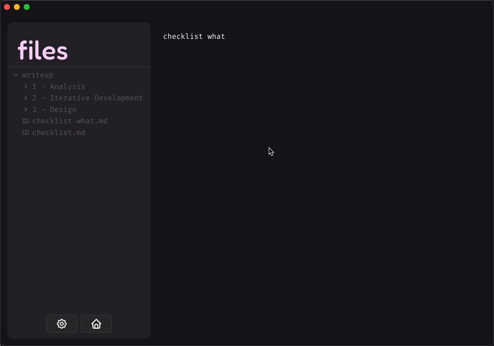

# 2.3.3 - Annotation of Code

> _An overview & explanation of the code written to build this project - **this includes testing**_

For Iteration 3, I made progress in the following general areas:

- [Toolbar](#toolbar)
  - [Settings](#implementing-settings)
  - [Home Button](#home-button)
  - [New File Button](#new-file)
- [Overhauling the UI Hierarchy](#overhauling-the-ui-hierarchy)
- [Improving Aesthetics](#improving-aesthetics)
- [Text Editor - Saving](#adding-saving)
- [Network](#network-revisions--improvements)
  - [View & Edit Modes](#adding-view--edit-modes)
  - [More Functionality for Nodes](#adding-more-functionality-to-nodes)
  - [Network Physics](#physics)
- [Implementing a Database](#implementing-an-sqlite-database)
- [Welcome Modal](#welcome-modal)

_Due to me unwisely working on different sections at the same time when programming this iteration, some parts may appear non-chronological/ out of order with the timeline of how the program was built. Therefore, I can only apologise for the fact that some of this iteration may be confusing to follow._

## Toolbar

The Toolbar occupies a space at the bottom of the Sidebar, below the Filetree - this should house several buttons, all of which were set out in the [initial plan](../../1%20-%20Analysis/1.5-proposed_solution_features.md#sidebar), and then more specifically planned in the hierarchy chart [first iteration](../2.1-Iteration1/2.1.2-functionality_of_prototype.md):

- [Home button](/2%20-%20Iterative%20Development/2.3-Iteration3/2.3.3-annotation_of_code.md#home-button) - A link that will transport the user back the home view (where the Network is) upon being clicked
- [Settings](/2%20-%20Iterative%20Development/2.3-Iteration3/2.3.3-annotation_of_code.md#implementing-settings) - A button that activates a pop-up window where the user can modify certain aspects of the app/ experience, for example by picking a theme, or changing their username
- [New file](#new-file) - A button that creates a new file upon being clicked
- New folder - A button that creates a new directory. **This does not have a link as I did not end up having time to build this feature into the app.**

### Implementing Settings

My first port of call this iteration was to create an easily accessible settings page, indicated by a cog icon in the Toolbar - this will host many important features of the app, one of which being the user's ability to select the source directory within which their notes will be stored. This is an integral part of the app, and so was high on my priority list.

#### The Skeleton

1. The first step to building the skeleton for the Settings area was to create button in the sidebar, within the newly created Toolbar `<div/>` that triggers the opening of a [mantine modal UI component](https://mantine.dev/core/modal/) - a component I found after looking into Mantine's documentation that exhibits the 'pop-over' effect that I was looking for.

In order to modularise the code base, I created a separate file for the Settings page...

`../components/SettingsModal/SettingsModal.tsx`:

```tsx
export const SettingsModal = (): JSX.Element => {
  // react state used to globally keep track of if settings is open
  const [opened, { open, close }] = useDisclosure(false);

  return (
    <>
      <!-- the skeleton of the pop-over page -->
      <Modal.Root
        className={classes.modal}
        opened={opened}
        onClose={close}
        centered
        styles={{
          title: {
            fontSize: '24px',
            fontWeight: 'normal',
          },
        }}
      >
        <!-- the behaviour of the background when settings is open -->
        <Modal.Overlay backgroundOpacity={0.2} blur={1.8} />
        <!-- the content to be displayed within the pop-over -->
        <Modal.Content radius="13px" className={classes.content}>
          <!-- the 'sidebar' where the menu of settings will be displayed -->
          <NavBar />
        </Modal.Content>
      </Modal.Root>

      <!-- the button that will appear in the toolbar -->
      <Button variant="default" onClick={open}>
        <IconSettings />
      </Button>
    </>
  );
};
```

... which I then imported into the Sidebar file for use...

`../components/Sidebar/Sidebar.tsx`:

```tsx
import { SettingsModal } from '../SettingsModal/SettingsModal';
...

<div className={classes.toolbar}>
  <SettingsModal />
</div>
```

... resulting in:

<div align="center">
  
</div>

2. Then I defined the contents of the menu, or 'Navbar' as described in the code, adding the 4 main features I saw to be relevant in my plan:

- [Appearance](#appearance)
- [Account](#account)
- [Files](#files)
- [Help](#help)

In order to modularise the code, I created 4 separate files (`Appearance.tsx`, `Account.tsx`, `Files.tsx`, and `Help.tsx`) for the tabs within the Settings navbar, each returning their respective components as `JSX.Element` objects in a way that could be imported into the main `SettingsModal.tsx` file...

`SettingsModal.tsx`:

```tsx
import { Account } from './Account';
import { Appearance } from './Appearance';
import { Files } from './Files';
import { Help } from './Help';
```

... which could then be used within the `Navbar` component, making use of [Mantine's `Tabs` component](https://mantine.dev/core/tabs/) to build the skeleton of the Navbar panel. Seeing how much code is already in the Navbar function's return object, it's clear that the modularisation I applied above was certainly necessary in cleaning up the file and making it more readable and easy to modify in future development...

`SettingsModal.tsx`:

```tsx
const NavBar = (): JSX.Element => {
  const [section, setSection] = useState<string>('appearance');

  return (
    <div className={classes.root}>
      <div className={classes.header}>
        <Title className={classes.title}>settings</Title>
        <Title className={classes.section}>{section}</Title>
        <Modal.CloseButton className={classes.close} size="xl" />
      </div>
      <div>
        <Divider />
      </div>
      <Tabs
        className={classes.tabs}
        color="var(--mantine-color-defaultScheme-2)"
        defaultValue="appearance"
        variant="pills"
        orientation="vertical"
        radius={0}
        onChange={(value) => setSection(value || 'appearance')}
      >
        {/* creating a sidebar panel ('navbar') */}
        <Tabs.List className={classes.navbar}>
          <Tabs.Tab className={classes.tab} value="appearance">
            appearance
          </Tabs.Tab>
          <Tabs.Tab className={classes.tab} value="account">
            account
          </Tabs.Tab>
          <Tabs.Tab className={classes.tab} value="files">
            files
          </Tabs.Tab>
          <Tabs.Tab className={classes.tab} value="help">
            help
          </Tabs.Tab>
        </Tabs.List>

        {/* defining the contents of each 'tab' */}
        <Tabs.Panel className={classes.panel} value="files" onClick={() => setSection('files')}>
          <ScrollArea.Autosize
            className={classes.scrollableArea}
            type="scroll"
            scrollHideDelay={100}
          >
            <Files /> {/* imported from Files.tsx */}
          </ScrollArea.Autosize>
        </Tabs.Panel>

        <Tabs.Panel
          className={classes.panel}
          value="appearance"
          onClick={() => setSection('appearance')}
        >
          <ScrollArea.Autosize
            className={classes.scrollableArea}
            type="scroll"
            scrollHideDelay={100}
          >
            <Appearance /> {/* imported from Appearance.tsx */}
          </ScrollArea.Autosize>
        </Tabs.Panel>

        <Tabs.Panel className={classes.panel} value="account" onClick={() => setSection('account')}>
          <ScrollArea.Autosize
            className={classes.scrollableArea}
            type="scroll"
            scrollHideDelay={100}
          >
            <Account /> {/* imported from Account.tsx */}
          </ScrollArea.Autosize>
        </Tabs.Panel>

        <Tabs.Panel className={classes.panel} value="help" onClick={() => setSection('help')}>
          <ScrollArea.Autosize
            className={classes.scrollableArea}
            type="scroll"
            scrollHideDelay={100}
          >
            <Help /> {/* imported from Help.tsx */}
          </ScrollArea.Autosize>
        </Tabs.Panel>
      </Tabs>
    </div>
  );
};
```

... which resulted in a toggle-able modal that has a heading, navbar, area for content, and an exit button:


I additionally gave the components some filler components, just give me an idea as to how each components' contents will (very roughly) look on the page - note that these don't provide any functionality, and are just a skeleton to work off of:


##### Testing

###### Test 1: Check that the Settings modal can be toggled via the button

| Description                                                                                                                                                                    | Input                                                                                                                     | Output                                                                   | Result         |
| ------------------------------------------------------------------------------------------------------------------------------------------------------------------------------ | ------------------------------------------------------------------------------------------------------------------------- | ------------------------------------------------------------------------ | -------------- |
| The user should be able to click on the Settings button (with the cog icon) to toggle the modal open, and click on the 'x' button, or anywhere outside the modal, to close it. | Click the Settings button and click the 'x' in the top right, then repeat instead clicking outside the modal to escape it | User is greeted by the welcome modal, then exits successfully both times | **Success** ✅ |

**Evidence:**

<div align="center">
  
</div>

###### Test 2: Ensure navigation through Settings tabs is possible

| Description                                                            | Input                                                            | Output                                                                                                 | Result         |
| ---------------------------------------------------------------------- | ---------------------------------------------------------------- | ------------------------------------------------------------------------------------------------------ | -------------- |
| The user should be able to navigate between each of the Settings tabs. | Click through each of the tabs on the left of the Settings modal | The content of each tab is displayed in the area on the right if the Settings Modal upon being clicked | **Success** ✅ |

**Evidence:**

_Note: this required content be in each of the tabs so as to see that each tab's is displayed correctly and at the right time. Therefore, I completed this test after placing some filler content in each of the tabs._

<div align="center">
  
</div>

#### Account

This is the section responsible for handling the user data (credentials etc.), and any changes they make to them. This requires fields for:

- username
- email
- password
- additionally there should be a profile picture, but I haven't focused on introducing that feature yet

each with their own respective logos and filler content (by default the input boxes should display the original username, email and passwords).

This also requires linking to the database so that the changes will be made permanent.

In order to modularise the code, I created a `<SubmissionForm/>` element to use, placing the functionality withing the `SubmissionForm()` function in another part of the file to increase readability and ease of use for developers...

`Account.tsx`:

```tsx
export const Account = (): JSX.Element => {
  return (
    <Stack className={classes.stack}>
      <SubmissionForm />
    </Stack>
  );
};
```

... Then I defined the skeleton of the Account page, using three instances of Mantine's `<Form/>` component and their `useForm()` hook for each of username, email and password...

`Account.tsx`:

```tsx
const SubmissionForm = (): JSX.Element => {
  const [name, setName] = useState('name');
  const [email, setEmail] = useState('email');
  const [password, setPassword] = useState('password');
  const at = <IconAt size={16} stroke={1.5} />;
  const lock = <IconLock size={16} stroke={1.5} />;
  const user = <IconUser size={16} stroke={1.5} />;

  // at this point, the database is not linked to this section; the values are set to ''
  const formName = useForm({
    mode: 'uncontrolled',
    initialValues: { name: '' },
  });
  const formEmail = useForm({
    mode: 'uncontrolled',
    initialValues: { email: '' },
  });
  const formPassword = useForm({
    mode: 'uncontrolled',
    initialValues: { password: '' },
  });

  const handleSubmitName = async (values: typeof formName.values): Promise<void> => {
    await asyncSubmit(values);
    setName(values.name); // set the submitted value as the new placeholder
    formName.reset(); // reset the form to empty the input
  };
  const handleSubmitEmail = async (values: typeof formEmail.values): Promise<void> => {
    await asyncSubmit(values);
    setEmail(values.email); // set the submitted value as the new placeholder
    formEmail.reset(); // reset the form to empty the input
  };
  const handleSubmitPassword = async (values: typeof formPassword.values): Promise<void> => {
    await asyncSubmit(values);
    setPassword(values.password); // set the submitted value as the new placeholder
    formPassword.reset(); // reset the form to empty the input
  };

  return (
    <Flex align="center" gap="xl">
      <div style={{ flex: 1 }}>
        <form onSubmit={formName.onSubmit(handleSubmitName)}>
          <Flex gap="sm" justify="flex-start" align="center" direction="row" wrap="wrap">
            <TextInput
              leftSection={user}
              placeholder={name}
              key={formName.key('name')}
              {...formName.getInputProps('name')}
            />

            <Group justify="flex-end">
              <ActionIcon
                variant="transparent"
                aria-label="submit"
                type="submit"
                loaderProps={{ type: 'dots' }}
                size="lg"
              >
                <IconCornerDownLeft />
              </ActionIcon>
            </Group>
          </Flex>
        </form>

        <Space h="sm" />
        <Divider />
        <Space h="sm" />

        <form onSubmit={formEmail.onSubmit(handleSubmitEmail)}>
          <Flex gap="sm" justify="flex-start" align="center" direction="row" wrap="wrap">
            <TextInput
              leftSection={at}
              placeholder={email}
              key={formEmail.key('email')}
              {...formEmail.getInputProps('email')}
              width="100%"
            />

            <Group justify="flex-end">
              <ActionIcon
                variant="transparent"
                aria-label="submit"
                type="submit"
                loaderProps={{ type: 'dots' }}
                size="lg"
              >
                <IconCornerDownLeft />
              </ActionIcon>
            </Group>
          </Flex>
        </form>

        <Space h="sm" />
        <Divider />
        <Space h="sm" />

        <form onSubmit={formPassword.onSubmit(handleSubmitPassword)}>
          <Flex gap="sm" justify="flex-start" align="center" direction="row" wrap="wrap">
            <TextInput
              leftSection={lock}
              placeholder={password}
              key={formPassword.key('password')}
              {...formPassword.getInputProps('password')}
            />

            <Group justify="flex-end">
              <ActionIcon
                variant="transparent"
                aria-label="submit"
                type="submit"
                loaderProps={{ type: 'dots' }}
                size="lg"
              >
                {/* <IconArrowRight stroke={2} /> */}
                <IconCornerDownLeft />
              </ActionIcon>
            </Group>
          </Flex>
        </form>
      </div>
    </Flex>
  );
};
```


##### Changes from design specification

Though my initial design used the down-left arrow icon to indicate a submission button to the right of each field, once I actually had access to more icon libraries I experimented with some other icons, and considered again if they're even necessary in the UI. In the end, I decided on keeping the existing icons, as the older portion of the demographic, who aren't as necessarily as well-versed in tech, may not infer that pressing `enter` is a common form of submission in similar apps/ websites, though I believe the UI could be optimised in the future.

`SettingsModal.tsx`:

```tsx
...
<IconRightArrow />
...
<IconCornerDownLeft />
...
<IconCheck />
...
```


However, I wasn't satisfied with the positioning of the fields either. In light of [stakeholder feedback given in Iteration 2](../2.2-Iteration2/2.2.4-stakeholder_feedback.md), I needed a fluid way to incorporate the user profile picture selector into this page. This wouldn't work well with the current positioning, unless it went above or below the submission fields, which I thought wouldn't be a very cohesive design, so I experimented with moving the fields to the left and right of the page:

`Account.tsx`:

```tsx
<Flex gap="sm" justify="center" align="center" direction="row" wrap="wrap">
```


to

```tsx
<Flex gap="sm" justify="flex-start" align="center" direction="row" wrap="wrap">
```


to

```tsx
<Flex gap="sm" justify="flex-end" align="center" direction="row" wrap="wrap">
```


I decided having the profile picture selector to the left of the fields brought the design together, ensuring it's not out of the of the user's eye and cursor.

Then I worked on actually implementing the selection feature, with a default 'user' image displaying if nothing has been picked by the user. The image is selected by clicking on the profile picture circle, and navigating through the user's filesystem. Since the function awaits a filepath to the image to be returned, an asynchronous (`async`) function is required to do this:

`Account.tsx`:

```tsx
const SubmissionForm = (): JSX.Element => {
  ...
  const [profileImage, setProfileImage] = useState<string | null>(null);
  ...
  const handleImageClick = async (): Promise<void> => {
    try {
      const imgData = await window.ipcAPI.openFileSelector();
      if (imgData) {
        setProfileImage(imgData);
      }
    } catch (error) {
      console.error('Failed to select image: ', error);
    }
  };
  return (
    <Flex align="center" gap="xl">
      <div className={classes.profileImg} onClick={handleImageClick}>
        {profileImage ? (
          
        ) : (
          <IconUser size={60} stroke={1.5} color="var(--mantine-color-defaultScheme-1)" />
        )}
      </div>
      ...
    </Flex>
  );
};
```

The function must be defined in the IPC API in order to be used:

`/src/renderer/src/types/index.ts`:

```tsx
export type IpcAPI = {
  ...
  openFileSelector: (options: {
    filters: Array<{ name: string; extensions: string[] }>;
  }) => Promise<string>;
  ...
};
```

It must then be able to communicate between the front and back ends using the Electron API:

`/src/preload/index.ts`:

```tsx
if (process.contextIsolated) {
  try {
    contextBridge.exposeInMainWorld('electron', electronAPI);
    // communication between front and backend for data transfer (tree node data)
    // adapted from: https://www.jsgarden.co/blog/how-to-handle-electron-ipc-events-with-typescript
    contextBridge.exposeInMainWorld('ipcAPI', {
      ...
      openFileSelector: (options) => ipcRenderer.invoke('open-file-selector', options),
      ...
    }
    ...
  }
...
}
```

The functionality of it can then be defined in the backend:

- It must open the file selector, only allowing certain file types (_images_), and,
- Encode the image and send it back to the frontend with the correct MIME type (_explained below_)

`/src/main/index.ts`:

```tsx
// listens for the request to select a file, opens the native OS' filesystem UI and returns selected file path
ipcMain.handle('open-file-selector', async () => {
  const result = await dialog.showOpenDialog({
    properties: ['openFile'],
    filters: [{ name: 'Images', extensions: ['jpg', 'png', 'gif', 'jpeg'] }],
  });

  if (result.filePaths.length > 0) {
    const imgPath = result.filePaths[0];
    const imgBuffer = await readFile(imgPath);
    const base64Img = imgBuffer.toString('base64');
    const mimeType = getMimeType(imgPath);
    return `data:${mimeType};base64,${base64Img}`;
  }
  return null;
});
```

Using the concept of modularisation to place the `getMimeType()` function in a separate file, where `getMimeType()` is explained in the comment above the function definition:

`fileHandling.ts`:

```tsx
/* this is used to retrieve the Multi-purpose Internet Mail Extension (MIME) type of the image,
 so as to correctly encode base64 image data */
export const getMimeType = (filePath: string): string => {
  const extension = filePath.toLowerCase();
  if (extension.endsWith('.png')) return 'image/png';
  if (extension.endsWith('.webp')) return 'image/webp';
  if (extension.endsWith('.svg')) return 'image/svg+xml';
  if (extension.endsWith('.gif')) return 'image/gif'; // in case the .gif type ever needs to be processed
  return 'image/jpeg'; // the default extension for .jpg, .jpeg...
};
```

As a result, we get a profile image component that looks like this:


If an image is selected, it is displayed like this:


And a demo of the process of selecting a profile picture is below:


##### Styling

Finally, I finished the Account tab by adding styling to the tab's CSS module `Account.module.css` to align with the UI design for Settings pages in Design Part 1:

`Account.module.css`:

```css
.root {
  --root-height: 70vh;
  --root-width: 110vh;
  --main-area-height: calc(var(--root-height) - var(--header-height));
  --profile-img-width: 160px;

  height: var(--root-height);
  width: var(--root-width);
  background-color: var(--mantine-color-defaultScheme-1);
  font-weight: 500;
}

.stack {
  height: calc(var(--main-area-height));
}

.profileImg {
  width: var(--profile-img-width);
  height: var(--profile-img-width);
  border-radius: calc(var(--profile-img-width) / 2);
  overflow: hidden;
  cursor: pointer;
  border: 2px solid var(--mantine-color-defaultScheme-3);
  display: flex;
  justify-content: center;
  align-items: center;
  background-color: var(--mantine-color-defaultScheme-1);
}

.cameraIcon {
  color: var(--mantine-color-defaultScheme-3);
}

.dividerSettingsComponent {
  width: var(--content-area-width-padded);
  border-color: var(--mantine-color-defaultScheme-3);
}
```

In addition, I created the styling for the navigation bar on the left of the Settings modal:

`SettingsModal.module.css`:

```css
.modal {
  --modal-size: var(--root-width);
  height: var(--root-height);
}

.root {
  --title-width: 208px;
  --title-width-padded: calc(2 * var(--mantine-spacing-lg) + var(--title-width));
  --root-height: 70vh;
  --root-width: 110vh;
  --header-padding-top: var(--mantine-spacing-xl);
  --header-padding-bottom: var(--mantine-spacing-xs);
  --header-height: calc(var(--header-padding-bottom) + var(--header-padding-top) + 72px);
  --main-area-height: calc(var(--root-height) - var(--header-height));
  --padding-default: 20px;
  --content-area-width: calc(var(--root-width) - var(--title-width-padded));
  --content-area-width-padded: calc(var(--content-area-width) - 2 * var(--padding-default));
  --profile-img-width: 160px;

  height: var(--root-height);
  width: var(--root-width);
  background-color: var(--mantine-color-defaultScheme-1);
  font-weight: 500;
}

.settingsButton {
  color: var(--mantine-color-defaultScheme-4);
  background-color: var(--mantine-color-defaultScheme-1);
  border-color: var(--mantine-color-defaultScheme-1);
}

.settingsButton:hover {
  color: var(--mantine-color-defaultScheme-6);
  background-color: var(--mantine-color-defaultScheme-1);
}

.tab {
  border-radius: 0;
  transition: color 100ms ease;
  color: var(--mantine-color-defaultScheme-3);
  font-size: 20px;
}

.tab:active {
  color: var(--mantine-color-defaultScheme-6);
}

.tab:focus {
  color: var(--mantine-color-defaultScheme-6);
}

.tab:hover {
  background-color: transparent;
  color: var(--mantine-color-defaultScheme-6);
}

.navbar {
  padding-left: 4px;
  padding-top: 10px;
  background-color: var(--mantine-color-defaultScheme-2);
  color: var(--mantine-color-defaultScheme-9);
  height: calc(var(--main-area-height));
  min-width: var(--title-width-padded);
  gap: 0;
}

.title {
  padding-left: var(--mantine-spacing-lg);
  padding-top: var(--header-padding-top);
  padding-right: var(--mantine-spacing-lg);
  padding-bottom: var(--header-padding-bottom);
  min-width: var(--title-width-padded);
  background-color: var(--mantine-color-defaultScheme-2);
  color: var(--mantine-color-defaultScheme-6);
}

.section {
  padding-left: var(--mantine-spacing-lg);
  padding-top: var(--mantine-spacing-xl);
  color: var(--mantine-color-defaultScheme-9);
}

.header {
  display: flex;
  flex-direction: row;
}

.close {
  padding-top: var(--mantine-spacing-xs);
  padding-right: var(--mantine-spacing-xs);
  color: var(--mantine-color-defaultScheme-4);
  background-color: var(--mantine-color-defaultScheme-1) !important;
}

.scrollableArea {
  height: 100%;
  overflow-x: scroll;
}

.text {
  color: var(--mantine-color-defaultScheme-4);
  font-weight: 500;
  font-size: 16px;
  max-width: var(--content-area-width-padded);
  text-overflow: ellipsis;
  overflow: hidden;
  text-overflow: ellipsis;
  white-space: nowrap;
  display: block;
  width: 100%;
}

.settingComponent {
  padding-top: 10px;
  padding-bottom: 10px;
}

.settingsComponentTitle {
  width: 100%;
  color: var(--mantine-color-defaultScheme-9);
}

.settingsComponentContent {
  display: flex;
  flex-direction: column;
}

.settingsSubHeading {
  width: 100%;
  color: var(--mantine-color-defaultScheme-3);
}
```

##### The Result

_Note: I removed the username field before styling as I came to the conclusion having a username was unnecessary given the user already has a unique identifier in the form of their email._


##### Testing

###### Test 3: Test that the image selector works

| Description                                                                                                      | Input                                                                                                                                 | Output                                                                                                                                                                                                                                     | Result                                                                                                   |
| ---------------------------------------------------------------------------------------------------------------- | ------------------------------------------------------------------------------------------------------------------------------------- | ------------------------------------------------------------------------------------------------------------------------------------------------------------------------------------------------------------------------------------------ | -------------------------------------------------------------------------------------------------------- |
| Test that the profile picture selector works correctly, and retains the picture upon leaving the Settings modal. | Left click on the image selector and select a photo. Then leave and re-open the Settings modal and navigate back to the `account` tab | The user's native file selector should be opened, allowing only certain image types to be selected. This image should be displayed in the circular profile picture area, and should remain even when the user leaves and re-opens Settings | **Partial Success** 🟨 - _image selection and display is correct, but image is not permanently retained_ |

**Evidence:**

<div align="center">
  
</div>

The rest of the testing for this is going to be done later in the iteration, [when I've implemented an SQLite database](#account-customisation).

As a result of the fact the result of this test was not a complete success, I believe the way to fix this problem would be to store the path the the profile picture in the database. However, this is not a priority right now, and so I will attempt to fix it if I have time towards the end of this iteration.

#### Files

Working on the Files component within settings, I started by creating a reusable set of `<div/>`s to be used for each setting 'component'...


... where the component is a `<div/>`, with its classname defining its role in the component, such that each setting consists of:

- `.settingComponent` - the root component, to contain the content of the setting
- `.settingsComponentTitle` - the title of the setting
- `.settingsComponentContent` - the description of the content, along with the action to be done (_i.e select the root directory_):

`Files.tsx`:

```tsx
export const Files = (): JSX.Element => {
  ...
  return (
    <div>
      <div className={classes.settingComponent}>
        <Title className={classes.settingsComponentTitle} size="h3">
          header goes here
        </Title>
        <div className={classes.settingsComponentContent}>
          <Text className={classes.text}>
            description goes here
          </Text>
          <Space h="md" />
          <!-- action goes here: -->
        </div>
      </div>
    ...
  );
};
```

##### Source Folder Selector

I could then use this template to apply the 'source folder' setting, as well as any others in the future:

`Files.tsx`:

```tsx
export const Files = (): JSX.Element => {
  // data provider used to keep track of the selected root directory
  const { rootDirPath, setRootDirPath } = useSharedData();
  ...
  return (
    <div>
      <Stack className={classes.stack}>
        <div className={classes.settingComponent}>
          <Title className={classes.settingsComponentTitle} size="h3">
            source folder
          </Title>
          <div className={classes.settingsComponentContent}>
            <Text className={classes.text}>
              the root directory within which your notes will be stored
            </Text>
            <Space h="md" />
            <MantineButton
              className={classes.selectFolderButton}
              variant="subtle"
              leftSection={<IconChevronDown />}
              onClick={handleDirectorySelect}
            >
              {rootDirPath || 'select directory'}
            </MantineButton>
          </div>
        </div>
        <Divider />
        ...
      </Stack>
    </div>
  );
};
```

I then added functionality to the `select directory` button in the code above by creating a function to handle the button being clicked...

`Files.tsx`:

```tsx
export const Files = (): JSX.Element => {
  ...
  const handleDirectorySelect = async (): Promise<void> => {
    try {
      // asynchronously communicates with backend, so must wait for a response with `await`
      const directory = await window.ipcAPI.openDirectorySelector();
      if (directory) {
        setRootDirPath(directory);
      }
    } catch (error) {
      console.error('Failed to select directory:', error);
    }
  };
  ...
}
```

... linking to the `preload` layer...

`src/preload/index.ts`:

```ts
if (process.contextIsolated) {
  try {
    ...
    contextBridge.exposeInMainWorld('ipcAPI', {
      ...
      openDirectorySelector: () => ipcRenderer.invoke('open-directory-selector'),
      ...
    }
  }
}
...
```

... and then handling the process on the backend (`main`) by using Electron's built-in `.showOpenDialog()` method to open the file selector...

`main/index.ts`:

```ts
// listens for the request to select a directory, opens the native OS' filesystem UI and returns selected directory path
ipcMain.handle('open-directory-selector', async () => {
  const result = await dialog.showOpenDialog({
    properties: ['openDirectory'],
  });
  return result.filePaths[0];
});
```

###### Test 4: Check that the directory selected is found and used

| Description                                                                         | Input                                                                                          | Output                                             | Result         |
| ----------------------------------------------------------------------------------- | ---------------------------------------------------------------------------------------------- | -------------------------------------------------- | -------------- |
| The user should be able to select _specifically_ a directory from their filesystem. | Click on the `select directory` button, choose a directory as the root directory and select it | The path to the file is displayed in the Files tab | **Success** ✅ |

**Evidence:**

<div align="center">
  
</div>

##### Save Frequency

**_Later on in the development process_**, I came back to this feature, and I added another setting to handle the frequency of saving (_how frequently the text editor saves the contents of the file to the user's filesystem_). The options are:

- on change
- every second
- every 2s
- every 5s
- every 10s

and they determine the the time in milliseconds for the throttle handler (_the time before the `handleSaveContent()` function is called again_)

`EditNodeMetaScreen.tsx`:

```tsx
const getSaveDelay = (frequency: string): number => {
  if (frequency === 'on-change') return 0;
  return parseInt(frequency) || 2000;
};

// prevents file from being saved more than every n milliseconds
const throttledSaveHandler = useThrottledCallback(
  handleSaveContent,
  getSaveDelay(saveFrequency || '2000')
);
```

Where the `handleSaveContent()` function uses the `.saveFile()` method I created when designing the [saving file content functionality](#file-content-saving) to save the current contents of the Text Editor to the name of the currently selected file:

`EditNodeMetaScreen.tsx`:

```tsx
const handleSaveContent = useCallback(
  async (markdown: string): Promise<void> => {
    if (!selectedTreeNodeData) return;
    try {
      await window.ipcAPI.saveFile(selectedTreeNodeData.value, markdown);
      console.log('File saved successfully');
    } catch (error) {
      console.error('Error saving file:', error);
    }
  },
  [selectedTreeNodeData]
);
```

Therefore the function does not need to be tested as it already has been.

I added some further styling to match the styling in the Account tab. The only differences were in the styling of the dropdown/ selector buttons:

`Files.module.css`:

```css
.root {
  --title-width: 208px;
  --title-width-padded: calc(2 * var(--mantine-spacing-lg) + var(--title-width));
  --root-height: 70vh;
  --root-width: 110vh;
  --header-padding-top: var(--mantine-spacing-xl);
  --header-padding-bottom: var(--mantine-spacing-xs);
  --header-height: calc(var(--header-padding-bottom) + var(--header-padding-top) + 72px);
  --main-area-height: calc(var(--root-height) - var(--header-height));
  --padding-default: 20px;
  --content-area-width: calc(var(--root-width) - var(--title-width-padded));
  --content-area-width-padded: calc(var(--content-area-width) - 2 * var(--padding-default));
}

.selectFolderButton {
  align-self: flex-start;
  height: auto;
  align-content: center;
  min-height: 36px;
  color: var(--mantine-color-defaultScheme-5);
  background-color: var(--mantine-color-defaultScheme-1);
  padding: 5px;
  gap: 0;
  max-width: var(--content-area-width-padded);
  text-overflow: ellipsis;
}

.selectFolderButton:hover {
  color: var(--mantine-color-defaultScheme-5);
  background-color: var(--mantine-color-defaultScheme-2);
}

/* ns stands for 'native select' */
.nsRoot {
  align-self: flex-start;
  height: auto;
  align-content: center;
  max-height: 36px;
  margin-left: -5px;
}

.nsSection {
  color: var(--mantine-color-defaultScheme-5);
  margin-left: 5px;
}

.nsInput {
  color: var(--mantine-color-defaultScheme-5);
  background-color: var(--mantine-color-defaultScheme-1);
  margin-left: 5px;
}

.nsInput:hover {
  color: var(--mantine-color-defaultScheme-5);
  background-color: var(--mantine-color-defaultScheme-2);
}
```

###### Test 5: Test that the selection dropdown work

| Description                                                                                                                | Input                                                                             | Output                                                                       | Result         |
| -------------------------------------------------------------------------------------------------------------------------- | --------------------------------------------------------------------------------- | ---------------------------------------------------------------------------- | -------------- |
| The user should be able to select all the different options from the dropdown, and have their changes reflected in the UI. | Click on the `save frequency` button, and select all different options one-by-one | The button should be updated to display the option last selected by the user | **Success** ✅ |

**Evidence:**

<div align="center">
  
</div>

###### Test 6: Test that save frequency is accurate and correct

| Description                                                                                                           | Input                                                                                                                                                                                | Output                                                                                         | Result         |
| --------------------------------------------------------------------------------------------------------------------- | ------------------------------------------------------------------------------------------------------------------------------------------------------------------------------------ | ---------------------------------------------------------------------------------------------- | -------------- |
| Upon the user changing the save frequency, the change in frequency of saving of files should be accurately reflected. | Click on the `save frequency` button, and cycle through each option, writing changes to a file each time and observing the frequency at which the contents are logged on the backend | The contents should be saved and logged to the backend console at the time intervals selected. | **Success** ✅ |

**Evidence:**

<div align="center">
  
</div>

##### The Result

The result can be seen in the evidence for the test above.

##### Changes from design specification

I found that fitting the exact [UI design](../../3%20-%20Design/3.1%20-%20Design%20Part%20I/3.1.3-interface_designs.md#settings) in terms of the positioning of the 'select directory' button impossible to meet, given how the size of the button can grow to the width of the settings screen. This is because the filepath the user selects could be much longer than the originally designated area - therefore, I had to compromise by placing the button below the setting description, rather than to the right of it. **In order to maintain consistency, I made the decision to keep this design pattern for all settings components.**

#### Appearance

Since settings regarding appearance aren't generally necessary parts of the app, I came back to this section near the end, once all vital functionality was implemented.

##### Network Appearance (Boid's)

Firstly, as I had implemented Boid's algorithm, I decided it is important that the user can prevent the behaviour if they so choose - this is because of [a comment made by Jay in the Stakeholder Feedback section last iteration](../2.2-Iteration2/2.2.4-stakeholder_feedback.md#transcript-of-interview-with-jay) suggesting that Boid's may be irritating or distracting, and so should not be a behaviour the user can't turn off.

As a result I designed a Setting component to contain a Title of 'network' to tell the user all the settings within this section relate to the network, along with a fitting description:

`Appearance.tsx`:

```tsx
...
export const Appearance = (): JSX.Element => {
  ...
  return (
    <Stack className={classes.stack}>
      <div className={classes.settingComponent}>
        <Title className={classes.settingsSubHeading} size="h2">
          network
        </Title>
        <Text className={classes.text}>determine the characteristics of the network of nodes</Text>
        ...
      </div>
      ...
    </Stack>
  );
};
```

I followed up by adding a component for Boid's algorithm, with a title and description to explain what the setting does:

`Appearance.tsx`:

```tsx
...
<Title className={classes.settingsComponentTitle} size="h3">
  boid&apos;s algorithm
</Title>
<div className={classes.settingsComponentContent}>
  <Text className={classes.text}>
    decide whether boid&apos;s algorithm is applied to the network - this essentially allows
    the nodes to move autonomously, similarly to how a flock of birds moves in the sky
  </Text>
  ...
</div>
```

And then I added a `<Checkbox/>` element to allow the user to toggle between Boid's algorithm running and not, which updates the `boolean` variable in the `SharedDataProvider` when checked or unchecked:

`Appearance.tsx`:

```tsx
export const Appearance = (): JSX.Element => {
  const { boids, setBoids } = useSharedData();
  return (
    <Stack className={classes.stack}>
      <div className={classes.settingComponent}>
        ...
        <div className={classes.settingsComponentContent}>
          ...
          <Space h="md" />
          <Checkbox
            color="var(--mantine-color-defaultScheme-5)"
            classNames={{
              root: classes.checkbox,
              input: classes.checkboxInput,
            }}
            label={boids ? "boid's will run" : "boid's won't run"}
            checked={boids}
            onChange={(event) => setBoids(event.currentTarget.checked)}
            wrapperProps={{
              onClick: () => setBoids((isChecked) => !isChecked),
            }}
          />
        </div>
      </div>
    </Stack>
  );
};
```

I wrote some CSS in the `.module.css` file to animate the checkbox and style it to fit the app's aesthetics:

`Appearance.module.css`:

```css
.checkbox {
  border: 1px solid var(--mantine-color-defaultScheme-3);
  padding: var(--mantine-spacing-xs) var(--mantine-spacing-sm);
  border-radius: var(--mantine-radius-md);
  border-width: 2px;
  transition:
    color 100ms ease,
    background-color 100ms ease,
    border-color 100ms ease;
  cursor: pointer;
  max-width: 240px;
  background-color: var(--mantine-color-defaultScheme-2);

  &[data-checked] {
    background-color: var(--mantine-color-defaultScheme-2);
    border-color: var(--mantine-color-defaultScheme-5);
    color: var(--mantine-color-defaultScheme-5);
  }

  & * {
    pointer-events: none;
    user-select: none;
  }
}
```

And achieved the following effect:

<div align='center'>
  
</div>

##### General Appearance (Theming)

Then I came back to this section later to implement theming. To do this, I decided to go to `/src/renderer/src/index.tsx` to create custom themes that differ from the original grey-white-pink default theme. They all consist of the same layout, with the only changes being to the 10 different colours to be used, and showing the code for all themes would be impractical and waste space - an example of the themes I made was the `lightTheme`, which looks as follows:

`/src/renderer/src/index.tsx`:

```tsx
...
const lightTheme = createTheme({
  fontFamily: 'Fira Code, monospace',
  colors: {
    defaultScheme: [
      '#f7f7f2f5',
      '#f0f0f0f5',
      '#E7E7E2E5',
      '#C7C7C2C5',
      '#B7B7B2B5',
      '#5465ff',
      '#5465ff',
      '#f7f7f2f5',
      '#f7f7f2f5',
      '#4A4850',
    ],
  },
  headings: {
    fontFamily: 'fredoka, sans-serif',
    fontWeight: '500',
    sizes: {
      h1: { fontSize: '54px' },
      h2: { fontSize: '40px' },
      h3: { fontSize: '30px' },
      h4: { fontSize: '24px' },
      h5: { fontSize: '22px' },
      h6: { fontSize: '20px' },
    },
  },
  fontSizes: {
    xs: '10px',
    sm: '15px',
    md: '15px',
    lg: '40px',
    xl: '54px',
  },
});
...
```

Then I used a series of `if` statements to check which theme has been selected, then returning the app with a theme wrapped around it (_above it in the app's hierarchy_):

`/src/renderer/src/index.tsx`:

```tsx
...
const ThemedApp = (): JSX.Element => {
  const { theme } = useTheme();
  let usedTheme;
  const { setUiMode } = useSharedData();
  setUiMode('dark');

  if (theme === 'defaultTheme') {
    usedTheme = defaultTheme;
    setUiMode('dark');
  } else if (theme === 'oceanTheme') {
    usedTheme = oceanTheme;
    setUiMode('dark');
  } else if (theme === 'lightTheme') {
    usedTheme = lightTheme;
    setUiMode('light');
  } else if (theme === 'magmaTheme') {
    usedTheme = magmaTheme;
    setUiMode('dark');
  } else if (theme === 'lavenderTheme') {
    usedTheme = lavenderTheme;
    setUiMode('dark');
  } else if (theme === 'deepOceanTheme') {
    usedTheme = deepOceanTheme;
    setUiMode('dark');
  } else {
    usedTheme = defaultTheme;
    setUiMode('dark');
  }

  return (
    <MantineProvider defaultColorScheme="dark" theme={usedTheme}>
      <HashRouter>
        <AppWrapper />
      </HashRouter>
    </MantineProvider>
  );
};
...
```

Before finally rewriting the `createRoot()` function to work with whatever theme is selected dynamically:

`/src/renderer/src/index.tsx`:

```tsx
...
ReactDOM.createRoot(document.getElementById('root') as HTMLElement).render(
  <React.StrictMode>
    <ThemeProvider>
      <SharedDataProvider>
        <ThemedApp /> {/* this is new */}
      </SharedDataProvider>
    </ThemeProvider>
  </React.StrictMode>
);
```

Then it was time to actually implement theme selection into the Settings modal. I attempted to follow the design I set out in [Design Part 1](../../3%20-%20Design/3.1%20-%20Design%20Part%20I/3.1.3-interface_designs.md), which makes the theme selector appear in a grid, where the selected theme has a box around it. I decided to modularise the component by creating the Setting component (_with the title and description_) along with an element `<ThemePickerGrid />`, which I could then define as a function below it in the file:

`Appearance.tsx`:

```tsx
export const Appearance = (): JSX.Element => {
  ...
  return (
    <Stack className={classes.stack}>
      ...
      <div className={classes.settingComponent}>
        <Title className={classes.settingsSubHeading} size="h2">
          theming
        </Title>
        <Text className={classes.text}>customise how you want your app to look</Text>

        <Title className={classes.settingsComponentTitle} size="h3">
          colour theme
        </Title>
        <div className={classes.settingsComponentContent}>
          <Text className={classes.text}>tailor the app to your preference</Text>
          <Space h="md" />
          <ThemePickerGrid />
        </div>
      </div>
    </Stack>
  );
};
```

To modularise further, I defined what a single 'theme module' would be with the `ThemeModule()` function, which returns a rectangular object styled with the primary and secondary colours of its respective theme, as well as surrounding the selected theme with a border coloured to match primary colour of the app:

`Appearance.tsx`:

```tsx
...
export const ThemeModule = ({
  themeName,
  label,
  backgroundColour,
  foregroundColour,
  secondaryColour,
}: ThemeModuleProps): JSX.Element => {
  const { theme, setTheme } = useTheme();
  return (
    <div
      className={`${classes.themeBox} ${theme === themeName ? classes.theme : ''}`}
      onClick={() => setTheme(themeName)}
      style={{
        backgroundColor: backgroundColour,
        borderColor: theme === themeName ? foregroundColour : 'transparent',
      }}
    >
      <div className={classes.themeAccent} style={{ backgroundColor: foregroundColour }}></div>
      <div
        className={classes.themeAccentSecondary}
        style={{ backgroundColor: secondaryColour }}
      ></div>
      <Text c={secondaryColour} className={classes.themeLabel}>
        {label}
      </Text>
    </div>
  );
};
```

Before finally putting it all together by creating a grid of `<ThemeModule/>` components, feeding each theme module the colours of each theme:

```tsx
const ThemePickerGrid = (): JSX.Element => {
  return (
    <Grid className={classes.grid}>
      <Grid.Col span={6}>
        <ThemeModule
          themeName="defaultTheme"
          label="default"
          backgroundColour="#29262D"
          foregroundColour="#61497C"
          secondaryColour="#FED5FB"
        />
      </Grid.Col>

      <Grid.Col span={6}>
        <ThemeModule
          themeName="lavenderTheme"
          label="lavender"
          backgroundColour="#1D1A2C"
          foregroundColour="rgb(86, 63, 95)"
          secondaryColour="#a4b6dd"
        />
      </Grid.Col>

      <Grid.Col span={6}>
        <ThemeModule
          themeName="oceanTheme"
          label="ocean"
          backgroundColour="rgb(26, 29, 56)"
          foregroundColour="#504c8d"
          secondaryColour="#ffffff"
        />
      </Grid.Col>

      <Grid.Col span={6}>
        <ThemeModule
          themeName="deepOceanTheme"
          label="deep ocean"
          backgroundColour="#131037"
          foregroundColour="rgb(49, 25, 134)"
          secondaryColour="#35305E"
        />
      </Grid.Col>

      <Grid.Col span={6}>
        <ThemeModule
          themeName="lightTheme"
          label="light"
          backgroundColour="#f7f7f2f5"
          foregroundColour="#5465ff"
          secondaryColour="#B7B7B2B5"
        />
      </Grid.Col>

      <Grid.Col span={6}>
        <ThemeModule
          themeName="magmaTheme"
          label="magma"
          backgroundColour="#1A0F0F"
          foregroundColour="#ff514a"
          secondaryColour="#ff916a"
        />
      </Grid.Col>
    </Grid>
  );
};
```

... and giving the grid some styling to fit it in with the aesthetic of the rest of the app in its respective CSS module:

`Appearance.module.css`:

```css
.grid {
  padding-right: var(--padding-default);
}

.themeBox {
  height: 100px;
  border-radius: 8px;
  padding: 10px;
  cursor: pointer;
  border: 2px solid transparent;
  transition: all 0.2s ease;
  display: flex;
  flex-direction: column;
  justify-content: space-between;
}

.themeBox:hover {
  transform: translateY(-2px);
  box-shadow: 0 4px 8px rgba(0, 0, 0, 0.2);
}

.selectedTheme {
  border-width: 2px;
  border-style: solid;
}

.themeAccent {
  height: 10px;
  width: 50%;
  border-radius: 5px;
  margin-top: 10px;
}

.themeLabel {
  color: var(--mantine-color-defaultScheme-7);
  font-size: 16px;
  margin-top: 10px;
  font-family: 'Fredoka';
  font-weight: 500;
}

.themeAccentSecondary {
  height: 5px;
  width: 25%;
  border-radius: 10px;
  margin-top: 5px;
}
```

Which resulted in the following effect:

<div align='center'>
  
</div>

###### Test 7: Test that the Boid's checkbox works

| Description                                                                                   | Input                                                                                                                                                                         | Output                                                                          | Result                                                                                                                                                                                       |
| --------------------------------------------------------------------------------------------- | ----------------------------------------------------------------------------------------------------------------------------------------------------------------------------- | ------------------------------------------------------------------------------- | -------------------------------------------------------------------------------------------------------------------------------------------------------------------------------------------- |
| Test that clicking on the checkbox sets Boid's as active, and unchecking stops the behaviour. | Tick the Boid's checkbox, exit Settings and observe if Boid's takes effect after 5 seconds, and the go back and un-tick the checkbox, again exiting and observing the network | The network should only move on its own if Boid's is active (the box is ticked) | **Partial Success** 🟨 - _the behaviour does successfully change, however it seems the user must click somewhere on screen for the change to take effect (essentially updating the network)_ |

**Evidence:**

<div align="center">
  
</div>

As a result of the fact the result of this test was not a complete success, I wanted to solve the error, but could not think of a solution to the problem. I didn't want to spend too much time thinking about this relatively minor issue, so decided to move on and come back if I had time.

###### Test 8: Test that the user can select different themes

| Description                                                                                                                       | Input                                                                                                                                   | Output                                                                                                                     | Result                                                                                                                                                                                                                                                          |
| --------------------------------------------------------------------------------------------------------------------------------- | --------------------------------------------------------------------------------------------------------------------------------------- | -------------------------------------------------------------------------------------------------------------------------- | --------------------------------------------------------------------------------------------------------------------------------------------------------------------------------------------------------------------------------------------------------------- |
| The user should be able to pick different themes from the theme grid and see their choice reflected instantly in the app's theme. | Select the different themes in the theme grid and observe how the app changes, looking not inly in Settings but in all areas of the app | The app should change it's theme to the one selected by the user, and the theme should be consistent everywhere in the app | **Success** ✅ - _this works in its entirety, though some minor discrepancies in colour suggest my styling doesn't work completely, e.g the checkbox for Boid's appears dark even when the light theme is selected - this isn't to do with the theme selection_ |

**Evidence:**

<div align="center">
  
</div>

##### The Result

The result can be seen in the evidence for the test above.

#### Help

This was one of the last sections I could do before completing the app, as it requires the implementation of demo screenshots and videos - these can only be taken once all features are in place, and the app looks how it will when built & shipped for production. As a result, this part is was done right ner the end of development, and thus the app looks much more complete than just before and after this in the document.

For each part of the app I saw to be potentially confusing, I added a component documenting how to solve the issue the user may have. I did the same for any help my stakeholders suggested may be necessary.

##### Structure

For each 'help component', I followed the same format of using my 'settings component' design to create titles, subtitles, text and media. The general format consists of:

- A title for a category within help (optional)
- A subtitle depicting the specific problem the user may need help with
- A content area including:
  - A text area housing a description of how to solve the problem
  - A piece of media (`.gif`/ `.png`) to accompany the description, giving the user a visual guide to follow and replicate (this would be especially useful for the older/ less tech-savvy portion of my target demographics, as just text may not explain the solution to them in a way they find understandable)

This is reflected in the below example code:

`SettingsModal.tsx`:

```tsx
const Help = (): JSX.Element => {
  return (
    <Stack className={classes.stack}>
      <div className={classes.settingComponent}>
        <Title className={classes.settingsSubHeading} size="h2">
          broad area e.g getting started
        </Title>
        <Title className={classes.settingsComponentTitle} size="h3">
          problem 1
        </Title>
        <div className={classes.settingsComponentContent}>
          <Text className={classes.text}>how to fix problem 1</Text>
          <Image
            radius="md"
            src={demogif}
            alt="demo gif showing how to fix problem 1"
            fallbackSrc="https://placehold.co/600x400?text=Placeholder"
            className={classes.demo}
          />
        </div>
      </div>
      <Divider size="sm" className={classes.dividerSettingsComponent} />
      ... {/* more components */}
    </Stack>
  );
};
```

Since the code is almost identical except for the content of each help setting, I don't see a point in showing the code for each of them here, just the result of the implementations of the boilerplate above. I then used this format to create the following help components:

- Selecting a root directory
- Accessing your notes
- Opening a note
- Toggling Boid's algorithm
- Changing the parameters of Boid's algorithm to customise the experience
- Toggling between view/ edit modes, and how to draw/ remove connections

##### Testing

###### Test 9: Test that all `gif`s are displayed and play on repeat

| Description                                                                                                             | Input                                                        | Output                                                                 | Result         |
| ----------------------------------------------------------------------------------------------------------------------- | ------------------------------------------------------------ | ---------------------------------------------------------------------- | -------------- |
| Check that all help demos are displayed in the help tab, and play on repeat so that the user can re-watch if necessary. | Navigate to the help tab and scroll through all help modules | Identify that all modules are there and `gif`s replaying over and over | **Success** ✅ |

**Evidence:**

<div align="center">
  
</div>

### Home Button

Additionally, I created another component that links to the Home view, positioned next to the settings icon in the toolbar:

`HomeButton.tsx`:

```tsx
export const HomeButton = (): JSX.Element => {
  const navigate = useNavigate();
  return (
    <Button
      className={classes.homeButton}
      title="Home"
      variant="default"
      onClick={() => navigate('/home/view')}
    >
      <IconHome size={32} />
    </Button>
  );
};
```

With some basic styling:

```css
.homeButton {
  color: var(--mantine-color-defaultScheme-4);
  background-color: var(--mantine-color-defaultScheme-1);
  border-color: var(--mantine-color-defaultScheme-1);
}

.homeButton:hover {
  color: var(--mantine-color-defaultScheme-6);
  background-color: var(--mantine-color-defaultScheme-1);
}
```

<div align="center">
  
</div>

#### Testing

Since I already know the `navigate()` function works from prior testing, I have nothing to test.

### New File

Since the creation of the home button, the UI of the app had a significant upgrade - this is touched upon later in the iteration, but a brief overview of changes to this specific part of the app (_a.k.a the Toolbar_) are:

- transparent button backgrounds,
- highlight-on-hover effect to make it clear these are buttons,
- a divider to separate the Toolbar from the rest of the Sidebar, and,
- re-coloured to fit the [colour scheme](../../3%20-%20Design/3.1%20-%20Design%20Part%20I/3.1.3-interface_designs.md)

The functionality behind the new file button is relatively simple, reusing the `window.ipcAPI.saveFile()` method created [when implementing saving](#file-content-saving):

`CreateFileButton.tsx`:

```tsx
const createNewFile = (): void => {
  window.ipcAPI.saveFile(filePath + '/' + name + ' ' + counter + '.md', ' ');

  // tells text editor what file to open
  setSelectedTreeNodeData({
    label: name + ' ' + counter,
    value: filePath + '/' + name + ' ' + counter + '.md',
  });
  setSelectedFile(name + ' ' + counter);
  // title of file will be autofocused so user can quickly rename from 'new file X'
  setNewFileCreated(true);
  console.log(`navigating to ${name + ' ' + counter}`);
  navigate('/home/edit-node-meta');
  setCounter((counter ?? 1) + 1);
  // if a new file is created, autofocus the title of the file when entering text editor
  setNewFileCreated(true);
};
```

Additionally, I allowed the user to use a keyboard shortcut (`cmd`/`ctrl`+`n`) to do the same thing:

`renderer/index.ts`:

```ts
...
const AppWrapper = (): JSX.Element => {
  ...
  useHotkeys([
    [
      'mod+N',
      (): void => {
        if (!counter) setCounter(1);
        const fileName = 'new file ' + counter;

        // save new file
        window.ipcAPI.saveFile((rootDirPath ?? '~') + '/' + fileName + '.md', '');

        // tells text editor what file to open
        setSelectedTreeNodeData({
          label: fileName,
          value: rootDirPath + '/' + fileName + '.md',
        });
        setSelectedFile(fileName);
        // title of file will be autofocused so user can quickly rename from 'new file X'
        setNewFileCreated(true);
        console.log(`navigating to ${fileName}`);

        // increment counter in anticipation of another file being created (prevents duplicate naming)
        setCounter((counter ?? 1) + 1);

        console.log('cmd/ctrl+n: create new note');
      },
    ],
    ...
  ]);
  ...
}
```

#### Testing

##### Test 10: Test that the new file button creates & opens a new file

| Description                                                                                                                                                           | Input                                         | Output                                                    | Result         |
| --------------------------------------------------------------------------------------------------------------------------------------------------------------------- | --------------------------------------------- | --------------------------------------------------------- | -------------- |
| Check that clicking the 'new file' (`+`) button creates an empty new file (_called 'new file X', where X is a number_), and opens it in the text editor for the user. | Click on the 'new file' button in the Sidebar | See that the criteria described in the Description is met | **Success** ✅ |

**Evidence:**

<div align="center">
  
</div>

##### Test 11: Test that the new file command creates & opens a new file

| Description                                                                                                                                                                    | Input                                       | Output                                                    | Result                                                                           |
| ------------------------------------------------------------------------------------------------------------------------------------------------------------------------------ | ------------------------------------------- | --------------------------------------------------------- | -------------------------------------------------------------------------------- |
| Check that using the new file command (`cmd`/`ctrl`+`n`) creates an empty new file (_called 'new file X', where X is a number_), and opens it in the text editor for the user. | Use the new file command (`cmd`/`ctrl`+`n`) | See that the criteria described in the Description is met | **Partial Success** 🟨 - _command only works if user is viewing the Home screen_ |

**Evidence:**

<div align="center">
  
</div>

I found upon inspecting the code that at no point did the code for the shortcut actually navigate the user to the text editor, just setting the selected file etc. To fix this issue, I added the line `navigate('/home/edit-node-meta');` which allowed the program to successfully navigate the user to the text editor.

## Overhauling the UI Hierarchy

Over the past 2 iterations, I've experienced some difficulties working with the way I initially designed the structure of the app and the components within it, not being able to produce some of the functionality I would like to for example because the layout does not permit it. Therefore, I decided when specifying what to work on this iteration that I needed to explicitly draw out the hierarchy of components for each main screen in the app, updating [Design Part 1](../../3%20-%20Design/3.1%20-%20Design%20Part%20I/3.1.3-interface_designs.md) accordingly.

**It's important to note that a lot of these changes appear out of order with the timeline (non-chronological). This is because this section was completed throughout the entirety of Iteration 3, and so I was making changes at different stages in the app's creation.**

### Home Hierarchy


### Text Editor Hierarchy


### Settings Hierarchy


These give me the blueprints by which to structure all the `<div />` components within each screen, from which I can then add all the functionality I wish to, in the way originally intended.

## Improving Aesthetics

The aesthetics in the app thus far are sub-par - there are more than a few bugs and ugly UI features currently in the app. Plenty of changes need to be made to meet a reasonable standard for myself, the stakeholders and the target audience. Here I'm addressing all poor aesthetic qualities in the app, and attempt to bring them up to scratch.

### Theming

In order to make the codebase as easy to develop with and understand as possible, I decided to implement the [colour scheme](../../3%20-%20Design/3.1%20-%20Design%20Part%20I/3.1.3-interface_designs.md) at the highest level of the hierarchy of files, in `src/renderer/src/index.tsx`. This means that, using the 'cascading' property of CSS, all files 'beneath' `index.tsx` in the file hierarchy can inherit this theme.

To demonstrate this visually, when listing all files/ directories in `src/renderer/src`, we see that `index.tsx` is on the same level as `components`, `providers`, and `screens` - the directories holding code that requires styling in accordance with the theme, and therefore are able to inherit the theme:


Using [Mantine's documentation on theming](https://mantine.dev/theming/mantine-provider/), I was able to construct a theme object to be accessed by all CSS files:

`src/renderer/src/index.tsx`:

```tsx
import { createTheme, MantineProvider } from '@mantine/core';

...

const theme = createTheme({
  fontFamily: 'Fira Code, monospace',
  colors: {
    // each colour in the colour scheme can be accessed via indexing, e.g --mantine-default-scheme-5 yields purple (#61497C)
    defaultScheme: [
      '#19161E',
      '#29262D',
      '#2E2B33',
      '#4A4850',
      '#62606B',
      '#61497C',
      '#FED5FB',
      '#FFFFFF',
      '#FFFFFF',
      '#FFFFFF',
    ],
  },
  headings: {
    fontFamily: 'fredoka, sans-serif',
    fontWeight: '500',
    sizes: {
      h1: { fontSize: '54px' },
      h2: { fontSize: '40px' },
      h3: { fontSize: '30px' },
      h4: { fontSize: '24px' },
      h5: { fontSize: '22px' },
      h6: { fontSize: '20px' },
    },
  },
  fontSizes: {
    xs: '10px',
    sm: '15px',
    md: '15px',
    lg: '40px',
    xl: '54px',
  },
});

...
```

This determines that anything inheriting this theme will:

- Be able to access the colour scheme by indexing the `defaultScheme` array, and
- Use the 'Fira Code' font, unless it's a heading, in which case it will use the Fredoka font, both with size constraints.

As a result, I can use these to style each part of the app by its CSS module (each component has a corresponding CSS file with the convention `[filename].module.css`), and any changes I make to this file will be seen app-wide without the need for individual modification.

### Making Custom Title Bar

An issue I have with the basic skeleton of the app is the persistent title bar at the top of the page:

<div align="center">
  
</div>

In most modern apps, the bar at the top of the screen that houses the full-screen, minimise and close (red, yellow and green on macOS, and +, - and x on Windows) buttons is hidden from view. I've seen this done before with Electron apps in demos and tutorials on Youtube (_e.g [Build an Electron App in Under 60 Minutes by Traversy Media](https://www.youtube.com/watch?v=kN1Czs0m1SU)_), and discovered it was a setting you can change by editing an attribute on the `BrowserWindow` initialisation in `main`:

`main/index.ts`:

```ts
function createWindow(): void {
  // create the browser window
  const mainWindow = new BrowserWindow({
    ...
    titleBarStyle: 'hidden',
    ...
  });
  ...
}
...
```

This gave me the desired effect, though caused some styling issues, as all the content on each page was shifted up by the height of the previously present title bar. As a result, in each screen's css, I created a variable `var(--padding-width)` of the same height in pixels as the title bar was (`30px`), which I then padded each of the screens with:

`LoginScreen.module.css`:

```css
.root {
  --titlebar-height: 30px;
  ...
  height: calc(100vh - var(--titlebar-height));
  ...
}
```

etc., giving me the following look, with a much cleaner, emptier top section of the app:


### Sidebar

#### Manual Dynamic Resizing

To make the experience more interactive, I decided to introduce a resizing feature to the Sidebar. This means the user will be able to change the ration of Sidebar width to Network width, making seeing their files easier if they have long names, or giving the network more space if the files have short names.

In order to produce this effect, I knew I would need to keep track of both the Sidebar's width and if the Sidebar is currently being resized throughout the app's lifetime - therefore React's `useState()` hooks would be needed, requiring the use of event listeners to follow what the mouse is doing at all times:

```ts
export const ScreenWithSidebar = ({ children }: ScreenWithSidebarProps): JSX.Element => {
  const [sidebarWidth, setSidebarWidth] = useState(250);
  const [resizing, setResizing] = useState(false);
  // define constraints
  const minWidth = 250;
  const maxWidth = 450;

  ...

  // function allowing the manual dynamic resizing of the sidebar
  const startResizing = useCallback((mouseDownEvent: React.MouseEvent) => {
    setResizing(true);

    const startResizing = (mouseMoveEvent: MouseEvent): void => {
      const newWidth = mouseMoveEvent.clientX;
      if (newWidth > minWidth && newWidth < maxWidth) {
        setSidebarWidth(newWidth);
      }
    };

    const stopResizing = (): void => {
      setResizing(false);
      window.removeEventListener('mousemove', startResizing);
      window.removeEventListener('mouseup', stopResizing);
    };

    window.addEventListener('mousemove', startResizing);
    window.addEventListener('mouseup', stopResizing);
  }, []);
...
}
```

##### 'Jumping' Error

As soon as this was implemented, I noticed that upon resizing the sidebar from a width not equal to the initialised width, the sidebar jumped back to the initial width before resizing:


After some inspection of both the bug visually and in my code, I found the sidebar's width to be being set relative to the whole screen.
This meant I was setting the width from the edge of the app window, which when applied to the Sidebar - whose width is less than to the edge of the window - caused it to 'jump' back to the width from the very edge of the screen.

Using logic, the code used that likely caused this effect was:

```ts
export const ScreenWithSidebar = ({ children }: ScreenWithSidebarProps): JSX.Element => {
  ...
  const startResizing = useCallback((mouseDownEvent: React.MouseEvent) => {
    setResizing(true);

    const startResizing = (mouseMoveEvent: MouseEvent): void => {
      const newWidth = mouseMoveEvent.clientX;
      if (newWidth > minWidth && newWidth < maxWidth) {
        setSidebarWidth(newWidth);
      }
    };
  ...
  }, []);
...
}
```

In order to fix this, I used the relative distance from the mouse down click to when released using a constant `startX` variable to subtract from the current position, `mouseMoveEvent.clientX`. This meant I now have 2 separate variables to keep track of mouse position and Sidebar width at the same time. Additionally, for this function to be called upon an update to the width of the Sidebar, I had to let the callback function depend on the `sidebarWidth` variable (seen in the second last line):

```ts
// function allowing the manual dynamic resizing of the sidebar
const startResizing = useCallback((mouseDownEvent: React.MouseEvent) => {
  setResizing(true);
    const startX = mouseDownEvent.clientX; // new
    const startWidth = sidebarWidth; // new

    const startResizing = (mouseMoveEvent: MouseEvent): void => {
      const difference = mouseMoveEvent.clientX - startX; // new
      const newWidth = startWidth + difference; // new
      if (newWidth > minWidth && newWidth < maxWidth) {
        setSidebarWidth(newWidth);
      }
    };
    ...
  },
  [sidebarWidth] // new
);
```

##### Test 12: Test that the Sidebar resizes with no error

| Description                                                                              | Input                                                                                                           | Output                                                                                                                            | Result         |
| ---------------------------------------------------------------------------------------- | --------------------------------------------------------------------------------------------------------------- | --------------------------------------------------------------------------------------------------------------------------------- | -------------- |
| Ensure that the changes made result in a Sidebar that does not bug and smoothly resizes. | Attempt to resize the Sidebar to its extremes, and try to resize from a width that is not the Sidebar's default | Sidebar should have a sensible maximum and minimum width, and should no longer bug when resizing from a non-default Sidebar width | **Success** ✅ |

**Evidence:**


#### Styling

The Sidebar, though containing some styling, was still quite bare-bones, and not particularly nice to look at. In accordance with the [design set out](../../3%20-%20Design/3.1%20-%20Design%20Part%20I/3.1.3-interface_designs.md), I used the theme I made earlier to replicate my initial design idea for the Sidebar:

`Sidebar.module.css`:

```css
/* declaring the variables used for reusability */
:root {
  --margin-width: 10px;
  --sidebar-width: 200px;
  --border-width: 2px;
  --border-color: rgb(44, 44, 44);
  --toolbar-height: 60px;
  --sidebar-border-radius: 13px;
  --title-bar-height: 30px;
  --sidebar-margin: 15px;
  --padding-default: 20px;
}

.root {
  background-color: var(--mantine-color-defaultScheme-1);
  border-radius: var(--sidebar-border-radius);
  height: calc(100vh - 2 * var(--sidebar-margin) - var(--title-bar-height));
  width: calc(var(--sidebar-width) - 2);
  display: flex;
  flex-direction: column;
}

/* the base that the title sits on */
.titleDiv {
  padding-left: var(--padding-default);
  padding-top: var(--padding-default);
  min-width: 200px;
  flex-shrink: 0;
  color: var(--mantine-color-defaultScheme-6);
  overflow: hidden;
  -webkit-box-orient: vertical;
  min-height: 40px;
  text-overflow: ellipsis;
}

.title {
  text-overflow: ellipsis;
}

/* the horizontal grey lines between sections */
.divider {
  margin-left: var(--padding-default);
  margin-right: var(--padding-default);
}

.tree {
  background-color: transparent;
}

/* the base that the filetree sits on */
.filetreeDiv {
  position: relative;
  flex: 1;
  min-height: 0;
  padding-left: 10px;
  padding-top: 4px;
  overflow: hidden;
}

.scrollableArea {
  height: 100%;
  padding-right: 10px;
  scrollbar-width: none;
}

.toolbar {
  bottom: 15px;
  height: var(--toolbar-height);
  display: flex;
  justify-content: center;
  align-items: center;
  gap: 8px;
  background-color: var(--mantine-color-defaultScheme-1);
  border-radius: var(--sidebar-border-radius);
}

/* the base that each label sits on */
.leaf {
  display: flex;
  align-items: center;
  gap: 6px;
  min-width: 0;
  width: 100%;
  background-color: var(--mantine-color-defaultScheme-1);
}

/* each component of the file tree */
.label {
  margin-left: var(--margin-width);
  margin-right: var(--margin-width);
  white-space: nowrap;
  overflow: hidden;
  text-overflow: ellipsis;

  &[data-selected] {
    color: var(--mantine-color-defaultScheme-6);
  }
}

/* the text within each label */
.leafText {
  color: var(--mantine-color-defaultScheme-4);
  size: 'lg';
  white-space: nowrap;
  overflow: hidden;
  text-overflow: ellipsis;
  flex: 1;
  min-width: 0;
  -webkit-font-smoothing: antialiased;
}

.leafText:hover {
  color: var(--mantine-color-defaultScheme-6);
}
```

#### Scrollbars

In relation to the Sidebar and the filetree within it, I had no real solution to what happened when the width of the name of one of the files was wider than the SideBar. This led to unwanted behaviour:

- The names too wide not displaying all their content, and,
- If the filetree was expanded below the bottom of the screen, the Sidebar grew in size as well

This led me to create 2 HTML elements for the filetree to sit within, that have custom scrollbar behaviour such that the user can scroll right to see the wider names, and down to see files off the screen.
I used `<ScrollArea.Autosize />` to create a vertical scroll effect, and `<Box />` (a Mantine component [recommended in their documentation for this kind of use case](https://mantine.dev/core/box/)) to provide a horizontal scroll effect:

`Sidebar.tsx`:

```tsx
export const Sidebar = (): JSX.Element => {
  return (
    ...
    <div className={classes.filetree}>
      <ScrollArea.Autosize
        className={classes.scrollableArea}
        type="scroll"
        offsetScrollbars
        viewportProps={{ style: { overflowX: 'hidden' } }}
        scrollHideDelay={100}
      >
        <Box>
          <Tree
            levelOffset="lg"
            className={classes.tree}
            selectOnClick
            clearSelectionOnOutsideClick
            data={treeNodeData ? treeNodeData : []}
            renderNode={(payload) => <Leaf {...payload} />}
          />
        </Box>
      </ScrollArea.Autosize>
    </div>
    ...
  )
  ...
}
```

I used the following CSS to style them exactly as I want, with `overflow: hidden;` meaning the horizontal scrollbar is hidden from view:

`Sidebar.module.css`:

```css
.filetree {
  position: relative;
  flex: 1;
  min-height: 0;
  padding-left: 10px;
  padding-top: 4px;
  overflow: hidden;
}

.scrollableArea {
  height: 100%;
  padding-right: 10px;
  scrollbar-width: none;
}
```

#### Test 13: Test that the Sidebar filetree works fluidly

| Description                                                                                                                                                                                                                                                | Input                                                                         | Output                                                     | Result                                                                   |
| ---------------------------------------------------------------------------------------------------------------------------------------------------------------------------------------------------------------------------------------------------------- | ----------------------------------------------------------------------------- | ---------------------------------------------------------- | ------------------------------------------------------------------------ |
| Check that folders do not cause the Sidebar to change size when expanded, and overflow off the screen horizontally and vertically where necessary, as well as giving the user the ability to scroll vertically/ horizontally to view the content entirely. | Expand folders off the screen and attempt to scroll left, right, up, and down | See that the criteria described in the Description are met | **Success** ✅ - _command only works if user is viewing the Home screen_ |

**Evidence:**

<div align="center">
  
</div>

### Login/ Signup Design

#### Styling

As it stood, the log in and sign up screens were far more function-oriented than style-oriented, with standard components with little to no styling applied. In order to bring them up to scratch, I updated the CSS for both screens to reflect the designs in [Design Part 1](../../3%20-%20Design/3.1%20-%20Design%20Part%20I/3.1.3-interface_designs.md).

Given that the Signup screen is essentially a clone of the Login screen with a few extra components, I considered it to be better to use one CSS file for both screens, simply adding the extra styling for the Signup screen to the end of the file:

`LoginScreen.module.css`:

```css
/* the page the content sites on */
.root {
  --titlebar-height: 30px;
  height: calc(100vh - var(--titlebar-height));
  display: flex;
  justify-content: center;
  align-items: center;
}

/* the 'card' the input fields sit on top of */
.base {
  --toolbar-height: 30px;
  background-color: var(--mantine-color-defaultScheme-1);
  border-radius: 8px;
  padding: 40px;
  width: 400px;
  display: flex;
  flex-direction: column;
  margin-top: 10px;
  margin-bottom: calc(10px + var(--toolbar-height));
}

.title {
  text-align: center;
  color: var(--mantine-color-defaultScheme-6);
}

.form {
  display: flex;
  flex-direction: column;
  gap: 15px;
}

.submit {
  color: var(--mantine-color-defaultScheme-5);
  background-color: var(--mantine-color-defaultScheme-0);
}

.submit:hover {
  color: var(--mantine-color-defaultScheme-6);
  background-color: var(--mantine-color-defaultScheme-5);
}

.signupText {
  color: var(--mantine-color-defaultScheme-5);
}

.signupText:hover {
  color: var(--mantine-color-defaultScheme-0);
}

.leftArrow:hover {
  color: var(--mantine-color-defaultScheme-0) !important;
}
```

Additionally, I chose to use some in-line styling within the `LoginScreen.tsx` file as I found [Mantine's styling guide](https://mantine.dev/styles/styles-overview/) quite unhelpful - their components often have multiple sub classes within them for each element of the component. I couldn't work out how to access these from within the CSS file, so I chose to style them within the component declarations themselves (`<TextInput/>` and `<PasswordInput/>`) in order to isolate the components I wanted to style:

`LoginScreen.tsx`:

```tsx
import classes from './LoginScreen.module.css';

export const LoginScreen = (): JSX.Element => {
  ...

  return (
    <Screen>
      <div className={classes.root}>
        <div className={classes.base}>
          ...

          <!-- <form onSubmit={form.onSubmit(() => navigate('/home'))} className={classes.form}> */} -->
          <form
            ...
            className={classes.form}
          >
            <!-- username field -->
            <TextInput
              styles={{
                // styles are done inline here due to TextInput having multiple subclasses, potentially making a css file for these more confusing
                input: {
                  background: 'var(--mantine-color-defaultScheme-2)',
                  color: 'var(--mantine-color-defaultScheme-6)',
                  borderColor: 'var(--mantine-color-defaultScheme-2)',
                },
                label: {
                  color: 'var(--mantine-color-defaultScheme-4)',
                },
              }}
              ...
            />

            <!-- password field -->
            <PasswordInput
              styles={{
                input: {
                  background: 'var(--mantine-color-defaultScheme-2)',
                  color: 'var(--mantine-color-defaultScheme-6)',
                  borderColor: 'var(--mantine-color-defaultScheme-2)',
                },
                label: {
                  color: 'var(--mantine-color-defaultScheme-4)',
                },
              }}
              ...
            />
            ...
          </form>
          ...
        </div>
      </div>
    </Screen>
  );
};
```

The Login screen:


The Signup screen:


#### Autofocus

Additionally, a slight issue with the Login screen I noticed was that you have to click on the email input before you can start entering your email.
Given that the app's just started up at this stage in the app lifecycle, and the user likely wants to get to their notes as quickly and fluidly as possible, forcing them to move the mouse and click the email field before even being able to enter their credentials would likely have a negative impact on user experience. Therefore, I looked into how to autofocus the cursor on the email input. After googling, the solution turned out to be as simple as using the `autofocus` attribute (set to 'true' by default) on the email input:

`LoginScreen.tsx`:

```tsx
...
export const LoginScreen = (): JSX.Element => {
  ...

  return (
    <Screen>
      <div className={classes.root}>
        <div className={classes.base}>
          ...
          <form
            ...
          >
            <!-- username field -->
            <TextInput
              ...
              autoFocus
            />
            ...
          </form>
          ...
        </div>
        ...
      </div>
    </Screen>
  )
}
```

#### The Result

A demo of the autofocus, and the interactive elements implemented in the styling section work, is also below (some of the components use hover effects to make it more apparent and intuitive to the user that that they can interact with those components):


### Network

#### Styling

Given that the Network uses the `<Canvas/>` element to render content, I had to use a slightly different method to style each component (the canvas renders in a different way to normal HTML/CSS). After following [some more guides on the Canvas element, specifically styling](https://www.youtube.com/watch?v=Yvz_axxWG4Y&t=152s), I found I could use the `getComputedStyle()` function, followed by the `.getPropertyValue()` method to retrieve the colour scheme colours, along with any other styles I want, from the Network's CSS file - this allows me to declare all the styling for the Network first in the CSS, along with all other styling for the non-canvas section...

`NodeNetwork.module.css`:

```css
/* defining canvas styles */
:root {
  --node-colour: var(--mantine-color-defaultScheme-2);
  --node-hover-colour: var(--mantine-color-defaultScheme-9);
  --node-text-colour: var(--mantine-color-defaultScheme-6);
  --node-connection-colour: var(--mantine-color-defaultScheme-3);
  --node-centre-colour: var(--mantine-color-defaultScheme-3);
  --node-selected-colour: var(--mantine-color-defaultScheme-5);
  --node-connection-width: 2px;
  --node-font: 'Fira Code';
  --node-text-size: 12px;
  --titlebar-height: 30px;
  --toggle-height: 34px;
  --root-padding: 15px;
  --controls-width: 100px;
}

/* base for all components to sit on */
.networkDiv {
  flex: 1;
  display: flex;
  flex-direction: column;
  height: 100%;
  overflow: hidden;
  position: relative;
}

/* constraints for canvas element */
.canvas {
  position: absolute;
  top: var(--toggle-height);
  left: 0;
  right: 0;
  bottom: 0;
  width: 100%;
  height: calc(100% - var(--toggle-height));
}

/* everything below covers toggle menu at top of page */
.viewEditToggle {
  display: flex;
  padding-left: calc((100% / 2) - var(--controls-width));
  align-items: center;
  flex-direction: row;
}

.segmentedControl {
  background-color: var(--mantine-color-defaultScheme-1);
}

.eyeIcon {
  width: 16px;
  height: 16px;
}

.pencilIcon {
  width: 16px;
  height: 16px;
}

.viewToggled:hover {
  color: var(--mantine-color-defaultScheme-6);
}

.editToggled:hover {
  color: var(--mantine-color-defaultScheme-6);
}
```

... and then retrieve these styles from within the TypeScript file as variables for use when drawing the parts of the Network using the following:

`NodeNetwork.tsx`:

```tsx
import { Center, SegmentedControl } from '@mantine/core';
import { IconEye, IconPencil } from '@tabler/icons-react';
import classes from './NodeNetwork.module.css';
import { useSharedData } from '@renderer/providers/SharedDataProvider';
...

export const NodeNetwork = ({ files }: NodeNetworkProps): JSX.Element => {
  const {
    ...
    nodeRadius,
    setNodeRadius,
    titleOpacity,
  } = useSharedData();
  const [mode, setMode] = useState('view');

  ...

  // canvas drawing function
  const draw = useCallback(() => {
    const ctx = contextRef.current;
    if (!ctx) return;
    ...

    // retrieving network styling from css file
    const computedStyle = getComputedStyle(document.documentElement);
    const nodeColour: string = computedStyle.getPropertyValue('--node-colour') || '#2E2B33';
    const nodeTextColour: string =
      computedStyle.getPropertyValue('--node-text-colour') || '#FED5FB';
    const connectionColour: string =
      computedStyle.getPropertyValue('--node-connection-colour') || '#4A4850';
    const centreColour: string = computedStyle.getPropertyValue('--node-centre-colour') || '#4A4850';
    const selectedColour: string =
      computedStyle.getPropertyValue('--node-selected-colour') || '#61497C';
    const connectionWidth: number =
      parseInt(computedStyle.getPropertyValue('--node-connection-width')) || 2;
    const fontFamily: string = computedStyle.getPropertyValue('--node-font') || 'Fira Code';
    const textSize: string = computedStyle.getPropertyValue('--node-text-size') || '12px';

    // batch similar operations
    ctx.strokeStyle = connectionColour;
    ctx.lineWidth = connectionWidth;

    // draw connections
    ...

    // batch text rendering
    ctx.fillStyle = nodeTextColour;
    ctx.font = `${textSize} ${fontFamily}`;
    ctx.textAlign = 'center';
    ctx.globalAlpha = titleOpacity || 1;
    ...
    ctx.globalAlpha = 1;

    // batch node drawing
    ctx.fillStyle = nodeColour;
    ...

    // in the case that edit mode is on, these features are drawn
    if (mode == 'edit') {
      // batch centre drawing (the point from which the user can drag a connection)
      ctx.fillStyle = centreColour;
      ...

      // draw dragging connection
    }
  }, [nodes, connections, draggingConnection, nodeRadius, mode, titleOpacity, counter]);

  return (
    <div className={classes.networkDiv}>
      ...
      <div className={classes.viewEditToggle}>
        <SegmentedControl
          className={classes.segmentedControl}
          ...
          data={[
            {
              ...
              label: (
                <Center className={classes.viewToggled} style={{ gap: 10 }}>
                  <IconEye className={classes.eyeIcon} />
                </Center>
              ),
            },
            {
              ...
              label: (
                <Center className={classes.editToggled} style={{ gap: 10 }}>
                  <IconPencil className={classes.pencilIcon} />
                </Center>
              ),
            },
          ]}
          ...
        />
      </div>
      <canvas
        className={classes.canvas}
        ...
      />
    </div>
  );
};
```

At this point, I wanted to recreate the effect seen in the [preliminary design](../../3%20-%20Design/3.1%20-%20Design%20Part%20I/3.1.3-interface_designs.md) of having the selected node in the filetree in the Sidebar be highlighted a different colour (purple) to the rest of the nodes. I knew to do this I would need a way of tracking which file is currently selected, lending itself to again using the `SharedDataProvider`...

`SharedDataProvider.ts`:

```ts
import { createContext, useContext, useMemo, useState } from 'react';
...

export type SharedData = {
  selectedFile: string | undefined;
  setSelectedFile: React.Dispatch<React.SetStateAction<string | undefined>>;
  ...
};

...

export function SharedDataProvider({ children }: SharedDataProviderProps): JSX.Element {
  const [selectedFile, setSelectedFile] = useState<string>();
  ...

  const value = useMemo<SharedData>(
    () => ({
      selectedFile,
      setSelectedFile,
      ...
    }),
    [
      selectedFile,
      ...
    ]
  );

  return <SharedDataContext.Provider value={value}>{children}</SharedDataContext.Provider>;
}

...
```

... which could be used to set the selected file to whichever file is selected. Given that a file can be selected in two ways:

- By left clicking the file in the Sidebar, or,
- By being right clicked in the Network,

I had to make sure both methods would set the file being selected to `SelectedFile` using `setSelectedFile()`.

Therefore, I made sure that clicking on a node updated the selected file...

`NodeNetwork.tsx`:

```tsx
import { useCallback, useEffect, useRef, useState } from 'react';
import { Position, Node, Connection, NodeNetworkProps } from '../../types/index';
import { useNavigate } from 'react-router-dom';
import { useSharedData } from '@renderer/providers/SharedDataProvider';

export const NodeNetwork = ({ files }: NodeNetworkProps): JSX.Element => {
  const navigate = useNavigate();
  const {
    selectedFile,
    setSelectedFile,
    ...
  } = useSharedData();

  ...

  // mouse event handlers
  const handleMouseDown = (e: React.MouseEvent<HTMLCanvasElement>): void => {
    ...

    // mouse position relative to the canvas
    const { x, y } = handleMousePosition(e.clientX, e.clientY);

    const leftClick: number = 0;
    // const scrollClick: number = 1;
    const rightClick: number = 2;
    ...

    // check if clicking on a node
    const clickedNode = nodes.find(
      (node) => Math.sqrt(Math.pow(node.x - x, 2) + Math.pow(node.y - y, 2)) < (nodeRadius || 15)
    );

    if (clickedNode) {
      // check if clicking near center (connection handle)
      ...
      if (mode == 'edit' && distanceToCenter < 10) {
        ...
      } else {
        if (e.button == rightClick) {
          ...
          // set the selected node data in the shared data provider context, and navigate to its contents
          setSelectedFile(treeNodeData.value.split('/').pop()?.replace('.md', '') || '');
          navigate('/home/edit-node-meta');
        } else if (e.button == leftClick) {
          ...
        }
      }
    }
  };

  return (
    ...
  );
};
```

... as well as the case that the user clicks on a file in the Sidebar:

`Sidebar.tsx`:

```tsx
import { ReactElement, useEffect, useState } from 'react';
import { useSharedData } from '@renderer/providers/SharedDataProvider';
import { useNavigate } from 'react-router-dom';

export const Sidebar = (): JSX.Element => {
  ...
  return(
    ...
  );
};

function Leaf({
  node,
  expanded,
  hasChildren,
  elementProps,
  tree,
}: RenderTreeNodePayload): ReactElement<FileIconProps> {
  // making use of the SharedDataProvider and the custom hook useSharedData() to access the shared data
  const { ..., setSelectedFile, setNewFileCreated } = useSharedData();
  const navigate = useNavigate();

  return (
    <Group
      ...
      onClick={() => {
        ...
        if (!node.children) {
          ...
          <!-- updating the shared data with the selected node -->
          setSelectedFile(node.value.split('/').pop()?.replace('.md', '') || '');
          ...
          navigate('/home/edit-node-meta');
        }
      }}
    >
      ...
    </Group>
  );
}
```

Finally, I implemented the logic to actually highlight the node that was last selected/ entered. For this, I chose to iterate through all the nodes in the `draw()` function (_unfortunately, there isn't really a more efficient method, and due to the way te canvas renders things, I couldn't just change the colour of the canvas context when iterating through the nodes to draw them_). Then, simply check if the node's file name matches the name of the `selectedFile` variable:

`NodeNetwork.tsx`:

```tsx
export const NodeNetwork = ({ files }: NodeNetworkProps): JSX.Element => {
  ...

  const draw = useCallback(() => {
    ...
    // drawing selected node
    ctx.fillStyle = selectedColour;
    ctx.beginPath();
    nodes.forEach((node) => {
      if (node.title == selectedFile) {
        ctx.moveTo(node.x + (nodeRadius || 15), node.y);
        ctx.arc(node.x, node.y, nodeRadius || 15, 0, Math.PI * 2);
        ctx.fill();
      }
    });
    ...
  }
  )
}
```

#### Testing

##### Test 14: Test that clicking on a node opens it

| Description                                                       | Input                                       | Output                                                             | Result         |
| ----------------------------------------------------------------- | ------------------------------------------- | ------------------------------------------------------------------ | -------------- |
| Ensure that right clicking on a node opens it in the text editor. | Right click on any node in the node network | See that the node clicked's contents are opened in the text editor | **Success** ✅ |

**Evidence:**

<div align="center">
  
</div>

##### Test 15: Test that the last opened node is highlighted

| Description                                                                                                     | Input                                            | Output                                                                                                           | Result         |
| --------------------------------------------------------------------------------------------------------------- | ------------------------------------------------ | ---------------------------------------------------------------------------------------------------------------- | -------------- |
| Ensure that the node most recently opened/ edited is highlighted a different colour to the default node colour. | Open a note and navigate back to the Home screen | The node corresponding to that note should be highlighted a different colour than the other nodes in the network | **Success** ✅ |

**Evidence:**

<div align="center">
  
</div>

##### Test 16: Test the canvas styling is dynamic

_This test was only performed once the themes were integrated into the app_

| Description                                                                  | Input                       | Output | Result         |
| ---------------------------------------------------------------------------- | --------------------------- | ------ | -------------- |
| Test that the canvas' styles are updated when a change to the theme is made. | Change the theme of the app |        | **Success** ✅ |

**Evidence:**

<div align="center">
  
</div>

#### The Result

As a result, I had a network displaying nodes, connections etc. in colours matching the initial design, that displays the last selected node in purple:


### Text Editor

#### Styling

I found it challenging to work with MDXEditor's documentation on how to style the components within the editor, which was sparse and assumed prior knowledge on developing an app in this style, of which I have none.

As a result, I attempted to use debugging techniques to target the particular components and their class names that I wanted to style differently. To do this, I used the dev tools (`fn`+`f12`) within the app to isolate each div to work out where to apply the styling changes I wanted:


Which I then applied to each component I wanted to make changes to.

An example of this was changing link colours from blue to the purple featured in my [colour scheme](../../3%20-%20Design/3.1%20-%20Design%20Part%20I/3.1.3-interface_designs.md):


As seen above, I found when I traced the `<div/>`s back, the links were automatically given a style of `'color: white'`. I then applied this to the `.editor` component in the Text Editor's CSS file by using `:global()` in conjunction with the component (`a`), and the suffix of `!important` after changes I wanted to override:

`EditNodeMeta.module.css`:

```css
...
.editor :global([contenteditable='true'] a) {
  color: var(--mantine-color-defaultScheme-5) !important;
  text-decoration: underline;
  cursor: pointer;
}

.editor :global([contenteditable='true'] a:hover) {
  color: var(--mantine-color-defaultScheme-6) !important;
  text-decoration: underline;
}
...
```

After applying the rest of these changes...

`EditNodeMeta.module.css`:

```css
/* the base for the entire page */
.root {
  margin-left: 5px;
  display: flex;
  flex-direction: column;
  gap: 12px;
  border-radius: 6px;
  --sidebar-margin: 15px;
  --title-bar-height: 15px;
  --title-height: 70px;
  --title-padding: 30px;
  height: calc(
    100vh - 2 * var(--sidebar-margin) - var(--title-bar-height) - 2 * var(--title-height)
  );
  background-color: var(--mantine-color-defaultScheme-0);
  color: white;
  width: 100%;
  .button {
    width: fit-content;
  }
}

/* the div that the editor or the 'no file selected' message sit on */
.innerDiv {
  height: 100vh;
}

/* the classname provided by the MDXEditor API, determining a base for the editor to sit on */
.mdxeditor {
  --sidebar-margin: 15px;
  --title-bar-height: 32px;
  --title-height: 70px;
  --editor-padding: 12px;
  height: calc(
    100vh - 2 * var(--sidebar-margin) - var(--title-bar-height) - var(--title-height) -
      var(--editor-padding)
  );
  font-family: var(--mantine-font-family);
  padding: 0;
}

/* the name of the file (editable), at the top of the page */
.title {
  font-family: 'Fredoka';
  color: var(--mantine-color-defaultScheme-9);
  font-size: 54px;
  font-weight: 500;
  line-height: 1.2;
  min-width: 500px;
}

/* the styling of the content of the editor */
.editor {
  color: var(--mantine-color-defaultScheme-6);
  background-color: var(--mantine-color-defaultScheme-0);
}

.editor :global([contenteditable='true']) {
  color: var(--mantine-color-defaultScheme-9) !important;
  background-color: var(--mantine-color-defaultScheme-0) !important;
  font-family: var(--mantine-font-family) !important;
  --baseBg: var(--mantine-color-defaultScheme-2);
}

/* link styling (already shown above) */

.editor :global([contenteditable='true'] h1) {
  color: var(--mantine-color-defaultScheme-9) !important;
}
```

... I ended up with a text editor that abides by the [colour scheme and design](../../3%20-%20Design/3.1%20-%20Design%20Part%20I/3.1.3-interface_designs.md) (fonts, sizes etc.) that I specified in the Design section:


With a few minor changes I made out of necessity (_I found the text colour would've been too dark to read properly_).

#### Autofocus

Similarly to the Login and Signup pages use the `autofocus` feature to speed up workflow, when the user opens a note they should be able to start writing instantly. For this reason, I added the same `autofocus` attribute to the `<MDXEditor />` instance within `EditNodeMetaScreen.tsx`.

Initially, I had the idea that if a new file was to be created, the title should be auto-focused, and if the file already exists, focus the content - this means that when a new file is created, the user can more quickly modify the name of the file. This involved using a boolean state `newFileCreated` (and `setNewFileCreated()`) within the `SharedDataProvider`, so that it remains persistent and accessible throughout the app. Then, upon a new file being created, set the variable to true (with `setNewFileCreated()`), and if an existing file is clicked on in the Sidebar, set it to false, and set `autofocus={newFileCreated}` for both the title and editor:

`SharedDataProvider.tsx` (creating the shared data in the provider):

```tsx
import { createContext, useContext, useMemo, useState } from 'react';
...

export type SharedData = {
  ...
  newFileCreated: boolean | undefined; // decides whether to autofocus content or title of file (new file -> title, file exists -> content)
  setNewFileCreated: React.Dispatch<React.SetStateAction<boolean | undefined>>;
};

...

export function SharedDataProvider({ children }: SharedDataProviderProps): JSX.Element {
  ...
  const [newFileCreated, setNewFileCreated] = useState<boolean>();

  const value = useMemo<SharedData>(
    () => ({
      ...
      newFileCreated,
      setNewFileCreated,
    }),
    [
      ...
      newFileCreated,
    ]
  );
  ...
}

...
```

`Sidebar.tsx` (setting `newFileCreated` to `false` when existing file clicked):

```tsx
function Leaf({...}: RenderTreeNodePayload): ReactElement<FileIconProps> {
  // making use of the SharedDataProvider and the custom hook useSharedData() to access the shared data
  const { setSelectedTreeNodeData, setSelectedFile, setNewFileCreated } = useSharedData();
  const navigate = useNavigate();

  return (
    <Group
      gap={5}
      {...elementProps}
      onClick={() => {
        ...
        if (!node.children) {
          console.log('Sidebar: node selected: ', node);
          <!-- updating the shared data with the selected node -->
          setSelectedTreeNodeData(node);
          setSelectedFile(node.value.split('/').pop()?.replace('.md', '') || '');
          <!-- when an existing file is clicked, autofocus the content of the editor -->
          setNewFileCreated(false);
          navigate('/home/edit-node-meta');
        }
      }}
    >
    ...
    </Group>
  );
}
```

`CreateFileButton.tsx` (setting `newFileCreated` to `true` when existing new file created):

```tsx
...
import { useSharedData } from '@renderer/providers/SharedDataProvider';
import { CreateFileProps } from '../../../../types';

export const CreateFile = ({ filePath, name, files }: CreateFileProps): JSX.Element => {
  const { counter, setCounter, setNewFileCreated } = useSharedData();
  ...
  const createNewFile = (): void => {
    window.ipcAPI.saveFile(filePath + '/' + name + ' ' + counter + '.md', ' ');
    setCounter((counter ?? 1) + 1);
    // if a new file is created, autofocus the title of the file when entering text editor
    setNewFileCreated(true);
  };
  ...
};
```

`EditNodeMetaScreen.tsx` (setting the 2 autofocus attributes equal to `newFileCreated`):

```tsx
import classes from './EditNodeMetaScreen.module.css';
import { ScrollArea, Space, Title } from '@mantine/core';
import { useSharedData } from '@renderer/providers/SharedDataProvider';
...

export const EditNodeMetaScreen = (): JSX.Element => {
  const {
    ...
    newFileCreated,
  } = useSharedData();
  ...
  return (
    <div className={classes.root}>
      <div className={classes.innerDiv}>
        {fileContents === null ? (
          <Title h={1}>no selection made yet</Title>
        ) : (
          <ScrollArea.Autosize
            ...
          >
            <Space h="xl" />
            <div
              autoFocus={newFileCreated} <!-- new -->
              ...
            >
              {selectedFile}
            </div>

            <div className={classes.mdxeditor}>
              <MDXEditor
                ...
                autoFocus={newFileCreated} <!-- new -->
                ...
              />
            </div>
          </ScrollArea.Autosize>
        )}
      </div>
    </div>
  );
};
```

##### Test 17: Test that autofocus works correctly for files

| Description                                                                                                                                        | Input                                           | Output                                        | Result                                                                                                                                                           |
| -------------------------------------------------------------------------------------------------------------------------------------------------- | ----------------------------------------------- | --------------------------------------------- | ---------------------------------------------------------------------------------------------------------------------------------------------------------------- |
| Test that, when a file is opened, the cursor is auto-focused on a file's contents if it already exists, or on the file's title of the file is new. | Open an existing file, and then open a new file | The criteria in the Description should be met | **Partial Success** 🟨 - _autofocus works for existing files, but for new files the cursor also focuses at the end of the content, instead of in the title area_ |

**Evidence:**

<div align="center">
  
</div>

This logic works in theory, however when I attempted to test this functionality, it always auto-focused the content, even when a new file was created. My suspicion was that the issue was to do with asynchronous functions, and the autofocus potentially being set before or after the file was loaded leading to timing problems. However, after some debugging, I decided not to pursue this any further given how minor of a feature this was, opting to come back to it later if I had time.

#### Changes to Design Specification

A small change I made when compared to the original design laid out for the text editor is that the textual content (_i.e. not headers, links etc._) is white instead of grey - I deemed the grey to be too unreadable in actuality, and would've made for a less enjoyable and seamless experience. When running these changes past my stakeholders, they agreed white text was better than the grey originally planned.

Headers are additionally also in Fira Code along with the normal text - I found in reality having headers be in a different font to the rest of the text quite confusing and a bit of a headache, so I reserved the Fredoka font just for the title of the file at the top of the page.

#### The Result

The result is a text editor that looks like the design initially specified, and auto-focuses the content of the file when selected:


## Adding Saving

### File Content Saving

The first and most important data needing to be saved was the content of the notes being written.

When browsing the mdxEditor documentation for information on how to save contents, I found it very sparse, not providing examples of use cases etc., so I looked into using 'throttling' again (_I needed this when optimising the network as well, through the use case was too different to be ble to just cross reference_).


After not much success searching online, I made use of ChatGPT to ask about how to apply the concept of 'throttling' to this problem:


This helped me greatly, and led to me to:

1. Create a function to pass the content of the file to the backend, along with its file name,
2. Write the preload/ backend functionality to handle the retrieval of contents from the from the frontend,
3. Design a function to save those contents to the file, and,
4. Create a throttle handler to call the save function at a maximum frequency.

**Step 1** involved creating a method on the `ipcAPI` called `window.ipcApi.saveFile()` which would pass the file contents and file name to the backend, along with a message telling the backend to save the contents being passed to it:

`EditNodeMetaScreen.tsx`:

```tsx
...
export const EditNodeMetaScreen = (): JSX.Element => {
  ...
  const handleSaveContent = useCallback(
    async (markdown: string): Promise<void> => {
      const filteredMarkdown = markdown.replaceAll('\n\\|', '|').replaceAll('\\>', '>');
      setFileContents(filteredMarkdown);

      setTimeout(() => {
        mdxEditorRef.current?.focus();
      }, 0);

      if (!selectedTreeNodeData) return;
      try {
        await window.ipcAPI.saveFile(selectedTreeNodeData.value, filteredMarkdown);
        console.log('File saved successfully');
      } catch (error) {
        console.error('Error saving file:', error);
      }
    },
    [selectedTreeNodeData]
  );
  ...
};
```

Which is additionally called every time `selectedTreeNodeData` is updated (_it's called every time the user switches file, meaning whatever contents are in the file as the user opens a new file are saved to the original file_).

**Step 2** was to link the function to the backend, writing code in both `preload` and `main` to handle the reception of data:

`preload/index.ts`:

```ts
...
if (process.contextIsolated) {
  try {
    contextBridge.exposeInMainWorld('electron', electronAPI);
    // communication between front and backend for data transfer (tree node data)
    // expose these functions to the backend (main):
    contextBridge.exposeInMainWorld('ipcAPI', {
      ...
      // saves file contents to a given filepath in user's filesystem
      saveFile: (filePath: string, content: string) => {
        // debug
        console.log('preload:saveFile', { filePath, content });
        ipcRenderer.send('save-file', { filePath, content });

        return new Promise((resolve) => {
          ipcRenderer.on('save-file-success', (_event, success) => {
            console.log('on save-file-success');
            resolve(success);
          });
          ipcRenderer.on('save-file-failure', (_event, success) => {
            console.log('on save-file-failure');
            resolve(success);
          });
        });
      },
      ...
    }
  }
}
```

and main:

`main/index.ts`:

```ts
app.whenReady().then(() => {
  ...
  // when passed a file path and content...
  ipcMain.on('save-file', async (event: IpcMainEvent, { filePath, content }) => {
    console.log('main:save-file', filePath, content);
    // update the file contents, or filepath not found
    const result = await saveFile(filePath, content);
    result.success
      ? event.sender.send('save-file-success', result.success)
      : event.sender.send('save-file-failure', result.success);
  });
  ...
}
```

where the `saveFile(filePath, content)` function has not yet been defined.

**Step 3** was to write the functionality for the `saveFile(filePath, content)` function called in `main`, which I modularised by defining in the `fileHandling.ts` file, to be imported into `main/index.ts` for use. This made use of the `fs` module which provides a way to natively save file contents to files:

`fileHandling.ts`:

```ts
import fs from 'node:fs';

export const saveFile = (filePath: string, content: string): returnMessage => {
  fs.writeFile(filePath, content, (err) => {
    if (err) {
      console.log(err);
      return { success: false, err };
    }
    return { success: true, err };
  });
  return { success: true };
};

export type returnMessage = {
  success: boolean;
  path?: string;
};
...
```

Finally, **Step 4** was to build a throttle handler to cause the `saveFile()` function on the frontend to be called at most once per unit of time, where I've set that time as the `saveFrequency` variable (_which can be updated in settings_) or 2000ms is `saveFrequency` is `null` - note that `saveFrequency` is measured in milliseconds. This throttled function could then be passed to the `onChange` attribute on the `<MDXEditor/>` element:

`EditNodeMetaScreen.tsx`:

```tsx
const getSaveDelay = (frequency: string): number => {
  if (frequency === 'on-change') return 0;
  return parseInt(frequency) || 2000;
};

// prevents file from being saved more than every n milliseconds
const throttledSaveHandler = useThrottledCallback(
  handleSaveContent,
  getSaveDelay(saveFrequency || '2000')
);
...
return (
  ...
  <ScrollArea.Autosize
    className={classes.scrollableArea}
    type="never"
    offsetScrollbars
    viewportProps={{ style: { overflowX: 'hidden' } }}
    scrollHideDelay={100}
  >
    <div className={classes.mdxeditor}>
      {/* a class specially for the markdown editor instance, as specified in the documentation for MDXEditor: https://mdxeditor.dev/editor/docs/theming */}
      <MDXEditor
        ...
        onChange={throttledSaveHandler}
        ...
      />
    </div>
  </ScrollArea.Autosize>
  ...
  );
```

#### Testing

The testing for this goes hand-in-hand with when I tested the save frequency setting component when making Settings. Therefore, the testing for this can be seen [here in test 6](#test-6-test-that-save-frequency-is-accurate-and-correct).

### File Name Saving

To save file names, I used a similar concept, only working with a `<div/>` instead of an `<MDXEditor/>` element, modifying the save times to be every time the user presses `enter` rather than the value of `saveFrequency`, and then used that called that function in conjunction with the `onKeyDown` parameter on the title div to have it be called every time the user presses enter on the keyboard:

`EditNodeMeta.tsx`:

```tsx
...
const handleSaveTitle = useCallback(
  async (newTitle: string): Promise<void> => {
    if (!selectedTreeNodeData) return;
    try {
      const result = await window.ipcAPI.renameFile(selectedTreeNodeData.value, newTitle);
      // update the title
      setTitle(newTitle);
    } catch (error) {
      console.error('Error renaming file:', error);
    }
  },
  [selectedTreeNodeData, setTitle, setSelectedTreeNodeData]
);
...
return (
  <div
    autoFocus={newFileCreated}
    className={classes.title}
    contentEditable={true}
    onKeyDown={(e) => {
      if (e.key === 'Enter') {
        e.preventDefault();
        e.currentTarget.blur();
        handleSaveTitle(e.currentTarget.textContent || '');
      }
    }}
    onPaste={(e) => {
      e.preventDefault();
      const pasteText = e.clipboardData.getData('text/plain').replace(/\n/g, '');
      const selection = window.getSelection();
      if (selection && selection.rangeCount > 0) {
        const range = selection.getRangeAt(0);
        range.deleteContents();
        range.insertNode(document.createTextNode(pasteText));
        selection.collapseToEnd();
      }
    }}
    spellCheck={false}
  >
    {selectedFile}
  </div>
  ...
);
```

This is then passed to the backend like before, and within the `fileHandling.ts` file on the backend, I used the `rename()` function (_again imported from the `fs` module_) to rename the file given, and let the frontend know if the process is successful:

`fileHandling.ts`:

```tsx
export const renameFile = async (oldPath: string, newTitle: string): Promise<returnMessage> => {
  try {
    const directory = path.dirname(oldPath);
    const newPath = path.join(directory, newTitle.trim() + '.md');

    // old path must exist in order to be renamed
    if (!oldPath) {
      return { success: false, path: newPath };
    }

    await rename(oldPath, newPath);
    return { success: true, path: newPath };
  } catch (error) {
    console.log('rename-title error:', error);
    return { success: false, path: oldPath };
  }
};
```

#### Error 1

Unfortunately, when trying to use this feature, I got the following error:


(_error occurred when clicking on the `checklist wha.md` file, which I had just renamed_)

After considering where the error could have arisen, I found it most likely that the culprit was in the Sidebar - the filetree only updates when the root directory is changed as seen in the `useCallback()` function:

```tsx
useEffect(() => {
  if (rootDirPath) {
    window.ipcAPI.getTreeNodeData(rootDirPath).then((treeNodeData) => {
      setTreeNodeData(treeNodeData);
    });
  }
}, [rootDirPath]);
```

where the argument passed at the end of the function, `[rootDirPath]`, means the function is called _if and only if_ the root directory is changed. This is an issue as it means any files that have their names changed won't necessarily have their names changed in the filetree - the architecture of the communication between front and back end for retrieval of file contents then means that these incorrect names can be send to the backend for content retrieval, resulting in a behaviour such that a file can be renamed once, but subsequent renamings result in error:


Therefore, I needed to modify the callback such that the correct file names are retrieved upon any of the titles of files/ folders being changed, so the program doesn't take the wrong filename and send it to the backend to return its contents. This means updating the callback to depend on `title` as well as `rootDirPath` _i.e it will be called every time there is a change to either of those variables_:

```tsx
useEffect(() => {
  if (rootDirPath) {
    window.ipcAPI.getTreeNodeData(rootDirPath).then((treeNodeData) => {
      setTreeNodeData(treeNodeData);
    });
  }
}, [rootDirPath, title]);
```

However, since the Sidebar relies on `TreeNodeData` and thus `selectedTreeNodeData`, `selectedTreeNodeData` must also be updated with the new title - if not, the title will update, but when clicking on the renamed file in the file tree, its title will still be the original title. As a result, it will request the backend to access a file that no longer exists, as it's under a new name. This lead to me adding the following to the `handleSaveTitle` function:

```tsx
const handleSaveTitle = useCallback(
  ...
    setSelectedTreeNodeData({
      ...selectedTreeNodeData,
      value: result.path,
      label: newTitle,
    });
  [selectedTreeNodeData, setTitle, setSelectedTreeNodeData]
);
```

#### Error 2

Upon implementing this change, I found there was another error being raised every time I renamed a file:



Given that this happened _every time_ a new name was submitted, this had to mean that the issue was within `handleSaveTitle()`. Given that the error suggested the backend was trying to open a file named 'undefined', the data being passed from the front-end - `selectedTreeNodeData` - was also undefined. This suggested that functions were being called out of sync:

1. The file is renamed
2. `setSelectedTreeNodeData()` is called, setting value to `result.path` **before** `renameFile()` is completely executed _(the await keyword tells us it has an asynchronous response time)_
3. `renameFile()` returns result


Where the sequence should be:

1. The file is renamed
2. `renameFile()` returns result
3. `setSelectedTreeNodeData()` is called, setting value to `result.path`


To fix this, a new asynchronous `Promise` is called to wait one tick before continuing execution. This allows enough time for the backend to write the changes to the filename and return a result:

```tsx
await new Promise((resolve) => setTimeout(resolve, 0));
```

The result of these fixes on `handleSaveTitle()` is:

```tsx
const handleSaveTitle = useCallback(
  async (newTitle: string): Promise<void> => {
    if (!selectedTreeNodeData) return;
    try {
      const result = await window.ipcAPI.renameFile(selectedTreeNodeData.value, newTitle);
      // update the title
      setTitle(newTitle);
      // wait one tick to ensure file system operation is complete...
      await new Promise((resolve) => setTimeout(resolve, 0));
      // ...before updating the tree node data to prevent operations occurring out of sync
      setSelectedTreeNodeData({
        ...selectedTreeNodeData,
        value: result.path,
        label: newTitle,
      });
    } catch (error) {
      console.error('Error renaming file:', error);
    }
  },
  [selectedTreeNodeData, setTitle, setSelectedTreeNodeData]
);
```

## Network Revisions & Improvements

### Adding View & Edit Modes

One of the important features I had yet to implement in the Network was the ability to switch between view and edit modes so as to differentiate between adding/ removing connections and dragging nodes around or opening notes to edit them. I decided to use the `<SegmentedControl/>` element to build the toggle object, placing it physically above the `<canvas/>` element:

`NodeNetwork.tsx`:

```tsx
...
export const NodeNetwork = ({ files }: NodeNetworkProps): JSX.Element => {
  ...
  return (
    <div className={classes.networkDiv}>
      ...
      <div className={classes.viewEditToggle}>
        <SegmentedControl
          className={classes.segmentedControl}
          classNames={{
            indicator: classes.segmentedControlIndicator,
          }}
          value={mode}
          onChange={setMode}
          data={[
            {
              value: 'view',
              label: (
                <Center className={classes.viewToggled} style={{ gap: 10 }}>
                  <IconEye className={classes.eyeIcon} />
                </Center>
              ),
            },
            {
              value: 'edit',
              label: (
                <Center className={classes.editToggled} style={{ gap: 10 }}>
                  <IconPencil className={classes.pencilIcon} />
                </Center>
              ),
            },
          ]}
          radius="lg"
        />
      </div>
      ...
    </div>
  );
};
```

And with some styling, I managed to produce a toggle switch that looks almost identical to [the original design for the toggle](../../3%20-%20Design/3.1%20-%20Design%20Part%20I/3.1.3-interface_designs.md):

`NodeNetwork.module.css`:

```css
.viewEditToggle {
  display: flex;
  padding-left: calc((100% / 2) - var(--controls-width));
  align-items: center;
  flex-direction: row;
}

.segmentedControl {
  background-color: var(--mantine-color-defaultScheme-1);
  box-shadow: var(--mantine-shadow-md);
}

.segmentedControlIndicator {
  background-color: var(--mantine-color-defaultScheme-3);
}

.eyeIcon {
  width: 16px;
  height: 16px;
}

.pencilIcon {
  width: 16px;
  height: 16px;
}

.viewToggled:hover {
  color: var(--mantine-color-defaultScheme-6);
}

.editToggled:hover {
  color: var(--mantine-color-defaultScheme-6);
}
```

<div align='center'>
  
</div>

This looks good, however had no functionality at this point - for this to have an effect on the user experience, I updated the draw function such that:

- The `draw()` function will be re-called each time the mode is changed,
- Connections being dragged will only be rendered if in edit mode,
- The mini circles in each node indicating connections can be dragged from them will only be rendered if in edit mode, and,
- Connections will not be removed if clicked on in view mode:

`NodeNetwork.tsx`:

```tsx
  ...
  const draw = useCallback(() => {
    ...
    // in the case that edit mode is on, these features are drawn
    if (mode == 'edit') {
      // batch centre drawing (the point from which the user can drag a connection)
      ...

      // draw dragging connection
      if (draggingConnection) {
        ...
        }
      }
    }
  }, [
    nodes,
    connections,
    draggingConnection,
    nodeRadius,
    mode,
  ]);

  ...

  const handleMouseDown = (e: React.MouseEvent<HTMLCanvasElement>): void => {
    ...
    // check if clicking on a connection (to remove it)
    if (mode == 'edit') {
      ...
      // remove connection if clicked
      if (clickedConnection) {
        ...
      }
    }

    ...
    if (mode == 'edit' && distanceToCenter < 10) {
        // start dragging a connection
        setDraggingConnection({
          fromId: clickedNode.id,
          toPos: { x, y },
        });
        ...
      }
  };
  ...
```

### Physics

This section is only an addition I made a part of the project due to [a comment made by one of my stakeholders](../2.2-Iteration2/2.2.4-stakeholder_feedback.md#transcript-of-interview-2024), suggesting that I make the Network more interactive by adding physics to the nodes, and additionally to use an algorithm such as [Boid's Algorithm](https://en.wikipedia.org/wiki/Boids) to let the nodes move autonomously when idled.

#### Collisions

Firstly, I knew I needed to simulate collisions between nodes - I created a separate file, `NodePhysics.ts`, to modularise the physics system from the rest of the Node Network, also within the 'NodeNetwork' folder which can then be imported into `NodeNetwork.tsx`.

A run down of the steps I took to implement physics into the Network were:

##### 1. I wrote code to simulate collisions in `NodeNetwork.tsx`, using their velocities and masses

I created a class called `PhysicsSystem` to house all methods/ data for the simulation. I then applied concepts I learned online and in Further Maths by using:

- The conservation of momentum of 2 colliding particles:

$$
m_1u_1+m_2u_2=m_1v_1+m_2v_2
$$

- Newton's Law of Restitution:

$$
e=\frac{v_2-v_1}{u_1-u_2}
$$

- the equation for impulse:

$$
I=mv-mu
$$

- and drag (friction):

$$
F=\mu R
$$

which allowed me to calculate the velocities and directions of particles and walls colliding.

Programmatically, this looks like:

`NodePhysics.ts`:

```ts
export class PhysicsSystem {
  // basic physics variables
  private readonly velocityDamper = 0.2;
  private readonly restitution = 0.3;
  private readonly drag = 0.99;
  private readonly minSpeed = 0.01;
  private lastMousePos: Position | null = null;

  constructor(
    private canvasWidth: number,
    private canvasHeight: number
  ) {}

  update(nodes: Node[], draggedNodeId: number | null, isIdle: boolean, mousePos?: Position): void {
    // if mouse is dragging, calculate its velocity
    let mouseVelocity = { x: 0, y: 0 };
    if (mousePos && this.lastMousePos) {
      mouseVelocity = {
        // speed = (distance (pixels) / time (1 frame)) * slowing factor
        x: (mousePos.x - this.lastMousePos.x) * this.velocityDamper,
        y: (mousePos.y - this.lastMousePos.y) * this.velocityDamper,
      };
    }
    this.lastMousePos = mousePos || null;

    // update node positions and apply basic physics every frame (collisions etc.)
    nodes.forEach((node) => {
      if (node.id === draggedNodeId) {
        if (mousePos) {
          node.x = mousePos.x;
          node.y = mousePos.y;
          node.vx = mouseVelocity.x;
          node.vy = mouseVelocity.y;
        }
      } else {
        // slows nodes by friction coefficient
        node.vx *= this.drag;
        node.vy *= this.drag;

        // update positions of nodes based on velocity
        node.x += node.vx;
        node.y += node.vy;
      }
    });

    // collision handling
    for (let i = 0; i < nodes.length; i++) {
      const node = nodes[i];
      // collision with canvas edges (reverse x/ y velocities respectively)
      if (node.x - node.radius < 0 || node.x + node.radius > this.canvasWidth) {
        node.vx *= -this.restitution;
        node.x = Math.max(node.radius, Math.min(this.canvasWidth - node.radius, node.x));
      }
      if (node.y - node.radius < 0 || node.y + node.radius > this.canvasHeight) {
        node.vy *= -this.restitution;
        node.y = Math.max(node.radius, Math.min(this.canvasHeight - node.radius, node.y));
      }

      for (let j = i + 1; j < nodes.length; j++) {
        const nodeA = nodes[i];
        const nodeB = nodes[j];

        const dx = nodeB.x - nodeA.x;
        const dy = nodeB.y - nodeA.y;
        const distance = Math.sqrt(dx * dx + dy * dy);

        // collision handling
        if (distance < nodeA.radius + nodeB.radius) {
          const angle = Math.atan2(dy, dx);
          const nx = Math.cos(angle);
          const ny = Math.sin(angle);

          // calculate velocities of A and B relative to one another
          const dvx = nodeB.vx - nodeA.vx;
          const dvy = nodeB.vy - nodeA.vy;
          const velocityAlongNormal = dvx * nx + dvy * ny;

          // no need for collision resolution if nodes are moving away from one another
          if (velocityAlongNormal > 0) continue;

          // impulse = m(delta v)
          const j = -(1 + this.restitution) * velocityAlongNormal;
          const impulse = (2 * j) / (nodeA.mass + nodeB.mass);

          // apply impulse to nodes
          if (nodeA.id !== draggedNodeId) {
            nodeA.vx -= impulse * nx * nodeB.mass;
            nodeA.vy -= impulse * ny * nodeB.mass;
          }
          if (nodeB.id !== draggedNodeId) {
            nodeB.vx += impulse * nx * nodeA.mass;
            nodeB.vy += impulse * ny * nodeA.mass;
          }
        }
      }
    }
  }
```

##### 2. Handling physics in `NodeNetwork.tsx`

I then had to apply the code written above to the Network by importing the class from `NodePhysics.ts`, initialised the system using `useRef`, and then updating the physics every frame the canvas is in operation:

`NodeNetwork.tsx`:

```tsx
import { PhysicsSystem } from '../../components/NodeNetwork/NodePhysics';
...

  const physicsSystem = useRef<PhysicsSystem | null>(null);
  ...
  const handlePhysicsUpdate = (param: string, value: number): void => {
    setPhysicsParams((prev) => ({ ...prev, [param]: value }));
    if (param === 'nodeRadius') {
      setNodeRadius(value);
      // update all nodes with new radius
      setNodes((prevNodes) =>
        prevNodes.map((node) => ({
          ...node,
          radius: value,
        }))
      );
    }
    if (physicsSystem.current) {
      physicsSystem.current[param] = value;
    }
  };

  ...

  // initialising the physics system
  useEffect(() => {
    const canvas = canvasRef.current;
    if (!canvas) return;
    physicsSystem.current = new PhysicsSystem(canvas.width, canvas.height);
  }, []);

  // separate render loop effect
  useEffect(() => {
    let frameId: number;
    const animate = (): void => {
      if (physicsSystem.current) {
        const updatedNodes = [...nodes];
        physicsSystem.current.update(updatedNodes, draggedNode, isIdle, prevMousePos || undefined);
        // check if any nodes actually moved before updating state
        const hasChanges = updatedNodes.some(
          (node, i) => node.x !== nodes[i].x || node.y !== nodes[i].y
        );

        if (hasChanges) {
          setNodes(updatedNodes);
        }
      }
      draw();
      frameId = requestAnimationFrame(animate);
    };
    frameId = requestAnimationFrame(animate);

    return (): void => cancelAnimationFrame(frameId);
  }, [draggedNode, prevMousePos, draw, nodes]);
```

##### 3. Fixing overlap issues

I found that this code worked okay, but the nodes would overlap and not separate as they should every time upon colliding. As a result, I wrote an algorithm to detect if two nodes were above each other at all. If this is the case, the nodes should be pushed away by half the overlapping distance in the directions of their normals:

`NodePhysics.ts`:

```ts
export class PhysicsSystem {
  ...
  update(nodes: Node[], draggedNodeId: number | null, isIdle: boolean, mousePos?: Position): void {
    ...
    // collision handling
    for (let i = 0; i < nodes.length; i++) {
      ...
      for (let j = i + 1; j < nodes.length; j++) {
        ...
        // collision handling
        if (distance < nodeA.radius + nodeB.radius) {
          ...
          // if overlapping, separate nodes
          const overlap = nodeA.radius + nodeB.radius - distance;
          const separationX = nx * overlap;
          const separationY = ny * overlap;

          if (nodeA.id !== draggedNodeId) {
            nodeA.x -= separationX;
            nodeA.y -= separationY;
          }
          if (nodeB.id !== draggedNodeId) {
            nodeB.x += separationX;
            nodeB.y += separationY;
          }
        }
      }
    }
  }
}
```

The result of this was a Network of nodes that could be dragged and collided with each other, and the walls of the canvas:


##### 4. Tweaking parameters

The collisions were clearly too stiff, and friction was causing the nodes to stop almost instantly after impact. I then tweaked the friction coefficient variable `drag` down from $0.99$ to $0.95$ and turned coefficient of restitution `restitution` from $0.4$ to $0.9$ to make the nodes more 'bouncy':


Clearly the nodes were too 'bouncy' at this point, actually turning into a chain reaction and snowballing speed, so I did some further tweaking of the physics parameters to find the sweet spot, eventually settling on `restitution = 0.7` and `drag = 0.97`.

#### Boid's Algorithm

Then I implemented boid's algorithm, using https://people.ece.cornell.edu/land/courses/ece4760/labs/s2021/Boids/Boids.html as a reference. This involved:

##### 1. Following the documentation for Boid's

I followed the description and pseudocode from the website above and mimicked the algorithm within my codebase:

`NodePhysics`:

```ts
export class PhysicsSystem {
  ...
  // boids variables
  private protectedRange = 50;
  private visualRange = 300;
  private avoidFactor = 0.002;
  private turnFactor = 0.1;
  private centeringFactor = 0.0001;
  private matchingFactor = 0.05;
  private maxSpeed = 3;

  ...

  update(nodes: Node[], draggedNodeId: number | null, isIdle: boolean, mousePos?: Position): void {
    ...
    // only execute boids if user is idle
    if (isIdle) {
      nodes.forEach((node) => {
        // skip the node being targeted (dragged)
        if (node.id === draggedNodeId) return;

        // initialise the rest of boids variables to 0 (these only require this scope)
        let close_dx = 0;
        let close_dy = 0;
        let xposAvg = 0;
        let yposAvg = 0;
        let xvelAvg = 0;
        let yvelAvg = 0;
        let neighbouringBoids = 0;

        // perform boid's on this node using each other node in turn
        nodes.forEach((otherNode) => {
          if (node.id === otherNode.id) return;

          const dx = node.x - otherNode.x;
          const dy = node.y - otherNode.y;
          const squaredDistance = dx * dx + dy * dy;

          // if within the protected range
          if (squaredDistance < this.protectedRange * this.protectedRange) {
            // move out of protected range
            close_dx += dx;
            close_dy += dy;
            // otherwise, if in the visual range
          } else if (squaredDistance < this.visualRange * this.visualRange) {
            // update average velocities
            xposAvg += otherNode.x;
            yposAvg += otherNode.y;
            xvelAvg += otherNode.vx;
            yvelAvg += otherNode.vy;
            neighbouringBoids++;
          }
        });

        // apply flocking behavior
        if (neighbouringBoids > 0) {
          xposAvg /= neighbouringBoids;
          yposAvg /= neighbouringBoids;
          xvelAvg /= neighbouringBoids;
          yvelAvg /= neighbouringBoids;

          // apply centering and match velocities by matching factor
          node.vx +=
            (xposAvg - node.x) * this.centeringFactor + (xvelAvg - node.vx) * this.matchingFactor;
          node.vy +=
            (yposAvg - node.y) * this.centeringFactor + (yvelAvg - node.vy) * this.matchingFactor;
        }

        // cause nodes to avoid by an additional avoid factor
        node.vx += close_dx * this.avoidFactor;
        node.vy += close_dy * this.avoidFactor;

        // start avoiding edges if within padding's distance of them
        const padding = 50;
        if (node.y - node.radius < padding) node.vy += this.turnFactor;
        if (node.x + node.radius > this.canvasWidth - padding) node.vx -= this.turnFactor;
        if (node.x - node.radius < padding) node.vx += this.turnFactor;
        if (node.y + node.radius > this.canvasHeight - padding) node.vy -= this.turnFactor;

        // place limits on speed of nodes
        const speed = Math.sqrt(node.vx * node.vx + node.vy * node.vy);
        if (speed > 0) {
          if (speed < this.minSpeed) {
            node.vx = (node.vx / speed) * this.minSpeed;
            node.vy = (node.vy / speed) * this.minSpeed;
          }
          if (speed > this.maxSpeed) {
            node.vx = (node.vx / speed) * this.maxSpeed;
            node.vy = (node.vy / speed) * this.maxSpeed;
          }
        }

        // update positions based on velocity
        node.x += node.vx;
        node.y += node.vy;
      });
    }
    ...
  }
}
```

##### 2. Creating a dropdown menu for parameters

Given the experience I just had (_needing to tweak parameters until I created a collision behaviour I was happy with_), I decided it would be incredibly useful to create a menu to tweak the parameters of the network _within the UI_ - I had seen this done before when watching other developers create games and other programs. This would be useful both **1)** for the **developer** in quickly testing behaviours without having to modify the code and reload the app each time, and **2)** for the **user**, allowing them to quickly and easily tailour the Network's behaviour to their liking (_aligning with my aim to make the ap as customisable as possible_).

Upon scouring Mantine's library, I found [the `<Slider/>` element](https://mantine.dev/core/slider/), which would allow the user to pick a value along a slider for each of the Network's tweakable parameters.

In order to put this feature in place, I decided on the sliders being arranged in a dropdown menu so as not to hog valuable space in the network unless parameters are being modified - as a result, I created a separate module, `BoidsMenu`, containing `BoidsMenu.tsx` and `BoidsMenu.module.css`. I then designed the components in `BoidsMenu.tsx` to create all sliders within a toggle-able dropdown:

`BoidsMenu.tsx`:

```tsx
import { Button, Divider, Slider, Stack, Text } from '@mantine/core';
import classes from './BoidsMenu.module.css';
import { useState } from 'react';
import { IconChevronRight } from '@tabler/icons-react';
import { PhysicsControlsProps } from '../../types';
import { useSharedData } from '../../providers/SharedDataProvider';

export const PhysicsControls = ({
  protectedRange,
  visualRange,
  avoidFactor,
  turnFactor,
  centeringFactor,
  matchingFactor,
  maxSpeed,
  nodeRadius,
  onUpdate,
}: PhysicsControlsProps): JSX.Element => {
  const [isOpen, setIsOpen] = useState(false);
  const { titleOpacity, setTitleOpacity } = useSharedData();

  const minProtectedRange = 15;
  const maxProtectedRange = 200;
  const minVisualRange = maxProtectedRange;
  const maxVisualRange = 800;
  const minAvoidFactor = 0;
  const maxAvoidFactor = 0.1;
  const minTurnFactor = 0;
  const maxTurnFactor = 1;
  const minCenteringFactor = 0;
  const maxCenteringFactor = 0.001;
  const minMatchingFactor = 0;
  const maxMatchingFactor = 0.2;
  const minMaxSpeed = 0.01;
  const maxMaxSpeed = 5;
  const minNodeRadius = 10;
  const maxNodeRadius = 20;
  const minTitleOpacity = 0;
  const maxTitleOpacity = 1;

  return (
    <div className={classes.controls}>
      <Button
        justify="center"
        leftSection={isOpen ? <></> : <IconChevronRight size={16} />}
        onClick={() => setIsOpen(!isOpen)}
        className={classes.button}
        radius="lg"
      >
        controls
      </Button>

      {isOpen && (
        <Stack className={classes.content}>
          <Divider size="sm" className={classes.divider} />
          <div>
            <Text size="sm">protected range</Text>
            <Slider
              classNames={{
                root: classes.sliderRoot,
                track: classes.sliderTrack,
                trackContainer: classes.sliderTrackContainer,
                bar: classes.sliderBar,
                thumb: classes.sliderThumb,
                mark: classes.sliderMark,
                markLabel: classes.sliderMarkLabel,
              }}
              label={null}
              value={protectedRange}
              onChange={(value) => onUpdate('protectedRange', value)}
              min={minProtectedRange}
              max={maxProtectedRange}
            />
          </div>
          <div>
            <Text size="sm">visual range</Text>
            <Slider
              classNames={{
                root: classes.sliderRoot,
                track: classes.sliderTrack,
                bar: classes.sliderBar,
                thumb: classes.sliderThumb,
                mark: classes.sliderMark,
                markLabel: classes.sliderMarkLabel,
              }}
              label={null}
              value={visualRange}
              onChange={(value) => onUpdate('visualRange', value)}
              min={minVisualRange}
              max={maxVisualRange}
            />
          </div>
          <div>
            <Text size="sm">avoid factor</Text>
            <Slider
              ...
            />
          </div>
          <div>
            <Text size="sm">turn factor</Text>
            <Slider
              ...
            />
          </div>
          <div>
            <Text size="sm">centering factor</Text>
            <Slider
              ...
            />
          </div>
          <div>
            <Text size="sm">matching factor</Text>
            <Slider
              ...
            />
          </div>
          <div>
            <Text size="sm">max speed</Text>
            <Slider
              ...
            />
          </div>
          <Divider size="sm" className={classes.divider} />
          <div>
            <Text size="sm">node size</Text>
            <Slider
              ...
            />
          </div>
          <div>
            <Text size="sm">title opacity</Text>
            <Slider
              ...
            />
          </div>
        </Stack>
      )}
    </div>
  );
};
```

(_most of the sliders have `...` instead of their code as it doesn't seem useful to display that much code here given how similar the code for each component is_)

Then I styled the menu in accordance with the rest of the app - since this wasn't in the initial design plans for the project, I had to style this on how I thought would best fit the app around it:

`BoidsMenu.module.css`:

```css
:root {
  --titlebar-height: 30px;
  --padding: 15px;
}

.controls {
  position: fixed;
  right: var(--padding);
  top: var(--titlebar-height) + var(--padding);
  border-radius: var(--mantine-radius-md);
  box-shadow: var(--mantine-shadow-md);
  background-color: var(--mantine-color-defaultScheme-1);
  color: var(--mantine-color-defaultScheme-4);
  border-radius: 13px;
  z-index: 1;
  opacity: 0.9;
}

.button {
  width: 100%;
  padding-left: var(--padding);
  padding-right: var(--padding);
  border-radius: var(--mantine-radius-sm);
  /* transition: background-color 150ms ease; */
  background-color: var(--mantine-color-defaultScheme-1);
  color: var(--mantine-color-defaultScheme-4);
  border-radius: 13px;
}

.button:hover {
  background-color: var(--mantine-color-defaultScheme-1);
  color: var(--mantine-color-defaultScheme-6);
}

.content {
  padding-left: var(--padding);
  padding-right: var(--padding);
  padding-bottom: var(--padding);
}

.sliderBar {
  background-color: var(--mantine-color-defaultScheme-5);
  color: var(--mantine-color-defaultScheme-2);
}

.sliderThumb {
  background-color: var(--mantine-color-defaultScheme-2);
  border-color: var(--mantine-color-defaultScheme-5);
}

.sliderTrack {
  background-color: var(--mantine-color-defaultScheme-2);
  color: var(--mantine-color-defaultScheme-2);
}

.sliderTrack::before {
  background-color: var(--mantine-color-defaultScheme-1);
  color: var(--mantine-color-defaultScheme-2);
}

.sliderMark {
  border-color: var(--mantine-color-defaultScheme-2);
  color: var(--mantine-color-defaultScheme-2);
}

.sliderMarkLabel {
  color: var(--mantine-color-defaultScheme-2);
}

.divider {
  border-color: var(--mantine-color-defaultScheme-4);
}
```

And finally, I imported the component into `NodeNetwork.tsx` and arranged it within the return statement:

`NodeNetwork.tsx`:

```ts
import { PhysicsControls } from '../BoidsMenu/BoidsMenu';
...
export const NodeNetwork = ({ files }: NodeNetworkProps): JSX.Element => {
  const [physicsParams, setPhysicsParams] = useState({
    protectedRange: 50,
    visualRange: 300,
    avoidFactor: 0.05,
    turnFactor: 0.1,
    centeringFactor: 0.0001,
    matchingFactor: 0.05,
    maxSpeed: 2,
    nodeRadius: 15,
  });
  ...
  return (
    <div className={classes.networkDiv}>
      <PhysicsControls {...physicsParams} onUpdate={handlePhysicsUpdate} />
      ...
    </div>
  );
}
```

**_At this point, I applied the styling the the Network seen in the [section in which I styled the Network earlier](#styling-3)_**

#### Testing

##### Test 18: Test that the Network works smoothly

| Description                                                                                                                   | Input                                                                                  | Output                                                                                          | Result         |
| ----------------------------------------------------------------------------------------------------------------------------- | -------------------------------------------------------------------------------------- | ----------------------------------------------------------------------------------------------- | -------------- |
| Test that the parameters are tuned such that the Network cannot spiral out of control and have collisions occur indefinitely. | Stress test the Network by dragging nodes around fast and creating loads of collisions | Network should not 'spiral out of control', nor should nodes slow down after colliding too fast | **Success** ✅ |

**Evidence:**

<div align="center">
  
</div>

##### Test 19: Test the dropdown menu sliders work

###### Test 19a: Test that the protected range slider works

| Description                                                                                | Input                                       | Output                                                                         | Result         |
| ------------------------------------------------------------------------------------------ | ------------------------------------------- | ------------------------------------------------------------------------------ | -------------- |
| Verify that the protected range slider updates the protected range parameter in real time. | Drag the slider between high and low values | The nodes should react to the changes accordingly to match the protected range | **Success** ✅ |

**Evidence:**

<div align="center">
  
</div>

###### Test 19b: Test that the visual range slider works

| Description                                                                          | Input                                       | Output                                                                      | Result         |
| ------------------------------------------------------------------------------------ | ------------------------------------------- | --------------------------------------------------------------------------- | -------------- |
| Verify that the visual range slider updates the visual range parameter in real time. | Drag the slider between high and low values | The nodes should react to the changes accordingly to match the visual range | **Success** ✅ |

**Evidence:**

<div align="center">
  
</div>

###### Test 19c: Test that the avoid factor slider works

| Description                                                                          | Input                                       | Output                                                                      | Result         |
| ------------------------------------------------------------------------------------ | ------------------------------------------- | --------------------------------------------------------------------------- | -------------- |
| Verify that the avoid factor slider updates the avoid factor parameter in real time. | Drag the slider between high and low values | The nodes should react to the changes accordingly to match the avoid factor | **Success** ✅ |

**Evidence:**

<div align="center">
  
</div>

###### Test 19d: Test that the turn factor slider works

| Description                                                                           | Input                                       | Output                                                                     | Result         |
| ------------------------------------------------------------------------------------- | ------------------------------------------- | -------------------------------------------------------------------------- | -------------- |
| Verify that the protected turn factor updates the turn factor parameter in real time. | Drag the slider between high and low values | The nodes should react to the changes accordingly to match the turn factor | **Success** ✅ |

**Evidence:**

<div align="center">
  
</div>

###### Test 19e: Test that the centering factor slider works

| Description                                                                                  | Input                                       | Output                                                                          | Result         |
| -------------------------------------------------------------------------------------------- | ------------------------------------------- | ------------------------------------------------------------------------------- | -------------- |
| Verify that the centering factor slider updates the protected centering factor in real time. | Drag the slider between high and low values | The nodes should react to the changes accordingly to match the centering factor | **Success** ✅ |

**Evidence:**

<div align="center">
  
</div>

###### Test 19f: Test that the matching factor slider works

| Description                                                                                | Input                                       | Output                                                                         | Result         |
| ------------------------------------------------------------------------------------------ | ------------------------------------------- | ------------------------------------------------------------------------------ | -------------- |
| Verify that the matching factor slider updates the matching factor parameter in real time. | Drag the slider between high and low values | The nodes should react to the changes accordingly to match the matching factor | **Success** ✅ |

**Evidence:**

<div align="center">
  
</div>

###### Test 19g: Test that the max speed slider works

| Description                                                                    | Input                                       | Output                                                                   | Result         |
| ------------------------------------------------------------------------------ | ------------------------------------------- | ------------------------------------------------------------------------ | -------------- |
| Verify that the max speed slider updates the max speed parameter in real time. | Drag the slider between high and low values | The nodes should react to the changes accordingly to match the max speed | **Success** ✅ |

**Evidence:**

<div align="center">
  
</div>

###### Test 19h: Test that the node size slider works

| Description                                                                    | Input                                       | Output                                                                   | Result         |
| ------------------------------------------------------------------------------ | ------------------------------------------- | ------------------------------------------------------------------------ | -------------- |
| Verify that the node size slider updates the node size parameter in real time. | Drag the slider between high and low values | The nodes should react to the changes accordingly to match the node size | **Success** ✅ |

**Evidence:**

<div align="center">
  
</div>

###### Test 19i: Test that the title opacity slider works

| Description                                                                            | Input                                       | Output                                                                       | Result         |
| -------------------------------------------------------------------------------------- | ------------------------------------------- | ---------------------------------------------------------------------------- | -------------- |
| Verify that the title opacity slider updates the title opacity parameter in real time. | Drag the slider between high and low values | The nodes should react to the changes accordingly to match the title opacity | **Success** ✅ |

**Evidence:**

<div align="center">
  
</div>

### New File Button Bug

Earlier in development I noticed that adding a new file with the [New File button](#new-file) was problematic when it came to the network - each time a new file was added to the network, the whole thing would be re-initialised and rendered, with new random positions and velocities.
This can make for a disorienting effect, that derails one of the points of the network, as it jumbles the map of notes completely, potentially causing the user to lose their flow. I would like the network to react in some way to show that the newly created note has been added to the network; however this is not it:


It was immediately clear to me the nodes were being re-randomised each time a new note was added - this told me the problem was with the fact the the `useEffect()` function call to initialise nodes was re-initialising the nodes each time, and the fix was simple - I stopped the function from depending on `files` (_meaning it is no longer called every time `files` changes_):

`NodeNetwork.tsx`:

```tsx
useEffect(() => {
  ...
}, []); // was `}, [files]);` before
```

### Changes From Design Specification

The changes made from the design specification were to add a controls dropdown for the physics parameters, and to change the colours of the nodes so as to make their titles more readable.

## Implementing an SQLite Database

A feature that very much required attention for a successful login/ signup experience was a database. If I want users to be able to create and sign in to their own accounts, on top of other things, I need a way to store data persistently _i.e. once the app has been closed_.

After researching my options, I found [SQLite databases](https://www.sqlite.org/) to be a promising solution. It is:

- frequently contributed to,
- used widely amongst the developer community,
- well documented with [a plethora of tutorials](https://www.sqlitetutorial.net/),
- syntactically quite easy and understandable,
- lightweight and performant,
- cross platform compatible, and
- doesn't require a separate server to run, among other things.

This fits my use case well, as there likely won't be a need to store much data, it works on all platforms and will likely make for a much better development process than a less commonly used database such as [Orient DB](https://orientdb.org/), or a database not built for the job I need, such as [Couch DB](https://couchdb.apache.org/) (a mobile-oriented database). For these reasons, I chose this to be my database.

In order to set up the database, I used [DB Browser for SQLite](https://sqlitebrowser.org/) as an interface from within which I could interact with the database, using it firstly to set up a new database file called `nodepad.sqlite3` within the `db` folder:


With this I could then use code to initialise the database within the project. To do this I created a new file on the backend (`main`), `dbHandling.ts`, and initialised with the following:

`dbHandling.ts`:

```ts
import Database from 'better-sqlite3';

const database = new Database('./db/nodepad.sqlite3', {
  verbose: console.log,
});
```

### Login & Signup

In order to let users have permanent accounts to log in to or create, I first knew I had to create a table, `Users`, to store the users' credentials in using SQLite3 syntax:

```ts
...
createUsersTable();

// log all current users
const allUsers = database.prepare('SELECT * FROM Users').all();
console.log('Current users in database:', allUsers);

// creates table named 'Users' if one does not exist
function createUsersTable(): void {
  try {
    database.exec(`
      CREATE TABLE IF NOT EXISTS Users (
        id INTEGER PRIMARY KEY AUTOINCREMENT,
        email TEXT UNIQUE NOT NULL,
        password TEXT NOT NULL
      )
    `);
    console.log('Users table created or already exists.');
  } catch (err) {
    console.error('Error creating Users table:', err);
  }
}
...
```

**This table is in 3NF as it is in 2NF and has no transitive depemdecies.**

Next, if users want to create an account, a new entry would have to be registerd to the `Users` database. To do this, I wrote a function to create a new record in `Users` based on an `email` and `password` passed in as parameters. Note that I have the `email` field as the primary key, the database will throw an error if an email already in the database is attempted to be added again, so there is no need for duplicate email checking:

`dbHandling.ts`:

```ts
...
// create a new record with passed in credentials if they don't already exist
export const createCredentials = (
  email: string,
  password: string
): Promise<{ success: boolean; message?: string }> => {
  try {
    const statement = database.prepare('INSERT INTO Users (email, password) VALUES (?, ?)');
    // arguments passed into `.run()` are assigned to each consecutive `?` in the `.prepare()` statement above
    statement.run(email, password);
    return Promise.resolve({ success: true });
  } catch (err) {
    console.error('!! Error inserting user:', err);
    return Promise.resolve({ success: false, message: 'error creating credentials' });
  }
};
...
```

I also knew that is the user entered credentials into the Login page, these would need to be matched to credentials in the `Users` table. Therefore, I wrote another algorithm, `checkCredentials()`, to compare the details passed in to the function with any existing credentials in the `Users` table - it does this by retrieving all entries tied to that email and password combination, returning true if and only if more than zero records are returned:

`dbHnadling.ts`:

```ts
...
// check the passed in credentials to those existing in the db
export const checkCredentials = (
  email: string,
  password: string
): Promise<{ success: boolean; message?: string }> => {
  try {
    const statement = database.prepare('SELECT * FROM Users WHERE email = ? AND password = ?');
    const row = statement.get(email, password);
    if (!row) {
      return Promise.resolve({ success: false, message: 'invalid email or password' });
    }
    return Promise.resolve({ success: true });
  } catch (err) {
    console.error('!! Error checking credentials:', err);
    return Promise.resolve({ success: false, message: 'an unknown error occurred' });
  }
};
...
```

These functions were then ready for use in the app. The first step was to allow them to be accessed from the frontend by updating `main/index.ts` and `preload/index.ts` in turn to handle the messages requesting the functions be called from `renderer`, which has been covered several times before and doesn't need describing again.

Then I used the functions in conjunction with the Login and Signup code to validate that the user can log in/ sign up with the details entered, as well as throwing errors to let the user know they've entered invalid details:

`LoginScreen.tsx`:

```tsx
  ...
  const handleSubmit = useCallback(async (): Promise<void> => {
    const { email, password } = form.getValues();
    const result = await window.ipcAPI.checkCredentials(email, password); // using the newly created function
    if (result) {
      // if credentials are valid, log in and assign the useSharedData() provider with user's credentials
      setEmail(email);
      setPassword(password);
      // set boids to apply after 5s of inactivity by default
      setBoids(true);
      navigate('/home');
    } else {
      console.log('User not found');
      alert(
        'Invalid email or password. Please check both fields have been correctly entered, or sign up for a new account'
      );
    }
  }, [form]);
  ...
```

`SignupScreen.tsx`:

```tsx
  ...
  const handleSubmit = useCallback(async (): Promise<void> => {
    const { email, password }: UserCredential = form.getValues();
    const result = await window.ipcAPI.createCredentials(email, password);
    if (result) {
      console.log(credentials);
      setCredentials({ email, password });
      setEmail(email); // set the user's credentials and log them in
      setPassword(password);
      setIsNewUser(true); // give the user a welcome screen
      navigate('/home');
    } else {
      console.log('Email already taken');
      alert(
        "The email '" + email + "' is already in use. Try logging in, or using a different email"
      );
    }
  }, [form]);
  ...
```

#### Testing

##### Test 20: Test that login details are valid

| Description                                                                             | Input                                                                                                                                                  | Output                                                                                         | Result         |
| --------------------------------------------------------------------------------------- | ------------------------------------------------------------------------------------------------------------------------------------------------------ | ---------------------------------------------------------------------------------------------- | -------------- |
| Test that the user is entering the exact details of details that exist in the database. | Enter the combinations of invalid `username` and `password` fields, then valid `username` and invalid `password`, then valid `username` and `password` | The first two tests should throw errors, and the third should grant the user access to the app | **Success** ✅ |

**Evidence:**

<div align="center">
  
</div>

##### Test 21: Test that signup details are valid

| Description                                                                 | Input                                                                                                                                                                                                                                                                    | Output                                                                                                                     | Result         |
| --------------------------------------------------------------------------- | ------------------------------------------------------------------------------------------------------------------------------------------------------------------------------------------------------------------------------------------------------------------------ | -------------------------------------------------------------------------------------------------------------------------- | -------------- |
| Test that the user is entering an email that doesn't exist in the database. | Attempt to enter an `email` that already exists in the database with any password, and then enter a unique email that does not exist in the database with any password (that will pass the frontend validation of being greater than or equal to 8 characters in length) | The first test should throw an appropriate error, and the second should successfully create an account and log the user in | **Success** ✅ |

**Evidence:**

<div align="center">
  
</div>

### Account Customisation

One of the features I set out to implement was the ability to change the user's credentials from within the app, at `App -> Settings -> Account`. Currently, I had a blueprint for this, with inputs for a profile picture, username, email and password - however the changes made here did not persist, and were 'reversed' upon the user leaving Settings; no changes were made to the database.

The first thing to do was add persistent states for username and password so they could be accessed throughout the whole app via my `useSharedData()` provider. This means the app knows what credentials are assigned to this user so they can be displayed and updated within the app:

`SharedDataProvider.tsx`:

```tsx
export type SharedData = {
  ...
  email: string | undefined;
  setEmail: React.Dispatch<React.SetStateAction<string | undefined>>;
  password: string | undefined;
  setPassword: React.Dispatch<React.SetStateAction<string | undefined>>;
};

export function SharedDataProvider({ children }: SharedDataProviderProps): JSX.Element {
  ...
  const [email, setEmail] = useState<string>();
  const [password, setPassword] = useState<string>();

  const value = useMemo<SharedData>(
    () => ({
      ...
      email,
      setEmail,
      password,
      setPassword,
    }),
    [
      ...
      email,
      password,
    ]
  );

  return <SharedDataContext.Provider value={value}>{children}</SharedDataContext.Provider>;
}
```

This allowed me to assign the credentials to the user when successfully logging in, leading me to update the Login code to set the credentials if, and only if, the credentials are already in the database _i.e this is a valid login_:

`LoginScreen.tsx`:

```tsx
const handleSubmit = useCallback(async (): Promise<void> => {
  const { email, password } = form.getValues();
  const result = await window.ipcAPI.checkCredentials(email, password);
  if (result) {
    // if credentials are valid, log in and assign the useSharedData() provider with user's credentials
    setEmail(email);
    setPassword(password);
    navigate('/home');
  } else {
    console.log('User not found');
    alert(
      'Invalid email or password. Please check both fields have been correctly entered, or sign up for a new account'
    );
  }
}, [form]);
```

The result is that when the user logs in and navigates to `Setting -> Account`, their username and password are displayed in their respective fields:


Then I attempted to implement functions to update email and password. This followed the same structure as all other front-to-backend communication, with functions being defined in `/types/index.ts`:

`/types/index.ts`:

```ts
export type IpcAPI = {
  ...
  updateEmail: (oldEmail: string, newEmail: string) => Promise<boolean>;
  updatePassword: (email: string, password: string) => Promise<boolean>;
};
```

... the connection between IPCRenderer and IPCMain being established in `/preload/index.ts`, defining what should happen on the event of a success or failure to update the database:

`/preload/index.ts`:

```ts
if (process.contextIsolated) {
  try {
    ...
    // expose these functions to the backend (main):
    contextBridge.exposeInMainWorld('ipcAPI', {
      ...
      // updates email field in the record with primary key of oldEmail in db
      updateEmail: (oldEmail: string, newEmail: string) => {
        // debug
        console.log('preload:updateEmail', { oldEmail, newEmail });
        ipcRenderer.send('update-email', { oldEmail, newEmail });

        return new Promise((resolve) => {
          ipcRenderer.on('update-email-success', (_event, success) => {
            console.log('on update-email-success');
            resolve(success);
          });
          ipcRenderer.on('update-email-failure', (_event, success) => {
            console.log('on update-email-failure');
            resolve(success);
          });
        });
      },

      // updates password field in the record with primary key of email in db
      updatePassword: (email: string, password: string) => {
        // debug
        console.log('preload:updatePassword', { email, password });
        ipcRenderer.send('update-password', { email, password });

        return new Promise((resolve) => {
          ipcRenderer.on('update-password-success', (_event, success) => {
            console.log('on update-password-success');
            resolve(success);
          });
          ipcRenderer.on('update-password-failure', (_event, success) => {
            console.log('on update-password-failure');
            resolve(success);
          });
        });
      },
    ...
    }
  ...
  }
...
```

... defined what should happen upon the messages being sent from `preload` in `main`:

`main/index.ts`:

```ts
app.whenReady().then(() => {
  ...
  // new email is given...
  ipcMain.on('update-email', async (event: IpcMainEvent, { oldEmail, newEmail }) => {
    // old email is located and updated, or old email not found
    console.log('main:update-email', oldEmail, newEmail);
    const result = await checkCredentials(oldEmail, newEmail);
    result.success
      ? event.sender.send('update-email-success', result.success)
      : event.sender.send('update-email-failure', result.success);
  });

  // new password is given...
  ipcMain.on('update-password', async (event: IpcMainEvent, { email, password }) => {
    // email is located and password updated, or email not found
    console.log('main:update-password', email, password);
    const result = await updatePassword(email, password);
    result.success
      ? event.sender.send('update-password-success', result.success)
      : event.sender.send('update-password-failure', result.success);
  });
  ...
}
```

... and finally wrote the `updateEmail()` and `updatePassword()` functions within a separate file (`dbHandling.ts`), using SQLite statements to communicate with the database. In order to write these, I had to familiarise myself with the structure of SQLite statements, using [SQLite's official page](https://www.sqlitetutorial.net/sqlite-update/) as a guide:

`dbHandling.ts`:

```ts
// update the email of an existing record
export const updateEmail = (
  oldEmail: string,
  newEmail: string
): Promise<{ success: boolean; message?: string }> => {
  try {
    const statement = database.prepare('UPDATE Users SET email = ?, WHERE email = ?');
    const result = statement.run(newEmail, oldEmail);

    // if the record is not updated
    if (result.changes === 0) {
      return Promise.resolve({ success: false, message: 'email not found' });
    }
    return Promise.resolve({ success: true });
  } catch (err) {
    console.error('!! Error updating email:', err);
    return Promise.resolve({ success: false, message: 'an unknown error occurred' });
  }
};

// update the password of an existing record with given email
export const updatePassword = (
  email: string,
  password: string
): Promise<{ success: boolean; message?: string }> => {
  try {
    const statement = database.prepare('UPDATE Users SET password = ? WHERE email = ?');
    const result = statement.run(password, email);

    // if the record is not updated
    if (result.changes === 0) {
      return Promise.resolve({ success: false, message: 'account not found' });
    }
    return Promise.resolve({ success: true });
  } catch (err) {
    console.error('!! Error updating password:', err);
    return Promise.resolve({ success: false, message: 'an unknown error occurred' });
  }
};
```

As a result, I could use these functions within the submission of the `email` and `password` fields in `Settings -> Account` by rewriting the `handleSubmitEmail()` and `handleSubmitPassword()` functions - the functions now use `.updateEmail()` and `.updatePassword()` methods, using the awaited result to determine whether or not to update the values of `email` or `password` in the UI:

`SettingsModal.tsx`:

```tsx
const SubmissionForm = ():JSX.Element => {
  ...
  const handleSubmitEmail = async (values: typeof formEmail.values): Promise<void> => {
    const oldEmail = email || 'email'; // email could be undefined
    const result = await window.ipcAPI.updateEmail(oldEmail, values.email);
    if (result) {
      await asyncSubmit(values);
      setEmail(values.email); // set the submitted value as the new placeholder
    }
    formEmail.reset(); // reset the form to empty the input
  };

  const handleSubmitPassword = async (values: typeof formPassword.values): Promise<void> => {
    const result = await window.ipcAPI.updatePassword(
      email || 'email',
      values.password || 'password'
    ); // email and/ or password could be undefined
    if (result) {
      await asyncSubmit(values);
      setPassword(values.password); // set the submitted value as the new placeholder
    }
    formPassword.reset(); // reset the form to empty the input
  };
  ...
}
```

#### Error 1 - Incorrect Function Call

After making all these changes, I could finally test if they worked as intended. I logged in with the email 'a@b.c' and tried to change it to 'new@email.com'. This change was not reflected in the app, so I checked the debug log in the terminal and saw that the SQLite statement being executed was `'SELECT * FROM Users WHERE email = ? AND password = ?'`:

 - calling wrong function in main

Because I was using debugging methods to log all activity happening in the app to the console with sufficient detail, I recognised that the function being called was `checkCredentials()`, and tracked down that this was being called instead of `updateEmail()` in `main/index.ts`. This was simply an error on my part, accidentally writing the incorrect function call, and the fix was as simple as changing the function being called:

```ts
ipcMain.on('update-email', async (event: IpcMainEvent, { oldEmail, newEmail }) => {
  ...
  const result = await updateEmail(oldEmail, newEmail); // was const result = await checkCredentials(oldEmail, newEmail)
  ...
});
```

#### Error 2 - Syntax

After resolving that error, I found that my input was still resulting in an error somewhere - again my debug log helped me by supplying me with an error message on the backend again, this time suggesting a syntactical error near the `WHERE` part of the SQLite statement:


After inspecting the SQLite statement in `updateEmail()` more thoroughly, I found a comma just before the `WHERE` keyword, which I had incorrectly interpreted when I was using [SQLite's guide on how to update an existing record](https://www.sqlitetutorial.net/sqlite-update/) to help write the function. I then updated the statement to exclude the comma:

`dbHandling.ts`:

```ts
export const checkCredentials = (
  email: string,
  password: string
): Promise<{ success: boolean; message?: string }> => {
  try {
    const statement = database.prepare('SELECT * FROM Users WHERE email = ? AND password = ?'); // was 'SELECT * FROM Users, WHERE email = ? AND password = ?'
    ...
  }
};
```

#### Validation

To make these fields more secure, I implemented some validation inside the `useForm()` hook to match the validation for the login and signup pages. This means:

- Email must contain an at sign `@` and a full stop `.`, and,
- Password must be at least 8 characters long

These changes are reflected below under the `validate` attribute within `useForm()`:

`SettingsModal.tsx`:

```tsx
const formEmail = useForm({
  mode: 'uncontrolled',
  initialValues: { email: '' },

  validate: {
    email: (value) => (/^\S+@\S+$/.test(value) ? null : 'invalid email'),
  },
});

const formPassword = useForm({
  mode: 'uncontrolled',
  initialValues: { password: '' },

  validate: {
    password: (value) => (value.length >= 8 ? null : 'invalid password'),
  },
});
```

#### Testing

##### Test 22: Test that updating the email field works

| Description                                                                          | Input                                                                                           | Output                                                                                                            | Result         |
| ------------------------------------------------------------------------------------ | ----------------------------------------------------------------------------------------------- | ----------------------------------------------------------------------------------------------------------------- | -------------- |
| Test that the user can enter a new email in and have their email upddated in the db. | Create a new account and enter a different email into the email field before restarting the app | The database should log the updated email along with the original password in the console upon restarting the app | **Success** ✅ |

**Evidence:**


##### Test 23: Test that updating the password field works

| Description                                                                             | Input                                          | Output                                                                                                            | Result         |
| --------------------------------------------------------------------------------------- | ---------------------------------------------- | ----------------------------------------------------------------------------------------------------------------- | -------------- |
| Test that the user can enter a new password in and have their email upddated in the db. | Enter a unique password in and restart the app | The database should log the original email along with the updated password in the console upon restarting the app | **Success** ✅ |

**Evidence:**


#### Changes From Design Specification

During this process, I realised that having a username in the app is essentially redundant, as it isn't used anywhere, and would end up just making the database more complicated. Therefore, I decided to remove the `username` field from Settings.

**Upon communicating this change to my stakeholders, they agreed this change was a positive one, and reduces complexity and confusion for anyone using the app who might wonder what the need for a username is:**


### Tags

Another idea I had to make note taking more intuitive was to use tags - each note has a tags section where the user can add one or several tags to it. Firstly, I designed the frontend side of the equation by combining the `<Pill/>` element with the `<Combobox/>` element to create an interactive dropdown using an array of existing tags:

`EditNodeMetaScreen.tsx`:

```tsx
...
export const EditNodeMetaScreen = (): JSX.Element => {
  const [globalTags, setGlobalTags] = useState<Array<string>>();
  ...
  const combobox = useCombobox({
    onDropdownClose: (): void => combobox.resetSelectedOption(),
    onDropdownOpen: (): void => combobox.updateSelectedOptionIndex('active'),
  });

  const handleValueSelect = (val: string): void => {
    setFileTags((current) =>
      current.includes(val) ? current.filter((v) => v !== val) : [...current, val]
    );
    combobox.closeDropdown();
  };

  const handleValueRemove = (val: string): void => {
    setFileTags((current) => current.filter((v) => v !== val));
  };

  const selectedTagPills = Array.isArray(fileTags)
    ? fileTags.map((item) => (
        <Pill
          className={classes.pill}
          size="md"
          key={item}
          withRemoveButton
          onRemove={() => handleValueRemove(item)}
        >
          {item}
        </Pill>
      ))
    : [];

  const tagOptions = Array.isArray(globalTags)
    ? globalTags
        .filter(
          (item) =>
            !fileTags?.includes(item) && // exclude already selected tags
            item.toLowerCase().includes(search.trim().toLowerCase())
        )
        .map((item) => (
          <Combobox.Option value={item} key={item}>
            <Group gap="4" className={classes.tagsDropdownGroup}>
              <span>#</span>
              <!-- this highlights the common characters betweeb the search and the tags -->
              <Highlight highlight={search} color="#bca0d9">
                {item}
              </Highlight>
            </Group>
          </Combobox.Option>
        ))
    : [];
  ...
  return (
    ...
    <div className={classes.tagsDiv}>
      <Divider className={classes.divider} size="sm" />
      <Space h="md" />
      <Combobox
        classNames={{
          dropdown: classes.tagsDropdown,
          option: classes.tagsOption,
          empty: classes.tagsDropdownEmpty,
        }}
        store={combobox}
        onOptionSubmit={handleValueSelect}
      >
        <Combobox.DropdownTarget>
          <PillsInput
            leftSection={<IconHash color="var(--mantine-color-defaultScheme-3" />}
            variant="unstyled"
            onClick={() => combobox.openDropdown()}
          >
            <Pill.Group>
              {selectedTagPills}

              <Combobox.EventsTarget>
                <PillsInput.Field
                  className={classes.pillsInputField}
                  onFocus={() => combobox.openDropdown()}
                  onBlur={() => combobox.closeDropdown()}
                  value={search}
                  placeholder="..."
                  onChange={(event) => {
                    combobox.updateSelectedOptionIndex();
                    setSearch(event.currentTarget.value);
                    combobox.openDropdown();
                  }}
                  onKeyDown={(event) => {
                    if (event.key === 'Backspace' && search.length === 0) {
                      event.preventDefault();
                      handleValueRemove(fileTags ? fileTags[fileTags.length - 1] : '');
                    }
                    if (event.key === 'Enter') {
                      if (tagOptions?.length === 0 && search.trim() !== '') {
                        const newTag = search.trim();
                        setGlobalTags((prevTags) => {
                          const tagsArray = Array.isArray(prevTags) ? prevTags : [];
                          return [...tagsArray, newTag];
                        });
                        setFileTags((current) => [...current, newTag]);
                      }
                    setSearch('');
                    }
                  }}
                />
              </Combobox.EventsTarget>
            </Pill.Group>
          </PillsInput>
        </Combobox.DropdownTarget>

        <Combobox.Dropdown>
          <Combobox.Options>
            {tagOptions.length > 0 ? (
              tagOptions
              ) : (
              <Combobox.Empty>nothing to see here</Combobox.Empty>
            )}
          </Combobox.Options>
        </Combobox.Dropdown>
      </Combobox>
    </div>
  ...
  );
};
```

I then needed to have these tags be stored within the database alongside the user credentials, where each file has all tags linked to it stored in the database. The program should additionally recognise all tags used in any file within any root directory the user selects, so that the dropdown can show the user all tags already used in that directory, making it easier to select tags than rewriting them each time.

As a result, I created several functions on the backend to work with the database to make this work. Firstly, I needed to create a new table, `Tags`, to store all this information:

`dbHandling.ts`:

```ts
...
createTagsTable();
...
// creates table named 'Tags' if one does not exist
function createTagsTable(): void {
  try {
    database.exec(`
      CREATE TABLE IF NOT EXISTS Tags (
        id INTEGER PRIMARY KEY AUTOINCREMENT,
        filepath TEXT NOT NULL,
        tag TEXT NOT NULL,
        UNIQUE(filepath, tag)
      )
    `);
    console.log('Tags table created or already exists.');
  } catch (err) {
    console.error('Error creating Tags table:', err);
  }
}
...
```

Then, since I knew I would need to retrieve all tags for any particular file, I designed a function to find all records with the `filePath` field containing the path passed in to the function, and return each of tags associated with this file path:

`dbHandling`:

```ts
...
// returns an array of all the tags attached to a particular filepath
export const getFileTags = (filePath: string): Promise<{ tags: Array<string> }> => {
  try {
    const statement = database.prepare('SELECT tag FROM Tags WHERE filepath = ?');
    const rows = statement.all(filePath);
    if (rows) {
      return Promise.resolve({ tags: rows.map((row) => row.tag) });
    }
    return Promise.resolve({ tags: [] });
  } catch (err) {
    console.error('!! Error getting file tags:', err);
    return Promise.resolve({ tags: [] });
  }
};
...
```

Additionally, there would need to be a way to add new records to the `Tags` table, where each record contains a file path and a tag, so I made an algorithm to make as many records as there are tags to that file, with each containing one of those tags (_note that is the tag already exists on that file, a duplicate will not be made_):

`dbHandling.ts`:

```ts
...
// save each tag in the tags array from a file to its filepath
export const saveFileTags = (
  filePath: string,
  tags: Array<string>
): Promise<{ success: boolean; message?: string }> => {
  try {
    // first remove all existing tags from the file (user may have removed tags as well as adding them)
    const removeStatement = database.prepare('DELETE FROM Tags WHERE filepath = ?');
    removeStatement.run(filePath);

    // then make sure tags is an array
    const tagsArray = Array.isArray(tags) ? tags : [];
    // before adding back all the new and/ or existing tags one-by-one
    const insertStatement = database.prepare('INSERT INTO Tags (filepath, tag) VALUES (?,?)');
    tagsArray.forEach((tag) => {
      insertStatement.run(filePath, tag);
    });
    return Promise.resolve({ success: true });
  } catch (err) {
    console.error('!! Error saving file tags:', err);
    return Promise.resolve({ success: false, message: 'an unknown error occurred' });
  }
};
...
```

And finally, in order for the program to know what tags are used in a certain root directory, one last algorithm must be designed in order to look through the database and retrieve any records that contain the root directory's file path, returning all tags in these records - note that a wildcard is used to find the tags in any similar directory _i.e. if a filepath contains another filepath, the tags for that second filepath will also be checked and returned, so there is no loss of tags_:

`dbHandling`:

```ts
...
// returns an array of all the tags attached to a directory of files
export const getGlobalTags = (directoryPath: string): Promise<{ tags: Array<string> }> => {
  try {
    // statement finds any tags attached to files prefixed with the given directory path
    const statement = database.prepare(`SELECT tag FROM Tags WHERE filepath LIKE ?`);
    const rows = statement.all(directoryPath + '%');
    if (rows) {
      // there will likely be duplicate tags; these must be removed by first converting to a set
      const uniqueTags: Set<string> = new Set(rows.map((row) => row.tag));
      // then convert back to an array to be returned
      return Promise.resolve({ tags: Array.from(uniqueTags) });
    }
    return Promise.resolve({ tags: [] });
  } catch (err) {
    console.error('!! Error getting global tags:', err);
    return Promise.resolve({ tags: [] });
  }
};
```

After linking this functionality to the frontend using the same `main` -> `preload` -> `renderer` idea as I've used many times before at this point, leaving no reason to include it again.

On the frontend, I then accessed these functions to set the tags in the tags area and the tag options dropdown upon a new file being opened, the original file being closed, or the tags being updated (a tag is added or removed):

```tsx
export const EditNodeMetaScreen = (): JSX.Element => {
  const {
    ...
    fileTags,
    setFileTags,
    globalTags,
    setGlobalTags,
    rootDirPath,
  } = useSharedData();
  ...
  useEffect(() => {
    ...
    // save file tags
    window.ipcAPI.saveFileTags(selectedTreeNodeData.value, fileTags || []).then((message) => {
      // debug
      console.log(selectedTreeNodeData.value);
      console.log('EditNodeMetaScreen saveTags:', message);
    });
  }, [fileTags]);

  useEffect(() => {
    ...
    // retrieving tags from the backend and displaying them on load
    window.ipcAPI.getFileTags(selectedTreeNodeData.value).then((result) => {
      // debug
      console.log(selectedTreeNodeData.value, previousFilePathRef.current);
      console.log('EditNodeMetaScreen getTags:', result.tags, typeof result.tags);
      setFileTags(result.tags);
    });

    if (rootDirPath) {
      window.ipcAPI.getGlobalTags(rootDirPath).then((result) => {
        // debug
        console.log('EditNodeMetaScreen getGlobalTags:', result);
        setGlobalTags(result.tags);
      });
    }
  }, [selectedTreeNodeData]);
  ...
};
```

#### The Result

The result of all the code above, as well as some styling, is a tags area in the text editor that displays currently applied tags, can have tags added or removed, and displays a selectable dropdown of all tags used in the root directory the user is working in, as well as highlighting the common characters between the search term and any tags that fit the search term:


## Welcome Modal

The final piece if the app I had time to complete was to make [a welcome area that pops up when a new user logs in](../../3%20-%20Design/3.1%20-%20Design%20Part%20I/3.1.3-interface_designs.md). My idea was to use the `<Modal/>` element provided by Mantine, similarly to how I built the Settings screen. Additionally, I needed a variable shared by the `SharedDataProvider` to tell the app a new user is logged in - therefore I started by creating a `<Modal/>` that only opens if a user has successfully signed up for a new account. Since I knew from my initial plan that there were three parts to the welcome modal, I set up the modal with a 'stepper', with three 'steps' named 'Files', 'Theming', and 'Final Note':

`WelcomeModal.tsx`:

```tsx
export const WelcomeModal = (): JSX.Element => {
  const { isNewUser, setIsNewUser } = useSharedData();
  const [welcomeModalOpen, setWelcomeModalOpen] = useState(false);

  useEffect(() => {
    if (isNewUser) setWelcomeModalOpen(true);
  }, [isNewUser]);

  const handleCloseWelcomeModal = (): void => {
    setWelcomeModalOpen(false);
    setIsNewUser(false);
  };

  return (
    <Modal.Root
      closeOnClickOutside={false}
      opened={welcomeModalOpen}
      onClose={handleCloseWelcomeModal}
      size="lg"
      className={classes.modal}
      centered
    >
      <Modal.Overlay backgroundOpacity={0.2} blur={1.8} />
      <Modal.Content radius="13px" className={classes.content}>
        <WelcomeStepper />
      </Modal.Content>
    </Modal.Root>
  );
};

const WelcomeStepper = (): JSX.Element => {
  const [active, setActive] = useState(0);

  const nextStep = (): void => setActive((current) => (current < 3 ? current + 1 : current));
  const prevStep = (): void => setActive((current) => (current > 0 ? current - 1 : current));

  return (
    <div className={classes.stepperContainer}>
      <Stepper
        iconSize={45}
        active={active}
        onStepClick={setActive}
        color="var(--mantine-color-defaultScheme-6)"
        classNames={{
          root: classes.stepper,
          step: classes.step,
          stepCompletedIcon: classes.stepperCompletedIcon,
          stepIcon: classes.stepperIcon,
          stepLabel: classes.stepperLabel,
          separator: classes.stepperSeparator,
        }}
        styles={{
          stepLabel: {
            fontSize: '20px',
          },
        }}
      >
        <Stepper.Step label="files" icon={<IconNotes />}>
          <FileStepper />
        </Stepper.Step>
        <Stepper.Step label="theming" icon={<IconEdit />}>
          <ThemingStepper />
        </Stepper.Step>
        <Stepper.Step label="final note" icon={<IconInfoCircle />}>
          <FinalNotesStepper />
        </Stepper.Step>
        <Stepper.Completed>Completed, click back button to get to previous step</Stepper.Completed>
      </Stepper>

      <Group justify="center" mt="xl" className={classes.navigationButtons}>
        <MantineButton
          variant="unstyled"
          onClick={prevStep}
          disabled={active === 0}
          className={classes.navButton}
        >
          <IconArrowLeft size={45} />
        </MantineButton>
        <MantineButton
          variant="unstyled"
          onClick={nextStep}
          disabled={active === 2}
          className={classes.navButton}
        >
          <IconArrowRight size={45} />
        </MantineButton>
      </Group>
    </div>
  );
};
```

Where `isNewUser` is set to `true` when the user successfully signs up:

`SignUpScreen.tsx`:

```tsx
export const SignUpScreen = (): JSX.Element => {
  const { setIsNewUser, ... } = useSharedData();
  ...
  const handleSubmit = useCallback(async (): Promise<void> => {
    const { email, password }: UserCredential = form.getValues();
    const result = await window.ipcAPI.createCredentials(email, password);
    if (result) {
      ...
      setIsNewUser(true); // give the user a welcome screen
      navigate('/home');
    } else {
      console.log('Email already taken');
      alert(
        "The email '" + email + "' is already in use. Try logging in, or using a different email"
      );
    }
  }, [form]);
  ...
}
```

### The Files Stepper

Then, I modularised each of the three steps into their own files to be imported into the `WelcomeModal.tsx` file for use. I started with the 'Files' step, creating a new folder `FilesStepper`, containing `FilesStepper.tsx` and `FilesStepper.module.css`. This section was planned to contain the root directory selector, so all I had to do was write the code for the title and text for the page and then copy over the code from the Settings modal allowing the user to select the root directory:

`FilesStepper.tsx`:

```tsx
import { Space, Title, Button as MantineButton, Text } from '@mantine/core';
import { useSharedData } from '../../../providers/SharedDataProvider';
import classes from './FilesStepper.module.css';
import { IconChevronDown } from '@tabler/icons-react';

export const FileStepper = (): JSX.Element => {
  const { rootDirPath, setRootDirPath } = useSharedData();

  const handleDirectorySelect = async (): Promise<void> => {
    try {
      // asynchronously communicates with backend, so must wait for a response with `await`
      const directory = await window.ipcAPI.openDirectorySelector();
      if (directory) {
        setRootDirPath(directory);
      }
    } catch (error) {
      console.error('Failed to select directory:', error);
    }
  };

  return (
    <div className={classes.stepperContent}>
      <div className={classes.stepperTitle}>
        <Title order={1} className={classes.title}>
          welcome to nodepad.
        </Title>
      </div>
      <Space h="md" />
      <div className={classes.stepperContent}>
        <Text className={classes.text}>
          in order to take notes, you need to select a place to store them.
        </Text>
        <Space h="md" />
        <Text className={classes.text}>please select where you&apos;d like to keep them:</Text>
        <Space h="md" />
        <Space h="md" />
        <MantineButton
          className={classes.selectFolderButton}
          variant="subtle"
          leftSection={<IconChevronDown />}
          onClick={handleDirectorySelect}
        >
          {rootDirPath || 'select directory'}
        </MantineButton>
        <Space h="md" />
      </div>
    </div>
  );
};
```

### The Theming Stepper

The second section to cover was the theming stepper. According to the design plan, this area is to contain a grid of themes to choose from. Again, this borrows from Settings, using the same idea as the first stepper in that I could copy over the code for the theme selector in Settings, and then add a title and description, removing a few of the themes from the grid so as to give the user a less daunting four themes to pick from:

`ThemingStepper.tsx`:

```tsx
import { Space, Title, Grid } from '@mantine/core';
import classes from './ThemingStepper.module.css';
import { ThemeModule } from '../../Sidebar/Toolbar/SettingsModal/Appearance';

export const ThemingStepper = (): JSX.Element => {
  return (
    <div className={classes.stepperContent}>
      <div className={classes.stepperTitle}>
        <Title order={3} className={classes.title}>
          please select a theme:
        </Title>
      </div>
      <Space h="md" />
      <div className={classes.stepperContent}>
        <Grid className={classes.grid}>
          <Grid.Col span={6}>
            <ThemeModule
              themeName="defaultTheme"
              label="default"
              backgroundColour="#29262D"
              foregroundColour="#61497C"
              secondaryColour="#FED5FB"
            />
          </Grid.Col>

          <Grid.Col span={6}>
            <ThemeModule
              themeName="lightTheme"
              label="light"
              backgroundColour="#f7f7f2f5"
              foregroundColour="#5465ff"
              secondaryColour="#B7B7B2B5"
            />
          </Grid.Col>

          <Grid.Col span={6}>
            <ThemeModule
              themeName="lavenderTheme"
              label="lavender"
              backgroundColour="#1D1A2C"
              foregroundColour="rgb(86, 63, 95)"
              secondaryColour="#a4b6dd"
            />
          </Grid.Col>

          <Grid.Col span={6}>
            <ThemeModule
              themeName="oceanTheme"
              label="ocean"
              backgroundColour="rgb(26, 29, 56)"
              foregroundColour="#504c8d"
              secondaryColour="#ffffff"
            />
          </Grid.Col>
        </Grid>
      </div>
    </div>
  );
};
```

### The Final Note Stepper

Finally, I had to create once last stepper to tell the user where to go if they need help, and otherwise giving them the option to start taking notes by means of clicking the link, or pressing `esc` on the keyboard:

`FinalNotesStepper.tsx`:

```tsx
import { Space, Title, Text, Group } from '@mantine/core';
import classes from './FinalNotesStepper.module.css';
import { useNavigate } from 'react-router-dom';
import { useSharedData } from '../../../providers/SharedDataProvider';

export const FinalNotesStepper = (): JSX.Element => {
  const navigate = useNavigate();
  const { setIsNewUser } = useSharedData();

  return (
    <div className={classes.stepperContent}>
      <div className={classes.stepperTitle}>
        <Title order={3} className={classes.title}>
          thank you for choosing nodepad!
        </Title>
      </div>
      <Space h="md" />
      <div className={classes.stepperContent}>
        <Text className={classes.text}>
          If you&apos;re entirely new, or just want a refresher, we recommend heading to:
        </Text>
        <Space h="md" />
        <Text className={classes.text}> settings → files → source folder </Text>
        <Space h="md" />
        <Text className={classes.text}>to get you up to speed.</Text>

        <Group gap={8} justify="center">
          <Text className={classes.text} size="sm">
            otherwise,{' '}
          </Text>
          <Text
            className={classes.link}
            size="sm"
            style={{ cursor: 'pointer' }}
            onClick={() => {
              navigate('/home');
              setIsNewUser(false); // closes the modal
            }}
            td="underline"
          >
            start taking notes!
          </Text>
        </Group>
        <Space h="md" />
      </div>
    </div>
  );
};
```

### Testing

#### Test 24: Test that registering a new account opens the Welcome Modal

| Description                                                                             | Input                                                          | Output                                               | Result         |
| --------------------------------------------------------------------------------------- | -------------------------------------------------------------- | ---------------------------------------------------- | -------------- |
| Test that when a new account is made, the user is welcomed by the 3-step welcome modal. | Create a new account in the Signup screen using unique details | The user is logged in and greeted by a welcome modal | **Success** ✅ |

**Evidence:**


#### Test 25: Test that the first stepper works

| Description                                                                                    | Input                                                                                                          | Output                                                                                                                                                                              | Result         |
| ---------------------------------------------------------------------------------------------- | -------------------------------------------------------------------------------------------------------------- | ----------------------------------------------------------------------------------------------------------------------------------------------------------------------------------- | -------------- |
| Test that the user can select a root directory for their notes, and navigate to the next step. | Attempt to open the 'select directory' dialog and choose a directory, and then click on the purple right arrow | The files should appear as nodes in the network behind the Welcome modal, as well as in the Sidebar, and then the user should be navigated to the next step (_the theming stepper_) | **Success** ✅ |

**Evidence:**


#### Test 26: Test that the second stepper works

| Description                                                                             | Input                                                                                                                                                   | Output                                                                                                                                                                                                  | Result         |
| --------------------------------------------------------------------------------------- | ------------------------------------------------------------------------------------------------------------------------------------------------------- | ------------------------------------------------------------------------------------------------------------------------------------------------------------------------------------------------------- | -------------- |
| Test that the user can switch between and select themes, and navigate to the next step. | Attempt to select different themes from the theme picker, and then click on the right arrow (_will be the primary colour of whichever theme is picked_) | The app should automatically change colour to fit each theme picked, and then the user should be navigated to the final stepper. The theme should stay applied even once navigated to the final stepper | **Success** ✅ |

**Evidence:**


#### Test 27: Test that the user can navigate back and forward sufficiently

| Description                                                                                                                                 | Input                                                 | Output                                                                                                                                                                                                                                                                         | Result         |
| ------------------------------------------------------------------------------------------------------------------------------------------- | ----------------------------------------------------- | ------------------------------------------------------------------------------------------------------------------------------------------------------------------------------------------------------------------------------------------------------------------------------ | -------------- |
| Ensure that the user can go forward or backward between nodes, and cannot go back from the first stepper or forward from the finak stepper. | Click through the different steppers using the arrows | The user should be able to go back and forward. The left arrow should be grey and unusable if the first stepper is active, and so should the right arrow if the final stepper is active. Additionally, the the link in the final stepper should exit the user out of the modal | **Success** ✅ |

**Evidence:**


See next: [Stakeholder Feedback](./2.3.4-stakeholder_feedback.md)
