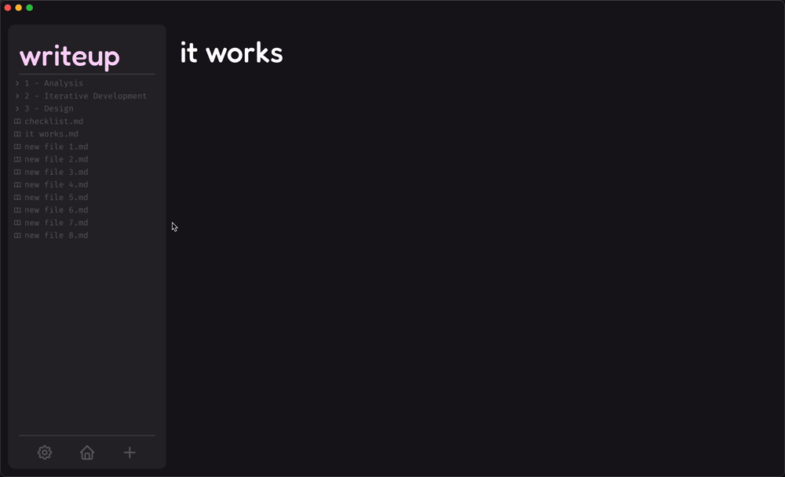

# 2.3.3 - Annotation of Code

> _An overview & explanation of the code written to build this project - **this includes testing**_

For Iteration 3, I made progress in the following general areas:

- [Toolbar](#toolbar)
  - [Settings](#implementing-settings)
  - [Home Button](#home-button)
  - [New File Button](#new-file)
- [Overhauling the UI Hierarchy](#overhauling-the-ui-hierarchy)
- [Improving Aesthetics](#improving-aesthetics) _- I revisited this section throughout the iteration; some parts may appear non-chronological_
- [Text Editor - Saving](#text-editor---adding-saving)
- [Network](#network-revisions--improvements)
  - [View & Edit Modes](#adding-view--edit-modes)
  - [More Functionality for Nodes](#adding-more-functionality-to-nodes)
  - [Network Physics](#physics)
- [Implementing a Database](#implementing-an-sqlite-database)
- [Accessibility](#accessibility)

## Toolbar

The Toolbar occupies a space at the bottom of the Sidebar, below the Filetree - this should house several buttons, all of which were set out in the [initial plan](../../1%20-%20Analysis/1.5-proposed_solution_features.md#sidebar), and then more specifically planned in the hierarchy chart [first iteration](../2.1-Iteration1/2.1.2-functionality_of_prototype.md):

- [Home button](/2%20-%20Iterative%20Development/2.3-Iteration3/2.3.3-annotation_of_code.md#home-button) - A link that will transport the user back the home view (where the Network is) upon being clicked
- [Settings](/2%20-%20Iterative%20Development/2.3-Iteration3/2.3.3-annotation_of_code.md#implementing-settings) - A button that activates a pop-up window where the user can modify certain aspects of the app/ experience, for example by picking a theme, or changing their username
- [New file](#new-file) - A button that creates a new file upon being clicked
- New folder - A button that creates a new directory. **This does not have a link as I did not end up having time to build this feature into the app.**

### Implementing Settings

My first port of call this iteration was to create an easily accessible settings page, indicated by a cog icon in the Toolbar - this will host many important features of the app, one of which being the user's ability to select the source directory within which their notes will be stored. This is an integral part of the app, and so was high on my priority list.

#### The Skeleton

1. The first step to building the skeleton for the Settings area was to create button in the sidebar, within the newly created Toolbar `<div/>` that triggers the opening of a [mantine modal UI component](https://mantine.dev/core/modal/) - a component I found after looking into Mantine's documentation that exhibits the 'pop-over' effect that I was looking for.

In order to modularise the code base, I created a separate file for the Settings page...

`../components/SettingsModal/SettingsModal.tsx`:

```tsx
export const SettingsModal = (): JSX.Element => {
  // react state used to globally keep track of if settings is open
  const [opened, { open, close }] = useDisclosure(false);

  return (
    <>
      <!-- the skeleton of the pop-over page -->
      <Modal.Root
        className={classes.modal}
        opened={opened}
        onClose={close}
        centered
        styles={{
          title: {
            fontSize: '24px',
            fontWeight: 'normal',
          },
        }}
      >
        <!-- the behaviour of the background when settings is open -->
        <Modal.Overlay backgroundOpacity={0.2} blur={1.8} />
        <!-- the content to be displayed within the pop-over -->
        <Modal.Content radius="13px" className={classes.content}>
          <!-- the 'sidebar' where the menu of settings will be displayed -->
          <NavBar />
        </Modal.Content>
      </Modal.Root>

      <!-- the button that will appear in the toolbar -->
      <Button variant="default" onClick={open}>
        <IconSettings />
      </Button>
    </>
  );
};
```

... which I then imported into the Sidebar file for use...

`../components/Sidebar/Sidebar.tsx`:

```tsx
import { SettingsModal } from '../SettingsModal/SettingsModal';
...

<div className={classes.toolbar}>
  <SettingsModal />
</div>
```

... resulting in:

<div align="center">
  
</div>

2. Then I defined the contents of the menu, or 'Navbar' as described in the code, adding the 4 main features I saw to be relevant in my plan:

- [Appearance](#appearance)
- [Account](#account)
- [Files](#files)
- [Help](#help)

In order to modularise the code _within the file_, I created 4 separate functions, each returning their respective components as `JSX.Element` objects...

`SettingsModal.tsx`:

```tsx
// modularising each component of the Navbar
const Appearance = (): JSX.Element => {
  ...
}
const Account = (): JSX.Element => {
  ...
}
const Files = (): JSX.Element => {
  ...
}
const Help = (): JSX.Element => {
  ...
}
```

... which could then be used within the `Navbar` component, making use of [Mantine's `Tabs` component](https://mantine.dev/core/tabs/) to build the skeleton of the Navbar panel. Seeing how much code is already in the Navbar function's return object, it's clear that the modularisation I applied above was certainly necessary in cleaning up the file and making it more readable and easy to modify in future development...

`SettingsModal.tsx`:

```tsx
const NavBar = (): JSX.Element => {
  const [section, setSection] = useState<string>('appearance');

  return (
    <div className={classes.root}>
      <div className={classes.header}>
        <Title className={classes.title}>settings</Title>
        <Title className={classes.section}>{section}</Title>
        <Modal.CloseButton className={classes.close} size="xl" />
      </div>
      <div>
        <Divider />
      </div>
      <Tabs
        className={classes.tabs}
        color="var(--mantine-color-defaultScheme-2)"
        defaultValue="appearance"
        variant="pills"
        orientation="vertical"
        radius={0}
        onChange={(value) => setSection(value || 'appearance')}
      >
        {/* creating a sidebar panel ('navbar') */}
        <Tabs.List className={classes.navbar}>
          <Tabs.Tab className={classes.tab} value="appearance">
            appearance
          </Tabs.Tab>
          <Tabs.Tab className={classes.tab} value="account">
            account
          </Tabs.Tab>
          <Tabs.Tab className={classes.tab} value="files">
            files
          </Tabs.Tab>
          <Tabs.Tab className={classes.tab} value="help">
            help
          </Tabs.Tab>
        </Tabs.List>

        {/* defining the contents of each 'tab' */}
        <Tabs.Panel className={classes.panel} value="files" onClick={() => setSection('files')}>
          <ScrollArea.Autosize
            className={classes.scrollableArea}
            type="scroll"
            scrollHideDelay={100}
          >
            <Files />
          </ScrollArea.Autosize>
        </Tabs.Panel>

        <Tabs.Panel
          className={classes.panel}
          value="appearance"
          onClick={() => setSection('appearance')}
        >
          <ScrollArea.Autosize
            className={classes.scrollableArea}
            type="scroll"
            scrollHideDelay={100}
          >
            <Appearance />
          </ScrollArea.Autosize>
        </Tabs.Panel>

        <Tabs.Panel className={classes.panel} value="account" onClick={() => setSection('account')}>
          <ScrollArea.Autosize
            className={classes.scrollableArea}
            type="scroll"
            scrollHideDelay={100}
          >
            <Account />
          </ScrollArea.Autosize>
        </Tabs.Panel>

        <Tabs.Panel className={classes.panel} value="help" onClick={() => setSection('help')}>
          <ScrollArea.Autosize
            className={classes.scrollableArea}
            type="scroll"
            scrollHideDelay={100}
          >
            <Help />
          </ScrollArea.Autosize>
        </Tabs.Panel>
      </Tabs>
    </div>
  );
};
```

... which resulted in a toggle-able modal that has a heading, navbar, area for content, and an exit button:


I additionally gave the components some filler components, just give me an idea as to how each components' contents will (very roughly) look on the page - note that these don't provide any functionality, and are just a skeleton to work off of:


#### Account

This is the section responsible for handling the user data (credentials etc.), and any changes they make to them. This requires fields for:

- username
- email
- password
- additionally there should be a profile picture, but I haven't focused on introducing that feature yet

each with their own respective logos and filler content (by default the input boxes should display the original username, email and passwords).

This also requires linking to the database so that the changes can be made permanent.

In order to modularise the code, I created a `<SubmissionForm/>` element to use, placing the functionality withing the `SubmissionForm()` function in another part of the file to increase readability and ease of use for developers...

`SettingsModal.tsx`:

```tsx
const Account = (): JSX.Element => {
  return (
    <Stack className={classes.stack}>
      <SubmissionForm />
    </Stack>
  );
};
```

... Then I defined the skeleton of the Account page, using three instances of Mantine's `<Form/>` component and their `useForm()` hook for each of username, email and password...

`SettingsModal.tsx`:

```tsx
const SubmissionForm = (): JSX.Element => {
  const [name, setName] = useState('name');
  const [email, setEmail] = useState('email');
  const [password, setPassword] = useState('password');
  const at = <IconAt size={16} stroke={1.5} />;
  const lock = <IconLock size={16} stroke={1.5} />;
  const user = <IconUser size={16} stroke={1.5} />;

  // at this point, the database is not linked to this section; the values are set to ''
  const formName = useForm({
    mode: 'uncontrolled',
    initialValues: { name: '' },
  });
  const formEmail = useForm({
    mode: 'uncontrolled',
    initialValues: { email: '' },
  });
  const formPassword = useForm({
    mode: 'uncontrolled',
    initialValues: { password: '' },
  });

  const handleSubmitName = async (values: typeof formName.values): Promise<void> => {
    await asyncSubmit(values);
    setName(values.name); // set the submitted value as the new placeholder
    formName.reset(); // reset the form to empty the input
  };
  const handleSubmitEmail = async (values: typeof formEmail.values): Promise<void> => {
    await asyncSubmit(values);
    setEmail(values.email); // set the submitted value as the new placeholder
    formEmail.reset(); // reset the form to empty the input
  };
  const handleSubmitPassword = async (values: typeof formPassword.values): Promise<void> => {
    await asyncSubmit(values);
    setPassword(values.password); // set the submitted value as the new placeholder
    formPassword.reset(); // reset the form to empty the input
  };

  return (
    <Flex align="center" gap="xl">
      <div style={{ flex: 1 }}>
        <form onSubmit={formName.onSubmit(handleSubmitName)}>
          <Flex gap="sm" justify="flex-start" align="center" direction="row" wrap="wrap">
            <TextInput
              leftSection={user}
              placeholder={name}
              key={formName.key('name')}
              {...formName.getInputProps('name')}
            />

            <Group justify="flex-end">
              <ActionIcon
                variant="transparent"
                aria-label="submit"
                type="submit"
                loaderProps={{ type: 'dots' }}
                size="lg"
              >
                <IconCornerDownLeft />
              </ActionIcon>
            </Group>
          </Flex>
        </form>

        <Space h="sm" />
        <Divider />
        <Space h="sm" />

        <form onSubmit={formEmail.onSubmit(handleSubmitEmail)}>
          <Flex gap="sm" justify="flex-start" align="center" direction="row" wrap="wrap">
            <TextInput
              leftSection={at}
              placeholder={email}
              key={formEmail.key('email')}
              {...formEmail.getInputProps('email')}
              width="100%"
            />

            <Group justify="flex-end">
              <ActionIcon
                variant="transparent"
                aria-label="submit"
                type="submit"
                loaderProps={{ type: 'dots' }}
                size="lg"
              >
                <IconCornerDownLeft />
              </ActionIcon>
            </Group>
          </Flex>
        </form>

        <Space h="sm" />
        <Divider />
        <Space h="sm" />

        <form onSubmit={formPassword.onSubmit(handleSubmitPassword)}>
          <Flex gap="sm" justify="flex-start" align="center" direction="row" wrap="wrap">
            <TextInput
              leftSection={lock}
              placeholder={password}
              key={formPassword.key('password')}
              {...formPassword.getInputProps('password')}
            />

            <Group justify="flex-end">
              <ActionIcon
                variant="transparent"
                aria-label="submit"
                type="submit"
                loaderProps={{ type: 'dots' }}
                size="lg"
              >
                {/* <IconArrowRight stroke={2} /> */}
                <IconCornerDownLeft />
              </ActionIcon>
            </Group>
          </Flex>
        </form>
      </div>
    </Flex>
  );
};
```


##### Changes from design specification

Though my initial design used the down-left arrow icon to indicate a submission button to the right of each field, once I actually had access to more icon libraries I experimented with some other icons, and considered again if they're even necessary in the UI. In the end, I decided on keeping the existing icons, as the older portion of the demographic, who aren't as necessarily as well-versed in tech, may not infer that pressing `enter` is a common form of submission in similar apps/ websites, though I believe the UI could be optimised in the future.

`SettingsModal.tsx`:

```tsx
...
<IconRightArrow />
...
<IconCornerDownLeft />
...
<IconCheck />
...
```


However, I wasn't satisfied with the positioning of the fields either. In light of [stakeholder feedback given in Iteration 2](../2.2-Iteration2/2.2.4-stakeholder_feedback.md), I needed a fluid way to incorporate the user profile picture selector into this page. This wouldn't work well with the current positioning, unless it went above or below the submission fields, which I thought wouldn't be a very cohesive design, so I experimented with moving the fields to the left and right of the page:

`SettingsModal.tsx`:

```tsx
<Flex gap="sm" justify="center" align="center" direction="row" wrap="wrap">
```


to

`SettingsModal.tsx`:

```tsx
<Flex gap="sm" justify="flex-start" align="center" direction="row" wrap="wrap">
```


to

`SettingsModal.tsx`:

```tsx
<Flex gap="sm" justify="flex-end" align="center" direction="row" wrap="wrap">
```


I decided having the profile picture selector to the left of the fields brought the design together, ensuring it's not out of the of the user's eye and cursor.

Then I worked on actually implementing the selection feature, with a default 'user' image displaying if nothing has been picked by the user. The image is selected by clicking on the profile picture circle, and navigating through the user's filesystem. Since the function awaits a filepath to the image to be returned, an asynchronous (`async`) function is required to do this:

`SettingsModal.tsx`:

```tsx
const SubmissionForm = (): JSX.Element => {
  ...
  const [profileImage, setProfileImage] = useState<string | null>(null);
  ...
  const handleImageClick = async (): Promise<void> => {
    try {
      const imgData = await window.ipcAPI.openFileSelector();
      if (imgData) {
        setProfileImage(imgData);
      }
    } catch (error) {
      console.error('Failed to select image: ', error);
    }
  };
  return (
    <Flex align="center" gap="xl">
      <div className={classes.profileImg} onClick={handleImageClick}>
        {profileImage ? (
          
        ) : (
          <IconUser size={60} stroke={1.5} color="var(--mantine-color-defaultScheme-1)" />
        )}
      </div>
      ...
    </Flex>
  );
};
```

The function must be defined in the IPC API in order to be used:

`/src/renderer/src/types/index.ts`:

```tsx
export type IpcAPI = {
  ...
  openFileSelector: (options: {
    filters: Array<{ name: string; extensions: string[] }>;
  }) => Promise<string>;
  ...
};
```

It must then be able to communicate between the front and back ends using the Electron API:

`/src/preload/index.ts`:

```tsx
if (process.contextIsolated) {
  try {
    contextBridge.exposeInMainWorld('electron', electronAPI);
    // communication between front and backend for data transfer (tree node data)
    // adapted from: https://www.jsgarden.co/blog/how-to-handle-electron-ipc-events-with-typescript
    contextBridge.exposeInMainWorld('ipcAPI', {
      ...
      openFileSelector: (options) => ipcRenderer.invoke('open-file-selector', options),
      ...
    }
    ...
  }
...
}
```

The functionality of it can then be defined in the backend:

- It must open the file selector, only allowing certain file types (_images_), and,
- Encode the image and send it back to the frontend with the correct MIME type (_explained below_)

`/src/main/index.ts`:

```tsx
// listens for the request to select a file, opens the native OS' filesystem UI and returns selected file path
ipcMain.handle('open-file-selector', async () => {
  const result = await dialog.showOpenDialog({
    properties: ['openFile'],
    filters: [{ name: 'Images', extensions: ['jpg', 'png', 'gif', 'jpeg'] }],
  });

  if (result.filePaths.length > 0) {
    const imgPath = result.filePaths[0];
    const imgBuffer = await readFile(imgPath);
    const base64Img = imgBuffer.toString('base64');
    const mimeType = getMimeType(imgPath);
    return `data:${mimeType};base64,${base64Img}`;
  }
  return null;
});
```

Using the concept of modularisation to place the `getMimeType()` function in a separate file, where `getMimeType()` is explained in the comment above the function definition:

`fileHandling.ts`:

```tsx
/* this is used to retrieve the Multi-purpose Internet Mail Extension (MIME) type of the image,
 so as to correctly encode base64 image data */
export const getMimeType = (filePath: string): string => {
  const extension = filePath.toLowerCase();
  if (extension.endsWith('.png')) return 'image/png';
  if (extension.endsWith('.webp')) return 'image/webp';
  if (extension.endsWith('.svg')) return 'image/svg+xml';
  if (extension.endsWith('.gif')) return 'image/gif'; // in case the .gif type ever needs to be processed
  return 'image/jpeg'; // the default extension for .jpg, .jpeg...
};
```

As a result, we get a profile image component that looks like this:


If an image is selected, it is displayed like this:


And a demo of the process of selecting a profile picture is below:


#### Files

Working on the Files component within settings, I started by creating a reusable set of `<div/>`s to be used for each setting 'component'...


... where the component is a `<div/>`, with its classname defining its role in the component, such that each setting consists of:

- `.settingComponent` - the root component, to contain the content of the setting
- `.settingsComponentTitle` - the title of the setting
- `.settingsComponentContent` - the description of the content, along with the action to be done (_i.e select the root directory_):

`SettingsModal.tsx`:

```tsx
const Files = (): JSX.Element => {
  ...
  return (
    <div>
      <div className={classes.settingComponent}>
        <Title className={classes.settingsComponentTitle} size="h3">
          header goes here
        </Title>
        <div className={classes.settingsComponentContent}>
          <Text className={classes.text}>
            description goes here
          </Text>
          <Space h="md" />
          <!-- action goes here: -->
        </div>
      </div>
    ...
  );
};
```

##### Source Folder Selector

I could then use this template to apply the 'source folder' setting, as well as any others in the future:

`SettingsModal.tsx`:

```tsx
const Files = (): JSX.Element => {
  // data provider used to keep track of the selected root directory
  const { rootDirPath, setRootDirPath } = useSharedData();
  ...
  return (
    <div>
      <Stack className={classes.stack}>
        <div className={classes.settingComponent}>
          <Title className={classes.settingsComponentTitle} size="h3">
            source folder
          </Title>
          <div className={classes.settingsComponentContent}>
            <Text className={classes.text}>
              the root directory within which your notes will be stored
            </Text>
            <Space h="md" />
            <MantineButton
              className={classes.selectFolderButton}
              variant="subtle"
              leftSection={<IconChevronDown />}
              onClick={handleDirectorySelect}
            >
              {rootDirPath || 'select directory'}
            </MantineButton>
          </div>
        </div>
        <Divider />
        ...
      </Stack>
    </div>
  );
};
```

I then added functionality to the `select directory` button in the code above by creating a function to handle the button being clicked...

`SettingsModal.tsx`:

```tsx
const Files = (): JSX.Element => {
  ...
  const handleDirectorySelect = async (): Promise<void> => {
    try {
      // asynchronously communicates with backend, so must wait for a response with `await`
      const directory = await window.ipcAPI.openDirectorySelector();
      if (directory) {
        setRootDirPath(directory);
      }
    } catch (error) {
      console.error('Failed to select directory:', error);
    }
  };
  ...
}
```

... linking to the `preload` layer...

`src/preload/index.ts`:

```ts
if (process.contextIsolated) {
  try {
    ...
    contextBridge.exposeInMainWorld('ipcAPI', {
      ...
      openDirectorySelector: () => ipcRenderer.invoke('open-directory-selector'),
      ...
    }
  }
}
...
```

... and then handling the process on the backend (`main`) by using Electron's built-in `.showOpenDialog()` method to open the file selector...

`main/index.ts`:

```ts
// listens for the request to select a directory, opens the native OS' filesystem UI and returns selected directory path
ipcMain.handle('open-directory-selector', async () => {
  const result = await dialog.showOpenDialog({
    properties: ['openDirectory'],
  });
  return result.filePaths[0];
});
```

###### The Result


##### Save Frequency

**_Later on in the development process_**, I came back to this feature, and I added another setting to handle the frequency of saving (_how frequently the text editor saves the contents of the file to the user's filesystem_). The options are:

- on change
- every second
- every 2s
- every 5s
- every 10s

and they determine the the time in milliseconds for the throttle handler (_the time before the `handleSaveContent()` function is called again_)

`EditNodeMetaScreen.tsx`:

```tsx
const getSaveDelay = (frequency: string): number => {
  if (frequency === 'on-change') return 0;
  return parseInt(frequency) || 2000;
};

// prevents file from being saved more than every n milliseconds
const throttledSaveHandler = useThrottledCallback(
  handleSaveContent,
  getSaveDelay(saveFrequency || '2000')
);
```

Where the `handleSaveContent()` function uses the `.saveFile()` method I created when designing the [saving file content functionality](#file-content-saving) to save the current contents of the Text Editor to the name of the currently selected file:

`EditNodeMetaScreen.tsx`:

```tsx
const handleSaveContent = useCallback(
  async (markdown: string): Promise<void> => {
    if (!selectedTreeNodeData) return;
    try {
      await window.ipcAPI.saveFile(selectedTreeNodeData.value, markdown);
      console.log('File saved successfully');
    } catch (error) {
      console.error('Error saving file:', error);
    }
  },
  [selectedTreeNodeData]
);
```

###### The Result


##### Changes from design specification

I found that fitting the exact [UI design](../../3%20-%20Design/3.1%20-%20Design%20Part%20I/3.1.3-interface_designs.md#settings) in terms of the positioning of the 'select directory' button impossible to meet, given how the size of the button can grow to the width of the settings screen. This is because the filepath the user selects could be much longer than the originally designated area - therefore, I had to compromise by placing the button below the setting description, rather than to the right of it. **In order to maintain consistency, I made the decision to keep this design pattern for all settings components.**

#### Appearance

#### Help

This was one of the last sections I could do before completing the app, as it requires the implementation of demo screenshots and videos - these can only be taken once all features are in place, and the app looks how it will when built & shipped for production. As a result, this part is was done right ner the end of development, and thus the app looks much more complete than just before and after this in the document.

For each part of the app I saw to be potentially confusing, I added a component documenting how to solve the issue the user may have. I did the same for any help my stakeholders suggested may be necessary.

##### Structure

For each 'help component', I followed the same format of using my 'settings component' design to create titles, subtitles, text and media. The general format consists of:

- A title for a category within help (optional)
- A subtitle depicting the specific problem the user may need help with
- A content area including:
  - A text area housing a description of how to solve the problem
  - A piece of media (`.gif`/ `.png`) to accompany the description, giving the user a visual guide to follow and replicate (this would be especially useful for the older/ less tech-savvy portion of my target demographics, as just text may not explain the solution to them in a way they find understandable)

This is reflected in the below example code:

`SettingsModal.tsx`:

```tsx
const Help = (): JSX.Element => {
  return (
    <Stack className={classes.stack}>
      <div className={classes.settingComponent}>
        <Title className={classes.settingsSubHeading} size="h2">
          broad area e.g getting started
        </Title>
        <Title className={classes.settingsComponentTitle} size="h3">
          problem 1
        </Title>
        <div className={classes.settingsComponentContent}>
          <Text className={classes.text}>how to fix problem 1</Text>
          <Image
            radius="md"
            src={demogif}
            alt="demo gif showing how to fix problem 1"
            fallbackSrc="https://placehold.co/600x400?text=Placeholder"
            className={classes.demo}
          />
        </div>
      </div>
      <Divider size="sm" className={classes.dividerSettingsComponent} />
      ... {/* more components */}
    </Stack>
  );
};
```

Since the code is almost identical except for the content of each help setting, I don't see a point in showing the code for each of them here, just the result of the implementations of the boilerplate above. I then used this format to create the following help components:

##### Getting Started

This subsection is for initial setup/ understanding the basics of the app. This includes:

- Accessing your notes:


- Opening a note:


##### Network behaviour:


### Home Button

Additionally, I created another component that links to the Home view, positioned next to the settings icon in the toolbar:

`HomeButton.tsx`:

```tsx
export const HomeButton = (): JSX.Element => {
  const navigate = useNavigate();
  return (
    <Button
      className={classes.homeButton}
      title="Home"
      variant="default"
      onClick={() => navigate('/home/view')}
    >
      <IconHome size={32} />
    </Button>
  );
};
```

With some basic styling:

```css
.homeButton {
  color: var(--mantine-color-defaultScheme-4);
  background-color: var(--mantine-color-defaultScheme-1);
  border-color: var(--mantine-color-defaultScheme-1);
}

.homeButton:hover {
  color: var(--mantine-color-defaultScheme-6);
  background-color: var(--mantine-color-defaultScheme-1);
}
```

<div align="center">
  
</div>

### New File

Since the creation of the home button, the UI of the app had a significant upgrade - this is touched upon later in the iteration, but a brief overview of changes to this specific part of the app (_a.k.a the Toolbar_) are:

- transparent button backgrounds,
- highlight-on-hover effect to make it clear these are buttons,
- a divider to separate the Toolbar from the rest of the Sidebar, and,
- re-coloured to fit the [colour scheme](../../3%20-%20Design/3.1%20-%20Design%20Part%20I/3.1.3-interface_designs.md)

```css
[code]
```

## Overhauling the UI Hierarchy

Over the past 2 iterations, I've experienced some difficulties working with the way I initially designed the structure of the app and the components within it, not being able to produce some of the functionality I would like to for example because the layout does not permit it. Therefore, I decided when specifying what to work on this iteration that I needed to explicitly draw out the hierarchy of components for each main screen in the app, updating [Design Part 1](../../3%20-%20Design/3.1%20-%20Design%20Part%20I/3.1.3-interface_designs.md) accordingly.

**It's important to note that a lot of these changes appear out of order with the timeline (non-chronological). This is because this section was completed throughout the entirety of Iteration 3, and so I was making changes at different stages in the app's creation.**

### Home Hierarchy


### Text Editor Hierarchy


### Settings Hierarchy


These give me the blueprints by which to structure all the `<div />` components within each screen, from which I can then add all the functionality I wish to, in the way originally intended.

## Improving Aesthetics

The aesthetics in the app thus far are sub-par - there are more than a few bugs and ugly UI features currently in the app. Plenty of changes need to be made to meet a reasonable standard for myself, the stakeholders and the target audience. Here I'm addressing all poor aesthetic qualities in the app, and attempt to bring them up to scratch.

### Theming

In order to make the codebase as easy to develop with and understand as possible, I decided to implement the [colour scheme](../../3%20-%20Design/3.1%20-%20Design%20Part%20I/3.1.3-interface_designs.md) at the highest level of the hierarchy of files, in `src/renderer/src/index.tsx`. This means that, using the 'cascading' property of CSS, all files 'beneath' `index.tsx` in the file hierarchy can inherit this theme.

To demonstrate this visually, when listing all files/ directories in `src/renderer/src`, we see that `index.tsx` is on the same level as `components`, `providers`, and `screens` - the directories holding code that requires styling in accordance with the theme, and therefore are able to inherit the theme:


Using [Mantine's documentation on theming](https://mantine.dev/theming/mantine-provider/), I was able to construct a theme object to be accessed by all CSS files:

`src/renderer/src/index.tsx`:

```tsx
import { createTheme, MantineProvider } from '@mantine/core';

...

const theme = createTheme({
  fontFamily: 'Fira Code, monospace',
  colors: {
    // each colour in the colour scheme can be accessed via indexing, e.g --mantine-default-scheme-5 yields purple (#61497C)
    defaultScheme: [
      '#19161E',
      '#29262D',
      '#2E2B33',
      '#4A4850',
      '#62606B',
      '#61497C',
      '#FED5FB',
      '#FFFFFF',
      '#FFFFFF',
      '#FFFFFF',
    ],
  },
  headings: {
    fontFamily: 'fredoka, sans-serif',
    fontWeight: '500',
    sizes: {
      h1: { fontSize: '54px' },
      h2: { fontSize: '40px' },
      h3: { fontSize: '30px' },
      h4: { fontSize: '24px' },
      h5: { fontSize: '22px' },
      h6: { fontSize: '20px' },
    },
  },
  fontSizes: {
    xs: '10px',
    sm: '15px',
    md: '15px',
    lg: '40px',
    xl: '54px',
  },
});

...
```

This determines that anything inheriting this theme will:

- Be able to access the colour scheme by indexing the `defaultScheme` array, and
- Use the 'Fira Code' font, unless it's a heading, in which case it will use the Fredoka font, both with size constraints.

As a result, I can use these to style each part of the app by its CSS module (each component has a corresponding CSS file with the convention `[filename].module.css`), and any changes I make to this file will be seen app-wide without the need for individual modification.

### Making Custom Title Bar

An issue I have with the basic skeleton of the app is the persistent title bar at the top of the page:

<div align="center">
  
</div>

In most modern apps, the bar at the top of the screen that houses the full-screen, minimise and close (red, yellow and green on macOS, and +, - and x on Windows) buttons is hidden from view. I've seen this done before with Electron apps in demos and tutorials on Youtube (_e.g [Build an Electron App in Under 60 Minutes by Traversy Media](https://www.youtube.com/watch?v=kN1Czs0m1SU)_), and discovered it was a setting you can change by editing an attribute on the `BrowserWindow` initialisation in `main`:

`main/index.ts`:

```ts
function createWindow(): void {
  // create the browser window
  const mainWindow = new BrowserWindow({
    ...
    titleBarStyle: 'hidden',
    ...
  });
  ...
}
...
```

This gave me the desired effect, though caused some styling issues, as all the content on each page was shifted up by the height of the previously present title bar. As a result, in each screen's css, I created a variable `var(--padding-width)` of the same height in pixels as the title bar was (`30px`), which I then padded each of the screens with:

`LoginScreen.module.css`:

```css
.root {
  --titlebar-height: 30px;
  ...
  height: calc(100vh - var(--titlebar-height));
  ...
}
```

etc., giving me the following look, with a much cleaner, emptier top section of the app:


### Sidebar

#### Manual Dynamic Resizing

To make the experience more interactive, I decided to introduce a resizing feature to the Sidebar. This means the user will be able to change the ration of Sidebar width to Network width, making seeing their files easier if they have long names, or giving the network more space if the files have short names.

In order to produce this effect, I knew I would need to keep track of both the Sidebar's width and if the Sidebar is currently being resized throughout the app's lifetime - therefore React's `useState()` hooks would be needed, requiring the use of event listeners to follow what the mouse is doing at all times:

```ts
export const ScreenWithSidebar = ({ children }: ScreenWithSidebarProps): JSX.Element => {
  const [sidebarWidth, setSidebarWidth] = useState(250);
  const [resizing, setResizing] = useState(false);
  // define constraints
  const minWidth = 250;
  const maxWidth = 450;

  ...

  // function allowing the manual dynamic resizing of the sidebar
  const startResizing = useCallback((mouseDownEvent: React.MouseEvent) => {
    setResizing(true);

    const startResizing = (mouseMoveEvent: MouseEvent): void => {
      const newWidth = mouseMoveEvent.clientX;
      if (newWidth > minWidth && newWidth < maxWidth) {
        setSidebarWidth(newWidth);
      }
    };

    const stopResizing = (): void => {
      setResizing(false);
      window.removeEventListener('mousemove', startResizing);
      window.removeEventListener('mouseup', stopResizing);
    };

    window.addEventListener('mousemove', startResizing);
    window.addEventListener('mouseup', stopResizing);
  }, []);
...
}
```

##### 'Jumping' Error

As soon as this was implemented, I noticed that upon resizing the sidebar from a width not equal to the initialised width, the sidebar jumped back to the initial width before resizing:


After some inspection of both the bug visually and in my code, I found the sidebar's width to be being set relative to the whole screen.
This meant I was setting the width from the edge of the app window, which when applied to the Sidebar - whose width is less than to the edge of the window - caused it to 'jump' back to the width from the very edge of the screen.

Using logic, the code used that likely caused this effect was:

```ts
export const ScreenWithSidebar = ({ children }: ScreenWithSidebarProps): JSX.Element => {
  ...
  const startResizing = useCallback((mouseDownEvent: React.MouseEvent) => {
    setResizing(true);

    const startResizing = (mouseMoveEvent: MouseEvent): void => {
      const newWidth = mouseMoveEvent.clientX;
      if (newWidth > minWidth && newWidth < maxWidth) {
        setSidebarWidth(newWidth);
      }
    };
  ...
  }, []);
...
}
```

In order to fix this, I used the relative distance from the mouse down click to when released using a constant `startX` variable to subtract from the current position, `mouseMoveEvent.clientX`. This meant I now have 2 separate variables to keep track of mouse position and Sidebar width at the same time. Additionally, for this function to be called upon an update to the width of the Sidebar, I had to let the callback function depend on the `sidebarWidth` variable (seen in the second last line):

```ts
// function allowing the manual dynamic resizing of the sidebar
const startResizing = useCallback((mouseDownEvent: React.MouseEvent) => {
  setResizing(true);
    const startX = mouseDownEvent.clientX; // new
    const startWidth = sidebarWidth; // new

    const startResizing = (mouseMoveEvent: MouseEvent): void => {
      const difference = mouseMoveEvent.clientX - startX; // new
      const newWidth = startWidth + difference; // new
      if (newWidth > minWidth && newWidth < maxWidth) {
        setSidebarWidth(newWidth);
      }
    };
    ...
  },
  [sidebarWidth] // new
);
```


#### Styling

The Sidebar, though containing some styling, was still quite bare-bones, and not particularly nice to look at. In accordance with the [design set out](../../3%20-%20Design/3.1%20-%20Design%20Part%20I/3.1.3-interface_designs.md), I used the theme I made earlier to replicate my initial design idea for the Sidebar:

`Sidebar.module.css`:

```css
/* declaring the variables used for reusability */
:root {
  --margin-width: 10px;
  --sidebar-width: 200px;
  --border-width: 2px;
  --border-color: rgb(44, 44, 44);
  --toolbar-height: 60px;
  --sidebar-border-radius: 13px;
  --title-bar-height: 30px;
  --sidebar-margin: 15px;
  --padding-default: 20px;
}

.root {
  background-color: var(--mantine-color-defaultScheme-1);
  border-radius: var(--sidebar-border-radius);
  height: calc(100vh - 2 * var(--sidebar-margin) - var(--title-bar-height));
  width: calc(var(--sidebar-width) - 2);
  display: flex;
  flex-direction: column;
}

/* the base that the title sits on */
.titleDiv {
  padding-left: var(--padding-default);
  padding-top: var(--padding-default);
  min-width: 200px;
  flex-shrink: 0;
  color: var(--mantine-color-defaultScheme-6);
  overflow: hidden;
  -webkit-box-orient: vertical;
  min-height: 40px;
  text-overflow: ellipsis;
}

.title {
  text-overflow: ellipsis;
}

/* the horizontal grey lines between sections */
.divider {
  margin-left: var(--padding-default);
  margin-right: var(--padding-default);
}

.tree {
  background-color: transparent;
}

/* the base that the filetree sits on */
.filetreeDiv {
  position: relative;
  flex: 1;
  min-height: 0;
  padding-left: 10px;
  padding-top: 4px;
  overflow: hidden;
}

.scrollableArea {
  height: 100%;
  padding-right: 10px;
  scrollbar-width: none;
}

.toolbar {
  bottom: 15px;
  height: var(--toolbar-height);
  display: flex;
  justify-content: center;
  align-items: center;
  gap: 8px;
  background-color: var(--mantine-color-defaultScheme-1);
  border-radius: var(--sidebar-border-radius);
}

/* the base that each label sits on */
.leaf {
  display: flex;
  align-items: center;
  gap: 6px;
  min-width: 0;
  width: 100%;
  background-color: var(--mantine-color-defaultScheme-1);
}

/* each component of the file tree */
.label {
  margin-left: var(--margin-width);
  margin-right: var(--margin-width);
  white-space: nowrap;
  overflow: hidden;
  text-overflow: ellipsis;

  &[data-selected] {
    color: var(--mantine-color-defaultScheme-6);
  }
}

/* the text within each label */
.leafText {
  color: var(--mantine-color-defaultScheme-4);
  size: 'lg';
  white-space: nowrap;
  overflow: hidden;
  text-overflow: ellipsis;
  flex: 1;
  min-width: 0;
  -webkit-font-smoothing: antialiased;
}

.leafText:hover {
  color: var(--mantine-color-defaultScheme-6);
}
```

#### Scrollbars

In relation to the Sidebar and the filetree within it, I had no real solution to what happened when the width of the name of one of the files was wider than the SideBar. This led to unwanted behaviour:

- The names too wide not displaying all their content, and,
- If the filetree was expanded below the bottom of the screen, the Sidebar grew in size as well

This led me to create 2 HTML elements for the filetree to sit within, that have custom scrollbar behaviour such that the user can scroll right to see the wider names, and down to see files off the screen.
I used `<ScrollArea.Autosize />` to create a vertical scroll effect, and `<Box />` (a Mantine component [recommended in their documentation for this kind of use case](https://mantine.dev/core/box/)) to provide a horizontal scroll effect:

`Sidebar.tsx`:

```tsx
export const Sidebar = (): JSX.Element => {
  return (
    ...
    <div className={classes.filetree}>
      <ScrollArea.Autosize
        className={classes.scrollableArea}
        type="scroll"
        offsetScrollbars
        viewportProps={{ style: { overflowX: 'hidden' } }}
        scrollHideDelay={100}
      >
        <Box>
          <Tree
            levelOffset="lg"
            className={classes.tree}
            selectOnClick
            clearSelectionOnOutsideClick
            data={treeNodeData ? treeNodeData : []}
            renderNode={(payload) => <Leaf {...payload} />}
          />
        </Box>
      </ScrollArea.Autosize>
    </div>
    ...
  )
  ...
}
```

I used the following CSS to style them exactly as I want, with `overflow: hidden;` meaning the horizontal scrollbar is hidden from view:

`Sidebar.module.css`:

```css
.filetree {
  position: relative;
  flex: 1;
  min-height: 0;
  padding-left: 10px;
  padding-top: 4px;
  overflow: hidden;
}

.scrollableArea {
  height: 100%;
  padding-right: 10px;
  scrollbar-width: none;
}
```

#### The Result

As a result, I got the Sidebar looking very similar to my initial design, with smooth, intuitive navigation:

<div align="center">
  
</div>

### Login/ Signup Design

#### Styling

As it stood, the log in and sign up screens were far more function-oriented than style-oriented, with standard components with little to no styling applied. In order to bring them up to scratch, I updated the CSS for both screens to reflect the designs in [Design Part 1](../../3%20-%20Design/3.1%20-%20Design%20Part%20I/3.1.3-interface_designs.md).

Given that the Signup screen is essentially a clone of the Login screen with a few extra components, I considered it to be better to use one CSS file for both screens, simply adding the extra styling for the Signup screen to the end of the file:

`LoginScreen.module.css`:

```css
/* the page the content sites on */
.root {
  --titlebar-height: 30px;
  height: calc(100vh - var(--titlebar-height));
  display: flex;
  justify-content: center;
  align-items: center;
}

/* the 'card' the input fields sit on top of */
.base {
  --toolbar-height: 30px;
  background-color: var(--mantine-color-defaultScheme-1);
  border-radius: 8px;
  padding: 40px;
  width: 400px;
  display: flex;
  flex-direction: column;
  margin-top: 10px;
  margin-bottom: calc(10px + var(--toolbar-height));
}

.title {
  text-align: center;
  color: var(--mantine-color-defaultScheme-6);
}

.form {
  display: flex;
  flex-direction: column;
  gap: 15px;
}

.submit {
  color: var(--mantine-color-defaultScheme-5);
  background-color: var(--mantine-color-defaultScheme-0);
}

.submit:hover {
  color: var(--mantine-color-defaultScheme-6);
  background-color: var(--mantine-color-defaultScheme-5);
}

.signupText {
  color: var(--mantine-color-defaultScheme-5);
}

.signupText:hover {
  color: var(--mantine-color-defaultScheme-0);
}

.leftArrow:hover {
  color: var(--mantine-color-defaultScheme-0) !important;
}
```

Additionally, I chose to use some in-line styling within the `LoginScreen.tsx` file as I found [Mantine's styling guide](https://mantine.dev/styles/styles-overview/) quite unhelpful - their components often have multiple sub classes within them for each element of the component. I couldn't work out how to access these from within the CSS file, so I chose to style them within the component declarations themselves (`<TextInput/>` and `<PasswordInput/>`) in order to isolate the components I wanted to style:

`LoginScreen.tsx`:

```tsx
import classes from './LoginScreen.module.css';

export const LoginScreen = (): JSX.Element => {
  ...

  return (
    <Screen>
      <div className={classes.root}>
        <div className={classes.base}>
          ...

          <!-- <form onSubmit={form.onSubmit(() => navigate('/home'))} className={classes.form}> */} -->
          <form
            ...
            className={classes.form}
          >
            <!-- username field -->
            <TextInput
              styles={{
                // styles are done inline here due to TextInput having multiple subclasses, potentially making a css file for these more confusing
                input: {
                  background: 'var(--mantine-color-defaultScheme-2)',
                  color: 'var(--mantine-color-defaultScheme-6)',
                  borderColor: 'var(--mantine-color-defaultScheme-2)',
                },
                label: {
                  color: 'var(--mantine-color-defaultScheme-4)',
                },
              }}
              ...
            />

            <!-- password field -->
            <PasswordInput
              styles={{
                input: {
                  background: 'var(--mantine-color-defaultScheme-2)',
                  color: 'var(--mantine-color-defaultScheme-6)',
                  borderColor: 'var(--mantine-color-defaultScheme-2)',
                },
                label: {
                  color: 'var(--mantine-color-defaultScheme-4)',
                },
              }}
              ...
            />
            ...
          </form>
          ...
        </div>
      </div>
    </Screen>
  );
};
```

The Login screen:


The Signup screen:


#### Autofocus

Additionally, a slight issue with the Login screen I noticed was that you have to click on the email input before you can start entering your email.
Given that the app's just started up at this stage in the app lifecycle, and the user likely wants to get to their notes as quickly and fluidly as possible, forcing them to move the mouse and click the email field before even being able to enter their credentials would likely have a negative impact on user experience. Therefore, I looked into how to autofocus the cursor on the email input. After googling, the solution turned out to be as simple as using the `autofocus` attribute (set to 'true' by default) on the email input:

`LoginScreen.tsx`:

```tsx
...
export const LoginScreen = (): JSX.Element => {
  ...

  return (
    <Screen>
      <div className={classes.root}>
        <div className={classes.base}>
          ...
          <form
            ...
          >
            <!-- username field -->
            <TextInput
              ...
              autoFocus
            />
            ...
          </form>
          ...
        </div>
        ...
      </div>
    </Screen>
  )
}
```

#### The Result

A demo of the autofocus, and the interactive elements implemented in the styling section work, is also below (some of the components use hover effects to make it more apparent and intuitive to the user that that they can interact with those components):


### Network

#### Styling

Given that the Network uses the `<Canvas/>` element to render content, I had to use a slightly different method to style each component (the canvas renders in a different way to normal HTML/CSS). After following [some more guides on the Canvas element, specifically styling](https://www.youtube.com/watch?v=Yvz_axxWG4Y&t=152s), I found I could use the `getComputedStyle()` function, followed by the `.getPropertyValue()` method to retrieve the colour scheme colours, along with any other styles I want, from the Network's CSS file - this allows me to declare all the styling for the Network first in the CSS, along with all other styling for the non-canvas section...

`NodeNetwork.module.css`:

```css
/* defining canvas styles */
:root {
  --node-colour: var(--mantine-color-defaultScheme-2);
  --node-hover-colour: var(--mantine-color-defaultScheme-9);
  --node-text-colour: var(--mantine-color-defaultScheme-6);
  --node-connection-colour: var(--mantine-color-defaultScheme-3);
  --node-centre-colour: var(--mantine-color-defaultScheme-3);
  --node-selected-colour: var(--mantine-color-defaultScheme-5);
  --node-connection-width: 2px;
  --node-font: 'Fira Code';
  --node-text-size: 12px;
  --titlebar-height: 30px;
  --toggle-height: 34px;
  --root-padding: 15px;
  --controls-width: 100px;
}

/* base for all components to sit on */
.networkDiv {
  flex: 1;
  display: flex;
  flex-direction: column;
  height: 100%;
  overflow: hidden;
  position: relative;
}

/* constraints for canvas element */
.canvas {
  position: absolute;
  top: var(--toggle-height);
  left: 0;
  right: 0;
  bottom: 0;
  width: 100%;
  height: calc(100% - var(--toggle-height));
}

/* everything below covers toggle menu at top of page */
.viewEditToggle {
  display: flex;
  padding-left: calc((100% / 2) - var(--controls-width));
  align-items: center;
  flex-direction: row;
}

.segmentedControl {
  background-color: var(--mantine-color-defaultScheme-1);
}

.eyeIcon {
  width: 16px;
  height: 16px;
}

.pencilIcon {
  width: 16px;
  height: 16px;
}

.viewToggled:hover {
  color: var(--mantine-color-defaultScheme-6);
}

.editToggled:hover {
  color: var(--mantine-color-defaultScheme-6);
}
```

... and then retrieve these styles from within the TypeScript file as variables for use when drawing the parts of the Network using the following:

`NodeNetwork.tsx`:

```tsx
import { Center, SegmentedControl } from '@mantine/core';
import { IconEye, IconPencil } from '@tabler/icons-react';
import classes from './NodeNetwork.module.css';
import { useSharedData } from '@renderer/providers/SharedDataProvider';
...

export const NodeNetwork = ({ files }: NodeNetworkProps): JSX.Element => {
  const {
    ...
    nodeRadius,
    setNodeRadius,
    titleOpacity,
  } = useSharedData();
  const [mode, setMode] = useState('view');

  ...

  // canvas drawing function
  const draw = useCallback(() => {
    const ctx = contextRef.current;
    if (!ctx) return;
    ...

    // retrieving network styling from css file
    const computedStyle = getComputedStyle(document.documentElement);
    const nodeColour: string = computedStyle.getPropertyValue('--node-colour') || '#2E2B33';
    const nodeTextColour: string =
      computedStyle.getPropertyValue('--node-text-colour') || '#FED5FB';
    const connectionColour: string =
      computedStyle.getPropertyValue('--node-connection-colour') || '#4A4850';
    const centreColour: string = computedStyle.getPropertyValue('--node-centre-colour') || '#4A4850';
    const selectedColour: string =
      computedStyle.getPropertyValue('--node-selected-colour') || '#61497C';
    const connectionWidth: number =
      parseInt(computedStyle.getPropertyValue('--node-connection-width')) || 2;
    const fontFamily: string = computedStyle.getPropertyValue('--node-font') || 'Fira Code';
    const textSize: string = computedStyle.getPropertyValue('--node-text-size') || '12px';

    // batch similar operations
    ctx.strokeStyle = connectionColour;
    ctx.lineWidth = connectionWidth;

    // draw connections
    ...

    // batch text rendering
    ctx.fillStyle = nodeTextColour;
    ctx.font = `${textSize} ${fontFamily}`;
    ctx.textAlign = 'center';
    ctx.globalAlpha = titleOpacity || 1;
    ...
    ctx.globalAlpha = 1;

    // batch node drawing
    ctx.fillStyle = nodeColour;
    ...

    // in the case that edit mode is on, these features are drawn
    if (mode == 'edit') {
      // batch centre drawing (the point from which the user can drag a connection)
      ctx.fillStyle = centreColour;
      ...

      // draw dragging connection
    }
  }, [nodes, connections, draggingConnection, nodeRadius, mode, titleOpacity, counter]);

  return (
    <div className={classes.networkDiv}>
      ...
      <div className={classes.viewEditToggle}>
        <SegmentedControl
          className={classes.segmentedControl}
          ...
          data={[
            {
              ...
              label: (
                <Center className={classes.viewToggled} style={{ gap: 10 }}>
                  <IconEye className={classes.eyeIcon} />
                </Center>
              ),
            },
            {
              ...
              label: (
                <Center className={classes.editToggled} style={{ gap: 10 }}>
                  <IconPencil className={classes.pencilIcon} />
                </Center>
              ),
            },
          ]}
          ...
        />
      </div>
      <canvas
        className={classes.canvas}
        ...
      />
    </div>
  );
};
```

At this point, I wanted to recreate the effect seen in the [preliminary design](../../3%20-%20Design/3.1%20-%20Design%20Part%20I/3.1.3-interface_designs.md) of having the selected node in the filetree in the Sidebar be highlighted a different colour (purple) to the rest of the nodes. I knew to do this I would need a way of tracking which file is currently selected, lending itself to again using the `SharedDataProvider`...

`SharedDataProvider.ts`:

```ts
import { createContext, useContext, useMemo, useState } from 'react';
...

export type SharedData = {
  selectedFile: string | undefined;
  setSelectedFile: React.Dispatch<React.SetStateAction<string | undefined>>;
  ...
};

...

export function SharedDataProvider({ children }: SharedDataProviderProps): JSX.Element {
  const [selectedFile, setSelectedFile] = useState<string>();
  ...

  const value = useMemo<SharedData>(
    () => ({
      selectedFile,
      setSelectedFile,
      ...
    }),
    [
      selectedFile,
      ...
    ]
  );

  return <SharedDataContext.Provider value={value}>{children}</SharedDataContext.Provider>;
}

...
```

... which could be used to set the selected file to whichever file is selected. Given that a file can be selected in two ways:

- By left clicking the file in the Sidebar, or,
- By being right clicked in the Network,

I had to make sure both methods would set the file being selected to `SelectedFile` using `setSelectedFile()`.

Therefore, I made sure that clicking on a node updated the selected file...

`NodeNetwork.tsx`:

```tsx
import { useCallback, useEffect, useRef, useState } from 'react';
import { Position, Node, Connection, NodeNetworkProps } from '../../types/index';
import { useNavigate } from 'react-router-dom';
import { useSharedData } from '@renderer/providers/SharedDataProvider';

export const NodeNetwork = ({ files }: NodeNetworkProps): JSX.Element => {
  const navigate = useNavigate();
  const {
    selectedFile,
    setSelectedFile,
    ...
  } = useSharedData();

  ...

  // mouse event handlers
  const handleMouseDown = (e: React.MouseEvent<HTMLCanvasElement>): void => {
    ...

    // mouse position relative to the canvas
    const { x, y } = handleMousePosition(e.clientX, e.clientY);

    const leftClick: number = 0;
    // const scrollClick: number = 1;
    const rightClick: number = 2;
    ...

    // check if clicking on a node
    const clickedNode = nodes.find(
      (node) => Math.sqrt(Math.pow(node.x - x, 2) + Math.pow(node.y - y, 2)) < (nodeRadius || 15)
    );

    if (clickedNode) {
      // check if clicking near center (connection handle)
      ...
      if (mode == 'edit' && distanceToCenter < 10) {
        ...
      } else {
        if (e.button == rightClick) {
          ...
          // set the selected node data in the shared data provider context, and navigate to its contents
          setSelectedFile(treeNodeData.value.split('/').pop()?.replace('.md', '') || '');
          navigate('/home/edit-node-meta');
        } else if (e.button == leftClick) {
          ...
        }
      }
    }
  };

  return (
    ...
  );
};
```

... as well as the case that the user clicks on a file in the Sidebar:

`Sidebar.tsx`:

```tsx
import { ReactElement, useEffect, useState } from 'react';
import { useSharedData } from '@renderer/providers/SharedDataProvider';
import { useNavigate } from 'react-router-dom';

export const Sidebar = (): JSX.Element => {
  ...
  return(
    ...
  );
};

function Leaf({
  node,
  expanded,
  hasChildren,
  elementProps,
  tree,
}: RenderTreeNodePayload): ReactElement<FileIconProps> {
  // making use of the SharedDataProvider and the custom hook useSharedData() to access the shared data
  const { ..., setSelectedFile, setNewFileCreated } = useSharedData();
  const navigate = useNavigate();

  return (
    <Group
      ...
      onClick={() => {
        ...
        if (!node.children) {
          ...
          <!-- updating the shared data with the selected node -->
          setSelectedFile(node.value.split('/').pop()?.replace('.md', '') || '');
          ...
          navigate('/home/edit-node-meta');
        }
      }}
    >
      ...
    </Group>
  );
}
```

Finally, I implemented the logic to actually highlight the node that was last selected/ entered. For this, I chose to iterate through all the nodes in the `draw()` function (_unfortunately, there isn't really a more efficient method, and due to the way te canvas renders things, I couldn't just change the colour of the canvas context when iterating through the nodes to draw them_). Then, simply check if the node's file name matches the name of the `selectedFile` variable:

`NodeNetwork.tsx`:

```tsx
export const NodeNetwork = ({ files }: NodeNetworkProps): JSX.Element => {
  ...

  const draw = useCallback(() => {
    ...
    // drawing selected node
    ctx.fillStyle = selectedColour;
    ctx.beginPath();
    nodes.forEach((node) => {
      if (node.title == selectedFile) {
        ctx.moveTo(node.x + (nodeRadius || 15), node.y);
        ctx.arc(node.x, node.y, nodeRadius || 15, 0, Math.PI * 2);
        ctx.fill();
      }
    });
    ...
  }
  )
}
```

#### The Result

As a result, I had a network displaying nodes, connections etc. in colours matching the initial design, that displays the last selected node in purple:


### Text Editor

#### Styling

I found it challenging to work with MDXEditor's documentation on how to style the components within the editor, which was sparse and assumed prior knowledge on developing an app in this style, of which I have none.

As a result, I attempted to use debugging techniques to target the particular components and their class names that I wanted to style differently. To do this, I used the dev tools (`fn`+`f12`) within the app to isolate each div to work out where to apply the styling changes I wanted:


Which I then applied to each component I wanted to make changes to.

An example of this was changing link colours from blue to the purple featured in my [colour scheme](../../3%20-%20Design/3.1%20-%20Design%20Part%20I/3.1.3-interface_designs.md):


As seen above, I found when I traced the `<div/>`s back, the links were automatically given a style of `'color: white'`. I then applied this to the `.editor` component in the Text Editor's CSS file by using `:global()` in conjunction with the component (`a`), and the suffix of `!important` after changes I wanted to override:

`EditNodeMeta.module.css`:

```css
...
.editor :global([contenteditable='true'] a) {
  color: var(--mantine-color-defaultScheme-5) !important;
  text-decoration: underline;
  cursor: pointer;
}

.editor :global([contenteditable='true'] a:hover) {
  color: var(--mantine-color-defaultScheme-6) !important;
  text-decoration: underline;
}
...
```

After applying the rest of these changes,

`EditNodeMeta.module.css`:

```css
/* the base for the entire page */
.root {
  margin-left: 5px;
  display: flex;
  flex-direction: column;
  gap: 12px;
  border-radius: 6px;
  --sidebar-margin: 15px;
  --title-bar-height: 15px;
  --title-height: 70px;
  --title-padding: 30px;
  height: calc(
    100vh - 2 * var(--sidebar-margin) - var(--title-bar-height) - 2 * var(--title-height)
  );
  background-color: var(--mantine-color-defaultScheme-0);
  color: white;
  width: 100%;
  .button {
    width: fit-content;
  }
}

/* the div that the editor or the 'no file selected' message sit on */
.innerDiv {
  height: 100vh;
}

/* the classname provided by the MDXEditor API, determining a base for the editor to sit on */
.mdxeditor {
  --sidebar-margin: 15px;
  --title-bar-height: 32px;
  --title-height: 70px;
  --editor-padding: 12px;
  height: calc(
    100vh - 2 * var(--sidebar-margin) - var(--title-bar-height) - var(--title-height) -
      var(--editor-padding)
  );
  font-family: var(--mantine-font-family);
  padding: 0;
}

/* the name of the file (editable), at the top of the page */
.title {
  font-family: 'Fredoka';
  color: var(--mantine-color-defaultScheme-9);
  font-size: 54px;
  font-weight: 500;
  line-height: 1.2;
  min-width: 500px;
}

/* the styling of the content of the editor */
.editor {
  color: var(--mantine-color-defaultScheme-6);
  background-color: var(--mantine-color-defaultScheme-0);
}

.editor :global([contenteditable='true']) {
  color: var(--mantine-color-defaultScheme-9) !important;
  background-color: var(--mantine-color-defaultScheme-0) !important;
  font-family: var(--mantine-font-family) !important;
  --baseBg: var(--mantine-color-defaultScheme-2);
}

/* link styling (already shown above) */

.editor :global([contenteditable='true'] h1) {
  color: var(--mantine-color-defaultScheme-9) !important;
}
```

... I ended up with a text editor that abides by the [colour scheme and design](../../3%20-%20Design/3.1%20-%20Design%20Part%20I/3.1.3-interface_designs.md) (fonts, sizes etc.) that I specified in the Design section:


#### Autofocus

Similarly to the Login and Signup pages use the `autofocus` feature to speed up workflow, when the user opens a note they should be able to start writing instantly. For this reason, I added the same `autofocus` attribute to the `<MDXEditor />` instance within `EditNodeMetaScreen.tsx`.

Initially, I had the idea that if a new file was to be created, the title should be auto-focused, and if the file already exists, focus the content - this means that when a new file is created, the user can more quickly modify the name of the file. This involved using a boolean state `newFileCreated` (and `setNewFileCreated()`) within the `SharedDataProvider`, so that it remains persistent and accessible throughout the app. Then, upon a new file being created, set the variable to true (with `setNewFileCreated()`), and if an existing file is clicked on in the Sidebar, set it to false, and set `autofocus={newFileCreated}` for both the title and editor:

`SharedDataProvider.tsx` (creating the shared data in the provider):

```tsx
import { createContext, useContext, useMemo, useState } from 'react';
...

export type SharedData = {
  ...
  newFileCreated: boolean | undefined; // decides whether to autofocus content or title of file (new file -> title, file exists -> content)
  setNewFileCreated: React.Dispatch<React.SetStateAction<boolean | undefined>>;
};

...

export function SharedDataProvider({ children }: SharedDataProviderProps): JSX.Element {
  ...
  const [newFileCreated, setNewFileCreated] = useState<boolean>();

  const value = useMemo<SharedData>(
    () => ({
      ...
      newFileCreated,
      setNewFileCreated,
    }),
    [
      ...
      newFileCreated,
    ]
  );
  ...
}

...
```

`Sidebar.tsx` (setting `newFileCreated` to `false` when existing file clicked):

```tsx
function Leaf({...}: RenderTreeNodePayload): ReactElement<FileIconProps> {
  // making use of the SharedDataProvider and the custom hook useSharedData() to access the shared data
  const { setSelectedTreeNodeData, setSelectedFile, setNewFileCreated } = useSharedData();
  const navigate = useNavigate();

  return (
    <Group
      gap={5}
      {...elementProps}
      onClick={() => {
        ...
        if (!node.children) {
          console.log('Sidebar: node selected: ', node);
          <!-- updating the shared data with the selected node -->
          setSelectedTreeNodeData(node);
          setSelectedFile(node.value.split('/').pop()?.replace('.md', '') || '');
          <!-- when an existing file is clicked, autofocus the content of the editor -->
          setNewFileCreated(false);
          navigate('/home/edit-node-meta');
        }
      }}
    >
    ...
    </Group>
  );
}
```

`CreateFileButton` (setting `newFileCreated` to `true` when existing new file created):

```tsx
...
import { useSharedData } from '@renderer/providers/SharedDataProvider';
import { CreateFileProps } from '../../../../types';

export const CreateFile = ({ filePath, name, files }: CreateFileProps): JSX.Element => {
  const { counter, setCounter, setNewFileCreated } = useSharedData();
  ...
  const createNewFile = (): void => {
    window.ipcAPI.saveFile(filePath + '/' + name + ' ' + counter + '.md', ' ');
    setCounter((counter ?? 1) + 1);
    // if a new file is created, autofocus the title of the file when entering text editor
    setNewFileCreated(true);
  };
  ...
};
```

`EditNodeMetaScreen.tsx` (setting the 2 autofocus attributes equal to `newFileCreated`):

```tsx
import classes from './EditNodeMetaScreen.module.css';
import { ScrollArea, Space, Title } from '@mantine/core';
import { useSharedData } from '@renderer/providers/SharedDataProvider';
...

export const EditNodeMetaScreen = (): JSX.Element => {
  const {
    ...
    newFileCreated,
  } = useSharedData();
  ...
  return (
    <div className={classes.root}>
      <div className={classes.innerDiv}>
        {fileContents === null ? (
          <Title h={1}>no selection made yet</Title>
        ) : (
          <ScrollArea.Autosize
            ...
          >
            <Space h="xl" />
            <div
              autoFocus={newFileCreated} <!-- new -->
              ...
            >
              {selectedFile}
            </div>

            <div className={classes.mdxeditor}>
              <MDXEditor
                ...
                autoFocus={newFileCreated} <!-- new -->
                ...
              />
            </div>
          </ScrollArea.Autosize>
        )}
      </div>
    </div>
  );
};
```

This logic works in theory, however when I attempted to test this functionality, it always auto-focused the content, even when a new file was created. My suspicion was that the issue was to do with asynchronous functions, and the autofocus potentially being set before or after the file was loaded leading to timing problems. However, after some debugging, I decided not to pursue this any further given how minor of a feature this was, opting to come back to it later if I had time.

#### Changes to Design Specification

A small change I made when compared to the original design laid out for the text editor is that the textual content (_i.e. not headers, links etc._) is white instead of grey - I deemed the grey to be too unreadable in actuality, and would've made for a less enjoyable and seamless experience. When running these changes past my stakeholders, they agreed white text was better than the grey originally planned.

Headers are additionally also in Fira Code along with the normal text - I found in reality having headers be in a different font to the rest of the text quite confusing and a bit of a headache, so I reserved the Fredoka font just for the title of the file at the top of the page.

#### The Result

The result is a text editor that looks like the design initially specified, and auto-focuses the content of the file when selected:



## Text Editor - Adding Saving

### File Content Saving

mdxEditor docs very sparse, not providing examples of usage, so I had to look into 'throttling' again (I needed this when optimising the network as well, through the use case was too different to be ble to just cross reference).


After not much success, I made use of chatGPT to ask about how to apply the concept of 'throttling' to this problem:


### File Name Saving

used similar concept, only working with a `<div/>` instead of `<MDXEditor/>`, and modifying the save times to be every time the user presses `enter`, rather than every 2000ms. Got backend functionality working with some difficulty, but issue arising when trying to open a renamed file:


(error occurred when clicking on the `checklist wha.md` file, which I had just renamed). After considering where the error could have arisen, I found it most likely that the culprit was in the sidebar - the filetree only updates when the root directory is changed as seen in the `useCallback()` function:

```tsx
useEffect(() => {
  if (rootDirPath) {
    window.ipcAPI.getTreeNodeData(rootDirPath).then((treeNodeData) => {
      setTreeNodeData(treeNodeData);
    });
  }
}, [rootDirPath]);
```

where the argument passed at the end of the function, `[rootDirPath]`, means the function is called if and only if the root directory is changed. This is an issue as it means any files that have their names changed won't necessarily have their names changed in the filetree - the architecture of the communication between front and back end for retrieval of file contents then means that these incorrect names can be send to the backend for content retrieval, resulting in a behaviour such that a file can be renamed once, but subsequent renamings result in error:


Therefore, I need to modify the callback such that the correct file names are retrieved upon any of the titles of files/ folders being changed, so the program doesn't take the wrong filename and send it to the backend to return its contents. This means updating the callback to depend on `title` as well as `rootDirPath` _i.e it will be called every time there is a change to either of those variables_:

```tsx
useEffect(() => {
  if (rootDirPath) {
    window.ipcAPI.getTreeNodeData(rootDirPath).then((treeNodeData) => {
      setTreeNodeData(treeNodeData);
    });
  }
}, [rootDirPath, title]);
```

However, since the Sidebar relies on `TreeNodeData` and thus `selectedTreeNodeData`, `selectedTreeNodeData` must also be updated with the new title - if not, the title will update, but when clicking on the renamed file in the file tree, its title will still be the original title. As a result, it will request the backend to access a file that no longer exists, as it's under a new name. This lead to me adding the following to the `handleSaveTitle` function:

```tsx
const handleSaveTitle = useCallback(
  ...
    setSelectedTreeNodeData({
      ...selectedTreeNodeData,
      value: result.path,
      label: newTitle,
    });
  [selectedTreeNodeData, setTitle, setSelectedTreeNodeData]
);
```

Upon implementing this change, I found an error was getting raised every time I renamed a file:


Given that this happened _every time_ a new name was submitted, this had to mean that the issue was within `handleSaveTitle()`. Given that the error suggested the backend was trying to open a file named 'undefined', the data being passed from the front-end - `selectedTreeNodeData` - was also undefined. This suggested that functions were being called out of sync:

1. The file is renamed
2. `setSelectedTreeNodeData()` is called, setting value to `result.path` **before** `renameFile()` is completely executed _(the await keyword tells us it has an asynchronous response time)_
3. `renameFile()` returns result


Where the sequence should be:

1. The file is renamed
2. `renameFile()` returns result
3. `setSelectedTreeNodeData()` is called, setting value to `result.path`


To fix this, a new asynchronous `Promise` is called to wait one tick before continuing execution. This allows enough time for the backend to write the changes to the filename and return a result:

```tsx
await new Promise((resolve) => setTimeout(resolve, 0));
```

The result of these fixes on `handleSaveTitle()` is:

```tsx
const handleSaveTitle = useCallback(
  async (newTitle: string): Promise<void> => {
    if (!selectedTreeNodeData) return;
    try {
      const result = await window.ipcAPI.renameFile(selectedTreeNodeData.value, newTitle);
      // update the title
      setTitle(newTitle);
      // wait one tick to ensure file system operation is complete...
      await new Promise((resolve) => setTimeout(resolve, 0));
      // ...before updating the tree node data to prevent operations occurring out of sync
      setSelectedTreeNodeData({
        ...selectedTreeNodeData,
        value: result.path,
        label: newTitle,
      });
    } catch (error) {
      console.error('Error renaming file:', error);
    }
  },
  [selectedTreeNodeData, setTitle, setSelectedTreeNodeData]
);
```

This led me to think about the way nodes are rendered in the Network as well, as the nodes are rendered in a similar fashion

## Network Revisions & Improvements

- note that NodeNetwork function is bulky and should be modularised/ broken down

### Adding View & Edit Modes

use draw function code, talk about several code blocks depending on the mode

redrawing dependant on updating the mode:

```ts
const draw = useCallback(() => {
  ...
}, [nodes, connections, draggingConnection, radius]);
```

to:

```ts
const draw = useCallback(() => {
  ...
}, [nodes, connections, draggingConnection, radius, mode]);
```

### Adding More Functionality to Nodes

- (view mode) right clicking opens node
- (edit mode) left clicking drags node around
- (edit mode) right clicking drags connection

### Physics

This section is only an addition I made a part of the project due to [a comment made by one of my stakeholders](../2.2-Iteration2/2.2.4-stakeholder_feedback.md#transcript-of-interview-2024), suggesting that I make the Network more interactive by adding physics to the nodes, and additionally to use an algorithm such as [Boid's Algorithm](https://en.wikipedia.org/wiki/Boids) to let the nodes move autonomously when idled.

#### Collisions

- added code to simulate collisions in `NodeNetwork.tsx`
- then added velocities, but was only applying to once mouse was let go (un-clicked)
- led to me modularising and creating a separate file to contain all logic
- then had issues with chain reaction bouncing off walls
- fine tuned restitution and friction coefficients, and added mouse velocity damper
- known issue - nodes overlap and frame rate/ reload speeds mean some collisions aren't detected

#### Boid's Algorithm

- then implemented boid's algorithm, using https://people.ece.cornell.edu/land/courses/ece4760/labs/s2021/Boids/Boids.html as a reference. This involved:
  - following description/ pseudocode in website above
  - creating dropdown menu for parameters - makes development easier and quicker as well as giving the user more freedom in terms of customisability (meeting requirements set by target demographic analysis/ stakeholders)
  - tweaking parameters until suitable ranges found
  - designed so that only kicks in after 5 seconds of inactivity
  - gives user option to enable/ disable boid's in settings

### New File Button Bug

Earlier in development I noticed that adding a new file with the [New File button](#new-file) was problematic when it came to the network - each time a new file was added to the network, the whole thing would be re-initialised and rendered, with new random positions and velocities.
This can make for a disorienting effect, that derails one of the points of the network, as it jumbles the map of notes completely, potentially causing the user to lose their flow. I would like the network to react in some way to show that the newly created note has been added to the network; however this is not it:


It was immediately clear to me

### Changes From Design Specification

- reconsidered colour of nodes as light pink is too bright

## Implementing an SQLite Database

A feature that very much required attention for a successful login/ signup experience was a database. If I want users to be able to create and sign in to their own accounts, on top of other things, I need a way to store data persistently _i.e. once the app has been closed_.

After researching my options, I found [SQLite databases](https://www.sqlite.org/) to be a promising solution. It is:

- frequently contributed to,
- used widely amongst the developer community,
- well documented with [a plethora of tutorials](https://www.sqlitetutorial.net/),
- syntactically quite easy and understandable,
- lightweight and performant,
- cross platform compatible, and
- doesn't require a separate server to run, among other things.

This fits my use case well, as there likely won't be a need to store much data, it works on all platforms and will likely make for a much better development process than a less commonly used database such as [Orient DB](https://orientdb.org/), or a database not built for the job I need, such as [Couch DB](https://couchdb.apache.org/) (a mobile-oriented database). For these reasons, I chose this to be my database.

### Login & Signup

- take screenshots of ui + code

```ts
import Database from 'better-sqlite3';

const database = new Database('./db/nodepad.sqlite3', {
  verbose: console.log,
});

// log all current users
database.all('SELECT * FROM Users', (err, rows) => {
  if (err) {
    console.error('Database SELECT error:', err);
    return;
  }
  console.log('Database SELECT result:', { rows });
});

// create a new record with passed in credentials if they don't already exist
export const createCredentials = (
  email: string,
  password: string
): Promise<{ success: boolean; message?: string }> => {
  return new Promise((resolve) => {
    console.log('createCredentials', { email, password });
    database.run('INSERT INTO Users (email, password) VALUES (?, ?)', [email, password], (err) => {
      if (err) {
        console.error('Error inserting user:', err);
        resolve({ success: false, message: err.message });
        return;
      }
      console.log('User created successfully');
      resolve({ success: true });
    });
  });
};

// check the passed in credentials to those existing in the db
export const checkCredentials = (
  email: string,
  password: string
): Promise<{ success: boolean; message?: string }> => {
  return new Promise((resolve) => {
    console.log('checkCredentials', { email, password });
    database.get(
      'SELECT * FROM Users WHERE email = ? AND password = ?',
      [email, password],
      (err, row) => {
        if (err) {
          console.error('Error checking credentials:', err);
          resolve({ success: false, message: err.message });
          return;
        }
        if (!row) {
          console.log('User not found');
          resolve({ success: false, message: 'Invalid email or password' });
          return;
        }
        console.log('User exists');
        resolve({ success: true });
      }
    );
  });
};
```

MIDWAY THROUGH A PACKAGE GOT UPDATED WHICH CAUSED A CONFLICT, LEADING TO THE APP NOT STARTING - THIS MEANT I HAD TO SWITCH TO THE `better-sqlite3` PACKAGE (from `sqlite3`), WHICH CHANGED HOW THE APP COMMUNICATES WITH THE DB:

```ts
import Database from 'better-sqlite3';

const database = new Database('./db/nodepad.sqlite3', {
  verbose: console.log,
});

// initialise database with a Users table if it doesn't already exist
database.exec(`
  CREATE TABLE IF NOT EXISTS Users (
    id INTEGER PRIMARY KEY AUTOINCREMENT,
    email TEXT UNIQUE NOT NULL,
    password TEXT NOT NULL
  )
`);

// log all current users
const allUsers = database.prepare('SELECT * FROM Users').all();
console.log('Current users in database:', allUsers);

// create a new record with passed in credentials if they don't already exist
export const createCredentials = (
  email: string,
  password: string
): Promise<{ success: boolean; message?: string }> => {
  try {
    const statement = database.prepare('INSERT INTO Users (email, password) VALUES (?, ?)');
    statement.run(email, password);
    return Promise.resolve({ success: true });
  } catch (err) {
    console.error('Error inserting user:', err);
    return Promise.resolve({ success: false, message: err.message });
  }
};

// check the passed in credentials to those existing in the db
export const checkCredentials = (
  email: string,
  password: string
): Promise<{ success: boolean; message?: string }> => {
  try {
    const statement = database.prepare('SELECT * FROM Users WHERE email = ? AND password = ?');
    const row = statement.get(email, password);
    if (!row) {
      return Promise.resolve({ success: false, message: 'Invalid email or password' });
    }
    return Promise.resolve({ success: true });
  } catch (err) {
    console.error('Error checking credentials:', err);
    return Promise.resolve({ success: false, message: err.message });
  }
};
```

### Account Customisation

One of the features I set out to implement was the ability to change the user's credentials from within the app, at `App -> Settings -> Account`. Currently, I had a blueprint for this, with inputs for a profile picture, username, email and password - however the changes made here did not persist, and were 'reversed' upon the user leaving Settings; no changes were made to the database.

The first thing to do was add persistent states for username and password so they could be accessed throughout the whole app via my `useSharedData()` provider. This means the app knows what credentials are assigned to this user so they can be displayed and updated within the app:

`SharedDataProvider.tsx`:

```tsx
export type SharedData = {
  ...
  email: string | undefined;
  setEmail: React.Dispatch<React.SetStateAction<string | undefined>>;
  username: string | undefined;
  setUsername: React.Dispatch<React.SetStateAction<string | undefined>>;
  password: string | undefined;
  setPassword: React.Dispatch<React.SetStateAction<string | undefined>>;
};

export function SharedDataProvider({ children }: SharedDataProviderProps): JSX.Element {
  ...
  const [email, setEmail] = useState<string>();
  const [username, setUsername] = useState<string>();
  const [password, setPassword] = useState<string>();

  const value = useMemo<SharedData>(
    () => ({
      ...
      email,
      setEmail,
      username,
      setUsername,
      password,
      setPassword,
    }),
    [
      ...
      email,
      username,
      password,
    ]
  );

  return <SharedDataContext.Provider value={value}>{children}</SharedDataContext.Provider>;
}
```

This allowed me to assign the credentials to the user when successfully logging in, leading me to update the Login code to set the credentials if, and only if, the credentials are already in the database _i.e this is a valid login_:

`LoginScreen.tsx`:

```tsx
const handleSubmit = useCallback(async (): Promise<void> => {
  const { email, password } = form.getValues();
  const result = await window.ipcAPI.checkCredentials(email, password);
  if (result) {
    // if credentials are valid, log in and assign the useSharedData() provider with user's credentials
    setEmail(email);
    setPassword(password);
    navigate('/home');
  } else {
    console.log('User not found');
    alert(
      'Invalid email or password. Please check both fields have been correctly entered, or sign up for a new account'
    );
  }
}, [form]);
```

The result is that when the user logs in and navigates to `Setting -> Account`, their username and password are displayed in their respective fields:


Then I attempted to implement functions to update email and password. This followed the same structure as all other front-to-backend communication, with functions being defined in `/types/index.ts`:

`/types/index.ts`:

```ts
export type IpcAPI = {
  ...
  updateEmail: (oldEmail: string, newEmail: string) => Promise<boolean>;
  updatePassword: (email: string, password: string) => Promise<boolean>;
};
```

... the connection between IPCRenderer and IPCMain being established in `/preload/index.ts`, defining what should happen on the event of a success or failure to update the database:

`/preload/index.ts`:

```ts
if (process.contextIsolated) {
  try {
    ...
    // expose these functions to the backend (main):
    contextBridge.exposeInMainWorld('ipcAPI', {
      ...
      // updates email field in the record with primary key of oldEmail in db
      updateEmail: (oldEmail: string, newEmail: string) => {
        // debug
        console.log('preload:updateEmail', { oldEmail, newEmail });
        ipcRenderer.send('update-email', { oldEmail, newEmail });

        return new Promise((resolve) => {
          ipcRenderer.on('update-email-success', (_event, success) => {
            console.log('on update-email-success');
            resolve(success);
          });
          ipcRenderer.on('update-email-failure', (_event, success) => {
            console.log('on update-email-failure');
            resolve(success);
          });
        });
      },

      // updates password field in the record with primary key of email in db
      updatePassword: (email: string, password: string) => {
        // debug
        console.log('preload:updatePassword', { email, password });
        ipcRenderer.send('update-password', { email, password });

        return new Promise((resolve) => {
          ipcRenderer.on('update-password-success', (_event, success) => {
            console.log('on update-password-success');
            resolve(success);
          });
          ipcRenderer.on('update-password-failure', (_event, success) => {
            console.log('on update-password-failure');
            resolve(success);
          });
        });
      },
    ...
    }
  ...
  }
...
```

... defined what should happen upon the messages being sent from `preload` in `main`:

`main/index.ts`:

```ts
app.whenReady().then(() => {
  ...
  // new email is given...
  ipcMain.on('update-email', async (event: IpcMainEvent, { oldEmail, newEmail }) => {
    // old email is located and updated, or old email not found
    console.log('main:update-email', oldEmail, newEmail);
    const result = await checkCredentials(oldEmail, newEmail);
    result.success
      ? event.sender.send('update-email-success', result.success)
      : event.sender.send('update-email-failure', result.success);
  });

  // new password is given...
  ipcMain.on('update-password', async (event: IpcMainEvent, { email, password }) => {
    // email is located and password updated, or email not found
    console.log('main:update-password', email, password);
    const result = await updatePassword(email, password);
    result.success
      ? event.sender.send('update-password-success', result.success)
      : event.sender.send('update-password-failure', result.success);
  });
  ...
}
```

... and finally wrote the `updateEmail()` and `updatePassword()` functions within a separate file (`dbHandling.ts`), using SQLite statements to communicate with the database. In order to write these, I had to familiarise myself with the structure of SQLite statements, using [SQLite's official page](https://www.sqlitetutorial.net/sqlite-update/) as a guide:

`dbHandling.ts`:

```ts
// update the email of an existing record
export const updateEmail = (
  oldEmail: string,
  newEmail: string
): Promise<{ success: boolean; message?: string }> => {
  try {
    const statement = database.prepare('UPDATE Users SET email = ?, WHERE email = ?');
    const result = statement.run(newEmail, oldEmail);

    // if the record is not updated
    if (result.changes === 0) {
      return Promise.resolve({ success: false, message: 'email not found' });
    }
    return Promise.resolve({ success: true });
  } catch (err) {
    console.error('!! Error updating email:', err);
    return Promise.resolve({ success: false, message: 'an unknown error occurred' });
  }
};

// update the password of an existing record with given email
export const updatePassword = (
  email: string,
  password: string
): Promise<{ success: boolean; message?: string }> => {
  try {
    const statement = database.prepare('UPDATE Users SET password = ? WHERE email = ?');
    const result = statement.run(password, email);

    // if the record is not updated
    if (result.changes === 0) {
      return Promise.resolve({ success: false, message: 'account not found' });
    }
    return Promise.resolve({ success: true });
  } catch (err) {
    console.error('!! Error updating password:', err);
    return Promise.resolve({ success: false, message: 'an unknown error occurred' });
  }
};
```

As a result, I could use these functions within the submission of the `email` and `password` fields in `Settings -> Account` by rewriting the `handleSubmitEmail()` and `handleSubmitPassword()` functions - the functions now use `.updateEmail()` and `.updatePassword()` methods, using the awaited result to determine whether or not to update the values of `email` or `password` in the UI:

`SettingsModal.tsx`:

```tsx
const SubmissionForm = ():JSX.Element => {
  ...
  const handleSubmitEmail = async (values: typeof formEmail.values): Promise<void> => {
    const oldEmail = email || 'email'; // email could be undefined
    const result = await window.ipcAPI.updateEmail(oldEmail, values.email);
    if (result) {
      await asyncSubmit(values);
      setEmail(values.email); // set the submitted value as the new placeholder
    }
    formEmail.reset(); // reset the form to empty the input
  };

  const handleSubmitPassword = async (values: typeof formPassword.values): Promise<void> => {
    const result = await window.ipcAPI.updatePassword(
      email || 'email',
      values.password || 'password'
    ); // email and/ or password could be undefined
    if (result) {
      await asyncSubmit(values);
      setPassword(values.password); // set the submitted value as the new placeholder
    }
    formPassword.reset(); // reset the form to empty the input
  };
  ...
}
```

#### Error 1 - Incorrect Function Call

After making all these changes, I could finally test if they worked as intended. I logged in with the email 'a@b.c' and tried to change it to 'new@email.com'. This change was not reflected in the app, so I checked the debug log in the terminal and saw that the SQLite statement being executed was `'SELECT * FROM Users WHERE email = ? AND password = ?'`:

 - calling wrong function in main

Because I was using debugging methods to log all activity happening in the app to the console with sufficient detail, I recognised that the function being called was `checkCredentials()`, and tracked down that this was being called instead of `updateEmail()` in `main/index.ts`. This was simply an error on my part, accidentally writing the incorrect function call, and the fix was as simple as changing the function being called:

```ts
ipcMain.on('update-email', async (event: IpcMainEvent, { oldEmail, newEmail }) => {
  ...
  const result = await updateEmail(oldEmail, newEmail); // was const result = await checkCredentials(oldEmail, newEmail)
  ...
});
```

#### Error 2 - Syntax

After resolving that error, I found that my input was still resulting in an error somewhere - again my debug log helped me by supplying me with an error message on the backend again, this time suggesting a syntactical error near the `WHERE` part of the SQLite statement:


After inspecting the SQLite statement in `updateEmail()` more thoroughly, I found a comma just before the `WHERE` keyword, which I had incorrectly interpreted when I was using [SQLite's guide on how to update an existing record](https://www.sqlitetutorial.net/sqlite-update/) to help write the function. I then updated the statement to exclude the comma:

`dbHandling.ts`:

```ts
export const checkCredentials = (
  email: string,
  password: string
): Promise<{ success: boolean; message?: string }> => {
  try {
    const statement = database.prepare('SELECT * FROM Users WHERE email = ? AND password = ?'); // was 'SELECT * FROM Users, WHERE email = ? AND password = ?'
    ...
  }
};
```

#### The Result

I then verified that there were no errors in the chain of communication between front and backend by inputting data into first the `email` field:


... and then the password field:


The fact that the values in the fields changed when new data was entered, along with the correctly updated credentials being logged upon restarting the app in the terminal, told me that the system was working as it should, with both the front and back end showing they worked as expected.

#### Validation

To make these fields more secure, I implemented some validation inside the `useForm()` hook to match the validation for the login and signup pages. This means:

- Email must contain an at sign `@` and a full stop `.`, and,
- Password must be at least 8 characters long

These changes are reflected below under the `validate` attribute within `useForm()`:

`SettingsModal.tsx`:

```tsx
const formEmail = useForm({
  mode: 'uncontrolled',
  initialValues: { email: '' },

  validate: {
    email: (value) => (/^\S+@\S+$/.test(value) ? null : 'invalid email'),
  },
});

const formPassword = useForm({
  mode: 'uncontrolled',
  initialValues: { password: '' },

  validate: {
    password: (value) => (value.length >= 8 ? null : 'invalid password'),
  },
});
```

#### Changes From Design Specification

During this process, I realised that having a username in the app is essentially redundant, as it isn't used anywhere, and would end up just making the database more complicated. Therefore, I decided to remove the `username` field from Settings.

**Upon communicating this change to my stakeholders, they agreed this change was a positive one, and reduces complexity and confusion for anyone using the app who might wonder what the need for a username is:**


## Accessibility

### Using Keyboard Shortcuts

`render/src/index.ts`:

```tsx
...
ReactDOM.createRoot(document.getElementById('root') as HTMLElement).render(
  <React.StrictMode>
    <MantineProvider defaultColorScheme="dark" theme={theme}>
      <SharedDataProvider>
        <HashRouter>
          <Routes>
            <Route path="/" element={<LoginScreen />} />
            <Route path="/login" element={<LoginScreen />} />
            <Route path="/signup" element={<SignUpScreen />} />
            <Route path="/home/*" element={<HomeScreen />} />
          </Routes>
        </HashRouter>
      </SharedDataProvider>
    </MantineProvider>
  </React.StrictMode>
);
```

```tsx

```

### Auto-Focus

See next: [Stakeholder Feedback](./2.3.4-stakeholder_feedback.md)
