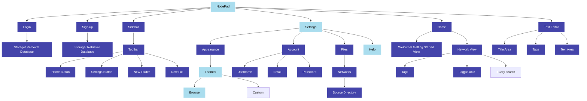
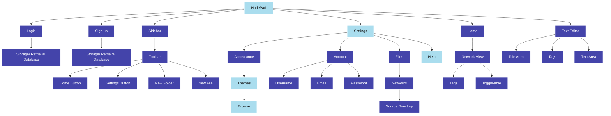
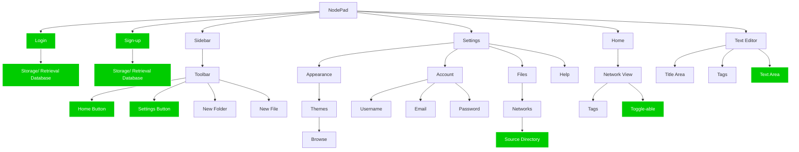

# 2.2.5 - Evaluation

> _To what extent was this iteration a success?_

An objective approach to evaluating the success of this iteration is to compare what I aimed to achieve with what was actually achieved in reality:

### The goal:

Which we previously saw simplified to:

### The result:

And now, I can demonstrate whether these have been a success, using the key:

- **green** - I achieved everything I set out to do
- **yellow** - I partially achieved what I wanted to
- **red** - I did not achieve what I set out to

See next: [Iteration 3: Aims](../2.3-Iteration3/2.3.1-aims.md)
