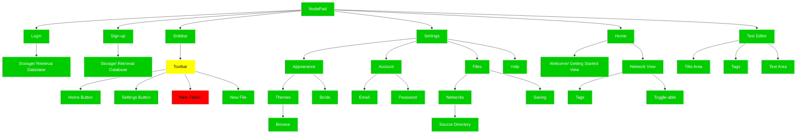

# 2.2.5 - Evaluation

> _To what extent was this iteration a success?_

An objective approach to evaluating the success of this iteration is to compare what I aimed to achieve with what was actually achieved in reality:

### The goal:

Which we previously saw simplified to:

### The result:

And now, I can demonstrate whether these have been a success, using the key:

- **green** - I achieved everything I set out to do
- **yellow** - I partially achieved what I wanted to
- **red** - I did not achieve what I set out to

Bringing this into perspective with the other two iterations, I've completed by far the majority of the aims I set out to achieve, including some extra features that I hadn't initially planned on building, but were implement upon suggestion from my clients.

See next:

- [3 - Design](../../3%20-%20Design/) - where the front-end and back-end are designed.
- [4 - Evaluation](../../4%20-%20Evaluation/) - where the front-end and back-end are designed.
