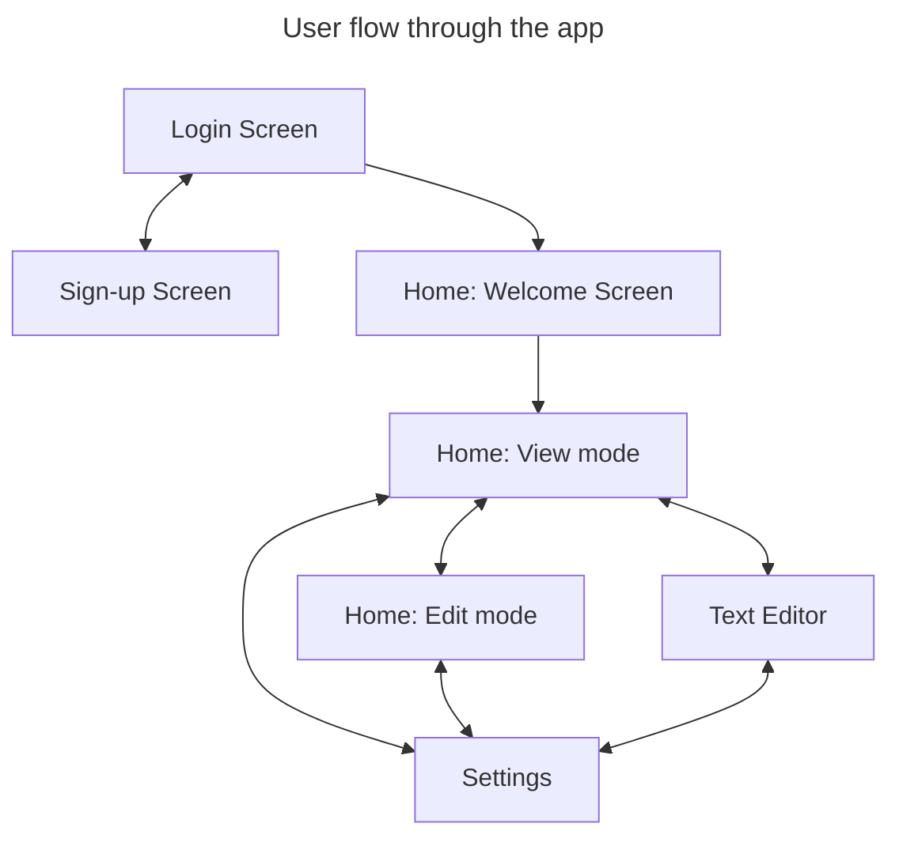

# 3.1.4 - User Flow

> _Shows the flow of different routes the user can take through the app_

```mermaid

---
title: User flow through the app
---

flowchart TD

	L[Login Screen] <--> S[Sign-up Screen]
  L --> HW[Home: Welcome Screen]
  HW --> HV[Home: View mode]
  HV <--> HE[Home: Edit mode]
  HV <--> TE[Text Editor]
  HV <--> SE[Settings]
  HE <--> SE
  TE <--> SE
```

See next [Design Part II](../3.2%20-%20Design%20Part%20II/3.2.1-algorithms.md)
