# 3.2.1 - Algorithms

> Using flowcharts and pseudocode to model all major algorithms used in the project

This section is dedicated to the algorithms written to ensure the app works to meet the [success criteria](../../1%20-%20Analysis/1.7-success_criteria.md). Each algorithm contains:

- **Justification** - where and why the algorithm fits into the solution, including a description of it
- **Flowchart** - a visual representation of the logical flow of data through the algorithm
- **Pseudocode** - a generic block of code written in no particular language to demonstrate, at a level closer to actual code, what the algorithm does
- **Variables** - identifying each variable used in the algorithm, and justifying its use

# Hierarchy of algorithms

> A top-down diagram of all major algorithms used in the project

All the algorithms are shown in the hierarchy below, displaying how they relate to the top down design of the app:

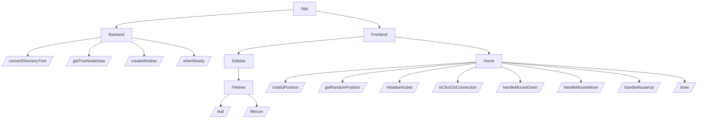

# Backend

## `convertDirectoryTree()`

_This algorithm is used to **recursively** turn the data collected from the users filesystem into data that can be displayed in the sidebar using Mantine's `Tree` module. It does this by converting each item in a JSON file into `TreeNodeData`, which can then be passed to the frontend for Mantine's `Tree` module to turn into a tree hierarchy._

### Flowchart

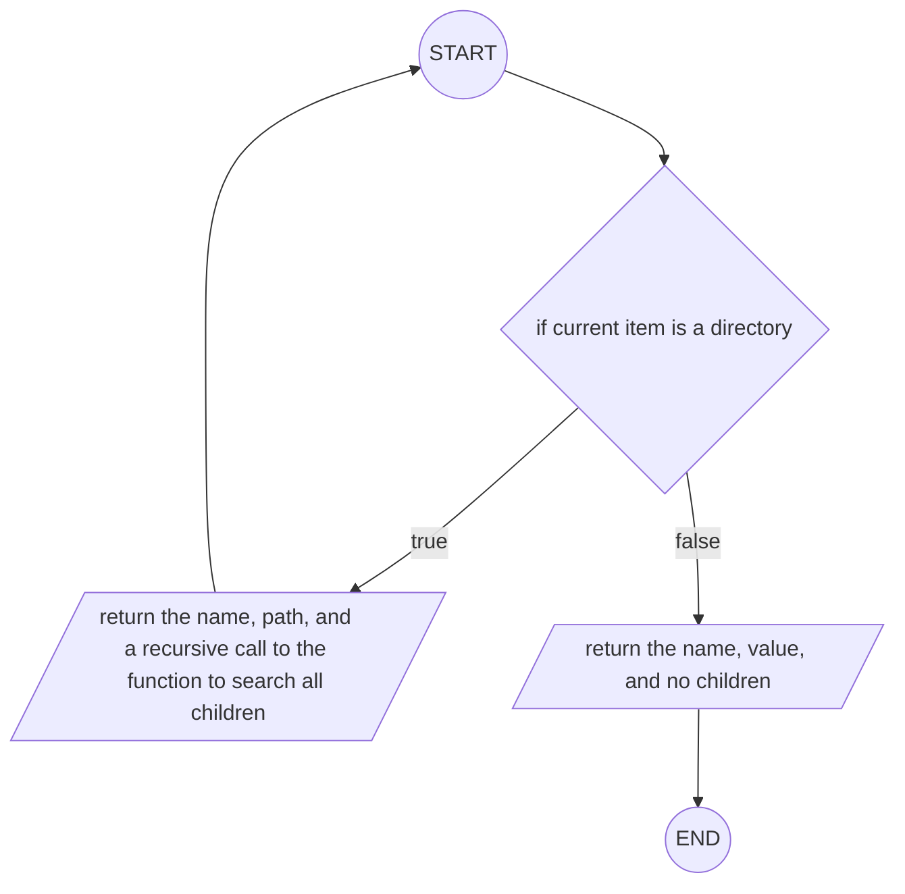

### Pseudocode

```vb

FUNCTION convertDirectoryTree(name, path, children):
  IF children:
    RETURN (
      label: name,
      value: path,
      children: convertDirectoryTree(name, path, children)
    )
  END IF
  RETURN (
    label: name,
    value: path,
    children: undefined
  )
END FUNCTION
```

### Variables

| Identifier | Type                                        | Component   | Purpose/ Justification                                                                                                                                                                                                                                                                                                                                                                                                                                                                         |
| ---------- | ------------------------------------------- | ----------- | ---------------------------------------------------------------------------------------------------------------------------------------------------------------------------------------------------------------------------------------------------------------------------------------------------------------------------------------------------------------------------------------------------------------------------------------------------------------------------------------------- |
| `name`     | `string`                                    | _parameter_ | the name given to each file/ directory - this is then reassigned to the `label` attribute of the `TreeNodeData` type.                                                                                                                                                                                                                                                                                                                                                                          |
| `path`     | `string`                                    | _parameter_ | the file path to the given file - this is then reassigned to the `value` attribute of the `TreeNodeData` type.                                                                                                                                                                                                                                                                                                                                                                                 |
| `children` | `Array<DirectoryTree<Record<string, any>>>` | _parameter_ | a `Record` (set of key-value pairs) of all children the item has - this is then reassigned to the `children` attribute (same name as in the `DirectoryTree` type) of the `TreeNodeData` type. This is called recursively on each of the children in order to reach all files in the selected source directory. This is only applicable to directories, and so if the item is a file, `convertDirectoryTree()` does not have to be called again, instead listing the `children` as `undefined`. |
| n/a        | `TreeNodeData`                              | _return_    | the function returns the passed in file tree in the `DirectoryTree` format in the `TreeNodeData` type, as required for the function to work as intended.                                                                                                                                                                                                                                                                                                                                       |

## `getTreeNodeData()`

_This function is used to retrieve the file structure of the source directory and return it in the `TreeNodeData[]` array format._

### Flowchart

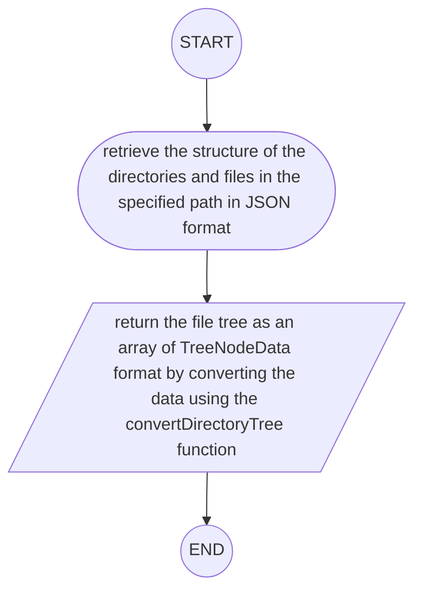

### Pseudocode

```vb
IMPORT directoryTree FROM "directory-tree"
FUNCTION getTreeNodeData(path):
  tree = directoryTree(path, { extensions: /\.md$/ })

  RETURN [convertDirectoryTree(tree)]
END FUNCTION
```

### Variables

| Identifier | Type                                 | Component        | Purpose/ Justification                                                                                                                                                                               |
| ---------- | ------------------------------------ | ---------------- | ---------------------------------------------------------------------------------------------------------------------------------------------------------------------------------------------------- |
| `path`     | `string`                             | _parameter_      | the path of the source directory - this is required in order for the program to know where to retrieve the file tree from.                                                                           |
| `tree`     | `DirectoryTree<Record<string, any>>` | _local variable_ | a `Record` of all the relevant directories and files, stored within the `DirectoryTree` structure is used to store the contents retrieved using the `directoryTree()` function.                      |
| n/a        | `Array<TreeNodeData>`                | _return_         | returns an array of `TreeNodeData` to be passed to the frontend for use in the file tree in the Sidebar, where each item in the array is a separate file/ directory to be rendered in the file tree. |

## `createWindow()`

_Arguably the most important algorithm of all, `createWindow()` creates an entry point and basic structure for the app to sit on, providing information on what to render, how to render it, where to look for source files etc., and then triggering the app to start rendering._

### Flowchart


### Pseudocode

```vb
FUNCTION createWindow():
  mainWindow = new BrowserWindow({
    width: 1000,
    height: 700,
    show: false,
    autoHideMenuBar: true,
    icon = process.platform == "linux" ? icon : NULL,
    webPreferences: {
      preload: join(__dirname, "./preload/index.js"),
      sandbox: false,
    },
  })

  IF mainWindowIsReadyToShow:
    mainWindow.show()
  END IF

  ' load the remote URL for development or the local html file for production
  IF is.dev AND process.env["ELECTRON_RENDERER_URL"]:
    mainWindow.loadURL(process.env["ELECTRON_RENDERER_URL"])
  ELSE:
    mainWindow.loadFile(join(directoryName, "../renderer/index.html"))
  END IF
END FUNCTION
```

### Variables

| Identifier                             | Type                      | Component  | Purpose/ Justification                                                                                                                                                                                      |
| -------------------------------------- | ------------------------- | ---------- | ----------------------------------------------------------------------------------------------------------------------------------------------------------------------------------------------------------- |
| `mainWindow`                           | `Electron.BrowserWindow`  | _variable_ | utilising Electron's `BrowserWindow` type and method to instantiate a main browser window. All the content of the app will sit within this window, so it is paramount the a browser window is instantiated. |
| `width`                                | `number`                  | _property_ | specifies the width of the browser window, in pixels.                                                                                                                                                       |
| `height`                               | `number`                  | _property_ | specifies the height if the browser window, in pixels.                                                                                                                                                      |
| `show`                                 | `boolean`                 | _property_ | determines whether the window should be shown when created.                                                                                                                                                 |
| `autoHideMenuBar`                      | `boolean`                 | _property_ | auto-hides the menu bar unless the alt key is pressed/ held.                                                                                                                                                |
| `icon`                                 | `string`                  | _property_ | dependant on if the user's OS is linux, an icon is supplied as its filename of type `string`.                                                                                                               |
| `webPreferences`                       | `Electron.webPreferences` | _property_ | a set of specifications for features of the web page.                                                                                                                                                       |
| `webPreferences.preload`               | `string`                  | _property_ | specifies a script that will be loaded before other scripts run in the page. The value given is the **absolute** file path to the script.                                                                   |
| `webPreferences.sandbox`               | `boolean`                 | _property_ | this sandbox's the renderer for with the window, in doing so making it compatible with the Chromium OS-level sandbox and disabling the Node.js engine.                                                      |
| `mainWindowIsReadyToShow`              | `boolean`                 | _variable_ | a value used to check whether all necessary action has been taken to prepare the window for being shown, determining whether or not to show the window to the user yet.                                     |
| `is.dev`                               | `boolean`                 | _variable_ | determines whether the app is being run in dev mode - forms part of the logic determining whether to run for production or development.                                                                     |
| `process.env["ELECTRON_RENDERER_URL"]` | `boolean`                 | _variable_ | determines if the app is being run using electron's remote renderer URL - forms part of the logic determining whether to run for production or development.                                                 |
| n/a                                    | `void`                    | _return_   | nothing needs to be return ed by the function.                                                                                                                                                              |

## `whenReady`

_This algorithm determines all the behaviours of the app once it's ready to launch. This includes listening for mouse/ keyboard events and checking for function calls from the frontend._

### Flowchart

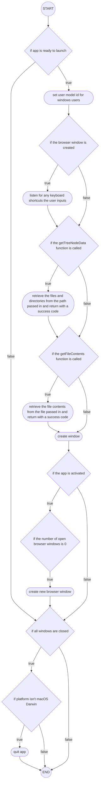

### Pseudocode

```vb
IF appIsReady():
  ' set app user model id for windows
  electronApp.setAppUserModelId("com.electron")

  ' default open or close DevTools with F12
  IF appBrowserWindowCreated:
    optimizer.watchWindowShortcuts(window)
  END IF

  ' when the frontend requests the file tree...
  IF getTreeNodeDataIsCalled(path):
    ' all files/ directories found and returned to frontend
    data = getTreeNodeData(path)
    event.send("get-tree-node-data-success", data)
  END IF

  ' when ipc receives request for file contents...
  IF getFileContentsIsCalled():
    ' file contents are read in and returned
    fileContents = getFileContents(path)
    event.send("get-file-contents-success", fileContents)
  END IF

  createWindow()

  IF appIsActivated():
    ' common on macOS to re-create a window when the
    ' dock icon clicked & no other windows open
    IF numberOfBrowserWindows == 0:
      createWindow()
    END IF
  END IF
END IF

' quit when all windows are closed unless OS=macOS
IF allWindowsAreClosed():
  IF process.platform != "darwin":
    app.quit()
  END IF
END IF
```

### Variables

| Identifier                | Type                     | Component  | Purpose/ Justification                                                                                                                                                                        |
| ------------------------- | ------------------------ | ---------- | --------------------------------------------------------------------------------------------------------------------------------------------------------------------------------------------- |
| `appBrowserWindowCreated` | `boolean`                | _variable_ | a variable used to check whether a window has [successfully] been created - this is used to determine whether ir not to watch for any keyboard shortcuts e.g. `ctrl` + `space` are pressed    |
| `window`                  | `Electron.BrowserWindow` | _variable_ | an object used to represent the window that opens when the app is started                                                                                                                     |
| `path`                    | `string`                 | _variable_ | a string such as `~/foo/bar` used to either return all subdirectories and files from within the specified location, or return the contents a the file found at that path in the user's system |
| `data`                    | `Array<TreeNodeData>`    | _variable_ | an intermediary variable used to clearly demonstrate what is being passed back to the frontend (the tree node data)                                                                           |
| `fileContents`            | `string`                 | _variable_ | similarly to `data`, an intermediary variable used to clearly demonstrate the thing being passed to the frontend (the contents of a specific file)                                            |
| `numberOfBrowserWindows`  | `number`                 | _variable_ | variable used as a count of the number of open windows - this is used for macOS, where all windows being closed doesn't automatically mean the app is closed                                  |
| `process.platform`        | `string`                 | _variable_ | a variable that yields what OS/ flavour the user is running on, used for when different behaviour is needed dependent on the specific platform                                                |

_^note this doesn't have a return type, as this isn't actually a function._

## Testing

| Description                                                     | Input(s)         | Expected Outputs(s)                                                            | Purpose/ Justification                                                     |
| --------------------------------------------------------------- | ---------------- | ------------------------------------------------------------------------------ | -------------------------------------------------------------------------- |
| Test that starting up the app brings the user to the login page | Start up the app | User is presented by a fully complete login page                               | Ensure that the app opens correctly to allow the user to log in to/ use it |
| Test that the app fills the entire screen when opened           | Start up the app | App window should fit the size of the screen the user is using to view the app | Immerses the user within the app as soon as the app is launched            |

# Frontend

## Login

### `checkCredentials()`

_This algorithm allows the program to compare user's entered credentials to the details in the database, allowing the user either to be granted or denied access_

#### Flowchart

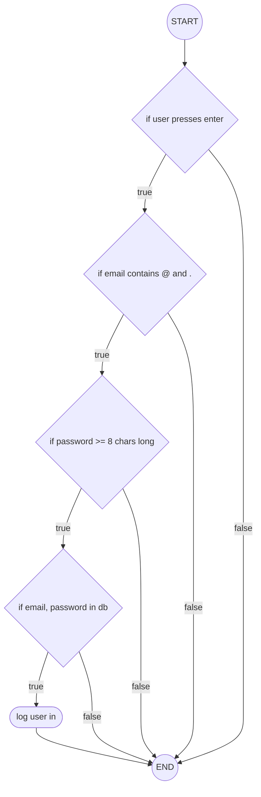

### Testing

| Description                                         | Input(s)                                                                                                                              | Expected Outputs(s)                                                                                                                                                               | Purpose/ Justification                                                                                                                                       |
| --------------------------------------------------- | ------------------------------------------------------------------------------------------------------------------------------------- | --------------------------------------------------------------------------------------------------------------------------------------------------------------------------------- | ------------------------------------------------------------------------------------------------------------------------------------------------------------ |
| Test that the user can enter text into login fields | Enter text into the email and password fields                                                                                         | Text is then displayed in the appropriate fields                                                                                                                                  | Allows the user to enter their details                                                                                                                       |
| Test that the user can submit details               | Press enter or click the submit button                                                                                                | The app responds by logging the user in, or displaying an error message if credentials are incorrect                                                                              | Allows the user to then log in with their details                                                                                                            |
| Test that the frontend validation works             | An email not containing and `@` or a `.`, first without and then with a password < 8 characters long and then one ≥ 8 characters long | Only when the credentials are entered in the format specified in the Description should the user be navigated to the Home screen, otherwise an appropriate error should be thrown | Allows some validation to occur on the frontend, before having to query the backend, making computation time potentially quicker and less resource intensive |
| Test that the sign up link works                    | Click on the 'sign up' link at the bottom of the page                                                                                 | User is redirected to the signup page                                                                                                                                             | Allows the user to sign up if they don't have an account                                                                                                     |

### Validation

In order to keep the need for validation minimal, I made sure to use buttons and interactive UI elements as much as possible to ensure the least chance of input errors, attempts to infiltrate the program etc. However, I had to implement some text input for the email and password fields. These are then sanitised on the frontend to make sure the user is entering data that resembles a real email and a password that is fairly secure. When the details are passed from the frontend to the backend, Electron will internally sanitise to check that no malicious injections etc have been entered, meaning I don't need to do so manually.

#### Pseudocode

```vb
IF (userPressesEnter):
  IF (email.contains("@") AND email.contains(".")):
    IF (password.length >= 8):
      IF (emailIsInDatabase):
        navigate(homeScreen)
      END IF
    END IF
  END IF
END IF
```

#### Variables

| Identifier          | Type      | Component  | Purpose/ Justification                                                                                  |
| ------------------- | --------- | ---------- | ------------------------------------------------------------------------------------------------------- |
| `userPressesEnter`  | `boolean` | _variable_ | determines whether or not the user is entering credentials                                              |
| `email`             | `string`  | _variable_ | holds the value passed in to the email field by the user - must contain '@' and '.'                     |
| `password`          | `string`  | _variable_ | holds the value passed in to the password field by the user                                             |
| `emailIsInDatabase` | `boolean` | _variable_ | the value of whether or not querying the database for the email entered by the user returns true or not |
| `homeScreen`        | `object`  | _variable_ | an object representing the home screen, to be navigated to                                              |

## `signUp()`

### Flowchart

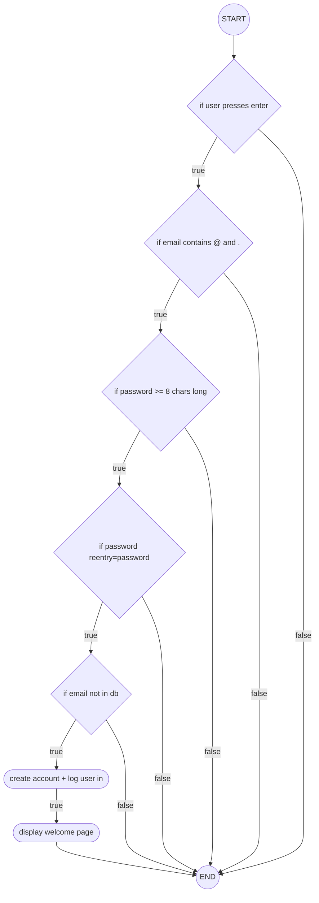

#### Pseudocode

```vb
IF (userPressesEnter):
  IF (email.contains("@") AND email.contains(".")):
    IF (password.length >= 8 AND passwordReEntry == password):
      IF (!emailIsInDatabase):
        createAccount(email, password)
        navigate(homeScreen)
        displayWelcomePage()
      END IF
    END IF
  END IF
END IF
```

#### Variables

| Identifier          | Type      | Component  | Purpose/ Justification                                                                                  |
| ------------------- | --------- | ---------- | ------------------------------------------------------------------------------------------------------- |
| `userPressesEnter`  | `boolean` | _variable_ | determines whether or not the user is entering credentials                                              |
| `email`             | `string`  | _variable_ | holds the value passed in to the email field by the user - must contain '@' and '.'                     |
| `password`          | `string`  | _variable_ | holds the value passed in to the password field by the user                                             |
| `passwordReEntry`   | `string`  | _variable_ | holds the value passed in to the re-enter password field by the user - must match the password field    |
| `emailIsInDatabase` | `boolean` | _variable_ | the value of whether or not querying the database for the email entered by the user returns true or not |
| `homeScreen`        | `object`  | _variable_ | an object representing the home screen, to be navigated to                                              |

### Testing

| Description                                           | Input(s)                                                                                                                                                                         | Expected Outputs(s)                                                                                                                                                               | Purpose/ Justification                                                                                                                                       |
| ----------------------------------------------------- | -------------------------------------------------------------------------------------------------------------------------------------------------------------------------------- | --------------------------------------------------------------------------------------------------------------------------------------------------------------------------------- | ------------------------------------------------------------------------------------------------------------------------------------------------------------ |
| Test that the user can enter text into sign up fields | Enter text into the email, password, and re-enter password fields                                                                                                                | Text is then displayed in the appropriate fields                                                                                                                                  | Allows the user to enter their details                                                                                                                       |
| Test that the user can submit details                 | Press enter or click the submit button                                                                                                                                           | The app responds by logging the user in **and displaying the welcome screen**, or displaying an error message if credentials are incorrect                                        | Allows the user to then sign up and log in with their details                                                                                                |
| Test that the frontend validation works               | An email not containing and `@` or a `.`, first without, then with a password < 8 characters long and then one ≥ 8 characters long, and then with a matching re-entered password | Only when the credentials are entered in the format specified in the Description should the user be navigated to the Home screen, otherwise an appropriate error should be thrown | Allows some validation to occur on the frontend, before having to query the backend, making computation time potentially quicker and less resource intensive |
| Test that the back arrow works                        | Click on the back arrow in the top left of the page                                                                                                                              | User is redirected back to the login page                                                                                                                                         | Allows the user to freely navigate between the two pages, in case they change their mind or want to explore                                                  |

### Validation

Similarly to the login, in order to keep the need for validation minimal, I made sure to use buttons and interactive UI elements as much as possible, but I had to implement some text input for the email, password, and re-enter password fields. These are then sanitised on the frontend to make sure the user is entering data that resembles a real email and a password that is fairly secure. When the details are passed from the frontend to the backend, Electron will internally sanitise to check that no malicious injections etc have been entered, meaning I don't need to do so manually.

## Sidebar

### `leaf()`

_This algorithm is used to initialise each item (file/ directory) in the source directory in its correct state (i.e. a directory could be open or closed), and determine the functionality that occurs if an item is clicked, giving the sidebar a file tree to display._

#### Flowchart

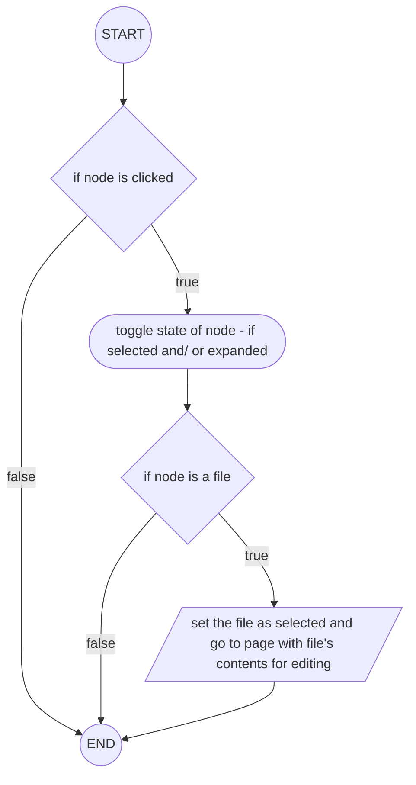

#### Pseudocode

```vb
' ... is used to represent HTML code that cannot be displayed as pseudocode (not relevant to the algorithm)
FUNCTION Leaf(node, expanded, hasChildren, tree):
  RETURN (
    <Group ' return group of 'leaves'
    ...
      IF node.isClicked():
        tree.toggleSelected(node.name);
        tree.toggleExpanded(node.value);
        IF !node.hasChildren:
          setSelectedFile(node);
          goTo(editFileContentsPage)
        END IF
      END IF
    >
      ...
    </Group>
  )
END FUNCTION

```

#### Variables

| Identifier             | Type                          | Component   | Purpose/ Justification                                                                                                                                |
| ---------------------- | ----------------------------- | ----------- | ----------------------------------------------------------------------------------------------------------------------------------------------------- |
| `node`                 | `TreeNodeData`                | _parameter_ | object representing a component of the file tree - this could be a directory or a file                                                                |
| `expanded`             | `boolean`                     | _parameter_ | variable that, if true, means the node selected is currently expanded, i.e. its children are visible, and if false, means the node is not expanded    |
| `hasChildren`          | `boolean`                     | _parameter_ | determines whether the node in focus has children - this essentially decides whether it is a directory (has children) or a file (can't have children) |
| `node.value`           | `string`                      | _variable_  | a string depicting the file path to that node within the user's file system                                                                           |
| `node.hasChildren`     | `boolean`                     | _variable_  | determines whether the selected node contains directories or files                                                                                    |
| `editFileContentsPage` | `string`                      | _variable_  | a variable representing the link to the edit contents page, where the user can then edit the contents of the file they selected                       |
| n/a                    | `ReactElement<FileIconProps>` | _return_    | returns what the user clicked on in the event of a click, useful for debugging                                                                        |

### `fileIcon()`

_This algorithm is used to determine and render which icon should be displayed next to the each file/ folder in the file tree in the sidebar._

#### Flowchart

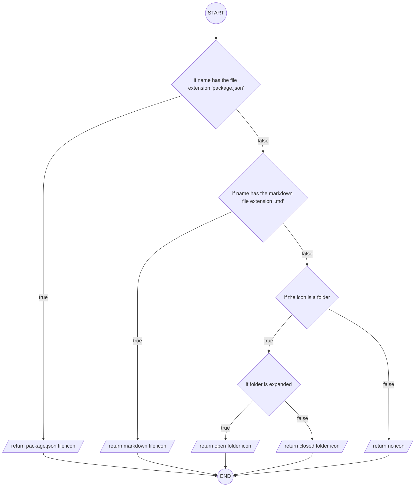

#### Pseudocode

```vb

FUNCTION FileIcon(name, isFolder, expanded):
  IF name.endsWith("package.json"):
    RETURN packageJsonIcon
  END IF

  IF name.endsWith(".md"):
    RETURN markdownIcon
  END IF

  IF isFolder:
    IF expanded:
      RETURN openFolderIcon
    END IF
    RETURN closedFolderIcon
  END IF

  RETURN undefined
END FUNCTION
```

#### Variables

| Identifier         | Type                  | Component   | Purpose/ Justification                                                                                               |
| ------------------ | --------------------- | ----------- | -------------------------------------------------------------------------------------------------------------------- |
| `name`             | `string`              | _parameter_ | the text to be rendered on top of each node, to indicate to the user what it is                                      |
| `isFolder`         | `boolean`             | _parameter_ | evaluates if the selected node is a directory, used to perform functionality specific to nodes of the directory type |
| `expanded`         | `boolean`             | _parameter_ | evaluates if the selected directory is in an expanded state                                                          |
| `packageJsonIcon`  | `string`              | _variable_  | the path to an SVG of the JSON icon, rendered next to files with the `.json` extension                               |
| `markdownIcon`     | `string`              | _variable_  | the path to an SVG of the markdown icon, rendered next to files with the `.md` extension                             |
| `openFolderIcon`   | `string`              | _variable_  | the path to an SVG of the open folder icon, rendered next to open directories                                        |
| `closedFolderIcon` | `string`              | _variable_  | the path to an SVG of the closed folder icon, rendered next to closed directories                                    |
| n/a                | `string`/ `undefined` | _variable_  | used as a return in the case that none of the other icons fit the needs of the node - nothing is returned            |

### Testing

| Description                                                        | Input(s)                                            | Expected Outputs(s)                                                                                                    | Purpose/ Justification                                                                 |
| ------------------------------------------------------------------ | --------------------------------------------------- | ---------------------------------------------------------------------------------------------------------------------- | -------------------------------------------------------------------------------------- |
| Test that the correct files are displayed                          | Select a root directory                             | The files and folders within the directory are all displayed                                                           | Allows user to write in any file within the directory by selecting it in the sidebar   |
| Test that the files are rendered correctly with correct file icons | Select a root directory                             | Check that all file icons are displayed to the left of each 'leaf' and correspond to the file type of the file/ folder | Makes distinguishing between different files/ folders much easier for the user         |
| Test that the home button works                                    | Click the home button                               | User is navigated back the the home page                                                                               | Allows the user to get back to one central home area from wherever they are in the app |
| Test that the new file button works                                | Click the new file button or press `cmd`/`ctrl`+`n` | User is navigated to the text editor where they can edit the new file created                                          | Allows user to create new files from within the app                                    |

### Validation

I aimed to minimalise the need for validation as always, making sure to use buttons and interactive UI elements as much as possible for the reasons given previously - the Sidebar needs no validation, as the only way to interact with it is through buttons/ elements, where the user has no chance to cause errors.

## Home/ Network

### `isValidPosition()`

_This algorithm checks if a given position is valid - a node generated at that position in the canvas would be at least the specified minimum distance from any other pre-existing node in the `nodes` array - using Pythagoras'._

#### Flowchart

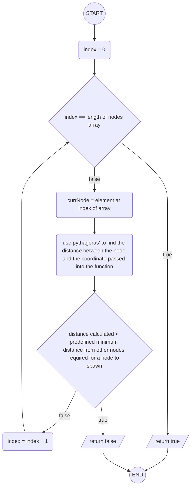

#### Pseudocode

```vb

FUNCTION isValidPosition(x, y, nodes):
  minDistance = 2 * radiusOfNode
  FOR EACH node IN nodes:
    distance = squareRoot((node.x-x)**2 + (node.y-y)**2)
    IF distance < minDistance:
      RETURN false
    END IF
  END FOR EACH
  RETURN true
END FUNCTION

```

#### Variables

| Identifier     | Type          | Component   | Purpose/ Justification                                                                                                                                                     |
| -------------- | ------------- | ----------- | -------------------------------------------------------------------------------------------------------------------------------------------------------------------------- |
| `x`            | `number`      | _parameter_ | a variable holding the x-position of the node being checked in the canvas, needed in tandem with the y-position to perform a calculation to check if the position is valid |
| `y`            | `number`      | _parameter_ | a variable holding the y-position of the node being checked in the canvas, needed in tandem with the x-position to perform a calculation to check if the position is valid |
| `nodes`        | `Array<Node>` | _parameter_ | an array used to compare the position of every other node in the network to the position of the node being passed in                                                       |
| `minDistance`  | `number`      | _variable_  | the pre-specified minimum distance each node can be from any other                                                                                                         |
| `radiusOfNode` | `number`      | _variable_  | the pre-specified radius of each node                                                                                                                                      |
| `node`         | `Node`        | _variable_  | an object storing all the information on a node - in this case, each node in the network as they're iterated through in turn                                               |
| `node.x`       | `number`      | _variable_  | the x-position of each node in the canvas                                                                                                                                  |
| `node.y`       | `number`      | _variable_  | the y-position of each node in the canvas                                                                                                                                  |
| `distance`     | `number`      | _variable_  | the calculated distance between two nodes, taking into account the size of the radius of each node                                                                         |
| _n/a_          | `boolean`     | _return_    | returns `true` if the node does not come closer than the minimum distance to any other node, otherwise returning false                                                     |

### `getRandomPosition()`

_This algorithm generates a random position for a new node in the network. It utilises the `isValidPosition()` algorithm to check if the position is valid, looping through until a valid position is generated, or a maximum number of attempts is reached._

#### Flowchart


#### Pseudocode

```vb

FUNCTION getRandomPosition(existingNodes, attempts):
  IF !canvasExists:
    RETURN (0, 0)
  END IF
  FOR i = 0 TO attempts:
    x = random(canvasHeight);
    y = random(canvasWidth);
    IF isValidPosition(x, y, existingNodes):
      RETURN (x, y)
    END IF
  END FOR
  RETURN (x: random(canvasHeight), y: random(canvasWidth))
END FUNCTION

```

#### Variables

| Identifier      | Type          | Component   | Purpose/ Justification                                                                                                                            |
| --------------- | ------------- | ----------- | ------------------------------------------------------------------------------------------------------------------------------------------------- |
| `existingNodes` | `Array<Node>` | _parameter_ | an array of all the nodes that exist in the network, used to check whether a position is occupied                                                 |
| `attempts`      | `number`      | _parameter_ | number of times the position is recalculated (in case another node occupies that position) before stopping in order to prevent indefinite looping |
| `canvasExists`  | `boolean`     | _variable_  | tells us whether the canvas exists, used to determine whether or not any calculations need to be made                                             |
| `i`             | `number`      | _variable_  | iterable variable used to iterate through the generation loop up to `attempts` times                                                              |
| `x`             | `number`      | _variable_  | the random x position the node                                                                                                                    |
| `y`             | `number`      | _variable_  | the random y position the node                                                                                                                    |
| `canvasHeight`  | `number`      | _variable_  | the height of the canvas element                                                                                                                  |
| `canvasWidth`   | `number`      | _variable_  | the width of the canvas element                                                                                                                   |
| _n/a_           | `Position`    | _return_    | the type the coordinate of the node takes, which is the return type                                                                               |

### `initialiseNodes()`

_This algorithm iterates through all files and directories passed in, converting all markdown files into nodes and pushing them to an array. This supplies the app with the necessary data to render specific nodes in the canvas._

#### Flowchart

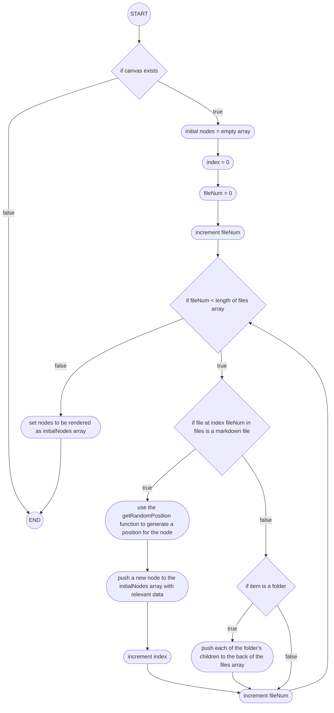

#### Pseudocode

```vb
FUNCTION initialiseNodes():
  IF !canvasExists RETURN
  initialNodes = []
  index = 0
  FOR EACH item IN files:
    IF item.endsWith(".md"):
      file = item
      position = getRandomPosition(initialNodes)
      initialNodes.push(
        id: index,
        x: position.x,
        y: position.y,
        title: file.filename,
        filePath: file.filepath,
        connections: []
      )
      index++;
    ELSE
      IF item.hasChildren
        FOR EACH child IN item.children
          files.push(child)
        END FOR EACH
      END IF
    END IF
  END FOR EACH
  setNodes(initialNodes)
END FUNCTION
```

#### Variables

| Identifier         | Type                  | Component  | Purpose/ Justification                                                                                                                                                                |
| ------------------ | --------------------- | ---------- | ------------------------------------------------------------------------------------------------------------------------------------------------------------------------------------- |
| `canvasExists`     | `boolean`             | _variable_ | tells us whether the canvas exists, used to determine whether or not any calculations need to be made                                                                                 |
| `initialNodes`     | `Array<Node>`         | _variable_ | an array of all nodes starting in the network, which are iterated through to generate positions and create node objects                                                               |
| `index`            | `number`              | _variable_ | a variable incremented through each loop which guarantees a unique identifier for each node                                                                                           |
| `item`             | `Array<TreeNodeData>` | _variable_ | used to identify each piece of data in the root directory - could be a file or a folder                                                                                               |
| `file`             | `Array<TreeNodeData>` | _variable_ | used to demonstrate that the item being processed is a file                                                                                                                           |
| `position`         | `Position`            | _variable_ | the randomly generated position of each node                                                                                                                                          |
| `id`               | `number`              | _variable_ | the unique numerical identifier for each node                                                                                                                                         |
| `x`                | `number`              | _variable_ | the x position the node                                                                                                                                                               |
| `y`                | `number`              | _variable_ | the y position the node                                                                                                                                                               |
| `title`            | `string`              | _variable_ | the name displayed below the node                                                                                                                                                     |
| `filePath`         | `string`              | _variable_ | the path to the note in the filesystem                                                                                                                                                |
| `connections`      | `Array<Connection>`   | _variable_ | an array of all connections between nodes, which can then be drawn                                                                                                                    |
| `child`            | `TreeNodeData`        | _variable_ | since the `item` could be a folder, it could have 'children', which could also be files or folders. Nodes represent files, so the program finds any files nested within these folders |
| `item.hasChildren` | `boolean`             | _variable_ | determines whether or not the item has children _i.e. is or isn't a folder_                                                                                                           |

### `draw()`

_This algorithm covers the entire drawing process for each frame the app is running. Due to how many decisions are in the algorithm, I've broken it down further, and then compiled it all at the end to show how all parts relate to one another._

#### Draw background

_This algorithm clears and draws the minimum sized canvas that can fit all nodes with in._

##### Flowchart


##### Pseudocode

```vb
context = getCurrentContext()
IF context == NULL:
  RETURN
END IF

usedArea = {
  minX: leftmostNode - padding
  maxX: rightmostNode + padding
  minY: lowermostNode - padding
  maxY: uppermostNode + padding
}

context.clearRectangle(usedArea)
```

##### Variables

| Identifier      | Type                                                       | Component  | Purpose/ Justification                                            |
| --------------- | ---------------------------------------------------------- | ---------- | ----------------------------------------------------------------- |
| `context`       | `CanvasRenderingContext2D \| null`                         | _variable_ | the context obtained for the canvas                               |
| `usedArea`      | `{minX: number, maxX: number, minY: number, maxY: number}` | _variable_ | the smallest used area that fits all nodes within it              |
| `minX`          | `number`                                                   | _variable_ | the position of the left side of the canvas                       |
| `maxX`          | `number`                                                   | _variable_ | the position of the right side of the canvas                      |
| `minY`          | `number`                                                   | _variable_ | the position of the top side of the canvas                        |
| `maxY`          | `number`                                                   | _variable_ | the position of the bottom side of the canvas                     |
| `leftmostNode`  | `Position`                                                 | _variable_ | the node that is positioned furthest left in the network          |
| `rightmostNode` | `Position`                                                 | _variable_ | the node that is positioned furthest right in the network         |
| `lowermostNode` | `Position`                                                 | _variable_ | the node that is positioned furthest up in the network            |
| `uppermostNode` | `Position`                                                 | _variable_ | the node that is positioned furthest down in the network          |
| `padding`       | `number`                                                   | _variable_ | the spacing away from the outermost nodes that the canvas extends |

#### Draw connections

_This algorithm cycles through all connections, works out if each node in the network is part of that connection and draws the connection between the relevant nodes. This is done to display the connections between all nodes in the network every frame of the app's cycle._

##### Flowchart

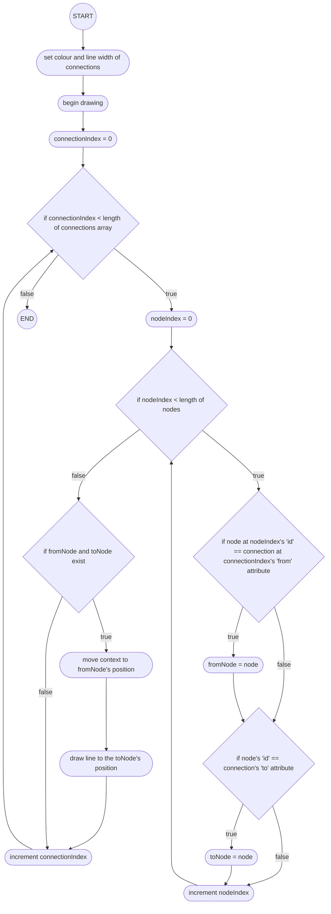

##### Pseudocode

```vb
context.colour = CONNECTION_COLOUR
context.lineWidth = 2;

FOR EACH connection IN connections:
  FOR EACH node IN nodes:
    IF node.id == connection.from:
      fromNode = node
    END IF
    IF node.id == connection.to:
      toNode = node
    END IF
  END FOR EACH
  IF fromNode != NULL AND toNode != NULL:
    context.moveTo(fromNode.x, fromNode.y)
    context.drawLineTo(toNode.x, toNode.y)
  END IF
END FOR EACH
```

##### Variables

| Identifier          | Type                | Component  | Purpose/ Justification                                                                                    |
| ------------------- | ------------------- | ---------- | --------------------------------------------------------------------------------------------------------- |
| `context.colour`    | `string`            | _variable_ | the colour the context should be when drawing                                                             |
| `CONNECTION_COLOUR` | `string`            | _variable_ | the colour of each connection                                                                             |
| `context.lineWidth` | `number`            | _variable_ | the width of the drawing                                                                                  |
| `connection`        | `Connection`        | _variable_ | the iterable used to loop through each connection                                                         |
| `connections`       | `Array<Connection>` | _variable_ | an array of all connections to be drawn, which will be iterated through                                   |
| `node`              | `Node`              | _variable_ | an object describing each node in the network, used to find where the connection should be drawn from/ to |
| `nodes`             | `Array<Node>`       | _variable_ | all nodes in the network                                                                                  |
| `node.id`           | `number`            | _variable_ | the unique identifier for each node in the network                                                        |
| `connection.from`   | `Position`          | _variable_ | the position the connection should be drawn from                                                          |
| `fromNode`          | `Position`          | _variable_ | the node the connection stems from                                                                        |
| `connection.to`     | `Position`          | _variable_ | the position the connection should be drawn to                                                            |
| `toNode`            | `Position`          | _variable_ | the node the connection is drawn to                                                                       |
| `fromNode.x`        | `number`            | _variable_ | the x position the connection should be drawn from                                                        |
| `fromNode.y`        | `number`            | _variable_ | the y position the connection should be drawn from                                                        |
| `toNode.x`          | `number`            | _variable_ | the x position the connection should be drawn to                                                          |
| `toNode.y`          | `number`            | _variable_ | the y position the connection should be drawn to                                                          |

#### Dragging connections

_This algorithm is used to ensure that, if a user is dragging a connection, a dashed line is drawn during the dragging process, and once the user lets go, the connection is drawn in solid if a link between the two nodes is established i.e. the user lets go above a second node. Otherwise no connection is drawn. This will be used in the Edit Mode in the Home Screen, allowing the user to graphically connect and disconnect nodes from one another._

##### Flowchart

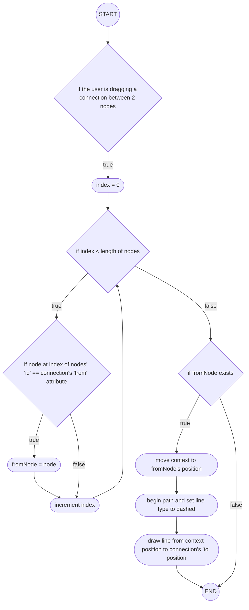

##### Pseudocode

```vb
IF draggingConnection == TRUE:
  FOR EACH node IN nodes:
    IF node.id == connection.from:
      fromNode = node
    END IF
  END FOR EACH
  IF fromNode != NULL:
    context.moveTo(fromNode.x, fromNode.y);
    context.drawLineTo(draggingConnection.toPos.x, draggingConnection.toPos.y);
  END IF
END IF
```

##### Variables

| Identifier                   | Type                                          | Component  | Purpose/ Justification                                                    |
| ---------------------------- | --------------------------------------------- | ---------- | ------------------------------------------------------------------------- |
| `draggingConnection`         | `{ fromId: number, toPos: Position } \| null` | _variable_ | determines whether a connection is currently being dragged                |
| `node.id`                    | `number`                                      | _variable_ | the unique identifier for each node in the network                        |
| `connection.from`            | `Position`                                    | _variable_ | the position the connection is being dragged from                         |
| `fromNode`                   | `Node`                                        | _variable_ | the node object that the connection is being drawn from                   |
| `fromNode.x`                 | `number`                                      | _variable_ | the x position of the node object that the connection is being drawn from |
| `fromNode.y`                 | `number`                                      | _variable_ | the y position of the node object that the connection is being drawn from |
| `draggingConnection.toPos.x` | `number`                                      | _variable_ | the x position of the node object that the connection is being drawn to   |
| `draggingConnection.toPos.x` | `number`                                      | _variable_ | the x position of the node object that the connection is being drawn to   |

#### Draw nodes

_This algorithm is used to draw and fill each node in the network with a specified colour and radius. These are the visual representations of each note made by the user._

##### Flowchart


##### Pseudocode

```vb
context.colour = NODE_COLOUR
FOR EACH node IN nodes:
  context.moveTo(node.x + radius, node.y)
  context.drawCircle(node.x, node.y, radius, 0, PI * 2)
END FOR EACH
context.fillCircle()
```

##### Variables

| Identifier       | Type          | Component  | Purpose/ Justification                                                                           |
| ---------------- | ------------- | ---------- | ------------------------------------------------------------------------------------------------ |
| `context.colour` | `string`      | _variable_ | the colour the context is when drawing the nodes                                                 |
| `NODE_COLOUR`    | `string`      | _variable_ | the colour of the nodes                                                                          |
| `node`           | `Node`        | _variable_ | an object describing each node in the network, used to determine where each node should be drawn |
| `nodes`          | `Array<Node>` | _variable_ | an array of all nodes in the network, to be iterated through                                     |
| `node.x`         | `number`      | _variable_ | the x position of the node being iterated through                                                |
| `node.y`         | `number`      | _variable_ | the y position of the node being iterated through                                                |
| `radius`         | `number`      | _variable_ | the radius of each node                                                                          |
| `PI`             | `number`      | _variable_ | a constant containing the value of pi                                                            |

#### Draw node centres

_This algorithm is used to draw a smaller circle at the centre of each node. This is used to demonstrate the area the user can drag a connection from or to. This will only show in the Edit Mode in the Home Screen._

##### Flowchart

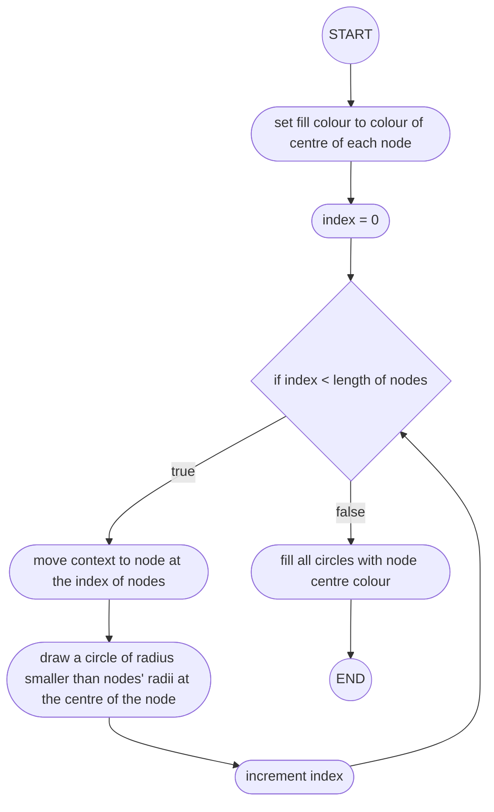

##### Pseudocode

```vb
context.colour = CENTRE_COLOUR
FOR EACH node IN nodes:
  context.moveTo(node.x + 5, node.y)
  context.drawCircle(node.x, node.y, 5, 0, PI * 2)
END FOR EACH
context.fillCircle()
```

##### Variables

| Identifier       | Type          | Component  | Purpose/ Justification                                                                             |
| ---------------- | ------------- | ---------- | -------------------------------------------------------------------------------------------------- |
| `context.colour` | `string`      | _variable_ | the colour the context should be when drawing node centres                                         |
| `NODE_COLOUR`    | `string`      | _variable_ | the colour the centre of each node should be                                                       |
| `node`           | `Node`        | _variable_ | an object describing each node in the network, used to determine where each centre should be drawn |
| `nodes`          | `Array<Node>` | _variable_ | an array of all nodes in the network, to be iterated through                                       |
| `node.x`         | `number`      | _variable_ | the x position of the node being iterated through                                                  |
| `node.y`         | `number`      | _variable_ | the y position of the node being iterated through                                                  |
| `PI`             | `number`      | _variable_ | a constant containing the value of pi                                                              |

#### Draw titles

_This algorithm iterates through each node in the network, establishes its title and draws it just below the node._

##### Flowchart

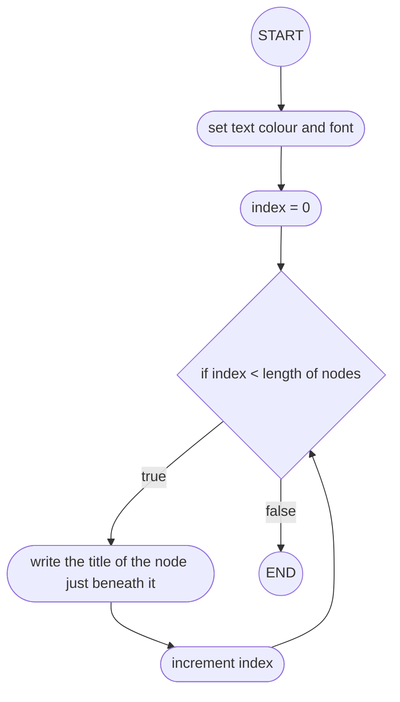

##### Pseudocode

```vb
context.colour = TEXT_COLOUR
context.font = TEXT_FONT
FOR EACH node IN nodes:
  context.fillText(node.title, node.x, node.y + 30)
END FOR EACH
```

##### Variables

| Identifier       | Type          | Component  | Purpose/ Justification                                                                             |
| ---------------- | ------------- | ---------- | -------------------------------------------------------------------------------------------------- |
| `context.colour` | `string`      | _variable_ | the colour the context should be when drawing node centres                                         |
| `TEXT_COLOUR`    | `string`      | _variable_ | the colour the text below each node should be                                                      |
| `context.font`   | `string`      | _variable_ | the font the title should be                                                                       |
| `node`           | `Node`        | _variable_ | an object describing each node in the network, used to determine where each centre should be drawn |
| `nodes`          | `Array<Node>` | _variable_ | an array of all nodes in the network, to be iterated through                                       |
| `node.title`     | `string`      | _variable_ | a string denoting the name of each node                                                            |
| `node.x`         | `number`      | _variable_ | the x position of the node being iterated through                                                  |
| `node.y`         | `number`      | _variable_ | the y position of the node being iterated through                                                  |

#### Combining all functionality - Flowchart

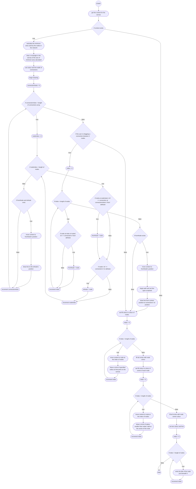

#### Combining all functionality - Pseudocode

```vb

FUNCTION draw():
  context = getCurrentContext()
  IF !context RETURN

  usedArea = {
    minX: leftmostNode - padding
    maxX: rightmostNode + padding
    minY: lowermostNode - padding
    maxY: uppermostNode + padding
  }
  context.clearRectangle(usedArea)

  context.colour = CONNECTION_COLOUR
  context.lineWidth = 2;

  FOR EACH connection IN connections:
    FOR EACH node IN nodes:
      IF node.id == connection.from:
        fromNode = node
      END IF
      IF node.id == connection.to:
        toNode = node
      END IF
    END FOR EACH
    IF fromNode != NULL AND toNode != NULL:
      context.moveTo(fromNode.x, fromNode.y)
      context.drawLineTo(toNode.x, toNode.y)
    END IF
  END FOR EACH

  IF draggingConnection == TRUE:
    FOR EACH node IN nodes:
      IF node.id == connection.from:
        fromNode = node
      END IF
    END FOR EACH
    IF fromNode != NULL:
      context.moveTo(fromNode.x, fromNode.y);
      context.drawLineTo(draggingConnection.toPos.x, draggingConnection.toPos.y);
    END IF
  END IF

  context.fillStyle = NODE_COLOUR
  FOR EACH node IN nodes:
    context.moveTo(node.x + radius, node.y)
    context.drawCircle(node.x, node.y, radius, 0, PI * 2)
  END FOR EACH
  context.fillCircle()

  context.fillStyle = CENTRE_COLOUR
  FOR EACH node IN nodes:
    context.moveTo(node.x + 5, node.y)
    context.drawCircle(node.x, node.y, 5, 0, Math.PI * 2)
  END FOR EACH
  context.fillCircle()

  context.fillStyle = TEXT_COLOUR
  context.font = TEXT_FONT
  FOR EACH node IN nodes:
    context.fillText(node.title, node.x, node.y + 30)
  END FOR EACH
END FUNCTION

```

### `isClickOnConnection()`

_This algorithm is used to validate if the user's click is within an acceptable distance of a connection to be considered clicking the connection - if the user clicks on a node within the acceptable area, the function will not consider this as a valid click. This is used in the context of the Edit Mode in Home, allowing the user to remove a connection by clicking on it._

#### Flowchart

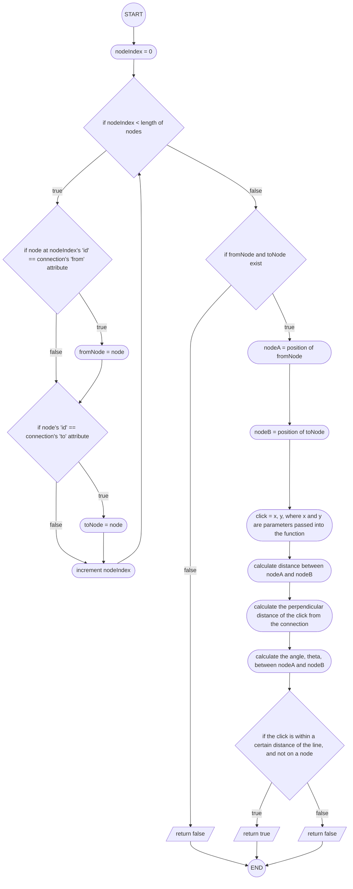

#### Pseudocode

```vb
FUNCTION isClickOnConnection(x, y, connection):
  FOR EACH node IN nodes:
    IF node.id == connection.from:
      fromNode = node
    END IF
    IF node.id == connection.to:
      toNode = node
    END IF
  END FOR EACH

  IF fromNode == NULL OR toNode == NULL
    RETURN FALSE
  END IF

  nodeA = (fromNode.x, fromNode.y)
  nodeB = (toNode.x, toNode.y)
  click = (x, y)

  lengthAB = squareRoot(power(nodeB.x - nodeA.x, 2) + power(nodeB.y - nodeA.y, 2))
  perpDistance = absoluteValue((nodeB.y - nodeA.y) * click.x - (nodeB.x - nodeA.x)
  * click.y + nodeB.x * nodeA.y - nodeB.y * nodeA.x) / lengthAB
  theta = arcTan((nodeB.y - nodeA.y) / (nodeB.x - nodeA.x))

  RETURN (
    perpDistance < 10 AND
    x >= min(nodeA.x, nodeB.x) + radius * cos(theta) AND
    x <= max(nodeA.x, nodeB.x) - radius * cos(theta) AND
    y >= min(nodeA.y, nodeB.y) - radius * sin(theta) AND
    y <= max(nodeA.y, nodeB.y) + radius * sin(theta)
  )
END FUNCTION
```

#### Variables

| Identifier        | Type                | Component   | Purpose/ Justification                                                                                      |
| ----------------- | ------------------- | ----------- | ----------------------------------------------------------------------------------------------------------- |
| `x`               | `number`            | _parameter_ | the x position of the cursor click in the canvas                                                            |
| `y`               | `number`            | _parameter_ | the y position of the cursor click in the canvas                                                            |
| `connection`      | `Connection`        | _parameter_ | an object denoting the connection between two nodes - a line between them                                   |
| `node`            | `Node`              | _variable_  | an object describing each node in the network, used to determine where each centre should be drawn          |
| `nodes`           | `Array<Nodes>`      | _variable_  | an array of all nodes in the network, to be iterated through                                                |
| `node.id`         | `number`            | _variable_  | the unique identifier for each node in the network                                                          |
| `connection.from` | `number`            | _variable_  | the position the connection originates from                                                                 |
| `fromNode`        | `Node \| undefined` | _variable_  | the node object with the position that the connection originates from                                       |
| `connection.to`   | `Position`          | _variable_  | the position the connection goes to                                                                         |
| `toNode`          | `Node \| undefined` | _variable_  | the node object with the position that the connection goes to                                               |
| `nodeA`           | `Position`          | _variable_  | a node object describing the node being drawn from, making long calculations look simpler and more readable |
| `fromNode.x`      | `number`            | _variable_  | the x position of the node being drawn from                                                                 |
| `fromNode.y`      | `number`            | _variable_  | the y position of the node being drawn from                                                                 |
| `nodeB`           | `Position`          | _variable_  | a node object describing the node being drawn to, making long calculations look simpler and more readable   |
| `toNode.x`        | `number`            | _variable_  | the x position of the node being drawn to                                                                   |
| `toNode.y`        | `number`            | _variable_  | the y position of the node being drawn to                                                                   |
| `click`           | `Position`          | _variable_  | the position the cursor is when the user clicks                                                             |
| `lengthAB`        | `number`            | _variable_  | the direct pythagorean length from A to B                                                                   |
| `perpDistance`    | `number`            | _variable_  | the perpendicular distance from the cursor click to the connection                                          |
| `nodeA.x`         | `number`            | _variable_  | the x position of the node being drawn from                                                                 |
| `nodeB.x`         | `number`            | _variable_  | the x position of the node being drawn to                                                                   |
| `nodeA.y`         | `number`            | _variable_  | the y position of the node being drawn from                                                                 |
| `nodeB.y`         | `number`            | _variable_  | the y position of the node being drawn to                                                                   |
| `click.x`         | `number`            | _variable_  | the x position of the click                                                                                 |
| `click.y`         | `number`            | _variable_  | the y position of the click                                                                                 |
| `theta`           | `number`            | _variable_  | the angle between node B and the connection line                                                            |

### `handleMouseDown()`

_This algorithm handles all possible outcomes of the user clicking within the canvas - this includes clicking on a connection, clicking on a node etc._

#### Flowchart

```mermaid

flowchart TD

A((START)) --> B([get rectangular area of node network])
B --> C{if the rectangle exists}
C --> |false| D[/return/]
D --> Z((END))
C --> |true| E([get mouse coordinates in the context of the canvas, rather than the whole screen])
E --> F([index = 0])
F --> G{if index < length of connections array}
G --> |true| H{if connection at index in connections array is clicked on}
H --> I([clickedConnection = connection])
I --> J([increment index])
J --> G
G --> |false| K{if clickedConnection exists}
K --> |true| L([remove clickedConnection from connections])
L --> Z
K --> |false| Z
```

#### Pseudocode

```vb
FUNCTION handleMouseDown(e):
  rect = canvasRef.getRectangleArea();
  IF rect == NULL:
    RETURN
  END IF

  x = e.clientX - rect.left
  y = e.clientY - rect.top

  FOR EACH connection IN connections:
    IF isClickOnConnection(x, y, connection):
      clickedConnection = connection
    END IF
  END FOR EACH

  IF clickedConnection:
    connections.remove(clickedConnection)
  END IF
  RETURN
END FUNCTION
```

#### Variables

| Identifier          | Type                      | Component   | Purpose/ Justification                                                                                                                 |
| ------------------- | ------------------------- | ----------- | -------------------------------------------------------------------------------------------------------------------------------------- |
| `e`                 | `MouseEvent`              | _parameter_ | an object describing a mouse event occurring. _Note: `e` is used as it is common convention for mouse events_                          |
| `rect`              | `DOMRect \| undefined`    | _variable_  | an object describing the rectangular area the canvas covers                                                                            |
| `x`                 | `number`                  | _variable_  | the x position of the cursor click in the canvas                                                                                       |
| `y`                 | `number`                  | _variable_  | the y position of the cursor click in the canvas                                                                                       |
| `e.clientX`         | `number`                  | _variable_  | the x position of the cursor click _within the entire window_                                                                          |
| `e.clientY`         | `number`                  | _variable_  | the y position of the cursor click _within the entire window_                                                                          |
| `rect.left`         | `number`                  | _variable_  | the position of the left side of the canvas                                                                                            |
| `rect.top`          | `number`                  | _variable_  | the position of the top side of the canvas                                                                                             |
| `connection`        | `Connection`              | _variable_  | an object describing the connection drawn between two nodes                                                                            |
| `connections`       | `Array<Connection>`       | _variable_  | an array of all connections in the network, to be iterated through                                                                     |
| `clickedConnection` | `Connection \| undefined` | _variable_  | an connection that only exists if a node is clicked on, used to determine whether or not to remove a connection upon the user clicking |

### `handleMouseMove()`

_This algorithm handles all possible outcomes of the user moving their mouse - this includes moving the mouse while dragging a connection, dragging a node etc._

#### Flowchart

```mermaid

flowchart TD

A((START)) --> B{if current animation frame is not defined}
B --> |true| C([set currentAnimationFrame using the 'requestAnimationFrame' function])
C --> D([get rectangular area of canvas])
D --> E{if area is null}
E --> |true| F[/return/]
E --> |false| G([set mouse coordinates in terms of the canvas])
G --> H{if a node is being dragged}
H --> |true| I([update the coordinates of the node in the network])
I --> J{if a connection is being dragged}
J --> |true| K([set the dragging connection equal to the potential connection from the node])
K --> L([set currentAnimationFrame to null])
L --> Z((END))
F --> Z
H --> |false| J
J --> |false| Z
```

#### Pseudocode

```vb

FUNCTION handleMouseMove(e):
  IF currentAnimationFrame == NULL:
    currentAnimationFrame = requestAnimationFrame():
      rect = canvasRef.getRectangle()
      IF rect == NULL:
        RETURN
      END IF
      x = e.clientX - rect.left;
      y = e.clientY - rect.top;

      IF draggedNode:
        node.updateCoordinates()
      END IF

      IF draggingConnection:
        setDraggingConnection(connection);
        currentAnimationFrame = NULL
      END IF
  END IF
END FUNCTION
```

#### Variables

| Identifier              | Type                                          | Component   | Purpose/ Justification                                                                                        |
| ----------------------- | --------------------------------------------- | ----------- | ------------------------------------------------------------------------------------------------------------- |
| `e`                     | `MouseEvent`                                  | _parameter_ | an object describing a mouse event occurring. _Note: `e` is used as it is common convention for mouse events_ |
| `currentAnimationFrame` | `React.MutableRefObject<number \| undefined>` | _variable_  | the current frame the animation is in                                                                         |
| `rect`                  | `DOMRect \| undefined`                        | _variable_  | an object describing the rectangular area the canvas covers                                                   |
| `x`                     | `number`                                      | _variable_  | the x position of the cursor click in the canvas                                                              |
| `y`                     | `number`                                      | _variable_  | the y position of the cursor click in the canvas                                                              |
| `e.clientX`             | `number`                                      | _variable_  | the x position of the cursor click _within the entire window_                                                 |
| `e.clientY`             | `number`                                      | _variable_  | the y position of the cursor click _within the entire window_                                                 |
| `rect.left`             | `number`                                      | _variable_  | the position of the left side of the canvas                                                                   |
| `rect.top`              | `number`                                      | _variable_  | the position of the top side of the canvas                                                                    |
| `draggedNode`           | `number \| null`                              | _variable_  | the id of the node potentially being dragged by the user                                                      |
| `node`                  | `Node`                                        | _variable_  | the actual node object being dragged, which can then have its coordinates updated                             |
| `draggingConnection`    | `{ fromId: number, toPos: Position } \| null` | _variable_  | an object describing a connection that is currently being drawn                                               |
| `connection`            | `{ fromId: number, toPos: Position } \| null` | _variable_  | an object describing the connection drawn between two nodes                                                   |

### `handleMouseUp()`

_This algorithm is used to handle any possible outcome of the user letting go of the mouse buttons within the canvas. This includes letting go of dragged connections and letting go of a node after dragging it._

#### Flowchart

```mermaid

flowchart TD

A((START)) --> B([attempt to retrieve canvas area])
B --> C{if canvas exists}
C --> |false| D[/return/]
D --> Z((END))
C --> |true| E([set x, y as mouse position])
E --> F{if the user is dragging a connection}
F --> |false| G([set draggedNode state to false i.e. no node is being dragged])
G --> Z
F --> |true| I([set index = 0])
I --> J{if index < length of nodes}
J --> |true| K{if the user has let go of the mouse above the node at the current index in nodes}
K --> |true| L([set targetNode to be the node])
L --> M([increment index])
M --> J
K --> |false| M
J --> |false| N{if targetNode exists AND targetNode is not the original node being dragged from}
N --> |true| O([add the newly made connection to the connections list])
O --> P([let the program know no connection is currently being dragged])
N --> |false| P
P --> G

```

#### Pseudocode

```vb

FUNCTION handleMouseUp(e):
  rect = canvasRef.getRectangle()
  IF rect == NULL:
    RETURN
  END IF
  x = e.clientX - rect.left;
  y = e.clientY - rect.top;

  IF draggingConnection
    FOR EACH node IN nodes:
      IF squareRoot(power(node.x - x, 2) + power(node.y - y, 2)) < radius:
        targetNode = node
      END IF
    END FOR EACH

    IF targetNode AND targetNode.id != draggingConnection.fromId:
      connections.push((draggingConnection.fromId, targetNode.id))
    END IF
    setDraggingConnection(NULL)
  END IF
  setDraggedNode(NULL);
END FUNCTION
```

#### Variables

| Identifier                  | Type                                          | Component   | Purpose/ Justification                                                                                        |
| --------------------------- | --------------------------------------------- | ----------- | ------------------------------------------------------------------------------------------------------------- |
| `e`                         | `MouseEvent`                                  | _parameter_ | an object describing a mouse event occurring. _Note: `e` is used as it is common convention for mouse events_ |
| `rect`                      | `DOMRect \| undefined`                        | _variable_  | an object describing the rectangular area the canvas covers                                                   |
| `x`                         | `number`                                      | _variable_  | the x position of the cursor click in the canvas                                                              |
| `y`                         | `number`                                      | _variable_  | the y position of the cursor click in the canvas                                                              |
| `e.clientX`                 | `number`                                      | _variable_  | the x position of the cursor click _within the entire window_                                                 |
| `e.clientY`                 | `number`                                      | _variable_  | the y position of the cursor click _within the entire window_                                                 |
| `rect.left`                 | `number`                                      | _variable_  | the position of the left side of the canvas                                                                   |
| `rect.top`                  | `number`                                      | _variable_  | the position of the top side of the canvas                                                                    |
| `draggingConnection`        | `{ fromId: number, toPos: Position } \| null` | _variable_  | the positions a connection is being dragged from and to, if any                                               |
| `node`                      | `Node`                                        | _variable_  | an object describing each node in the network                                                                 |
| `nodes`                     | `Array<Node>`                                 | _variable_  | an array of all nodes in the network, to be iterated through                                                  |
| `node.x`                    | `number`                                      | _variable_  | the x position of the node                                                                                    |
| `node.y`                    | `number`                                      | _variable_  | the y position of the node                                                                                    |
| `radius`                    | `number`                                      | _variable_  | the radius of the node, used to determine whether a connection has been successfully drawn to the node        |
| `targetNode`                | `Node`                                        | _variable_  | the object representing the node being drawn to                                                               |
| `targetNode.id`             | `number`                                      | _variable_  | the unique identifier of the node having a connection drawn to it                                             |
| `draggingConnection.fromId` | `number`                                      | _variable_  | the unique identifier of the node having a connection drawn from it                                           |
| `connections`               | `Array<Connection>`                           | _variable_  | an array of all connections in the network, to be iterated through                                            |

### `Physics`

> _This is a class containing all functions related to the physics/ simulation side of the Node Network_

#### `collisions`

_This algorithm is used to handle the event that nodes collide with one another, ot with one of the edges of the network. I decided to implement collisions into the Network based on my clients' feedback from previous iterations._

##### Flowchart

```mermaid

flowchart TD

A((START)) --> B([Initialize mouseVelocity to 0])
B --> C{if mousePos and lastMousePos exist}
C --> |false| D([Set lastMousePos to mousePos or NULL])
D --> G
C --> |true| E([calculate mouse velocity])
E --> F([Update mouse position])
F --> G([Set index = 0])
G --> H{if index < length of nodes}
H --> |false| Z((END))
H --> |true| I{if node at index is draggedNode}
I --> |true| J{if mousePos exists}
J --> |false| M([Skip node update])
M --> Q([Increment index])
Q --> H
J --> |true| K([Set nodePos to mousePos])
K --> L([Set nodeVel to mouseVelocity])
L --> Q
I --> |false| N([Apply friction])
N --> O([Update node position])
O --> Q

```

##### Pseudocode

```vb

FUNCTION handleCollisions(mousePos, lastMousePos):
  mouseVelocity = { x: 0, y: 0 }

  IF mousePos AND lastMousePos:
    mouseVelocity.x = (mousePos.x - lastMousePos.x) * velocityDamper
    mouseVelocity.y = (mousePos.y - lastMousePos.y) * velocityDamper
  END IF

  lastMousePos = mousePos OR NULL

  FOR EACH node IN nodes:
    IF node.id == draggedNodeId:
      IF mousePos:
        node.x = mousePos.x
        node.y = mousePos.y
        node.vx = mouseVelocity.x
        node.vy = mouseVelocity.y
      END IF
    ELSE:
      node.vx = node.vx * drag
      node.vy = node.vy * drag

      node.x = node.x + node.vx
      node.y = node.y + node.vy
    END IF
  END FOR EACH
END FUNCTION
```

##### Variables

| Identifier      | Type                     | Component   | Purpose/ Justification                                                                                                            |
| --------------- | ------------------------ | ----------- | --------------------------------------------------------------------------------------------------------------------------------- |
| `mousePos`      | `Position`               | _parameter_ | keep track of where the mouse currently is on the canvas                                                                          |
| `lastMousePos`  | `Position`               | _parameter_ | keep track of where the mouse was in the previous frame, useful for calculating mouse velocity                                    |
| `mouseVelocity` | `{x: number, y: number}` | _variable_  | used to animate each frame of the network, including calculating collision velocities on entry and exit                           |
| `node`          | `Node`                   | _variable_  | an object representing each node in the network, having properties allowing it to be acted on by the Network's 'physics'          |
| `nodes`         | `Array<Node>`            | _variable_  | an array of all the nodes in the network; to be iterated through and have calculations performed on each node                     |
| `draggedNodeId` | `number`                 | _variable_  | the unique identifier for the node being dragged, used to ensure nodes iterated through aren't the same as the node being dragged |
| `node.x`        | `number`                 | _variable_  | the x-position of each node in the canvas                                                                                         |
| `node.y`        | `number`                 | _variable_  | the y-position of each node in the canvas                                                                                         |
| `node.vx`       | `number`                 | _variable_  | the horizontal component of the speed of each node in the canvas                                                                  |
| `node.vy`       | `number`                 | _variable_  | the vertical component of the speed of each node in the canvas                                                                    |

#### `boids()`

_This algorithm is used to perform [Boid's algorithm](https://en.wikipedia.org/wiki/Boids) on the network, only when the user is idle. This was a feature [suggested by Jay in Iteration 2](../../2%20-%20Iterative%20Development/2.2-Iteration2/2.2.4-stakeholder_feedback.md). The algorithm is going to be written based off of the version of Boid's algorithm found on [this website](https://vanhunteradams.com/Pico/Animal_Movement/Boids-algorithm.html)._

##### Flowchart

```mermaid

flowchart TD

A((START)) --> B([iterate through each node])
B --> C([accumulator variables = 0])
C --> D([iterate through all other nodes])
D --> E([dx, dy = difference in position])
E --> F{if dx, dy in visual range}
F --> |false| Q
F --> |true| G([squared distance = dx² + dy²])
G --> H{if dx² + dy² < protectedRangeSquared}
H --> |true| I([accumulate closeDx, closeDy for avoidance])
I --> Q
H --> |false| J{if squaredDistance < visualRangeSquared}
J --> |false| Q
J --> |true| K([accumulate xposAvg, yposAvg, xvelAvg, yvelAvg])
K --> L([increment neighbouringNodes])
L --> Q([continue for next other node])
Q --> M{if neighbouringNodes > 0}
M --> |false| N
M --> |true| O([find avg position & velocity])
O --> P([adjust node velocity using centering & matching factors])
P --> N([adjust node velocity using avoidance factor])
N --> R([check if node is near edges & adjust velocity])
R --> S([compute node's speed])
S --> T{if speed < minSpeed}
T --> |true| U([set node velocity to minSpeed])
T --> |false| V{if speed > maxSpeed}
V --> |true| W([set velocity to maxSpeed])
V --> |false| X([update position using velocity])
W --> X
U --> X
X --> Y((END))
```

##### Pseudocode

```vb
FUNCTION boids():
  FOR EACH node IN nodes:
    xposAvg, yposAvg, xvelAvg, yvelAvg, neighbouringNodes, closeDx, closeDy = 0

    FOR EACH otherNode in nodes:
      dx = node.x - otherNode.x
      dy = node.y - otherNode.y

      IF abs(dx) < visualRange AND abs(dy) < visualRange:
        squaredDistance = dx * dx + dy * dy

        IF squaredDistance < protectedRangeSquared:
          closeDx += node.x - otherNode.x
          closeDy += node.y - otherNode.y

        ELSE IF squaredDistance < visualRangeSquared:
          xposAvg += otherNode.x
          yposAvg += otherNode.y
          xvelAvg += otherNode.vx
          yvelAvg += otherNode.vy
          neighbouringNodes += 1
        END IF
      END IF
    END FOR

    IF neighbouringNodes > 0:
      xposAvg = xposAvg / neighbouringNodes
      yposAvg = yposAvg / neighbouringNodes
      xvelAvg = xvelAvg / neighbouringNodes
      yvelAvg = yvelAvg / neighbouringNodes

      node.vx = node.vx + (xposAvg - node.x) * centeringFactor +
        (xvelAvg - node.vx) * matchingFactor
      node.vy = node.vy + (yposAvg - node.y) * centeringFactor +
        (yvelAvg - node.vy) * matchingFactor
    END IF

    node.vx = node.vx + (closeDx * avoidFactor)
    node.vy = node.vy + (closeDy * avoidFactor)

    IF outsideTopMargin:
      node.vy = node.vy + turnFactor
    END IF

    IF outsideRightMargin:
      node.vx = node.vx - turnFactor
    END IF

    IF outsideLeftMargin:
      node.vx = node.vx + turnFactor
    END IF

    IF outsideBottomMargin:
      node.vy = node.vy - turnFactor
    END IF

    speed = sqrt(node.vx * node.vx + node.vy * node.vy)

    IF speed < minSpeed:
      node.vx = (node.vx / speed) * minSpeed
      node.vy = (node.vy / speed) * minSpeed
    END IF

    IF speed > maxSpeed:
      node.vx = (node.vx / speed) * maxSpeed
      node.vy = (node.vy / speed) * maxSpeed
    END IF

  node.x = node.x + node.vx
  node.y = node.y + node.vy

END FUNCTION
```

##### Variables

| Identifier              | Type                     | Component  | Purpose/ Justification                                                                                                                                                                                                                                                                                                                                                                           |
| ----------------------- | ------------------------ | ---------- | ------------------------------------------------------------------------------------------------------------------------------------------------------------------------------------------------------------------------------------------------------------------------------------------------------------------------------------------------------------------------------------------------ |
| `node`                  | `Node`                   | _variable_ | an object representing each node in the network, having properties allowing it to be acted on by the Network's 'physics'                                                                                                                                                                                                                                                                         |
| `nodes`                 | `Array<Node>`            | _variable_ | an array of all the nodes in the network; to be iterated through and have calculations performed on each node                                                                                                                                                                                                                                                                                    |
| `xposAvg`               | `Position`               | _variable_ | the average x-position of all nodes in the network                                                                                                                                                                                                                                                                                                                                               |
| `yposAvg`               | `Position`               | _variable_ | the average y-position of all nodes in the network                                                                                                                                                                                                                                                                                                                                               |
| `xvelAvg`               | `{x: number, y: number}` | _variable_ | the average x-component of the velocity of all nodes in the network                                                                                                                                                                                                                                                                                                                              |
| `yvelAvg`               | `{x: number, y: number}` | _variable_ | the average y-component of the velocity of all nodes in the network                                                                                                                                                                                                                                                                                                                              |
| `neighbouringNodes`     | `Array<Node>`            | _variable_ | all nodes within the visible range but outside the protected range                                                                                                                                                                                                                                                                                                                               |
| `closeDx`               | `number`                 | _variable_ | the difference in x-coordinates of the nodes close to the particular node per frame                                                                                                                                                                                                                                                                                                              |
| `closeDy`               | `number`                 | _variable_ | the difference in x-coordinates of the nodes close to the particular node per frame                                                                                                                                                                                                                                                                                                              |
| `otherNode`             | `Node`                   | _variable_ | an object representing each _other_ node in the network, having properties allowing it to be acted on by the Network's 'physics'                                                                                                                                                                                                                                                                 |
| `dx`                    | `number`                 | _variable_ | the difference in x-coordinates of the node per frame                                                                                                                                                                                                                                                                                                                                            |
| `dy`                    | `number`                 | _variable_ | the difference in x-coordinates of the node per frame                                                                                                                                                                                                                                                                                                                                            |
| `visualRange`           | `number`                 | _variable_ | the radius within which nodes can 'see' each other                                                                                                                                                                                                                                                                                                                                               |
| `squaredDistance`       | `number`                 | _variable_ | a calculation to find the square of the distance between 2 nodes, **an optimisation** as this is quicker than recalculating for each `IF` statement                                                                                                                                                                                                                                              |
| `protectedRangeSquared` | `number`                 | _variable_ | a calculation to find the square of the protected range, **an optimisation** as this is quicker than recalculating through for each `IF` statement, where th protected range is the distance from a node such that nodes start avoiding each other (_they are 'too close to one another'_). The 2 squared variables are also quicker to compare than square rooting to find the actual distances |
| `node.x`                | `number`                 | _variable_ | the x-position of each node in the canvas                                                                                                                                                                                                                                                                                                                                                        |
| `otherNode.x`           | `number`                 | _variable_ | the x-position of each _other_ node in the canvas                                                                                                                                                                                                                                                                                                                                                |
| `node.y`                | `number`                 | _variable_ | the y-position of each node in the canvas                                                                                                                                                                                                                                                                                                                                                        |
| `otherNode.y`           | `number`                 | _variable_ | the y-position of each _other_ node in the canvas                                                                                                                                                                                                                                                                                                                                                |
| `visualRangeSquared`    | `number`                 | _variable_ | a calculation to find the square of the visual range, **an optimisation** as this is quicker than recalculating through for each `IF` statement                                                                                                                                                                                                                                                  |
| `node.vx`               | `number`                 | _variable_ | the horizontal component of the speed of each node in the canvas                                                                                                                                                                                                                                                                                                                                 |
| `otherNode.vx`          | `number`                 | _variable_ | the horizontal component of the speed of each _other_ node in the canvas                                                                                                                                                                                                                                                                                                                         |
| `node.vy`               | `number`                 | _variable_ | the vertical component of the speed of each node in the canvas                                                                                                                                                                                                                                                                                                                                   |
| `otherNode.vy`          | `number`                 | _variable_ | the vertical component of the speed of each _other_ node in the canvas                                                                                                                                                                                                                                                                                                                           |
| `centeringFactor`       | `number`                 | _variable_ | a number determining how strongly the flock tends towards its centre                                                                                                                                                                                                                                                                                                                             |
| `matchingFactor`        | `number`                 | _variable_ | a number determining by how much each node behaves like the other nodes _a.k.a its independence_                                                                                                                                                                                                                                                                                                 |
| `avoidFactor`           | `number`                 | _variable_ | a number determining by how much the nodes 'avoid' one another                                                                                                                                                                                                                                                                                                                                   |
| `turnFactor`            | `number`                 | _variable_ | a number determining how strongly the nodes turn away from the edges of the canvas                                                                                                                                                                                                                                                                                                               |
| `outsideTopMargin`      | `boolean`                | _variable_ | an expression determining whether the node is inside or outside the top of the 'inner box', determining whether the node should start to turn back down                                                                                                                                                                                                                                          |
| `outsideRightMargin`    | `boolean`                | _variable_ | an expression determining whether the node is inside or outside the right of the 'inner box', determining whether the node should start to turn back left                                                                                                                                                                                                                                        |
| `outsideLeftMargin`     | `boolean`                | _variable_ | an expression determining whether the node is inside or outside the left of the 'inner box', determining whether the node should start to turn back right                                                                                                                                                                                                                                        |
| `outsideBottomMargin`   | `boolean`                | _variable_ | an expression determining whether the node is inside or outside the bottom of the 'inner box', determining whether the node should start to turn back up                                                                                                                                                                                                                                         |
| `speed`                 | `number`                 | _variable_ | an estimate for the speed of the node's speed using the [alpha max plus beta min algorithm](https://en.wikipedia.org/wiki/Alpha_max_plus_beta_min_algorithm)                                                                                                                                                                                                                                     |
| `minSpeed`              | `number`                 | _variable_ | the minimum speed nodes can move at - this acts as a 'clamp' on how slow the nodes can move before regaining speed                                                                                                                                                                                                                                                                               |
| `maxSpeed`              | `number`                 | _variable_ | the maximum speed nodes can move at - this acts as a 'clamp' on how fast the nodes can move before losing speed                                                                                                                                                                                                                                                                                  |

### Testing

| Description                                                                   | Input(s)                                                                                                                                                                                      | Expected Outputs(s)                                                                                                                                                                                                      | Purpose/ Justification                                                                                                                |
| ----------------------------------------------------------------------------- | --------------------------------------------------------------------------------------------------------------------------------------------------------------------------------------------- | ------------------------------------------------------------------------------------------------------------------------------------------------------------------------------------------------------------------------ | ------------------------------------------------------------------------------------------------------------------------------------- |
| Test that the same files in the sidebar are displayed in the network as nodes | Select a root directory and navigate to the home view                                                                                                                                         | The nodes in the network's titles each correspond to one of the files in the sidebar                                                                                                                                     | Allows user to see and interact with the same notes that are the sidebar/ their root directory in the network                         |
| Test that all colours in the network are rendered correctly                   | Select a root directory and navigate to the home view                                                                                                                                         | Nodes, connections, node centres, the last visited node and the background should all be different colours that are part of the colour scheme, whichever theme is selected                                               | Allows the network to fit in seamlessly with the aesthetics of rest of the app                                                        |
| Test that nodes can be opened                                                 | Right click on a node                                                                                                                                                                         | The corresponding file is opened in the text editor view for editing                                                                                                                                                     | Makes editing notes quicker and more fluid as user has the option of opening a note through the sidebar _or_ through the network view |
| Test that the view/ edit toggle works                                         | Click the toggle button at the top of the network view                                                                                                                                        | The toggle switches between the eye icon and the pencil icon - the network then changes to allow connections to be drawn or deleted when the edit mode (pencil icon) is toggled                                          | Allows the user to differentiate between playing around with the network/ opening notes, and adding/ removing connections             |
| Test that connections can be added/ removed                                   | Switch to edit mode and attempt to draw a connection from one node to another from their centres. If this works, then attempt to delete the connection by clicking on the connection directly | A line should be drawn between the two nodes, and then deleted upon clicking on it                                                                                                                                       | Allows user to draw physical connections between their notes, allowing for linking of similar concepts/ ideas visually                |
| Test that nodes can be dragged                                                | Click and hold a node and move the cursor around the screen                                                                                                                                   | Node should stay 'attached' to the cursor until the mouse button is let go                                                                                                                                               | Allows the user to organise their notes visually however they like                                                                    |
| Test that nodes can collide with each other and the walls                     | Aim one node at another, and then at a wall by dragging and letting go at a high velocity                                                                                                     | Nodes should bounce off each other whilst conserving laws of physics, and nodes should bounce off walls in the same way                                                                                                  | Makes network more interactive and interesting for the user                                                                           |
| Test that boid's algorithm is successfully applied to the network             | Allow boids to run by checking the box in settings, and exit back to the home page, waiting for 5 seconds                                                                                     | After 5 seconds, nodes should start to move on their own, 'flocking' like birds                                                                                                                                          | Again makes the network more fun and interesting, giving the user something to look at while idled                                    |
| Test that the physics controls dropdown works                                 | Click on the dropdown top right of the network view, then change the slider values of each slider one by one                                                                                  | Dropdown should open to reveal sliders. Changing the value of each slider should then modify the networks behaviour according to each behaviour correctly e.g. turning uo max speed would cause the nodes to move faster | Makes the network much more customisable and personal to each user                                                                    |

### Validation

I aimed to minimalise the need for validation as always, making sure to use buttons and interactive UI elements as much as possible for the reasons given previously - the Network needs no validation, as the only way to interact with it is by clicking; the user cannot enter text anywhere, so the user has no chance to act on bad intentions.

## Text Editor

### `parseText()`

_This algorithm is used to parse the text entered into the text editor, allowing it to be rendered as markdown._

#### Flowchart

```mermaid

flowchart TD

A((START)) --> B{if text has been entered}
B --> |true| C[/tokenise the text into array/]
C --> D[/n=0/]
D --> E{if token at index n exists}
E --> F{if token contains 3 pipes}
F --> |true| G[/render a table in its place/]
G --> H[/n=n+1/]
H --> E
F --> |false| I{if token contains 2 backticks}
I --> |true| J[/render an inline code block/]
J --> H
I --> |false| K{if token starts with > sign}
K --> |true| L[/render quote block/]
K --> |false| M{if token contains 2 *s}
M --> |true| N[/italicise token/]
N --> H
N --> |false| O{if token contains 4 *s}
O --> |true| P[/embolden token/]
P --> H
O --> |false| H
B --> |false| Z((END))
E --> |false| Z((END))
```

#### Pseudocode

```vb

FUNCTION parseText(text):
  IF (text):
    tokens = tokenise(text)
    FOR EACH token IN tokens:
      IF token.contains("|", 3):
        render(table(token))
      ELSE IF token.contains("`", 2):
        render(inlineCodeBlock(token))
      ELSE IF token.startsWith(">"):
        render(quoteBlock(token))
      ELSE IF token.contains("*", 2):
        render(italicised(token))
      ELSE IF token.contains("*", 4):
        render(bold(token))
      END IF
    END FOR EACH
  END IF
END FUNCTION
```

#### Variables

| Identifier | Type             | Component   | Purpose/ Justification                                                                                    |
| ---------- | ---------------- | ----------- | --------------------------------------------------------------------------------------------------------- |
| `text`     | `string \| null` | _parameter_ | the new text in the text editor entered by the user. Has the possibility to be `null`                     |
| `tokens`   | `Array<string>`  | _parameter_ | an array of all the tokenised elements that make up the `text` variable, to be iterated through           |
| `token`    | `string`         | _parameter_ | represents one token in the `tokens` array, which can be processed so as to correctly render its contents |

### Testing

| Description                                                       | Input(s)                                                                                                                                     | Expected Outputs(s)                                                                                                                                                                                      | Purpose/ Justification                                                                                                                        |
| ----------------------------------------------------------------- | -------------------------------------------------------------------------------------------------------------------------------------------- | -------------------------------------------------------------------------------------------------------------------------------------------------------------------------------------------------------- | --------------------------------------------------------------------------------------------------------------------------------------------- |
| Test that all markdown elements are rendered correctly            | Enter all different custom markdown elements (_i.e create a table using the pipe symbols '\|', or an inline code block using backticks '`'_) | All markdown elements are parsed and displayed as they should be live in the text editor                                                                                                                 | Makes taking notes much more interesting and enjoyable, as well as making note taking more functional with the addition of things like tables |
| Test that tags are displayed correctly and can be interacted with | Open a note and attempt to add and remove tags from the tags area at the top of the text editor below the title                              | Tags should appear as soon as the file is opened, and a note should be added when user types word into the tags input area, and should be deleted if the user clicks on the 'x' next to any existing tag | Gives users another way to link files to each other logically, and allows them to easily identify what themes the note they've opened has     |

### Validation

I aimed to minimalise the need for validation as always, making sure to use buttons and interactive UI elements as much as possible for the reasons given previously. The parsing of text needs no validation checks as the package I'm going to use, MDXEditor, does internal validation checks. However the tags input area does need validation, checking both if the tag has already been entered, and if it could take up too much space in the database - this does not however need to ensure the input is not malicious, as it is being run through `preload` first, which allows Electron to run its checks for malicious input internally.

See next: [Data Structures](./3.2.3-data_structures.md)
