# 3.2.1 - Algorithms

> Using flowcharts and pseudocode to model all major algorithms used in the project

This section is dedicated to the algorithms written to ensure the app works to meet the [success criteria](../../1%20-%20Analysis/1.7-success_criteria.md). Each algorithm contains:

- **Justification** - where and why the algorithm fits into the solution
- **Flowchart** - a visual representation of the logical flow of data through the algorithm
- **Pseudocode** - a generic block of code written in no particular language to demonstrate, at a level closer to actual code, what the algorithm does
- **Variables** - identifying each variable used in the algorithm, and justifying its use

# Hierarchy of algorithms

> A top-down diagram of all major algorithms used in the project

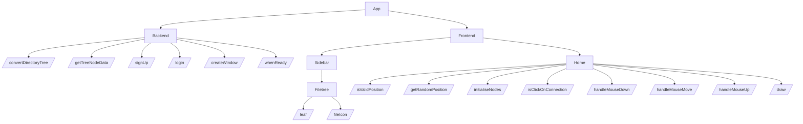

# Backend

## `convertDirectoryTree()`

_This algorithm is used to **recursively** turn the data collected from the users filesystem into data that can be displayed in the sidebar using Mantine's `Tree` module. It does this by converting each item in a JSON file into `TreeNodeData`, which can then be passed to the frontend for Mantine's `Tree` module to turn into a tree hierarchy._

### Flowchart

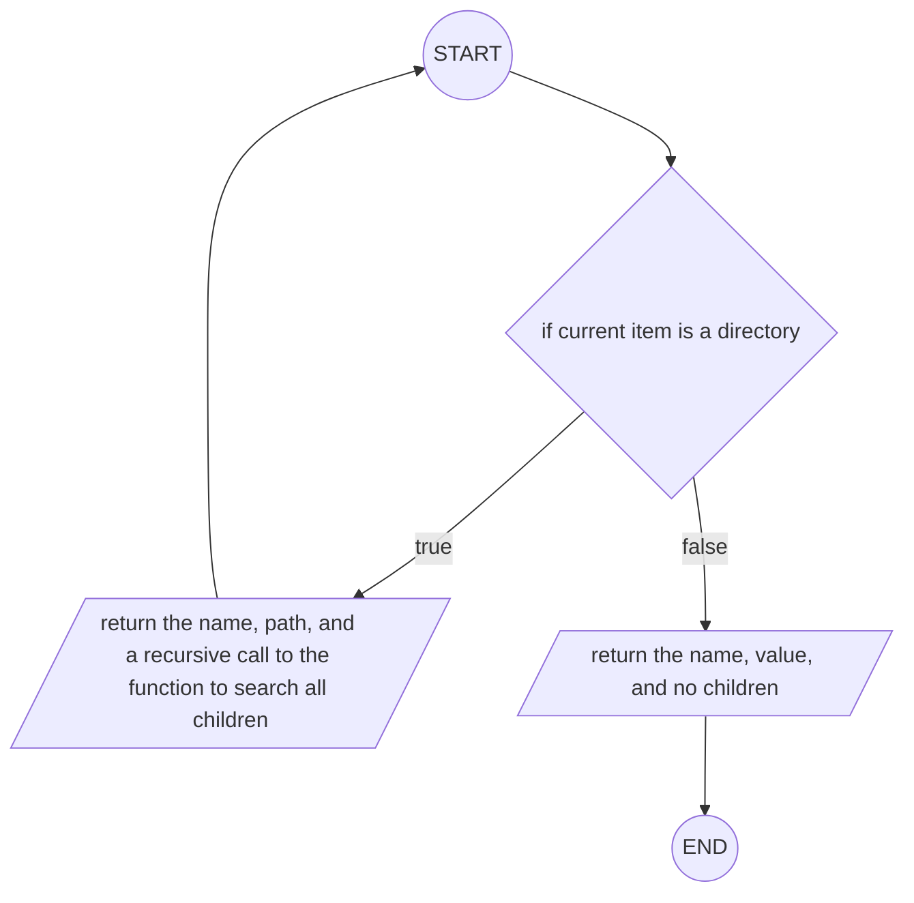

### Pseudocode

```vb

FUNCTION convertDirectoryTree(name, path, children):
  IF children:
    RETURN (
      label: name,
      value: path,
      children: convertDirectoryTree(name, path, children)
    )
  END IF
  RETURN (
    label: name,
    value: path,
    children: undefined
  )
END FUNCTION
```

### Variables

| Identifier | Type                                        | Component   | Purpose/ Justification                                                                                                                                                                                                                                                                                                                                                                                                                                                                         |
| ---------- | ------------------------------------------- | ----------- | ---------------------------------------------------------------------------------------------------------------------------------------------------------------------------------------------------------------------------------------------------------------------------------------------------------------------------------------------------------------------------------------------------------------------------------------------------------------------------------------------- |
| `name`     | `string`                                    | _parameter_ | the name given to each file/ directory - this is then reassigned to the `label` attribute of the `TreeNodeData` type.                                                                                                                                                                                                                                                                                                                                                                          |
| `path`     | `string`                                    | _parameter_ | the file path to the given file - this is then reassigned to the `value` attribute of the `TreeNodeData` type.                                                                                                                                                                                                                                                                                                                                                                                 |
| `children` | `Array<DirectoryTree<Record<string, any>>>` | _parameter_ | a `Record` (set of key-value pairs) of all children the item has - this is then reassigned to the `children` attribute (same name as in the `DirectoryTree` type) of the `TreeNodeData` type. This is called recursively on each of the children in order to reach all files in the selected source directory. This is only applicable to directories, and so if the item is a file, `convertDirectoryTree()` does not have to be called again, instead listing the `children` as `undefined`. |
| n/a        | `TreeNodeData`                              | _return_    | the function returns the passed in file tree in the `DirectoryTree` format in the `TreeNodeData` type, as required for the function to work as intended.                                                                                                                                                                                                                                                                                                                                       |

## `getTreeNodeData()`

_This function is used to retrieve the file structure of the source directory and return it in the `TreeNodeData[]` array format._

### Flowchart


### Pseudocode

```vb
IMPORT directoryTree FROM "directory-tree"
FUNCTION getTreeNodeData(path):
  tree = directoryTree(path, { extensions: /\.md$/ })

  RETURN [convertDirectoryTree(tree)]
END FUNCTION
```

### Variables

| Identifier | Type                                 | Component        | Purpose/ Justification                                                                                                                                                                               |
| ---------- | ------------------------------------ | ---------------- | ---------------------------------------------------------------------------------------------------------------------------------------------------------------------------------------------------- |
| `path`     | `string`                             | _parameter_      | the path of the source directory - this is required in order for the program to know where to retrieve the file tree from.                                                                           |
| `tree`     | `DirectoryTree<Record<string, any>>` | _local variable_ | a `Record` of all the relevant directories and files, stored within the `DirectoryTree` structure is used to store the contents retrieved using the `directoryTree()` function.                      |
| n/a        | `Array<TreeNodeData>`                | _return_         | returns an array of `TreeNodeData` to be passed to the frontend for use in the file tree in the Sidebar, where each item in the array is a separate file/ directory to be rendered in the file tree. |

## `login()`

_This algorithm covers the logic behind a user logging in to NodePad, which takes place within the Login screen ..._

## `signUp()`

_This algorithm covers the logic behind a user signing up to NodePad, which takes place within the Signup screen ..._

## `createWindow()`

_Arguably the most important algorithm of all, `createWindow()` creates an entry point and basic structure for the app to sit on, providing information on what to render, how to render it, where to look for source files etc., and then triggering the app to start rendering._

### Flowchart

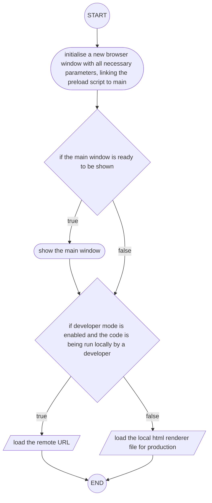

### Pseudocode

```vb
FUNCTION createWindow():
  mainWindow = new BrowserWindow({
    width: 1000,
    height: 700,
    show: false,
    autoHideMenuBar: true,
    icon = process.platform == "linux" ? icon : NULL,
    webPreferences: {
      preload: join(__dirname, "./preload/index.js"),
      sandbox: false,
    },
  })

  IF mainWindowIsReadyToShow:
    mainWindow.show()
  END IF

  ' load the remote URL for development or the local html file for production
  IF is.dev AND process.env["ELECTRON_RENDERER_URL"]:
    mainWindow.loadURL(process.env["ELECTRON_RENDERER_URL"])
  ELSE:
    mainWindow.loadFile(join(directoryName, "../renderer/index.html"))
  END IF
END FUNCTION
```

### Variables

| Identifier                             | Type                      | Component  | Purpose/ Justification                                                                                                                                                                                      |
| -------------------------------------- | ------------------------- | ---------- | ----------------------------------------------------------------------------------------------------------------------------------------------------------------------------------------------------------- |
| `mainWindow`                           | `Electron.BrowserWindow`  | _variable_ | utilising Electron's `BrowserWindow` type and method to instantiate a main browser window. All the content of the app will sit within this window, so it is paramount the a browser window is instantiated. |
| `width`                                | `number`                  | _property_ | specifies the width of the browser window, in pixels.                                                                                                                                                       |
| `height`                               | `number`                  | _property_ | specifies the height if the browser window, in pixels.                                                                                                                                                      |
| `show`                                 | `boolean`                 | _property_ | determines whether the window should be shown when created.                                                                                                                                                 |
| `autoHideMenuBar`                      | `boolean`                 | _property_ | auto-hides the menu bar unless the alt key is pressed/ held.                                                                                                                                                |
| `icon`                                 | `string`                  | _property_ | dependant on if the user's OS is linux, an icon is supplied as its filename of type `string`.                                                                                                               |
| `webPreferences`                       | `Electron.webPreferences` | _property_ | a set of specifications for features of the web page.                                                                                                                                                       |
| `webPreferences.preload`               | `string`                  | _property_ | specifies a script that will be loaded before other scripts run in the page. The value given is the **absolute** file path to the script.                                                                   |
| `webPreferences.sandbox`               | `boolean`                 | _property_ | this sandbox's the renderer for with the window, in doing so making it compatible with the Chromium OS-level sandbox and disabling the Node.js engine.                                                      |
| `mainWindowIsReadyToShow`              | `boolean`                 | _variable_ | a value used to check whether all necessary action has been taken to prepare the window for being shown, determining whether or not to show the window to the user yet.                                     |
| `is.dev`                               | `boolean`                 | _variable_ | determines whether the app is being run in dev mode - forms part of the logic determining whether to run for production or development.                                                                     |
| `process.env["ELECTRON_RENDERER_URL"]` | `boolean`                 | _variable_ | determines if the app is being run using electron's remote renderer URL - forms part of the logic determining whether to run for production or development.                                                 |
| n/a                                    | `void`                    | _return_   | nothing needs to be return ed by the function.                                                                                                                                                              |

## `whenReady`

_This algorithm determines all the behaviours of the app once it's ready to launch. This includes listening for mouse/ keyboard events and checking for function calls from the frontend._

### Flowchart


### Pseudocode

```vb
IF appIsReady():
  ' set app user model id for windows
  electronApp.setAppUserModelId("com.electron")

  ' default open or close DevTools with F12
  IF appBrowserWindowCreated:
    optimizer.watchWindowShortcuts(window)
  END IF

  ' when the frontend requests the file tree...
  IF getTreeNodeDataIsCalled(path):
    ' all files/ directories found and returned to frontend
    data = getTreeNodeData(path)
    event.send("get-tree-node-data-success", data)
  END IF

  ' when ipc receives request for file contents...
  IF getFileContentsIsCalled():
    ' file contents are read in and returned
    fileContents = getFileContents(path)
    event.send("get-file-contents-success", fileContents)
  END IF

  createWindow()

  IF appIsActivated():
    ' common on macOS to re-create a window when the
    ' dock icon clicked & no other windows open
    IF numberOfBrowserWindows == 0:
      createWindow()
    END IF
  END IF
END IF

' quit when all windows are closed unless OS=macOS
IF allWindowsAreClosed():
  IF process.platform != "darwin":
    app.quit()
  END IF
END IF
```

### Variables

| Identifier                | Type                     | Component  | Purpose/ Justification                                                                                                                                                                        |
| ------------------------- | ------------------------ | ---------- | --------------------------------------------------------------------------------------------------------------------------------------------------------------------------------------------- |
| `appBrowserWindowCreated` | `boolean`                | _variable_ | a variable used to check whether a window has [successfully] been created - this is used to determine whether ir not to watch for any keyboard shortcuts e.g. `ctrl` + `space` are pressed    |
| `window`                  | `Electron.BrowserWindow` | _variable_ | an object used to represent the window that opens when the app is started                                                                                                                     |
| `path`                    | `string`                 | _variable_ | a string such as `~/foo/bar` used to either return all subdirectories and files from within the specified location, or return the contents a the file found at that path in the user's system |
| `data`                    | `Array<TreeNodeData>`    | _variable_ | an intermediary variable used to clearly demonstrate what is being passed back to the frontend (the tree node data)                                                                           |
| `fileContents`            | `string`                 | _variable_ | similarly to `data`, an intermediary variable used to clearly demonstrate the thing being passed to the frontend (the contents of a specific file)                                            |
| `numberOfBrowserWindows`  | `number`                 | _variable_ | variable used as a count of the number of open windows - this is used for macOS, where all windows being closed doesn't automatically mean the app is closed                                  |
| `process.platform`        | `string`                 | _variable_ | a variable that yields what OS/ flavour the user is running on, used for when different behaviour is needed dependent on the specific platform                                                |

_^note this doesn't have a return type, as this isn't actually a function._

# Frontend

## Sidebar

### `leaf()`

_This algorithm is used to initialise each item (file/ directory) in the source directory in its correct state (i.e. a directory could be open or closed), and determine the functionality that occurs if an item is clicked, giving the sidebar a file tree to display._

#### Flowchart


#### Pseudocode

```vb
' ... is used to represent HTML code that cannot be displayed as pseudocode (not relevant to the algorithm)
FUNCTION Leaf(node, expanded, hasChildren, tree):
  RETURN (
    <Group ' return group of 'leaves'
    ...
      IF node.isClicked():
        tree.toggleSelected(node.name);
        tree.toggleExpanded(node.value);
        IF !node.hasChildren:
          setSelectedFile(node);
          goTo(editFileContentsPage)
        END IF
      END IF
    >
      ...
    </Group>
  )
END FUNCTION

```

#### Variables

| Identifier             | Type                          | Component   | Purpose/ Justification                                                                                                                                |
| ---------------------- | ----------------------------- | ----------- | ----------------------------------------------------------------------------------------------------------------------------------------------------- |
| `node`                 | `TreeNodeData`                | _parameter_ | object representing a component of the file tree - this could be a directory or a file                                                                |
| `expanded`             | `boolean`                     | _parameter_ | variable that, if true, means the node selected is currently expanded, i.e. its children are visible, and if false, means the node is not expanded    |
| `hasChildren`          | `boolean`                     | _parameter_ | determines whether the node in focus has children - this essentially decides whether it is a directory (has children) or a file (can't have children) |
| `node.value`           | `string`                      | _variable_  | a string depicting the file path to that node within the user's file system                                                                           |
| `node.hasChildren`     | `boolean`                     | _variable_  | determines whether the selected node contains directories or files                                                                                    |
| `editFileContentsPage` | `string`                      | _variable_  | a variable representing the link to the edit contents page, where the user can then edit the contents of the file they selected                       |
| n/a                    | `ReactElement<FileIconProps>` | _return_    | returns what the user clicked on in the event of a click, useful for debugging                                                                        |

### `fileIcon()`

_This algorithm is used to determine and render which icon should be displayed next to the each file/ folder in the file tree in the sidebar._

#### Flowchart

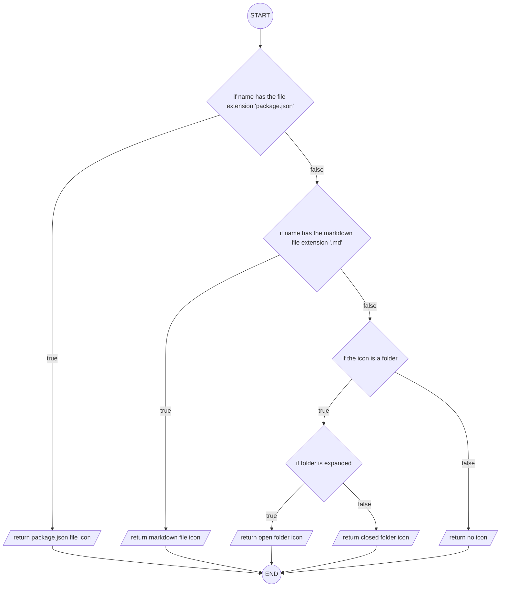

#### Pseudocode

```vb

FUNCTION FileIcon(name, isFolder, expanded):
  IF name.endsWith("package.json"):
    RETURN packageJsonIcon
  END IF

  IF name.endsWith(".md"):
    RETURN markdownIcon
  END IF

  IF isFolder:
    IF expanded:
      RETURN openFolderIcon
    END IF
    RETURN closedFolderIcon
  END IF

  RETURN undefined
END FUNCTION
```

#### Variables

| Identifier         | Type                  | Component   | Purpose/ Justification                                                                                               |
| ------------------ | --------------------- | ----------- | -------------------------------------------------------------------------------------------------------------------- |
| `name`             | `string`              | _parameter_ | the text to be rendered on top of each node, to indicate to the user what it is                                      |
| `isFolder`         | `boolean`             | _parameter_ | evaluates if the selected node is a directory, used to perform functionality specific to nodes of the directory type |
| `expanded`         | `boolean`             | _parameter_ | evaluates if the selected directory is in an expanded state                                                          |
| `packageJsonIcon`  | `string`              | _variable_  | the path to an SVG of the JSON icon, rendered next to files with the `.json` extension                               |
| `markdownIcon`     | `string`              | _variable_  | the path to an SVG of the markdown icon, rendered next to files with the `.md` extension                             |
| `openFolderIcon`   | `string`              | _variable_  | the path to an SVG of the open folder icon, rendered next to open directories                                        |
| `closedFolderIcon` | `string`              | _variable_  | the path to an SVG of the closed folder icon, rendered next to closed directories                                    |
| n/a                | `string`/ `undefined` | _variable_  | used as a return in the case that none of the other icons fit the needs of the node - nothing is returned            |

## Home

### `isValidPosition()`

_This algorithm checks if a given position is valid - a node generated at that position in the canvas would be at least the specified minimum distance from any other pre-existing node in the `nodes` array - using Pythagoras'._

#### Flowchart

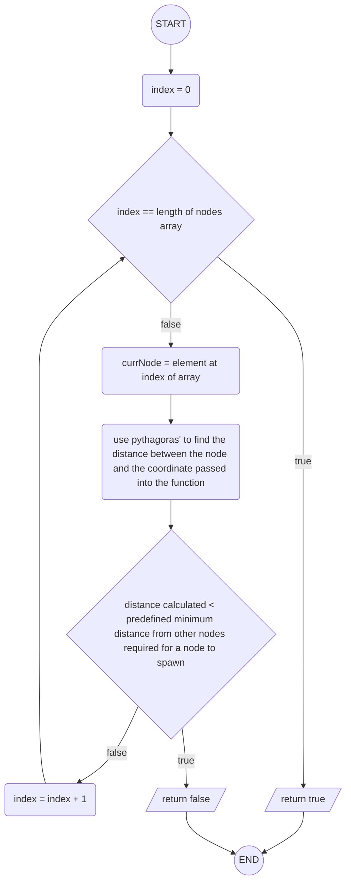

#### Pseudocode

```vb

FUNCTION isValidPosition(x, y, nodes):
  minDistance = 2 * radiusOfNode
  FOR EACH node IN nodes:
    distance = squareRoot((node.x-x)**2 + (node.y-y)**2)
    IF distance < minDistance:
      RETURN false
    END IF
  END FOR EACH
  RETURN true
END FUNCTION

```

#### Variables

| Identifier     | Type          | Component   | Purpose/ Justification                                                                                                                                                     |
| -------------- | ------------- | ----------- | -------------------------------------------------------------------------------------------------------------------------------------------------------------------------- |
| `x`            | `number`      | _parameter_ | a variable holding the x-position of the node being checked in the canvas, needed in tandem with the y-position to perform a calculation to check if the position is valid |
| `y`            | `number`      | _parameter_ | a variable holding the y-position of the node being checked in the canvas, needed in tandem with the x-position to perform a calculation to check if the position is valid |
| `nodes`        | `Array<Node>` | _parameter_ | an array used to compare the position of every other node in the network to the position of the node being passed in                                                       |
| `minDistance`  | `number`      | _variable_  | the pre-specified minimum distance each node can be from any other                                                                                                         |
| `radiusOfNode` | `number`      | _variable_  | the pre-specified radius of each node                                                                                                                                      |
| `node`         | `Node`        | _variable_  | an object storing all the information on a node - in this case, each node in the network as they're iterated through in turn                                               |
| `node.x`       | `number`      | _variable_  | the x-position of each node in the canvas                                                                                                                                  |
| `node.y`       | `number`      | _variable_  | the y-position of each node in the canvas                                                                                                                                  |
| `distance`     | `number`      | _variable_  | the calculated distance between two nodes, taking into account the size of the radius of each node                                                                         |
| _n/a_          | `boolean`     | _return_    | returns `true` if the node does not come closer than the minimum distance to any other node, otherwise returning false                                                     |

### `getRandomPosition()`

_This algorithm generates a random position for a new node in the network. It utilises the `isValidPosition()` algorithm to check if the position is valid, looping through until a valid position is generated, or a maximum number of attempts is reached._

#### Flowchart

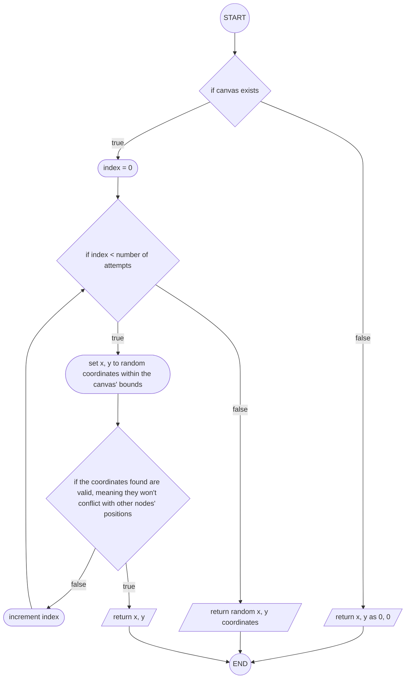

#### Pseudocode

```vb

FUNCTION getRandomPosition(existingNodes, attempts):
  IF !canvasExists:
    RETURN (0, 0)
  END IF
  FOR i = 0 TO attempts:
    x = random(canvasHeight);
    y = random(canvasWidth);
    IF isValidPosition(x, y, existingNodes):
      RETURN (x, y)
    END IF
  END FOR
  RETURN (x: random(canvasHeight), y: random(canvasWidth))
END FUNCTION

```

#### Variables

| Identifier      | Type          | Component   | Purpose/ Justification |
| --------------- | ------------- | ----------- | ---------------------- |
| `existingNodes` | `Array<Node>` | _parameter_ |                        |
| `attempts`      | `number`      | _parameter_ |                        |
| `canvasExists`  | `boolean`     | _variable_  |                        |
| `i`             | `number`      | _variable_  |                        |
| `x`             | `number`      | _variable_  |                        |
| `y`             | `number`      | _variable_  |                        |
| `canvasHeight`  | `number`      | _variable_  |                        |
| `canvasWidth`   | `number`      | _variable_  |                        |
| _n/a_           | `Position`    | _return_    |                        |

### `initialiseNodes()`

_This algorithm iterates through all files and directories passed in, converting all markdown files into nodes and pushing them to an array. This supplies the app with the necessary data to render specific nodes in the canvas._

#### Flowchart


#### Pseudocode

```vb
FUNCTION initialiseNodes():
  IF !canvasExists RETURN
  initialNodes = []
  index = 0
  FOR EACH item IN files:
    IF item.endsWith(".md"):
      file = item
      position = getRandomPosition(initialNodes)
      initialNodes.push(
        id: index,
        x: position.x,
        y: position.y,
        title: file.filename,
        filePath: file.filepath,
        connections: []
      )
      index++;
    ELSE
      IF item.hasChildren
        FOR EACH child IN item.children
          files.push(child)
        END FOR EACH
      END IF
    END IF
  END FOR EACH
  setNodes(initialNodes)
END FUNCTION
```

#### Variables

| Identifier         | Type                  | Component  | Purpose/ Justification |
| ------------------ | --------------------- | ---------- | ---------------------- |
| `canvasExists`     | `boolean`             | _variable_ |                        |
| `initialNodes`     | `Array<Node>`         | _variable_ |                        |
| `index`            | `number`              | _variable_ |                        |
| `item`             | `Array<TreeNodeData>` | _variable_ |                        |
| `file`             | `Array<TreeNodeData>` | _variable_ |                        |
| `position`         | `Position`            | _variable_ |                        |
| `id`               | `number`              | _variable_ |                        |
| `x`                | `number`              | _variable_ |                        |
| `y`                | `number`              | _variable_ |                        |
| `title`            | `string`              | _variable_ |                        |
| `filePath`         | `string`              | _variable_ |                        |
| `connections`      | `Array<Connection>`   | _variable_ |                        |
| `child`            | `TreeNodeData`        | _variable_ |                        |
| `item.hasChildren` | `boolean`             | _variable_ |                        |

### `draw()`

_This algorithm covers the entire drawing process for each frame the app is running. Due to how many decisions are in the algorithm, I've broken it down further, and then compiled it all at the end to show how all parts relate to one another._

#### Draw background

_This algorithm clears and draws the minimum sized canvas that can fit all nodes with in._

##### Flowchart

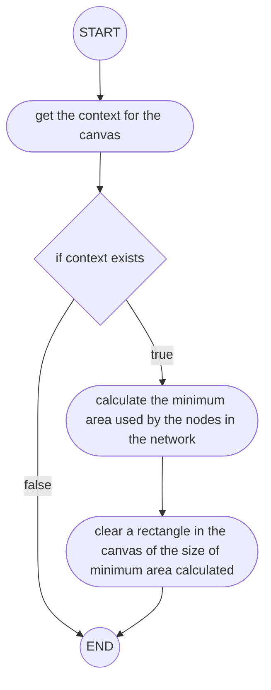

##### Pseudocode

```vb
context = getCurrentContext()
IF context == NULL:
  RETURN
END IF

usedArea = {
  minX: leftmostNode - padding
  maxX: rightmostNode + padding
  minY: lowermostNode - padding
  maxY: uppermostNode + padding
}

context.clearRectangle(usedArea)
```

##### Variables

| Identifier      | Type                                                       | Component  | Purpose/ Justification |
| --------------- | ---------------------------------------------------------- | ---------- | ---------------------- |
| `context`       | `CanvasRenderingContext2D \| null`                         | _variable_ |                        |
| `usedArea`      | `{minX: number, maxX: number, minY: number, maxY: number}` | _variable_ |                        |
| `minX`          | `number`                                                   | _variable_ |                        |
| `maxX`          | `number`                                                   | _variable_ |                        |
| `minY`          | `number`                                                   | _variable_ |                        |
| `maxY`          | `number`                                                   | _variable_ |                        |
| `leftmostNode`  | `Position`                                                 | _variable_ |                        |
| `rightmostNode` | `Position`                                                 | _variable_ |                        |
| `lowermostNode` | `Position`                                                 | _variable_ |                        |
| `uppermostNode` | `Position`                                                 | _variable_ |                        |
| `padding`       | `number`                                                   | _variable_ |                        |

#### Draw connections

_This algorithm cycles through all connections, works out if each node in the network is part of that connection and draws the connection between the relevant nodes. This is done to display the connections between all nodes in the network every frame of the app's cycle._

##### Flowchart

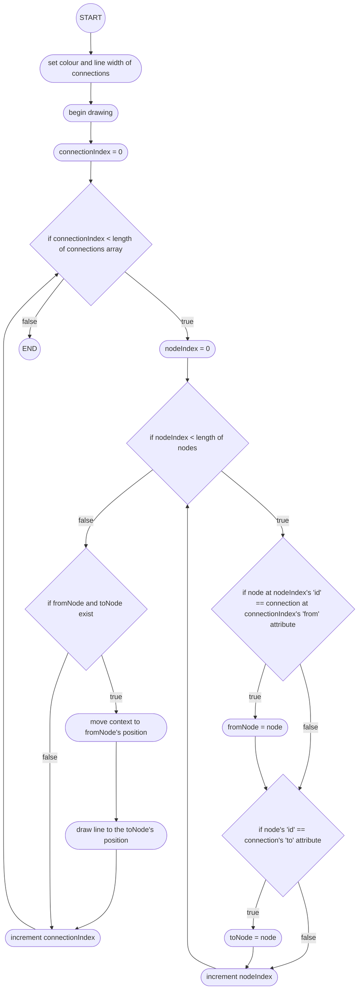

##### Pseudocode

```vb
context.colour = CONNECTION_COLOUR
context.lineWidth = 2;

FOR EACH connection IN connections:
  FOR EACH node IN nodes:
    IF node.id == connection.from:
      fromNode = node
    END IF
    IF node.id == connection.to:
      toNode = node
    END IF
  END FOR EACH
  IF fromNode != NULL AND toNode != NULL:
    context.moveTo(fromNode.x, fromNode.y)
    context.drawLineTo(toNode.x, toNode.y)
  END IF
END FOR EACH
```

##### Variables

| Identifier          | Type                | Component  | Purpose/ Justification |
| ------------------- | ------------------- | ---------- | ---------------------- |
| `context.colour`    | `string`            | _variable_ |                        |
| `CONNECTION_COLOUR` | `string`            | _variable_ |                        |
| `context.lineWidth` | `number`            | _variable_ |                        |
| `connection`        | `Connection`        | _variable_ |                        |
| `connections`       | `Array<Connection>` | _variable_ |                        |
| `node`              | `Node`              | _variable_ |                        |
| `nodes`             | `Array<Node>`       | _variable_ |                        |
| `node.id`           | `number`            | _variable_ |                        |
| `connection.from`   | `Position`          | _variable_ |                        |
| `fromNode`          | `Position`          | _variable_ |                        |
| `connection.to`     | `Position`          | _variable_ |                        |
| `toNode`            | `Position`          | _variable_ |                        |
| `fromNode.x`        | `number`            | _variable_ |                        |
| `fromNode.y`        | `number`            | _variable_ |                        |
| `toNode.x`          | `number`            | _variable_ |                        |
| `toNode.y`          | `number`            | _variable_ |                        |

#### Dragging connections

_This algorithm is used to ensure that, if a user is dragging a connection, a dashed line is drawn during the dragging process, and once the user lets go, the connection is drawn in solid if a link between the two nodes is established i.e. the user lets go above a second node. Otherwise no connection is drawn. This will be used in the Edit Mode in the Home Screen, allowing the user to graphically connect and disconnect nodes from one another._

##### Flowchart


##### Pseudocode

```vb
IF draggingConnection == TRUE:
  FOR EACH node IN nodes:
    IF node.id == connection.from:
      fromNode = node
    END IF
  END FOR EACH
  IF fromNode != NULL:
    context.moveTo(fromNode.x, fromNode.y);
    context.drawLineTo(draggingConnection.toPos.x, draggingConnection.toPos.y);
  END IF
END IF
```

##### Variables

| Identifier                   | Type                                          | Component  | Purpose/ Justification |
| ---------------------------- | --------------------------------------------- | ---------- | ---------------------- |
| `draggingConnection`         | `{ fromId: number, toPos: Position } \| null` | _variable_ |                        |
| `node.id`                    | `number`                                      | _variable_ |                        |
| `connection.from`            | `Position`                                    | _variable_ |                        |
| `fromNode`                   | `Position`                                    | _variable_ |                        |
| `fromNode.x`                 | `number`                                      | _variable_ |                        |
| `fromNode.y`                 | `number`                                      | _variable_ |                        |
| `draggingConnection.toPos.x` | `number`                                      | _variable_ |                        |
| `draggingConnection.toPos.x` | `number`                                      | _variable_ |                        |

#### Draw nodes

_This algorithm is used to draw and fill each node in the network with a specified colour and radius. These are the visual representations of each note made by the user._

##### Flowchart

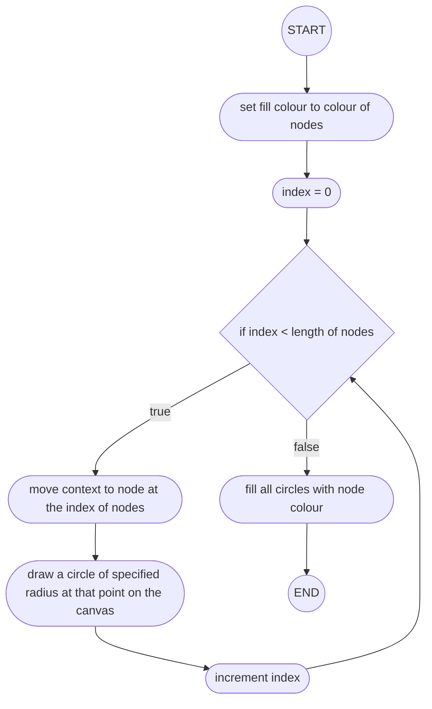

##### Pseudocode

```vb
context.colour = NODE_COLOUR
FOR EACH node IN nodes:
  context.moveTo(node.x + radius, node.y)
  context.drawCircle(node.x, node.y, radius, 0, PI * 2)
END FOR EACH
context.fillCircle()
```

##### Variables

| Identifier       | Type          | Component  | Purpose/ Justification |
| ---------------- | ------------- | ---------- | ---------------------- |
| `context.colour` | `string`      | _variable_ |                        |
| `NODE_COLOUR`    | `string`      | _variable_ |                        |
| `node`           | `Node`        | _variable_ |                        |
| `nodes`          | `Array<Node>` | _variable_ |                        |
| `node.x`         | `number`      | _variable_ |                        |
| `node.y`         | `number`      | _variable_ |                        |
| `radius`         | `number`      | _variable_ |                        |
| `PI`             | `number`      | _variable_ |                        |

#### Draw node centres

_This algorithm is used to draw a smaller circle at the centre of each node. This is used to demonstrate the area the user can drag a connection from or to. This will only show in the Edit Mode in the Home Screen._

##### Flowchart


##### Pseudocode

```vb
context.colour = CENTRE_COLOUR
FOR EACH node IN nodes:
  context.moveTo(node.x + 5, node.y)
  context.drawCircle(node.x, node.y, 5, 0, PI * 2)
END FOR EACH
context.fillCircle()
```

##### Variables

| Identifier       | Type          | Component  | Purpose/ Justification |
| ---------------- | ------------- | ---------- | ---------------------- |
| `context.colour` | `string`      | _variable_ |                        |
| `NODE_COLOUR`    | `string`      | _variable_ |                        |
| `node`           | `Node`        | _variable_ |                        |
| `nodes`          | `Array<Node>` | _variable_ |                        |
| `node.x`         | `number`      | _variable_ |                        |
| `node.y`         | `number`      | _variable_ |                        |
| `PI`             | `number`      | _variable_ |                        |

#### Draw titles

_This algorithm iterates through each node in the network, establishes its title and draws it just below the node._

##### Flowchart


##### Pseudocode

```vb
context.colour = TEXT_COLOUR
context.font = TEXT_FONT
FOR EACH node IN nodes:
  context.fillText(node.title, node.x, node.y + 30)
END FOR EACH
```

##### Variables

| Identifier       | Type          | Component  | Purpose/ Justification |
| ---------------- | ------------- | ---------- | ---------------------- |
| `context.colour` | `string`      | _variable_ |                        |
| `TEXT_COLOUR`    | `string`      | _variable_ |                        |
| `context.font`   | `string`      | _variable_ |                        |
| `node`           | `Node`        | _variable_ |                        |
| `nodes`          | `Array<Node>` | _variable_ |                        |
| `node.title`     | `string`      | _variable_ |                        |
| `node.x`         | `number`      | _variable_ |                        |
| `node.y`         | `number`      | _variable_ |                        |

#### Combining all functionality - Flowchart

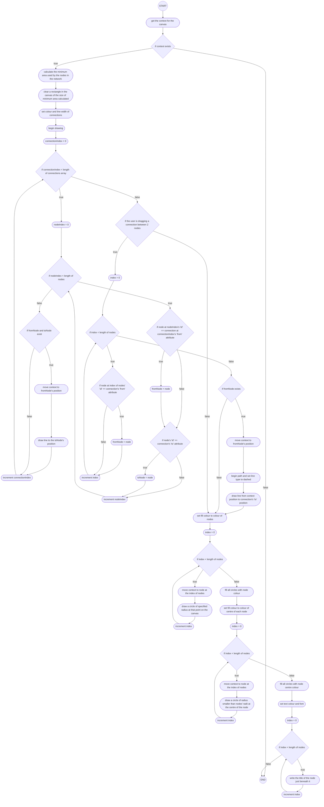

#### Combining all functionality - Pseudocode

```vb

FUNCTION draw():
  context = getCurrentContext()
  IF !context RETURN

  usedArea = {
    minX: leftmostNode - padding
    maxX: rightmostNode + padding
    minY: lowermostNode - padding
    maxY: uppermostNode + padding
  }
  context.clearRectangle(usedArea)

  context.colour = CONNECTION_COLOUR
  context.lineWidth = 2;

  FOR EACH connection IN connections:
    FOR EACH node IN nodes:
      IF node.id == connection.from:
        fromNode = node
      END IF
      IF node.id == connection.to:
        toNode = node
      END IF
    END FOR EACH
    IF fromNode != NULL AND toNode != NULL:
      context.moveTo(fromNode.x, fromNode.y)
      context.drawLineTo(toNode.x, toNode.y)
    END IF
  END FOR EACH

  IF draggingConnection == TRUE:
    FOR EACH node IN nodes:
      IF node.id == connection.from:
        fromNode = node
      END IF
    END FOR EACH
    IF fromNode != NULL:
      context.moveTo(fromNode.x, fromNode.y);
      context.drawLineTo(draggingConnection.toPos.x, draggingConnection.toPos.y);
    END IF
  END IF

  context.fillStyle = NODE_COLOUR
  FOR EACH node IN nodes:
    context.moveTo(node.x + radius, node.y)
    context.drawCircle(node.x, node.y, radius, 0, PI * 2)
  END FOR EACH
  context.fillCircle()

  context.fillStyle = CENTRE_COLOUR
  FOR EACH node IN nodes:
    context.moveTo(node.x + 5, node.y)
    context.drawCircle(node.x, node.y, 5, 0, Math.PI * 2)
  END FOR EACH
  context.fillCircle()

  context.fillStyle = TEXT_COLOUR
  context.font = TEXT_FONT
  FOR EACH node IN nodes:
    context.fillText(node.title, node.x, node.y + 30)
  END FOR EACH
END FUNCTION

```

### `isClickOnConnection()`

_This algorithm is used to validate if the user's click is within an acceptable distance of a connection to be considered clicking the connection - if the user clicks on a node within the acceptable area, the function will not consider this as a valid click. This is used in the context of the Edit Mode in Home, allowing the user to remove a connection by clicking on it._

#### Flowchart


#### Pseudocode

```vb
FUNCTION isClickOnConnection(x, y, connection):
  FOR EACH node IN nodes:
    IF node.id == connection.from:
      fromNode = node
    END IF
    IF node.id == connection.to:
      toNode = node
    END IF
  END FOR EACH

  IF fromNode == NULL OR toNode == NULL
    RETURN FALSE
  END IF

  nodeA = (fromNode.x, fromNode.y)
  nodeB = (toNode.x, toNode.y)
  click = (x, y)

  lengthAB = squareRoot(power(nodeB.x - nodeA.x, 2) + power(nodeB.y - nodeA.y, 2))
  perpDistance = absoluteValue((nodeB.y - nodeA.y) * click.x - (nodeB.x - nodeA.x)
  * click.y + nodeB.x * nodeA.y - nodeB.y * nodeA.x) / lengthAB
  theta = arcTan((nodeB.y - nodeA.y) / (nodeB.x - nodeA.x))

  RETURN (
    perpDistance < 10 AND
    x >= min(nodeA.x, nodeB.x) + radius * cos(theta) AND
    x <= max(nodeA.x, nodeB.x) - radius * cos(theta) AND
    y >= min(nodeA.y, nodeB.y) - radius * sin(theta) AND
    y <= max(nodeA.y, nodeB.y) + radius * sin(theta)
  )
END FUNCTION
```

#### Variables

| Identifier        | Type                | Component   | Purpose/ Justification |
| ----------------- | ------------------- | ----------- | ---------------------- |
| `x`               | `number`            | _parameter_ |                        |
| `y`               | `number`            | _parameter_ |                        |
| `connection`      | `Connection`        | _parameter_ |                        |
| `node`            | `Node`              | _variable_  |                        |
| `nodes`           | `Array<Nodes>`      | _variable_  |                        |
| `node.id`         | `number`            | _variable_  |                        |
| `connection.from` | `number`            | _variable_  |                        |
| `fromNode`        | `Node \| undefined` | _variable_  |                        |
| `connection.to`   | `Position`          | _variable_  |                        |
| `toNode`          | `Node \| undefined` | _variable_  |                        |
| `nodeA`           | `Position`          | _variable_  |                        |
| `fromNode.x`      | `number`            | _variable_  |                        |
| `fromNode.y`      | `number`            | _variable_  |                        |
| `nodeB`           | `Position`          | _variable_  |                        |
| `toNode.x`        | `number`            | _variable_  |                        |
| `toNode.y`        | `number`            | _variable_  |                        |
| `click`           | `Position`          | _variable_  |                        |
| `lengthAB`        | `number`            | _variable_  |                        |
| `perpDistance`    | `number`            | _variable_  |                        |
| `nodeA.x`         | `number`            | _variable_  |                        |
| `nodeB.x`         | `number`            | _variable_  |                        |
| `nodeA.y`         | `number`            | _variable_  |                        |
| `nodeB.y`         | `number`            | _variable_  |                        |
| `click.x`         | `number`            | _variable_  |                        |
| `click.y`         | `number`            | _variable_  |                        |
| `theta`           | `number`            | _variable_  |                        |

### `handleMouseDown()`

_This algorithm handles all possible outcomes of the user clicking within the canvas - this includes clicking on a connection, clicking on a node etc._

#### Flowchart

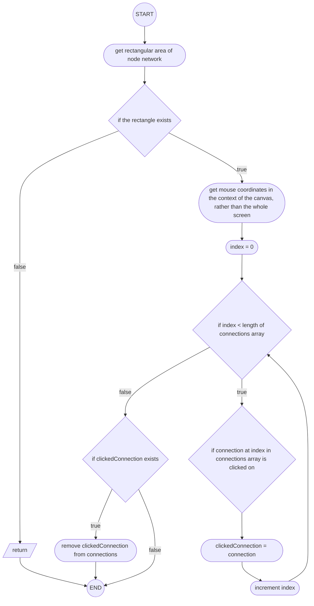

#### Pseudocode

```vb
FUNCTION handleMouseDown(e):
  rect = canvasRef.getRectangleArea();
  IF rect == NULL:
    RETURN
  END IF

  x = e.clientX - rect.left
  y = e.clientY - rect.top

  FOR EACH connection IN connections:
    IF isClickOnConnection(x, y, connection):
      clickedConnection = connection
    END IF
  END FOR EACH

  IF clickedConnection:
    connections.remove(clickedConnection)
  END IF
  RETURN
END FUNCTION
```

#### Variables

| Identifier          | Type                      | Component   | Purpose/ Justification                                                         |
| ------------------- | ------------------------- | ----------- | ------------------------------------------------------------------------------ |
| `e`                 | `MouseEvent`              | _parameter_ | jrvnkejrnvjern _note: `e` is used as it is common convention for mouse events_ |
| `rect`              | `DOMRect \| undefined`    | _variable_  |                                                                                |
| `x`                 | `number`                  | _variable_  |                                                                                |
| `y`                 | `number`                  | _variable_  |                                                                                |
| `e.clientX`         | `number`                  | _variable_  |                                                                                |
| `e.clientY`         | `number`                  | _variable_  |                                                                                |
| `rect.left`         | `number`                  | _variable_  |                                                                                |
| `rect.top`          | `number`                  | _variable_  |                                                                                |
| `connection`        | `Connection`              | _variable_  |                                                                                |
| `connections`       | `Array<Connection>`       | _variable_  |                                                                                |
| `clickedConnection` | `Connection \| undefined` | _variable_  |                                                                                |

### `handleMouseMove()`

_This algorithm handles all possible outcomes of the user moving their mouse - this includes moving the mouse while dragging a connection, dragging a node etc._

#### Flowchart

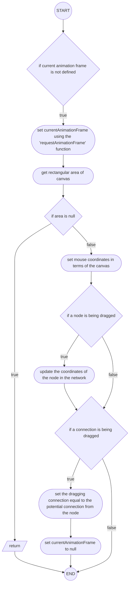

#### Pseudocode

```vb

FUNCTION handleMouseMove(e):
  IF currentAnimationFrame == NULL:
    currentAnimationFrame = requestAnimationFrame():
      rect = canvasRef.getRectangle()
      IF rect == NULL:
        RETURN
      END IF
      x = e.clientX - rect.left;
      y = e.clientY - rect.top;

      IF draggedNode:
        node.updateCoordinates()
      END IF

      IF draggingConnection:
        setDraggingConnection(connection);
        currentAnimationFrame = NULL
      END IF
  END IF
END FUNCTION
```

#### Variables

| Identifier              | Type                                          | Component   | Purpose/ Justification                                                         |
| ----------------------- | --------------------------------------------- | ----------- | ------------------------------------------------------------------------------ |
| `e`                     | `MouseEvent`                                  | _parameter_ | jrvnkejrnvjern _note: `e` is used as it is common convention for mouse events_ |
| `currentAnimationFrame` | `React.MutableRefObject<number \| undefined>` | _variable_  |                                                                                |
| `rect`                  | `DOMRect \| undefined`                        | _variable_  |                                                                                |
| `x`                     | `number`                                      | _variable_  |                                                                                |
| `y`                     | `number`                                      | _variable_  |                                                                                |
| `e.clientX`             | `number`                                      | _variable_  |                                                                                |
| `e.clientY`             | `number`                                      | _variable_  |                                                                                |
| `rect.left`             | `number`                                      | _variable_  |                                                                                |
| `rect.top`              | `number`                                      | _variable_  |                                                                                |
| `draggedNode`           | `number \| null`                              | _variable_  |                                                                                |
| `node`                  | `Node`                                        | _variable_  |                                                                                |
| `draggingConnection`    | `{ fromId: number, toPos: Position } \| null` | _variable_  |                                                                                |
| `connection`            | `{ fromId: number, toPos: Position } \| null` | _variable_  |                                                                                |

### `handleMouseUp()`

_This algorithm is used to handle any possible outcome of the user letting go of the mouse buttons within the canvas. This includes letting go of dragged connections and letting go of a node after dragging it._

#### Flowchart

```mermaid

flowchart TD

A((START)) --> B([attempt to retrieve canvas area])
B --> C{if canvas exists}
C --> |false| D[/return/]
D --> Z((END))
C --> |true| E([set x, y as the position of the mouse in the context of the canvas])
E --> F{if the user is dragging a connection}
F --> |false| G([set draggedNode state to false i.e. no node is being dragged])
G --> Z
F --> |true| I([set index = 0])
I --> J{if index < length of nodes}
J --> |true| K{if the user has let go of the mouse above the node at the current index in nodes}
K --> |true| L([set targetNode to be the node])
L --> M([increment index])
M --> J
K --> |false| M
J --> |false| N{if targetNode exists AND targetNode is not the original node being dragged from}
N --> |true| O([add the newly made connection to the connections list])
O --> P([let the program know no connection is currently being dragged])
N --> |false| P
P --> G

```

#### Pseudocode

```vb

FUNCTION handleMouseUp(e):
  rect = canvasRef.getRectangle()
  IF rect == NULL:
    RETURN
  END IF
  x = e.clientX - rect.left;
  y = e.clientY - rect.top;

  IF draggingConnection
    FOR EACH node IN nodes:
      IF squareRoot(power(node.x - x, 2) + power(node.y - y, 2)) < radius:
        targetNode = node
      END IF
    END FOR EACH

    IF targetNode AND targetNode.id != draggingConnection.fromId:
      connections.push((draggingConnection.fromId, targetNode.id))
    END IF
    setDraggingConnection(NULL)
  END IF
  setDraggedNode(NULL);
END FUNCTION
```

#### Variables

| Identifier                  | Type                                          | Component   | Purpose/ Justification                                                         |
| --------------------------- | --------------------------------------------- | ----------- | ------------------------------------------------------------------------------ |
| `e`                         | `MouseEvent`                                  | _parameter_ | jrvnkejrnvjern _note: `e` is used as it is common convention for mouse events_ |
| `rect`                      | `DOMRect \| undefined`                        | _variable_  |                                                                                |
| `x`                         | `number`                                      | _variable_  |                                                                                |
| `y`                         | `number`                                      | _variable_  |                                                                                |
| `e.clientX`                 | `number`                                      | _variable_  |                                                                                |
| `e.clientY`                 | `number`                                      | _variable_  |                                                                                |
| `rect.left`                 | `number`                                      | _variable_  |                                                                                |
| `rect.top`                  | `number`                                      | _variable_  |                                                                                |
| `draggingConnection`        | `{ fromId: number, toPos: Position } \| null` | _variable_  |                                                                                |
| `node`                      | `Node`                                        | _variable_  |                                                                                |
| `nodes`                     | `Array<Node>`                                 | _variable_  |                                                                                |
| `node.x`                    | `number`                                      | _variable_  |                                                                                |
| `node.y`                    | `number`                                      | _variable_  |                                                                                |
| `radius`                    | `number`                                      | _variable_  |                                                                                |
| `targetNode`                | `Node`                                        | _variable_  |                                                                                |
| `targetNode.id`             | `number`                                      | _variable_  |                                                                                |
| `draggingConnection.fromId` | `number`                                      | _variable_  |                                                                                |
| `connections`               | `Array<Connection>`                           | _variable_  |                                                                                |

# **add boids for network!!!!**

# **add boids for network!!!!**

# **add boids for network!!!!**
