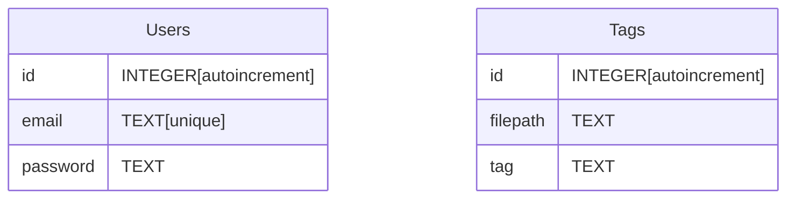

# 3.2.2 - Data Structures

> Describing all the custom data structures I will be creating in order to make this project function as it should whilst maximising modularity, readability, and the ability for future development to be as easy as possible for me and/ or others

## Types

For any custom types I make, I plan to keep them within the `types` directory in order to keep the codebase organised, understandable and as concise as possible. Within `types` is the TypeScript file containing all these custom types. **Each type has a comment above it to explain its purpose:**

`types/index.ts`:

```tsx
import { TreeNodeData } from '@mantine/core';

// the type of the function retrieving the relevant filetree from the user's filesystem in the `TreeNodeData[]` format
export type GetTreeNodeData = (path: string) => Promise<Array<TreeNodeData>>;

// the type of the function retrieving the contents of a particular file from the user's filesystem
export type GetFileContents = (path: string) => Promise<string>;

// the type of the API containing the different functions that communicate with `main` (the backend)
export type IpcAPI = {
  getTreeNodeData: GetTreeNodeData;
  getFileContents: GetFileContents;
  openDirectorySelector: () => Promise<string>;
  openFileSelector: (options: {
    filters: Array<{ name: string; extensions: string[] }>;
  }) => Promise<string>;
  createCredentials: (email: string, password: string) => Promise<boolean>;
  checkCredentials: (email: string, password: string) => Promise<boolean>;
  updateEmail: (oldEmail: string, newEmail: string) => Promise<boolean>;
  updatePassword: (email: string, password: string) => Promise<boolean>;
  saveFile: (filePath: string, content: string) => Promise<boolean>;
  renameFile: (
    oldPath: string,
    newTitle: string
  ) => Promise<{
    success: boolean;
    path: string;
  }>;
  getResourcePath: () => Promise<string>;
  getFileTags: (filePath: string) => Promise<{ tags: Array<string> }>;
  saveFileTags: (filePath: string, tags: Array<string>) => Promise<boolean>;
  getGlobalTags: (directoryPath: string) => Promise<{ tags: Array<string> }>;
};

// an interface to access the IpcAPI from
declare global {
  interface Window {
    ipcAPI: IpcAPI;
  }
}

// a type containing the coordinates of any node in the network
export type Position = {
  x: number;
  y: number;
};

// an interface made up of attributes used to describe any node in the network fully (contains all data required to render each node and find their file contents)
export interface Node {
  id: number;
  x: number;
  y: number;
  title: string;
  filePath: string;
  connections: Array<number>; // Array of connected node IDs
  mass: number | 1;
  vx: number | 0; // speed in x direction
  vy: number | 0; // speed in y direction
  radius: number;
  tags: Array<string>;
}

// an interface containing the unique ids of the nodes a connection is drawn from and to
export interface Connection {
  from: number;
  to: number;
}

// an interface defining what properties the node network element can have passed to it (the files that will be rendered as nodes)
export interface NodeNetworkProps {
  files: Array<TreeNodeData>;
}

// a type containing all the properties each file icon (displayed the the left of each file name in the sidebar) will have
export type FileIconProps = {
  name: string;
  isFolder: boolean;
  expanded: boolean;
};

// a type containing the details that make up each user's account, used to validate logins
export type UserCredential = {
  email: string;
  password: string;
};

// a type containing the properties that can be passed into the physics controls element (the sliders)
export type PhysicsControlsProps = {
  protectedRange: number;
  visualRange: number;
  avoidFactor: number;
  turnFactor: number;
  centeringFactor: number;
  matchingFactor: number;
  maxSpeed: number;
  nodeRadius: number;
  onUpdate: (param: string, value: number) => void;
};

// a type containing the properties that can be passed in to the create file element (the data needed to create a new file)
export type CreateFileProps = {
  filePath: string;
  name: string;
  files: Array<TreeNodeData>;
};

// a type containing the properties that can be passed in to the theme module element (data needed to create a theme module)
export type ThemeModuleProps = {
  themeName: string;
  label: string;
  backgroundColour: string;
  foregroundColour: string;
  secondaryColour: string;
};
```

## Database Structures

For this project, I'll need a database in order to store the account details of users to log in, and the tags they attach to different files, and these must persist even once the app is quit. Therefore, it is justifiable to create a new folder, `db`, and store within it a database file 'nodepad.sqlite3' in order to use a database in my project.

The database I've designed will be very simple. There are two tables, `Users` and `Tags` which do not relate in any way:



### Users

The Users table stores the credentials of any account registered for NodePad:

- `id` - the unique primary key for the Users table. A unique identifier that auto-increments with each new record added
- `email` - the email to a specific account. This must be unique in order to identify each account uniquely
- `password` - the password used to access a particular account. This is required in combination with the email allow the user to successfully log in, but does not need to be unique, as different accounts can use the same password

### Tags

The Tags table stores data on the tags attached to each file:

- `id` - the primary key for th Tags table. A unique identifier that auto-increments with each new record added
- `filepath` - the path to a specific file. Used to describe where each tag is attached
- `tag` - the name of a tag attached to a specific file. _Note that each record holds one tag, so there can be multiple records for the same filepath, each containing a different tag attached to that file_

The `filepath` and `tag` attributes must be unique pairs as well, otherwise the same tag could be saved to a filepath several times, so they come as the unique pair `UNIQUE(filepath, tag)`.

See next: [](.)
