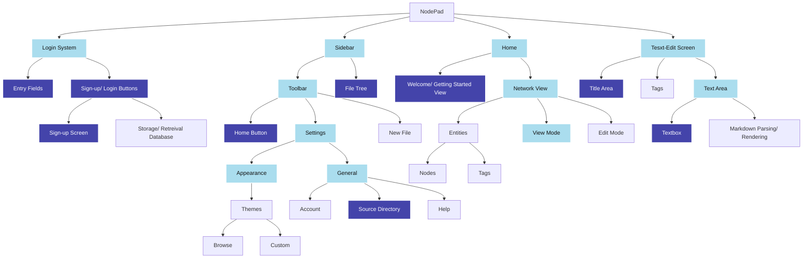

# 3.2 - Decomposition
>

## Top-down Model
Below is a more detailed, consolidated version of the earlier top-down models I provided in previous sections:

```mermaid

flowchart TD

	A --> U[Login System]:::highlight-half
	U --> V[Entry Fields]:::highlight
	U --> W[Sign-up/ Login Buttons]:::highlight
	W --> Z[Sign-up Screen]:::highlight
	W --> ZA[Storage/ Retreival Database]

  A[NodePad] --> B[Sidebar]:::highlight-half
  B --> C[Toolbar]:::highlight-half
  B --> D[File Tree]:::highlight
  C --> E[Home Button]:::highlight
  C --> F[Settings]:::highlight-half
  F --> G[Appearance]:::highlight-half
  G --> H[Themes]
  H --> Browse
  H --> Custom
  F --> X[General]:::highlight-half
  X --> Account
  X --> Y[Source Directory]:::highlight
  X --> Help
  C --> J[New File]

  A --> K[Home]:::highlight-half
  K --> L[Welcome/ Getting Started View]:::highlight
  K --> M[Network View]:::highlight-half
  M --> N[Entities]
  N --> Nodes
  N --> Tags
  M --> O[View Mode]:::highlight-half
  M --> P[Edit Mode]

  A --> Q[Tesxt-Edit Screen]:::highlight-half
  Q --> R[Title Area]:::highlight
  Q --> S[Tags]
  Q --> T[Text Area]:::highlight-half
  T --> ZB[Textbox]:::highlight
  T --> ZC[Markdown Parsing/ Rendering]

  classDef highlight fill:#44a,stroke:#fff,stroke-width:2px,color:#fff
  classDef highlight-half fill:#ade,stroke:#fff,stroke-width:2px,color:#111
```

### Justification
