# 3.3 - Interface Designs

> _A breakdown of all design choices made, & preliminary designs for the UI of each screen_

## Design Choices

This space is for choices I've made with regards to global design _i.e. specifications for styling that is maintained throughout the app, such as choice of font(s)_.

### Typography

#### Font(s)

For any text within the app, I've decided on two main fonts:

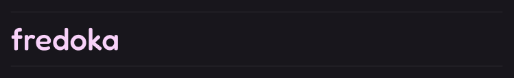

...and:

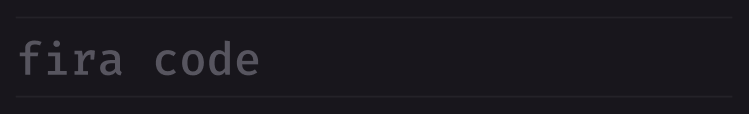

I find these fonts combine a fun atmosphere, with the curly yet still relatively formal nature of `fredoka`, with the serious `firacode` coding font, providing a feeling of both excitement/ interest with productivity, and work focus. The majority of user-inputted text will be in `firacode`, however I hope to be able to make all headings render in `fredoka` in the markdown editor.

#### Sizes

### Schemes

For the app's default colour scheme, I decided on a blend of presentable/ modern, and still interesting/ stimulating for the user. For this reason, I decided on a deep purple undertone throughout the colour scheme - similar to the blues used throughout industry-standard software, _for example, GitHub's default dark background is a very deep blue_ - however the purple can give the app a slightly more adventurous, unique appeal:

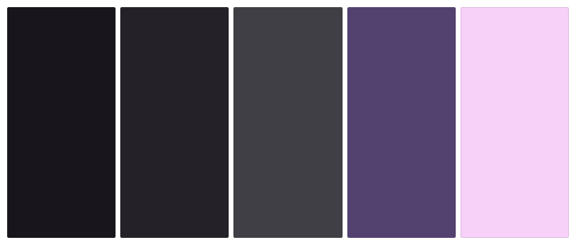

These are the predominant colours that will be present within the app's UI - the lighter colours become more exciting - these will be much more scarce due to their more 'pop-y', bright nature, and I aim to roughly follow the [60:30:10 split](https://www.freecodecamp.org/news/the-60-30-10-rule-in-design/).

## Screens

For the UI of the app as a whole, I've decided to take a simplistic, minimalist approach, keeping everything as simplified whilst maintaining optimal intuitiveness. I experimented with using Figma for the first time in order to draw up my designs digitally, allowing me to get much closer to how the actual project will look than drawings would - below are drafts of how I aim to make the UI look for each screen:

### Login

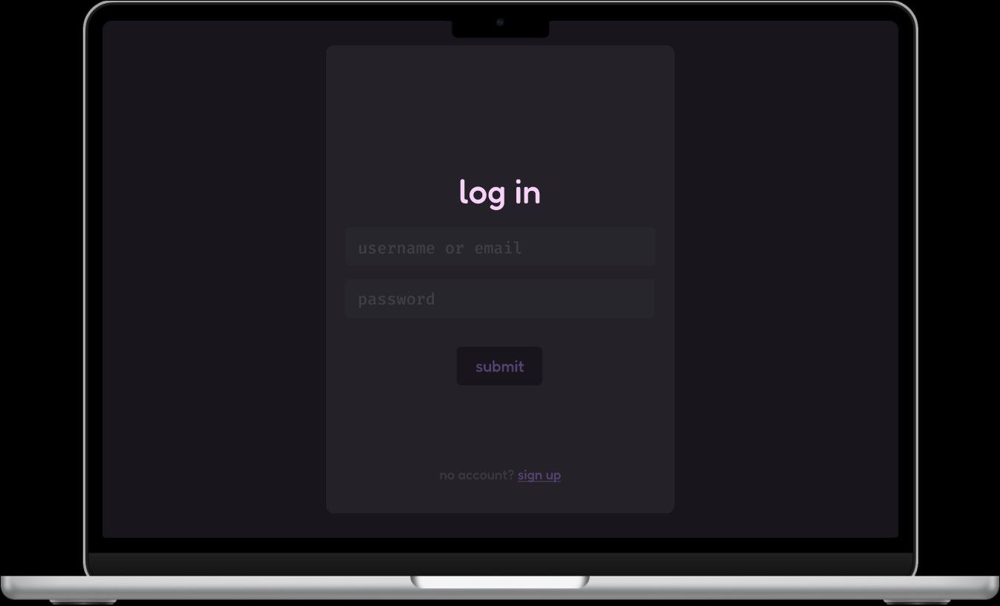

In order to keep with the simplistic UI ideology, the only information on the page is necessary for the login. It's clear straight away what the page is displaying through the use of a large, bright title 'log in' near the centre of the page. The light grey 'card-like' `
` behind it brings the user's attention to the centre of the page, towards the entry fields, increasing intuitiveness and ease of use, with a minimal `sign up` button by the bottom of the page. It can be this small because there is no other information (_that isn't related to logging in_) on the page, so there is little need to draw too much attention to it.

### Signup

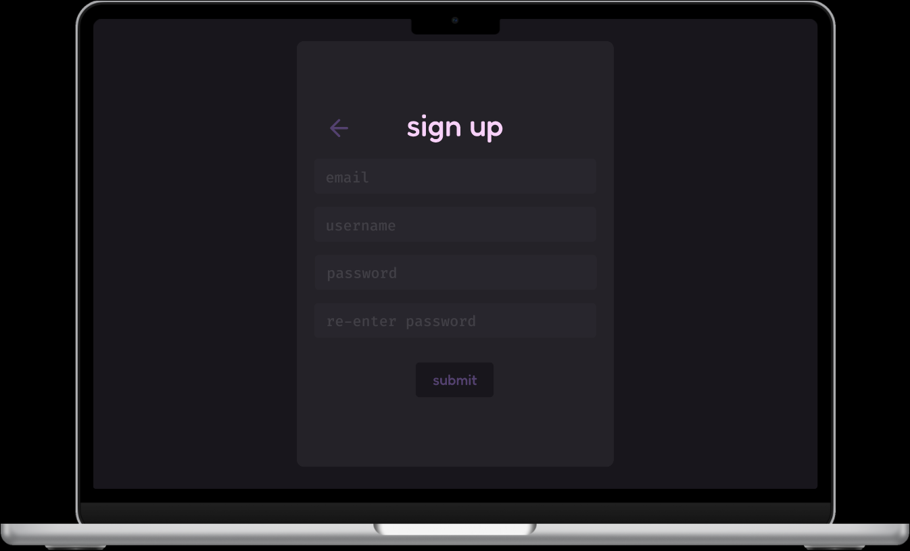

This page is essentially a copy of the login page, making only the changes I needed to for it to work as a sign up page. I aimed to keep the elements as similar and as close in position to the elements in the login page - this means that switching between the two by clicking on `sign up` (in the login page) or `submit` (in the signup page) will not be visually confusing/ difficult to follow. The colouring is consistent, with buttons being assigned the same shades of purple as the login page.

### Sidebar

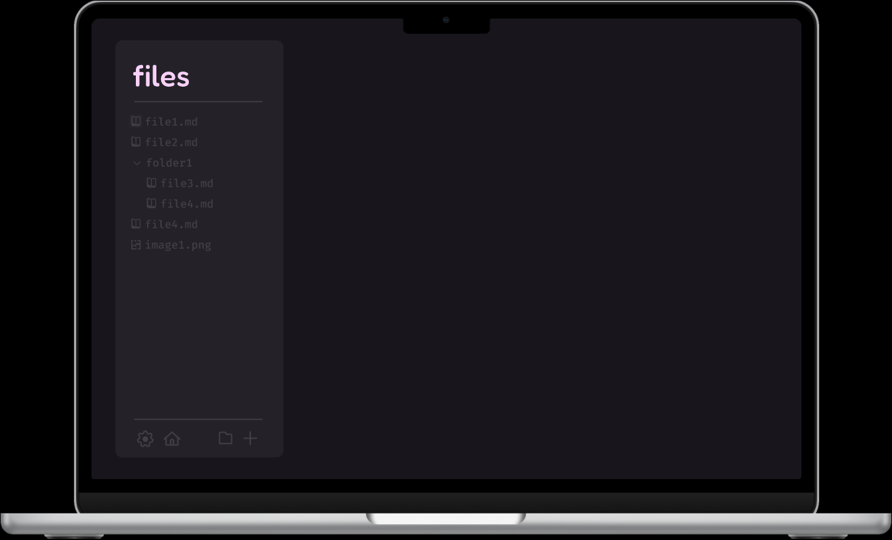

The sidebar is split into 3 sections - the title area, the file tree area and the toolbar. In order to keep this design minimal (_this will be present even when the user is taking notes, meaning it can't be too much of a distraction_), I kept the colour of most elements quite muted in the context of their background, and the same colour. This indifference makes it easy on the eyes and less of a visual distraction when the user isn't directly looking at it. The only stand-out area is the title, which will be the name of the source directory picked by the user. This is in a soft pink, following the theme of the rest of the app, with this colour representing an important piece of information. Additionally, as seen in the screens below, if a file is selected, it will have an elevated, slightly lighter grey box beneath it, and the file name and icon will be highlighted in the same pink as the title.

### Home

#### Welcome

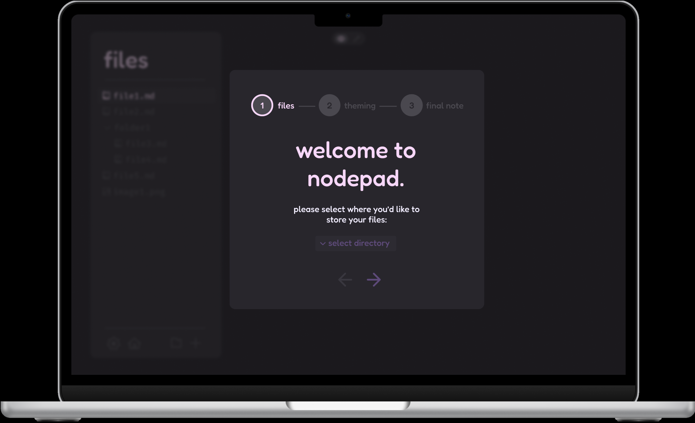

This section will make use of mantine's [modal](https://mantine.dev/core/modal/) component for the 'card' style UI, along with the [stepper](https://mantine.dev/core/stepper/) component as the progress bar at the top to suggest to the user that there are several steps to be completed in order to get set up in the app - I may prefer to implement this with [a form with steps](https://mantine.dev/form/recipes/#form-with-multiple-steps), as this requires validation for the next step to be reached (_i.e the user must do certain things in order for the app to start_). I aimed to maintain consistency not only within each page, but across pages given that the user will be moving between them. This means, for example, keeping titles the same size, colour and position on the page, so as not to disorientate the user when navigating between pages 1, 2 and 3.

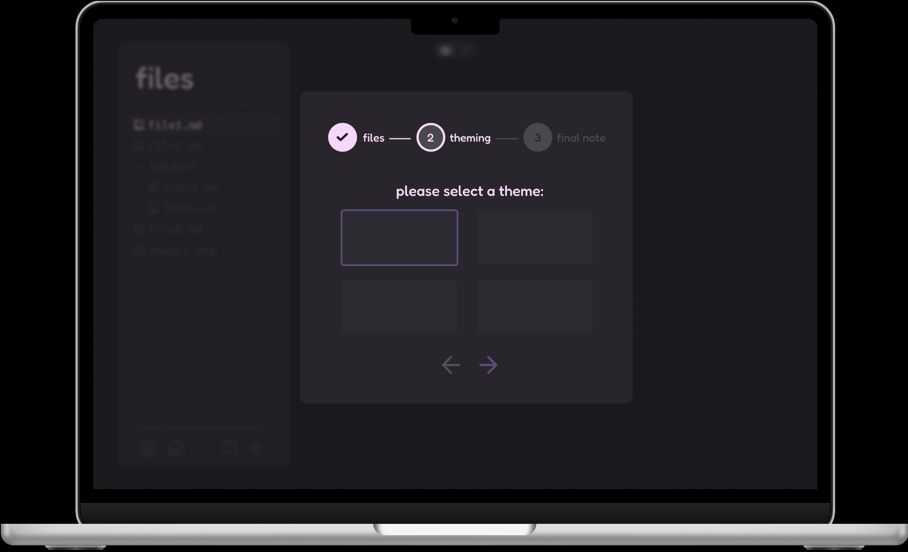

These pages cover basic user preferences needed in order for the app to open correctly and intuitively for them - they shouldn't have try to navigate settings straight away in order to change things such as theme and source directory immediately. Ideally the app should be ready to go with no setup, but this is not entirely possible without sacrificing ease of use and beginner-friendliness.

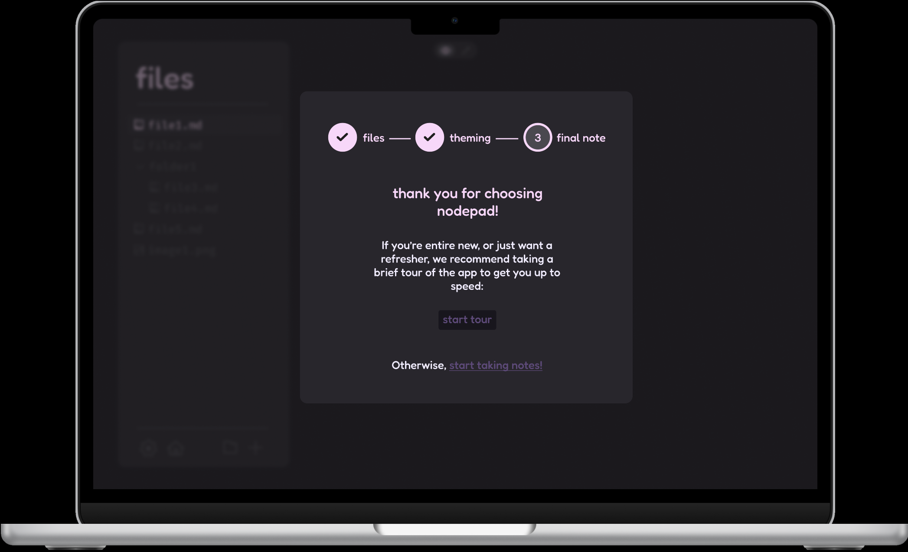

#### View mode

Incorporating the sidebar into this page, the view mode contains the `<canvas>` element containing the network of nodes. If a file is selected in the sidebar, it highlights the relevant node in purple (_this could be subject to change, I may want to switch the colours of selected and unselected nodes_). There is a small panel at the top of the screen, in the centre allowing the user to toggle between view and edit mode quickly and intuitively, with icons that the user will be able to recognise as `view` and `edit` with eye and pencil icons - these are highlighted in pink with a light grey box beneath it to symbolise that they've been selected respectively. In order to make sure this is feasible, I checked the documentation for Mantine, the UI library I'm using, and found [a viable option](https://mantine.dev/core/segmented-control/) for achieving this effect.

#### Edit mode

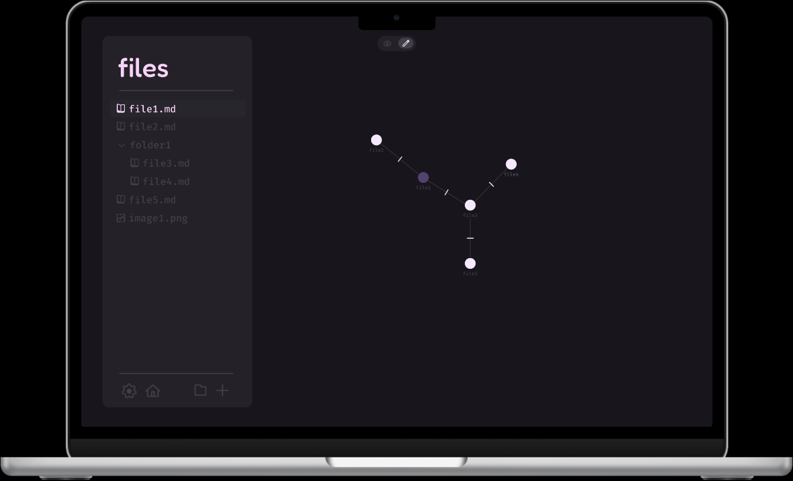

This page is very similar to the view mode - the main differences are that the toggle at the top is switched to `edit` mode, and the connections between nodes have lines on them, to represent they can be clicked in order to remove the connection. Additionally, nodes will have dotted circles around them in order to indicate they are in a state where they can be edited. This also gives a clearer indication that the user has switched modes, without needing to check the toggle at the top of the page to know which mode they're currently in.

### Text Editor

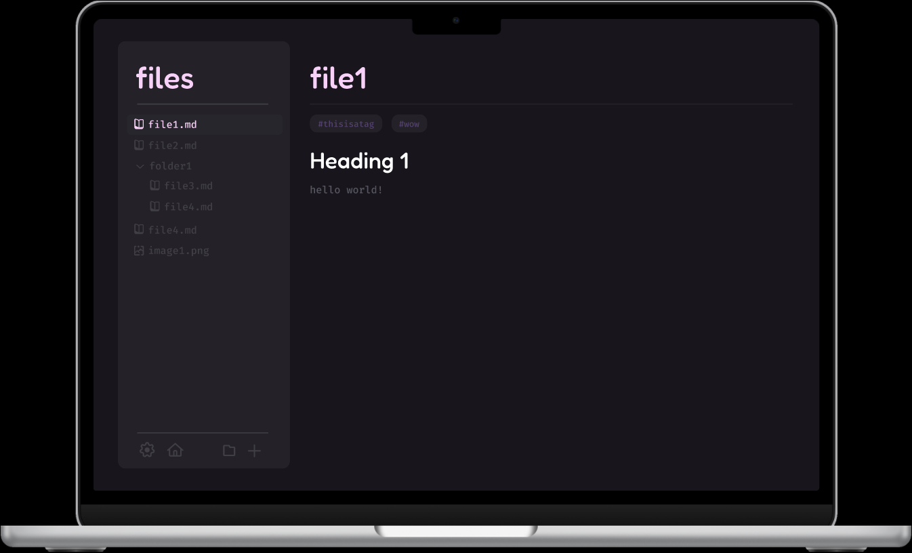

This contains 3 main sections as specified:

- the title is where the name of the file is displayed - this can be changed by the user dynamically as they're editing. This is in pink to suggest it is a piece of key information - this subconsciously drags the user's eyes to it, allowing them to easily and efficiently track which file they're currently editing.
- the tags section is a small area immediately below the title - the user can type in a tag by prefixing a word with a `#`, or clicking the `+` button. These are using a subtle colour-way, in a unique colour to display they're difference to the rest of the page, whilst being relatively easy on the eyes due to being quite dark/ muted.
- the text area is where the user will write in markdown - this is in white for the headings, making them pop visually, and a light grey for other text. This is rendered live in the space where it's written.

### Settings

I aim to make use of Mantine's built-in UI component, the [modal](https://mantine.dev/core/modal/) component, for the settings page.

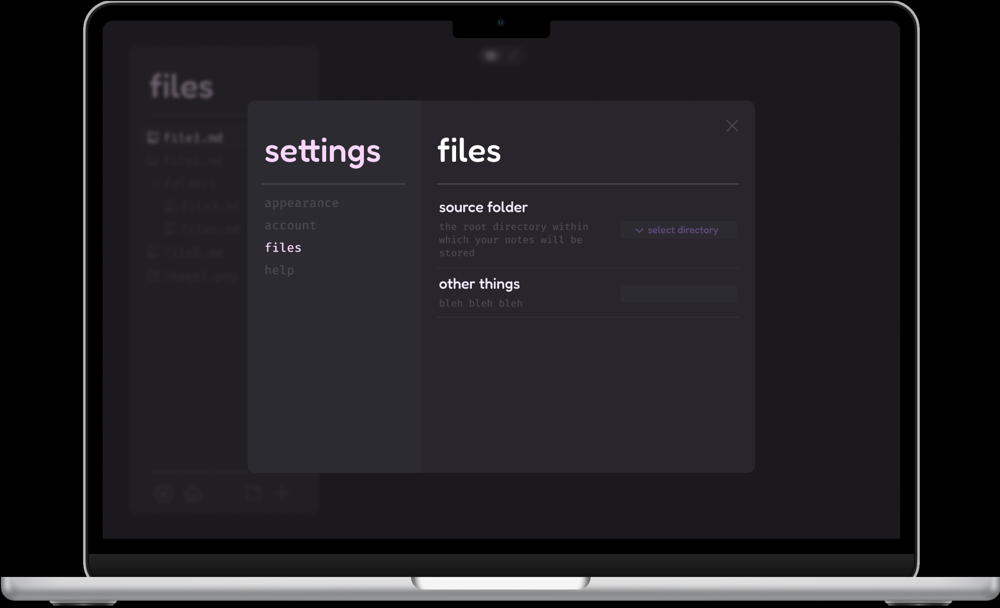

## The 5 E's

The five E's, and how I've used them within my design, are:

- **Effective** - the interface should perform its intended purpose. I've ensured this by thoroughly considering how different screens should fit together, _e.g with links, and how to implement them_, as well as implementing all the functionality I want in the app (visually)
- **Efficient** - navigation of the interface will be made efficient by: reducing the clutter on the page, ensuring there's only one way to navigate somewhere (_i.e. there aren't multiple `home` buttons on screen_), and placing these navigational tools in intuitive and easy-access places - _for example, the toolbar is where the majority of buttons will be located, all near each other so the user doesn't have to move the mouse far_
- **Engaging** - The colour scheme and font choices aim to make the UI formal, but still interesting/ enticing. The use of purples and pinks, along with two different fonts with entirely different qualities, helps to make the app engaging and actively enticing to the user, keeping them engaged and (somewhat) entertained when using it
- **Error-tolerant** - I've ade extensive use of buttons, toggles, switches and menus, using them wherever I can. This reduces the vast majority of errors the user could cause, as user input is the highest risk to an app's integrity and security. By using these interactive elements, I reduce the chance of the user being able to input anything potentially harmful/ damaging to the app - this has the added bonus of making the app more immersive and dynamic, again making it more interactive and **engaging**
- **Easy to learn** - The app should have as low a barrier to entry as possible. I've achieved this by: stripping back the UI to it's bare bones, leaving nothing more than what needs to be there (abstracting he processes within the app), using intuitive, familiar icons (I've researched icons that are most commonly associated with the elements I want in my app to use in the project), as well as providing a welcome page to familiarise the user with the app's environment quickly and easily. I've also followed commonly used design principles, such as the 60:30:10 rule in order to make the product as professional and commercially viable as possible
