# 4.1 - Post-Development Testing

> _Evidence of all black-box testing done upon the completion of the development stage_

Below are the tests planned in [post development testing](../3%20-%20Design/3.2%20-%20Design%20Part%20II/3.2.3-post_development_test_data.md), along with their evidence and results. They are based on my original success criteria, so the results can be used as a measure of success, as well as a measure of robustness and function:

## Test 1:

| Test No. | Desired Outcome                                                                                                                            | Link to [Success Criteria](../../1%20-%20Analysis/1.7-success_criteria.md) (referencing the 'Feature' column) | Justification                                                                                                                                                                                                                                                                                                | Test Data                                                         | Actual Outcome                                 | Conclusion          |
| -------- | ------------------------------------------------------------------------------------------------------------------------------------------ | ------------------------------------------------------------------------------------------------------------- | ------------------------------------------------------------------------------------------------------------------------------------------------------------------------------------------------------------------------------------------------------------------------------------------------------------ | ----------------------------------------------------------------- | ---------------------------------------------- | ------------------- |
| 1        | Theming stays consistent throughout the app - the colours, fonts, spacing etc. remains consistent and intuitive in every screen in the app | "Consistent and aesthetically pleasing UI"                                                                    | In order ot align with the principle providing an aesthetically pleasing app, it is essential that the user is satisfied and enjoys how the app feels and looks while taking notes - this experience mustn't be disturbed or broken down at any point by a UI that does not stay consistent and professional | Navigate through the entire app, inspecting each screen carefully | The Actual Outcome matches the Desired Outcome | Complete Success ✅ |

## Test 2:

| Test No. | Desired Outcome                                                                          | Link to [Success Criteria](../../1%20-%20Analysis/1.7-success_criteria.md) | Justification                                                                                                                                                                        | Test Data                                                                                                                          | Actual Outcome                                                                                                                                    | Conclusion         |
| -------- | ---------------------------------------------------------------------------------------- | -------------------------------------------------------------------------- | ------------------------------------------------------------------------------------------------------------------------------------------------------------------------------------ | ---------------------------------------------------------------------------------------------------------------------------------- | ------------------------------------------------------------------------------------------------------------------------------------------------- | ------------------ |
| 2        | When the theme is changed, the new theme is applied everywhere, to every part of the app | "Consistent and aesthetically pleasing UI"                                 | The app cannot be considered to be consistent in styling/ theming if only the default theme is applied everywhere - this ,ust be the case for _every_ theme the user can select from | Switch between each theme that can be selected, navigating through the entire app for each theme, inspecting each screen carefully | The themes are consistent everywhere, with the very small exception of an off-white colouration for some small UI elements in the light them only | Partial Success 🟨 |

## Test 3:

| Test No. | Desired Outcome                                                                                                      | Link to [Success Criteria](../../1%20-%20Analysis/1.7-success_criteria.md) | Justification                                                                                                                                                                                                          | Test Data     | Actual Outcome                                 | Conclusion          |
| -------- | -------------------------------------------------------------------------------------------------------------------- | -------------------------------------------------------------------------- | ---------------------------------------------------------------------------------------------------------------------------------------------------------------------------------------------------------------------- | ------------- | ---------------------------------------------- | ------------------- |
| 3        | The user is brought to the login page upon the app being started, with the app window filling the size of the screen | "Login page"                                                               | In order for the user to open the app using their account, they must log in - the sooner this is done, the quicker they can take their notes, so having this be the page the user is always greeted with is favourable | Start the app | The Actual Outcome matches the Desired Outcome | Complete Success ✅ |

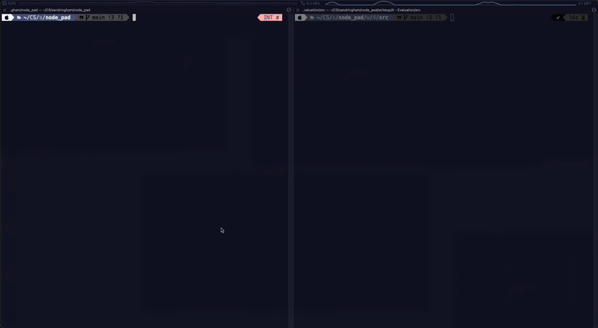

## Test 4:

| Test No. | Desired Outcome                                                                               | Link to [Success Criteria](../../1%20-%20Analysis/1.7-success_criteria.md) | Justification                             | Test Data                                                                                  | Actual Outcome                                 | Conclusion          |
| -------- | --------------------------------------------------------------------------------------------- | -------------------------------------------------------------------------- | ----------------------------------------- | ------------------------------------------------------------------------------------------ | ---------------------------------------------- | ------------------- |
| 4        | Upon entering valid details, the user is logged into the app and navigated to the home screen | "Login page"                                                               | The login feature must function correctly | Enter valid details into the login fields (credentials that already exist in the database) | The Actual Outcome matches the Desired Outcome | Complete Success ✅ |

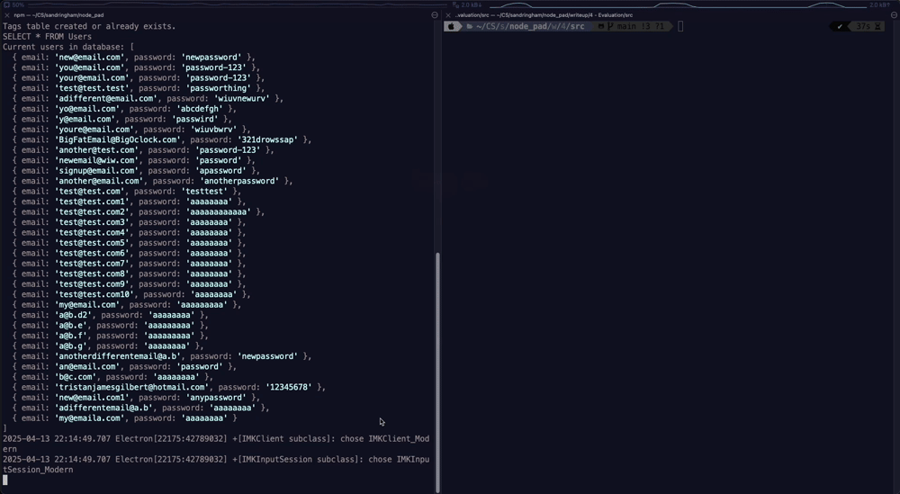

## Test 5:

| Test No. | Desired Outcome                                           | Link to [Success Criteria](../../1%20-%20Analysis/1.7-success_criteria.md) | Justification                                                                                                                                                                                                                                                                                      | Test Data                                                  | Actual Outcome                                 | Conclusion          |
| -------- | --------------------------------------------------------- | -------------------------------------------------------------------------- | -------------------------------------------------------------------------------------------------------------------------------------------------------------------------------------------------------------------------------------------------------------------------------------------------- | ---------------------------------------------------------- | ---------------------------------------------- | ------------------- |
| 5        | The user can access the signup page via the signup button | "Signup page"                                                              | Given that the users must log in, there must also be an easy and accessible means for which the users to create a new account. This also makes it easier to give new users a welcome screen, as the program can differentiate between users that have logged in and users that have just signed up | Click the 'sign up' button at the bottom of the login page | The Actual Outcome matches the Desired Outcome | Complete Success ✅ |

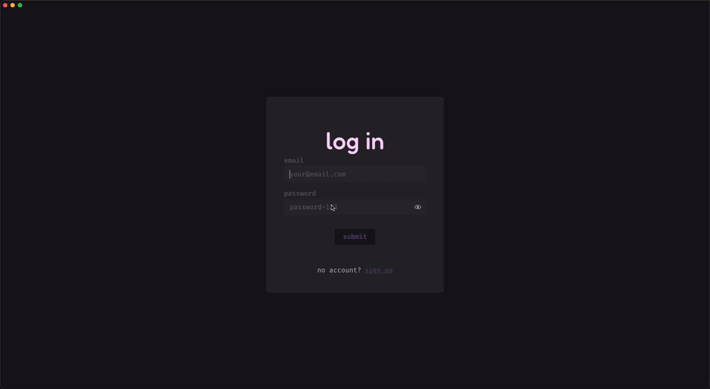

## Test 6:

| Test No. | Desired Outcome                                                                                                                      | Link to [Success Criteria](../../1%20-%20Analysis/1.7-success_criteria.md) | Justification                                                                                                                                                                                                                                             | Test Data                                                                                                                       | Actual Outcome                                 | Conclusion          |
| -------- | ------------------------------------------------------------------------------------------------------------------------------------ | -------------------------------------------------------------------------- | --------------------------------------------------------------------------------------------------------------------------------------------------------------------------------------------------------------------------------------------------------- | ------------------------------------------------------------------------------------------------------------------------------- | ---------------------------------------------- | ------------------- |
| 6        | Upon entering valid details, the user has their new account created, and is logged into the app to be welcomed by the welcome screen | "Signup page" / "Welcome view"                                             | It's key to make the signup experience as streamlined as possible, so the user should be logged in as soon as their account is created. Additionally, since they are a new user, they should be greeted by a welcome screen to guide them through the app | Enter valid details into the signup fields (credentials that don't already exist in the database, and pass frontend validation) | The Actual Outcome matches the Desired Outcome | Complete Success ✅ |

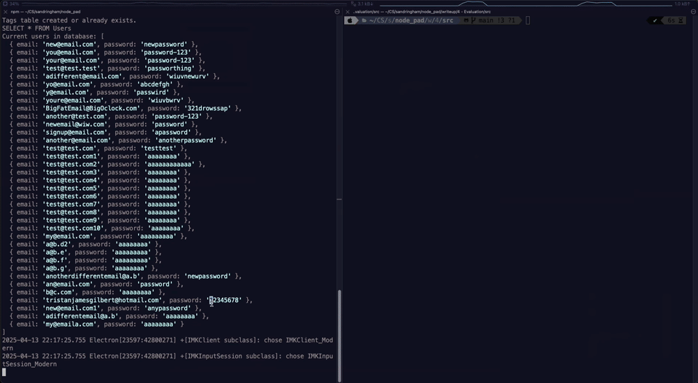

## Test 7:

| Test No. | Desired Outcome                                                                                                       | Link to [Success Criteria](../../1%20-%20Analysis/1.7-success_criteria.md) | Justification                                                                                                                                                                        | Test Data                                                                      | Actual Outcome                                                                                                                                    | Conclusion         |
| -------- | --------------------------------------------------------------------------------------------------------------------- | -------------------------------------------------------------------------- | ------------------------------------------------------------------------------------------------------------------------------------------------------------------------------------ | ------------------------------------------------------------------------------ | ------------------------------------------------------------------------------------------------------------------------------------------------- | ------------------ |
| 7        | New users are greeted by a welcome screen that gets them started, and gets them accustomed to taking notes on NodePad | "Welcome view"                                                             | As new users may have never seen the app before, it's important they're brought up to speed on how to use the app, as well as setting them up to have the app working as they desire | Create a new account and navigate through all the steps the welcome screen has | The Actual Outcome matches the Desired Outcome, though I believe the app should also tell the user where to go for help (App -> Settings -> Help) | Partial Success 🟨 |

## Test 8:

| Test No. | Desired Outcome                                                 | Link to [Success Criteria](../../1%20-%20Analysis/1.7-success_criteria.md) | Justification                                                                                                     | Test Data                                                                                                     | Actual Outcome                                 | Conclusion          |
| -------- | --------------------------------------------------------------- | -------------------------------------------------------------------------- | ----------------------------------------------------------------------------------------------------------------- | ------------------------------------------------------------------------------------------------------------- | ---------------------------------------------- | ------------------- |
| 8        | Home screen is easily accessible from everywhere within the app | "Home"                                                                     | Given the importance of home in the app, housing many important features such as the node network and the sidebar | Visit all screens and identify that there is a home button, or other easy exit directly back to the home page | The Actual Outcome matches the Desired Outcome | Complete Success ✅ |

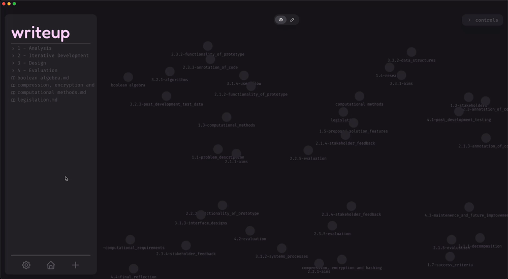

## Test 9:

| Test No. | Desired Outcome                                                                               | Link to [Success Criteria](../../1%20-%20Analysis/1.7-success_criteria.md) | Justification                                                                                                                                                                                                                                                         | Test Data                                                                                                                                                                                                          | Actual Outcome                                 | Conclusion          |
| -------- | --------------------------------------------------------------------------------------------- | -------------------------------------------------------------------------- | --------------------------------------------------------------------------------------------------------------------------------------------------------------------------------------------------------------------------------------------------------------------- | ------------------------------------------------------------------------------------------------------------------------------------------------------------------------------------------------------------------ | ---------------------------------------------- | ------------------- |
| 9        | Sidebar provides access to all notes within the user's selected root directory via a filetree | "Sidebar"                                                                  | The user should be able to see and open their notes quickly and easily from anywhere in the app, meaning even when in the text editor, they can find their note in the sidebar and open it without having to navigate home and open the note through the node network | Open the app to the home screen, and verify that all the files within the root directory are displayed correctly in a filetree in the sidebar, where these notes can be clicked on to open them in the text editor | The Actual Outcome matches the Desired Outcome | Complete Success ✅ |

## Test 10:

| Test No. | Desired Outcome                                                                    | Link to [Success Criteria](../../1%20-%20Analysis/1.7-success_criteria.md) | Justification                                                                                                                                                                | Test Data                                                                    | Actual Outcome                                 | Conclusion          |
| -------- | ---------------------------------------------------------------------------------- | -------------------------------------------------------------------------- | ---------------------------------------------------------------------------------------------------------------------------------------------------------------------------- | ---------------------------------------------------------------------------- | ---------------------------------------------- | ------------------- |
| 10       | Sidebar contains a toolbar with features allowing the user to perform key actions: | "Sidebar"                                                                  | There should be a singular place where the user can perform important actions related to navigation and file creation, as this makes for way easier interaction with the app | Open the app in the home view, and analyse the sidebar for a toolbar section | The Actual Outcome matches the Desired Outcome | Complete Success ✅ |

  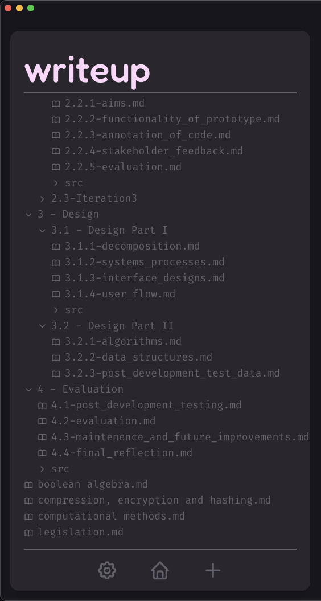

## Test 11:

| Test No. | Desired Outcome      | Link to [Success Criteria](../../1%20-%20Analysis/1.7-success_criteria.md) | Justification                                                                                                                                             | Test Data                                                                                       | Actual Outcome                                 | Conclusion          |
| -------- | -------------------- | -------------------------------------------------------------------------- | --------------------------------------------------------------------------------------------------------------------------------------------------------- | ----------------------------------------------------------------------------------------------- | ---------------------------------------------- | ------------------- |
| 11       | a) create a new file | "Sidebar"                                                                  | It's paramount that in a note-taking app the user can create new notes from directly within the app, otherwise the app would be almost entirely pointless | Navigate to any view in the app after logging in, and find and click on the new file (+) button | The Actual Outcome matches the Desired Outcome | Complete Success ✅ |

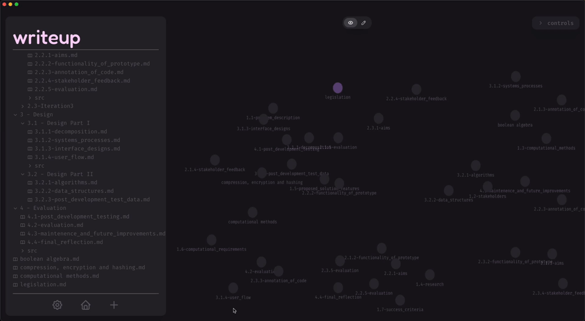

## Test 12:

| Test No. | Desired Outcome        | Link to [Success Criteria](../../1%20-%20Analysis/1.7-success_criteria.md) | Justification                                                                                                                                             | Test Data                                                                                              | Actual Outcome                                                    | Conclusion          |
| -------- | ---------------------- | -------------------------------------------------------------------------- | --------------------------------------------------------------------------------------------------------------------------------------------------------- | ------------------------------------------------------------------------------------------------------ | ----------------------------------------------------------------- | ------------------- |
| 12       | b) create a new folder | "Sidebar"                                                                  | Additionally, it's important, though not as vital, for the user to be able to make new folders within which they can organise their notes in the filetree | Navigate to any view in the app after logging in, and find and click on the new folder (folder) button | There is no option for the user to create a new folder in the app | Complete Failure ❌ |

The app does not provide an option to create a new folder:

  

## Test 13:

| Test No. | Desired Outcome              | Link to [Success Criteria](../../1%20-%20Analysis/1.7-success_criteria.md) | Justification                                                                                                                                                                                  | Test Data                                                                                           | Actual Outcome                                 | Conclusion          |
| -------- | ---------------------------- | -------------------------------------------------------------------------- | ---------------------------------------------------------------------------------------------------------------------------------------------------------------------------------------------- | --------------------------------------------------------------------------------------------------- | ---------------------------------------------- | ------------------- |
| 13       | c) navigate to the home page | "Sidebar"                                                                  | The user should be able to navigate hom from anywhere in the app. Since the sidebar is present almost everywhere in the app, a home button located in the sidebar would help achieve this goal | Navigate to any view in the app after logging in, and find and click on the new home (house) button | The Actual Outcome matches the Desired Outcome | Complete Success ✅ |

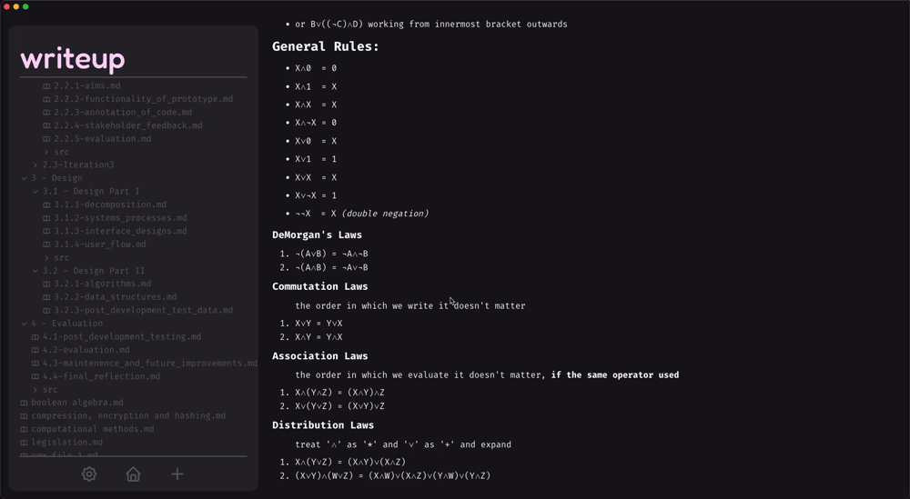

## Test 14:

| Test No. | Desired Outcome           | Link to [Success Criteria](../../1%20-%20Analysis/1.7-success_criteria.md) | Justification                                                                                                                                                                                                                                                                                           | Test Data                                                                                             | Actual Outcome                                 | Conclusion          |
| -------- | ------------------------- | -------------------------------------------------------------------------- | ------------------------------------------------------------------------------------------------------------------------------------------------------------------------------------------------------------------------------------------------------------------------------------------------------- | ----------------------------------------------------------------------------------------------------- | ---------------------------------------------- | ------------------- |
| 14       | d) open the settings page | "Sidebar"                                                                  | The user must have an entry point by which to access the settings page in order to tweak/ change the app to their liking. Given above that the sidebar is present almost everywhere, it makes sense that the settings button be here as well, since this allows the user to open settings from anywhere | Navigate to any view in the app after logging in, and find and click on the new settings (cog) button | The Actual Outcome matches the Desired Outcome | Complete Success ✅ |

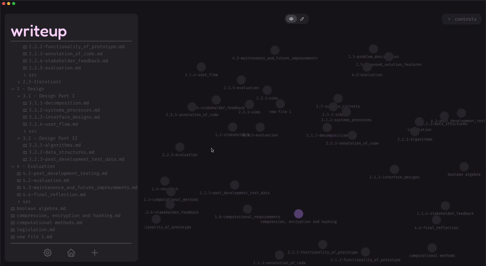

## Test 15:

| Test No. | Desired Outcome                                                     | Link to [Success Criteria](../../1%20-%20Analysis/1.7-success_criteria.md) | Justification                                                                                                                                                                                       | Test Data                                                                                               | Actual Outcome                                 | Conclusion          |
| -------- | ------------------------------------------------------------------- | -------------------------------------------------------------------------- | --------------------------------------------------------------------------------------------------------------------------------------------------------------------------------------------------- | ------------------------------------------------------------------------------------------------------- | ---------------------------------------------- | ------------------- |
| 15       | The node network renders all notes that are in the sidebar as nodes | "Network - View mode"                                                      | It's important that the nodes in the network are identical to the files displayed in the sidebar, as they are a visualisation of these files - this network is the main idea this project hinges on | Select a root directory and compare the files in the sidebar to the nodes displayed in the node network | The Actual Outcome matches the Desired Outcome | Complete Success ✅ |

## Test 16:

| Test No. | Desired Outcome                                                                                                          | Link to [Success Criteria](../../1%20-%20Analysis/1.7-success_criteria.md) | Justification                                                                                                                                                                              | Test Data                                                                                                                                                                                                                                       | Actual Outcome                                 | Conclusion          |
| -------- | ------------------------------------------------------------------------------------------------------------------------ | -------------------------------------------------------------------------- | ------------------------------------------------------------------------------------------------------------------------------------------------------------------------------------------ | ----------------------------------------------------------------------------------------------------------------------------------------------------------------------------------------------------------------------------------------------- | ---------------------------------------------- | ------------------- |
| 16       | The nodes in the node network are interactive, and the user can drag them, collide them and open them in the text editor | "Network - View mode"                                                      | In order to align with the idea that this app should be more fun and interactive that other note-taking apps on the market, it's essential the network is interactive and fun for the user | Navigate to the node network (in the home screen) and attempt to 1) drag nodes by clicking, holding and moving the cursor, 2) collide nodes by dragging a node into another, and, 3) open a node in the text editor by right clicking on a node | The Actual Outcome matches the Desired Outcome | Complete Success ✅ |

## Test 17:

| Test No. | Desired Outcome                                                                              | Link to [Success Criteria](../../1%20-%20Analysis/1.7-success_criteria.md) | Justification                                                                                                                                                                                | Test Data                                                                           | Actual Outcome                                 | Conclusion          |
| -------- | -------------------------------------------------------------------------------------------- | -------------------------------------------------------------------------- | -------------------------------------------------------------------------------------------------------------------------------------------------------------------------------------------- | ----------------------------------------------------------------------------------- | ---------------------------------------------- | ------------------- |
| 17       | The user can toggle between view and edit modes, allowing the user to differentiate between: | "Network - View mode" / "Network - Edit mode"                              | My aim is to make it as seamless and easy to use the app - one of the ways to do this would be to make it as easy and quick as possible to switch between editing and interacting with nodes | Identify the view-edit toggle at the top of the node network and click it to toggle | The Actual Outcome matches the Desired Outcome | Complete Success ✅ |

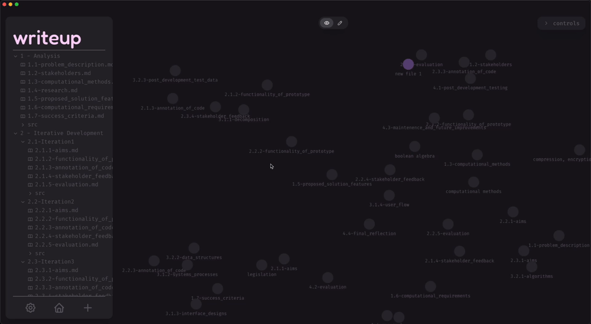

## Test 18:

| Test No. | Desired Outcome                                                                                  | Link to [Success Criteria](../../1%20-%20Analysis/1.7-success_criteria.md) | Justification                                                                                | Test Data                                                                                                                                         | Actual Outcome                                 | Conclusion          |
| -------- | ------------------------------------------------------------------------------------------------ | -------------------------------------------------------------------------- | -------------------------------------------------------------------------------------------- | ------------------------------------------------------------------------------------------------------------------------------------------------- | ---------------------------------------------- | ------------------- |
| 18       | a) view mode - where the user can play around with the network and open nodes in the text editor | "Network - View mode"                                                      | Similarly to before, the network must be interactive to align with the principles of the app | Ensure that the network is in view mode by clicking on the view-edit toggle until the eye icon is highlighted. Then verify that test 16 is passed | The Actual Outcome matches the Desired Outcome | Complete Success ✅ |

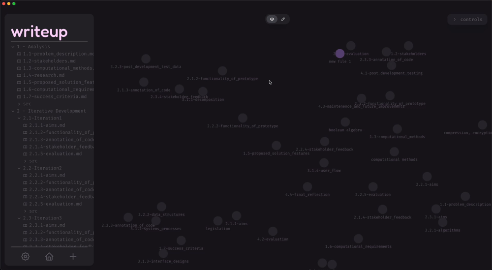

## Test 19:

| Test No. | Desired Outcome                                                                                  | Link to [Success Criteria](../../1%20-%20Analysis/1.7-success_criteria.md) | Justification                                                                                                                                                                                                                                                      | Test Data                                                                                                                                                                                                                                                                                                                   | Actual Outcome                                 | Conclusion          |
| -------- | ------------------------------------------------------------------------------------------------ | -------------------------------------------------------------------------- | ------------------------------------------------------------------------------------------------------------------------------------------------------------------------------------------------------------------------------------------------------------------ | --------------------------------------------------------------------------------------------------------------------------------------------------------------------------------------------------------------------------------------------------------------------------------------------------------------------------- | ---------------------------------------------- | ------------------- |
| 19       | b) edit mode - where the user can create/ delete connections between nodes by dragging/ clicking | "Network - Edit mode"                                                      | Since the app must be interactive, the view mode is necessary. However, if I want the user to be able to edit the network without intruding on the interactive element of the network, the edit mode is necessary to enable both criteria to be met simultaneously | Ensure that the network is in edit mode by clicking on the view-edit toggle until the eye icon is highlighted. Then attempt to drag a connection from one node to another by clicking, holding and dragging the cursor from the centre of one node to the centre of another, then click on the connection line to delete it | The Actual Outcome matches the Desired Outcome | Complete Success ✅ |

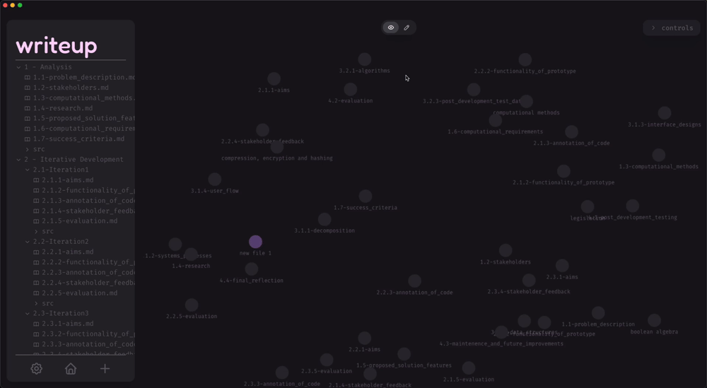

## Test 20:

| Test No. | Desired Outcome                                                                                   | Link to [Success Criteria](../../1%20-%20Analysis/1.7-success_criteria.md) | Justification                                                                                                                                                                        | Test Data                                                                  | Actual Outcome                                                                | Conclusion          |
| -------- | ------------------------------------------------------------------------------------------------- | -------------------------------------------------------------------------- | ------------------------------------------------------------------------------------------------------------------------------------------------------------------------------------ | -------------------------------------------------------------------------- | ----------------------------------------------------------------------------- | ------------------- |
| 20       | The user should be able to search through the network of nodes to quickly and visually find notes | "Network - Search"                                                         | It should be easy for the user to find their notes - a search achieves this, and making it visual by filtering out nodes visibly makes the app much more interactive and interesting | Press `cmd`/`ctrl`+`f` or the search icon and attempt to search for a note | There is no option for the user to search through the node network in the app | Complete Failure ❌ |

There is no way for the user to search through the node network or filetree.

## Test 21:

| Test No. | Desired Outcome                                                                                     | Link to [Success Criteria](../../1%20-%20Analysis/1.7-success_criteria.md) | Justification                                                                                                                        | Test Data                                                                      | Actual Outcome                                 | Conclusion          |
| -------- | --------------------------------------------------------------------------------------------------- | -------------------------------------------------------------------------- | ------------------------------------------------------------------------------------------------------------------------------------ | ------------------------------------------------------------------------------ | ---------------------------------------------- | ------------------- |
| 21       | The user should be able to navigate through a settings page, which contains the following sections: | "Settings"                                                                 | If I want the app to be customisable and accessible, the user should be able to tweak the app to their needs through a settings page | Click on the cog icon in the toolbar in the sidebar, or press `cmd`/`ctrl`+`,` | The Actual Outcome matches the Desired Outcome | Complete Success ✅ |

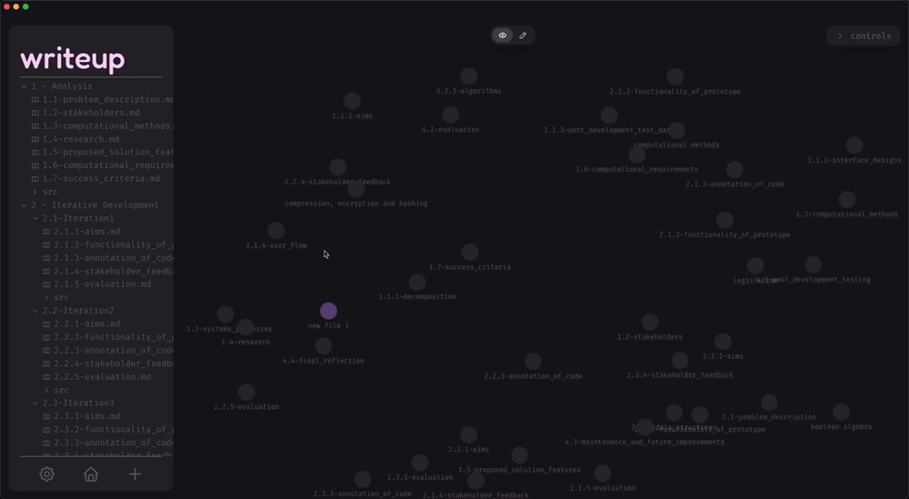

## Test 22:

| Test No. | Desired Outcome | Link to [Success Criteria](../../1%20-%20Analysis/1.7-success_criteria.md) | Justification                                                                                            | Test Data                                                                                     | Actual Outcome                                 | Conclusion          |
| -------- | --------------- | -------------------------------------------------------------------------- | -------------------------------------------------------------------------------------------------------- | --------------------------------------------------------------------------------------------- | ---------------------------------------------- | ------------------- |
| 22       | a) Themes       | "Settings - Themes"                                                        | The user should be able to visually customise the app by changing how it looks to suit their preferences | Open settings (_like in test 21_), navigate to the themes section, and change the app's theme | The Actual Outcome matches the Desired Outcome | Complete Success ✅ |

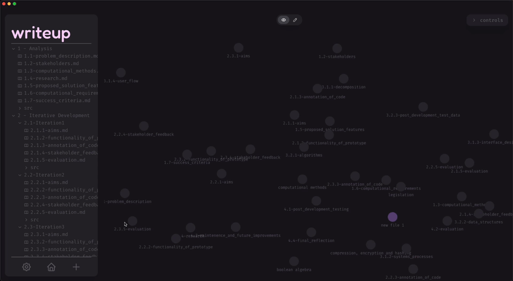

## Test 23:

| Test No. | Desired Outcome | Link to [Success Criteria](../../1%20-%20Analysis/1.7-success_criteria.md) | Justification                                                                                                                                                                    | Test Data                                                                    | Actual Outcome                                 | Conclusion          |
| -------- | --------------- | -------------------------------------------------------------------------- | -------------------------------------------------------------------------------------------------------------------------------------------------------------------------------- | ---------------------------------------------------------------------------- | ---------------------------------------------- | ------------------- |
| 23       | b) Account      | "Settings - Account"                                                       | The user should be able to modify details about their account, such as their email and password in order to make their account tweakable and usable such as professional apps do | Open settings, navigate to the account section and enter new account details | The Actual Outcome matches the Desired Outcome | Complete Success ✅ |

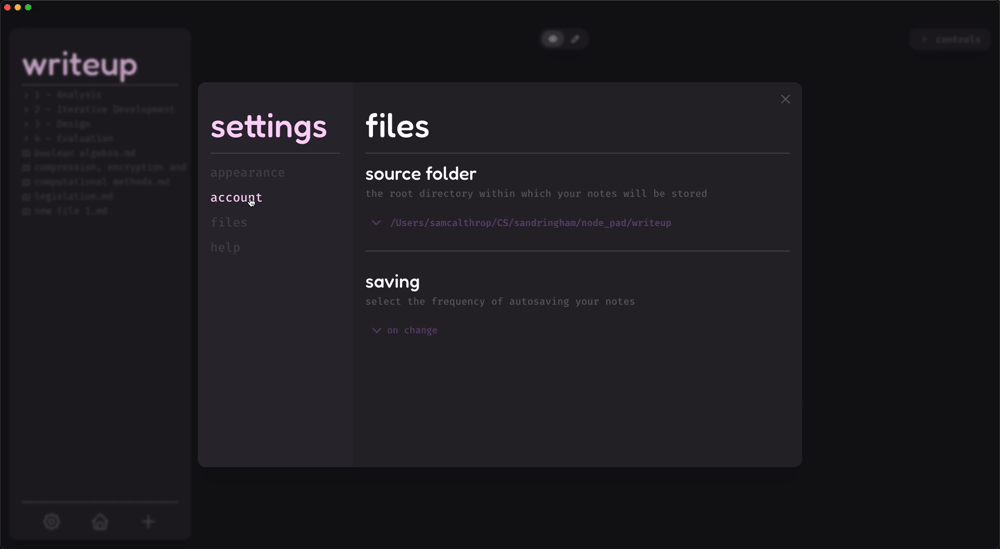

## Test 24:

| Test No. | Desired Outcome | Link to [Success Criteria](../../1%20-%20Analysis/1.7-success_criteria.md) | Justification                                                                                                                                                               | Test Data                                                                  | Actual Outcome                                                                                                                                              | Conclusion          |
| -------- | --------------- | -------------------------------------------------------------------------- | --------------------------------------------------------------------------------------------------------------------------------------------------------------------------- | -------------------------------------------------------------------------- | ----------------------------------------------------------------------------------------------------------------------------------------------------------- | ------------------- |
| 24       | c) Files        | "Settings - Files"                                                         | The user needs a place to change the root directory the app uses to find their notes, so as not to limit the experience by only allowing them one place to keep their notes | Open settings, navigate to the files section and change the root directory | The Actual Outcome matches the Desired Outcome (_note that the over-arching section is 'Appearance', and now themes are just a subsection of this section_) | Complete Success ✅ |

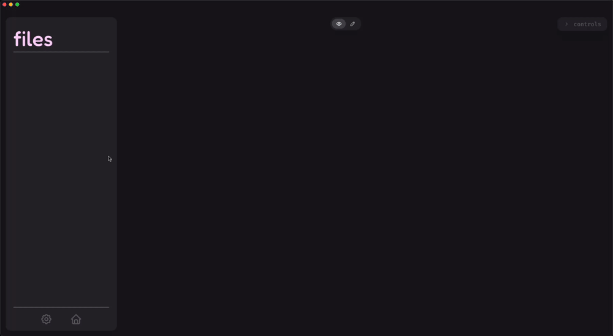

## Test 25:

| Test No. | Desired Outcome | Link to [Success Criteria](../../1%20-%20Analysis/1.7-success_criteria.md) | Justification                                                                                                                                                                              | Test Data                                                                            | Actual Outcome                                 | Conclusion          |
| -------- | --------------- | -------------------------------------------------------------------------- | ------------------------------------------------------------------------------------------------------------------------------------------------------------------------------------------ | ------------------------------------------------------------------------------------ | ---------------------------------------------- | ------------------- |
| 25       | d) Help         | "Settings - Help"                                                          | The user also needs a place where they can seek help if they are lost or confused about any part of the app, so there must be a section where any questions they may have will be answered | Open settings, navigate to the help sections and watch any tutorials in this section | The Actual Outcome matches the Desired Outcome | Complete Success ✅ |

## Test 26:

| Test No. | Desired Outcome                                        | Link to [Success Criteria](../../1%20-%20Analysis/1.7-success_criteria.md) | Justification                                                                                                                                                                                                                                                             | Test Data                                                                                                                                                                                                        | Actual Outcome                                 | Conclusion          |
| -------- | ------------------------------------------------------ | -------------------------------------------------------------------------- | ------------------------------------------------------------------------------------------------------------------------------------------------------------------------------------------------------------------------------------------------------------------------- | ---------------------------------------------------------------------------------------------------------------------------------------------------------------------------------------------------------------- | ---------------------------------------------- | ------------------- |
| 26       | The text editor should render markdown live and inline | "Page view - Live markdown preview"                                        | Live rendering markdown makes the user experience much more interesting and interactive, providing visualisation tools that make it a superset of plain text editors - this will likely aid in the UX of the app, making it more favourable than just a plain text editor | Navigate to the text editor for any note, either by clicking on a file in the sidebar or by right clicking on a node, and attempt to produce italicised text, bold text and an inline code block live and inline | The Actual Outcome matches the Desired Outcome | Complete Success ✅ |

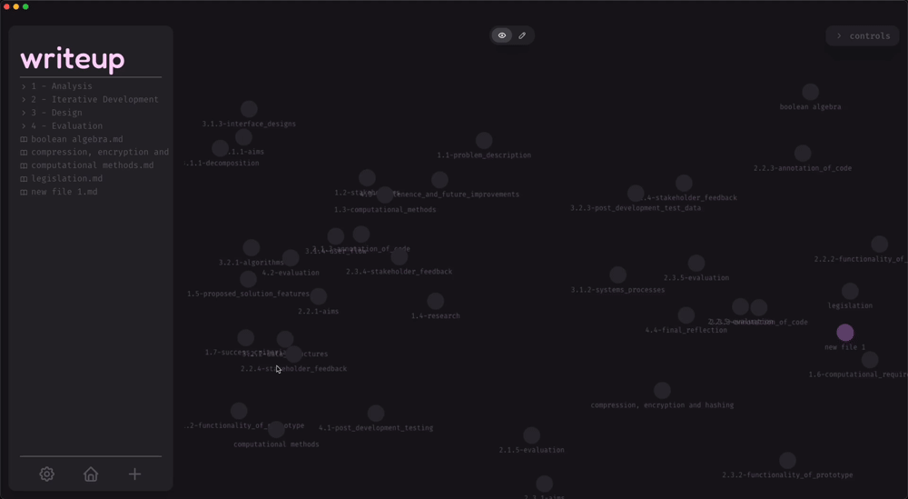

## Test 27:

| Test No. | Desired Outcome                                                                                | Link to [Success Criteria](../../1%20-%20Analysis/1.7-success_criteria.md) | Justification                                                                                                                                                                                                                                   | Test Data                                                                                                                                                                                                                                                                        | Actual Outcome                                 | Conclusion          |
| -------- | ---------------------------------------------------------------------------------------------- | -------------------------------------------------------------------------- | ----------------------------------------------------------------------------------------------------------------------------------------------------------------------------------------------------------------------------------------------- | -------------------------------------------------------------------------------------------------------------------------------------------------------------------------------------------------------------------------------------------------------------------------------- | ---------------------------------------------- | ------------------- |
| 27       | The text editor should have an area dedicated to tags, which can be created, added and removed | "Page view - Tags"                                                         | Tags provide another way for the user to link notes together - the node network provides visual links, and tags provide logical links, making it easy to work out what a note is about just by reading its tags. It acts as a way to sort notes | Navigate to the text editor for any note like in test 26, and try to add, create and delete tags by selecting a tag from the dropdown, then writing a new tag and pressing enter to add it (_in the input area provided_), then click on the 'x' to the right of one of the tags | The Actual Outcome matches the Desired Outcome | Complete Success ✅ |

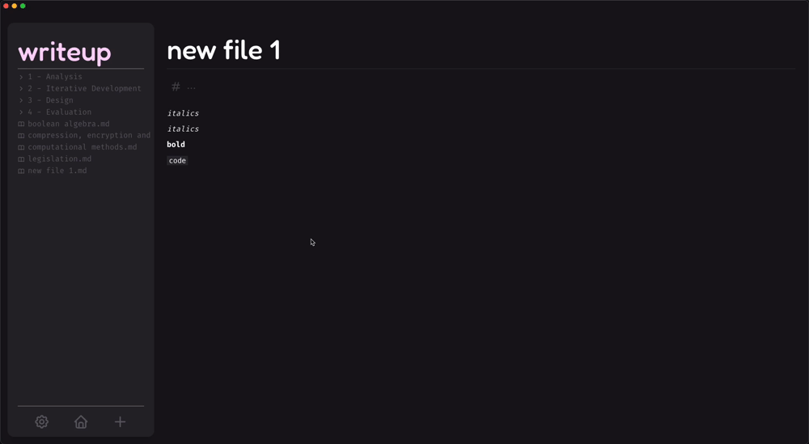

See next: [Evaluation](./4.2-evaluation.md)
