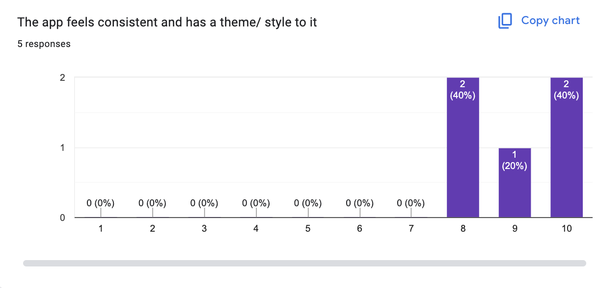

# 4.2 - Evaluation

> _Directly comparing my final product to [the success criteria I laid out at the start](../1%20-%20Analysis/1.7-success_criteria.md)_

**Key:**

- 🟥 - core features that are **needed**
- 🟧 - moderate importance
- 🟩 - features that should be added, but **aren't needed**
- 🟪 - completely optional features - everything else takes priority and these will be completed if/ when I have time

| Feature                                  | Importance | Details                                                                                                                                                                                                                                                                                              | Limitations                                                                                                                                                                                                                                                                                                                                                                       | Completion             | Evidence     |
| ---------------------------------------- | ---------- | ---------------------------------------------------------------------------------------------------------------------------------------------------------------------------------------------------------------------------------------------------------------------------------------------------- | --------------------------------------------------------------------------------------------------------------------------------------------------------------------------------------------------------------------------------------------------------------------------------------------------------------------------------------------------------------------------------- | ---------------------- | ------------ |
| Login page                               | 🟥         | The first page the user is greeted with, where the user can login to NodePad, granting them access to the app if correct credentials are entered                                                                                                                                                     | Requires use of a database to store account details. Also, a 'forgot password?' option would likely mean setting up automated emails for password verification. Additionally, an account is not strictly required to access the functionality of the app. May actually slow down workflow, as the user may want to start taking notes, and not see the need for an account at all | Completely finished ✅ | Tests 3, 4   |
| Signup page                              | 🟥         | A page the user can access by clicking a link in the login page. This allows the user to create a new account if they don't already own one                                                                                                                                                          | Requires use of a database to store account details. An account is also not strictly required to access the functionality of the app                                                                                                                                                                                                                                              | Completely finished ✅ | Tests 5, 6   |
| Welcome view                             | 🟧         | An area to welcome in the user. This should have an option to be turned off for when the user opens the app in the future                                                                                                                                                                            | This may be challenging to incorporate into an existing app architecture, as it should interact with different parts of the app                                                                                                                                                                                                                                                   | Completely finished ✅ | Tests 6, 7   |
| Welcome view - Tutorials                 | 🟩         | A space in the welcome view showing the user tutorials on how to start taking notes                                                                                                                                                                                                                  | This could take up too much space in the welcome view, and may not be needed if tutorials are also in settings                                                                                                                                                                                                                                                                    | Not completed ❌       | Test 7       |
| Home                                     | 🟥         | A centralised area the user will always be redirected to unless in the text editor view                                                                                                                                                                                                              |                                                                                                                                                                                                                                                                                                                                                                                   | Completely finished ✅ | Test 8       |
| Network - View mode                      | 🟥         | A visual representation of the user's notes, giving both an aesthetically pleasing and functional/ intuitive map. Nodes in the network can be dragged around or left clicked to enter page view                                                                                                      | It could be quite hard to design an interactive asynchronous animation to display the network                                                                                                                                                                                                                                                                                     | Completely finished ✅ | Tests 15-18  |
| Network - Edit mode                      | 🟧         | Provides an interactive means to make the connections between nodes and tags. The alternative would be to list the connections, which makes the experience less smooth/ interesting                                                                                                                  | Could be very time consuming to completely conceptualise and code                                                                                                                                                                                                                                                                                                                 | Mostly finished 🟨     | Tests 17, 19 |
| Network - Isolation                      | 🟪         | The user can select which tag(s) they want to isolate, and the network will highlight only nodes connected to the specified tag(s). This can extend to be accessed from Page view, where clicking on any of the tags listed within the file will bring them back to the network and isolate that tag | Again, this could be very difficult to integrate, and on top of this, and in large networks an inefficient algorithm could take a long time to complete, given that the algorithm will probably be recursive                                                                                                                                                                      | Not completed ❌       | `n/a`        |
| Network - Search                         | 🟩         | The user can press a button and search through all notes they have. This can be represented visually by filtering out all nodes not relevant to the search term, leaving only those that the user may want to access in the network                                                                  | This feature could be quite ambitious, and may take a lot of effort and time to get running. As this isn't a key feature, it's one that may get pushed to the bottom of the pile to work on other, more integral features of the app                                                                                                                                              | Not completed ❌       | `n/a`        |
| Sidebar                                  | 🟥         | An area of the screen permanently taken up by the sidebar, which houses the filetree of notes and a toolbar providing buttons for settings, new files, new folders and home                                                                                                                          |                                                                                                                                                                                                                                                                                                                                                                                   | Mostly finished 🟨     | Test 9-14    |
| Settings                                 | 🟥         | A space where the user can change their preferences, split up into various settings                                                                                                                                                                                                                  |                                                                                                                                                                                                                                                                                                                                                                                   | Completely finished ✅ | Test 21      |
| Settings - Themes                        | 🟩         | A space where the user can select from a range of different themes, which each colour and style the app uniquely                                                                                                                                                                                     |                                                                                                                                                                                                                                                                                                                                                                                   | Completely finished ✅ | Test 22      |
| Settings - Account                       | 🟧         | Where the user can change details about their account                                                                                                                                                                                                                                                |                                                                                                                                                                                                                                                                                                                                                                                   | Completely finished ✅ | Test 23      |
| Settings - Files                         | 🟥         | Where the user can modify information relating to their file system e.g. the root directory to be displayed in the sidebar                                                                                                                                                                           |                                                                                                                                                                                                                                                                                                                                                                                   | Completely finished ✅ | Test 24      |
| Settings - Help                          | 🟧         | Where the user can find help/ tutorials on how to use the app, in the case that anything isn't immediately intuitive                                                                                                                                                                                 |                                                                                                                                                                                                                                                                                                                                                                                   | Completely finished ✅ | Test 25      |
| Page view (text editor)                  | 🟥         | An area in which the user can edit the selected markdown file, edit its title and see a list of all the tags the note is connected to/ has                                                                                                                                                           |                                                                                                                                                                                                                                                                                                                                                                                   | Completely finished ✅ | Test 26      |
| Page view - Live markdown preview        | 🟥         | One of the core concepts of the app, the markdown text written by the user should be auto-rendered on the page when they write it                                                                                                                                                                    | The process of parsing, formatting and rendering the text is new to me, and I don't know how difficult it will be                                                                                                                                                                                                                                                                 | Completely finished ✅ | Test 26      |
| Page view - Tags                         | 🟧         | An area of the text editor where the user can give each file tags by typing or selecting. This allows the user to quickly identify what a note contains by its tags, and is another way of logically connecting notes together                                                                       |                                                                                                                                                                                                                                                                                                                                                                                   | Completely finished ✅ | Test 27      |
| Files backed up on the cloud             | 🟪         | A system of automatically saving the user's notes to a remote database, making their notes accessible even if they lose access to their device                                                                                                                                                       | Saving all this data to a database may be very complex, and as mentioned in [research](1.4-research.md), some users actually may not want their data being stored on other systems for security & privacy reasons                                                                                                                                                                 | Not completed ❌       | `n/a`        |
| Consistent and aesthetically pleasing UI | 🟥         | A user interface that looks and feels smooth, simplistic, intuitive, and appropriate - this is key for an app such as this, where it is essential the user is satisfied and enjoys how it feels and looks while taking notes                                                                         | Coordinating the styles for each part of the app may be difficult when the app gets bigger and more complex                                                                                                                                                                                                                                                                       | Mostly finished 🟨     | Tests 1, 2   |

All my criteria bar the sidebar were completely finished, and it was only a minor feature missing from the sidebar. The only criteria I didn't complete were some of those marked in 🟩 or 🟪 (_very low in terms of importance_). Given that the pretty much all of the mostly completed criteria were incredibly close to being completely finished, and given that I implemented additional features based on stakeholder feedback that were arguably more worthwhile as well, I believe this to be a successful project.

## Usability

Upon asking my stakeholders about usability, they said the following:

James: "I think the app is very usable. I think the only downsides are that there is no way to search through notes, and it takes a while to log in sometimes."

Jay: "I think it's very usable. I really like some of the features in settings, like how easily you can change your account details or what theme you're using. I can definitely see it being a product that could be used by the public given time."

Given how positively my stakeholders responded to the question, and how many of the criteria were met, I believe the app to be quite highly usable, and feasible as an actual product in the market if I had more time to develop it.

### Questionnaire/ Usability Testing

I went further and gave each of my stakeholders, as well as some of the people from my school a questionnaire to answer to test the usability of the app:

^ A score of only 8 or higher reflects a very strong app in terms of ease of use (average of of 8.6/10)

^ Again only scores of 8 or higher suggest the app is consistent in its use of colours and styling (average of 9/10)

^ The majority of people (60%) have a positive opinion about how NodePad compares to other apps on the market, and those who didn't pick agree were neutral, so this is a net positive.

^ Again, 60% of responders had a positive experience with the speed of the app, though this time, 20% _strongly_ agreed, making this even more positive than the previous question.

^ This question gained 100% positive responses, and again 20% of responders strongly agreed that the app is fast.

^ Finally, I again had the majority of responders (60%) tell me that they would overall feel positive if they had to use the app from now on over other existing apps.

Given the responses I've gained, I can say that the app is quite highly usable, given that all the users who've used and tested my app have responded either neutrally or positively to it, with the majority of responses being positive, and some even strongly positive.

See next: [Maintenance and Future Improvements](./4.3-maintenence_and_future_improvements.md)
